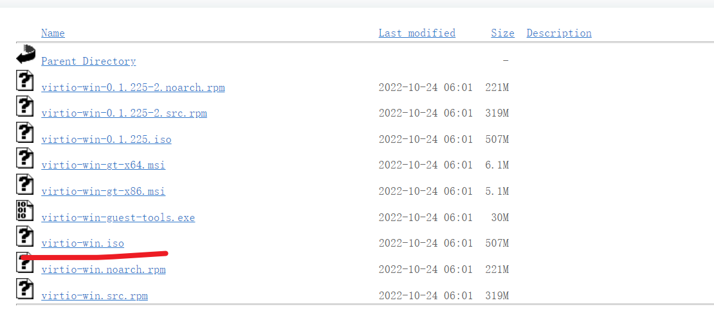
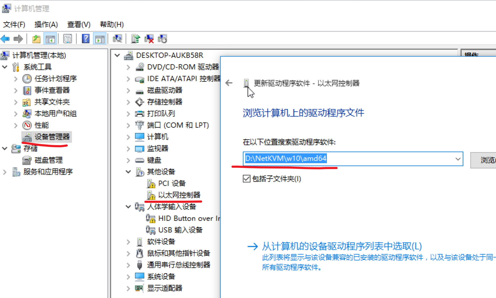

## 环境准备

```bash
# 查看CPU是否支持虚拟化，这里必须返回非0的值
egrep -c '(vmx|svm)' /proc/cpuinfo

# 检查主板是否支持虚拟化
sudo apt update && sudo apt install cpu-checker -y
kvm-ok
# 上面这个命令必须返回下面的结果才算可用
# 以下输出结果可用
INFO: /dev/kvm exists
KVM acceleration can be used

# 安装相关的软件包，这里我没有安装virt-manager，需要图形界面的可以安装一下
sudo apt install qemu-kvm libvirt-daemon-system libvirt-clients bridge-utils virtinst -y
# 各个软件作用如下
qemu-kvm: 提供硬件底层虚拟化。
libvirt-daemon-system: 为 libvirt作为系统服务的守护程序运行。
libvirt-clients: 为不同的虚拟机提供长期稳定的C API
bridge-utils:提供网络桥接功能
virtinst: 为libvirt创建虚拟机提供一系列的命令行工作
virt-manager: KVM虚拟机管理图形界面，如果服务器没有安装图形化界面，没有必要安装它。

# 检查一下是否安装完毕，会返回active
sudo systemctl is-active libvirtd

# 添加一下用户组，记得把xiaoyou改成自己的用户名
sudo usermod -aG libvirt xiaoyou
sudo usermod -aG kvm xiaoyou
```

## 网桥配置

因为想让虚拟机与物理机位于同一个网段，所以这里就需要使用网桥了，我们可以这样配置

```bash
sudo vim /etc/sysctl.d/bridge.conf
# 添加如下内容
net.bridge.bridge-nf-call-ip6tables=0
net.bridge.bridge-nf-call-iptables=0
net.bridge.bridge-nf-call-arptables=0

sudo vim /etc/udev/rules.d/99-bridge.rules
# 添加如下内容
ACTION=="add", SUBSYSTEM=="module", KERNEL=="br_netfilter", RUN+="/sbin/sysctl -p /etc/sysctl.d/bridge.conf"

# 我们看下接口，这里我们需要把kvm默认的接口给删掉
ip link
sudo virsh net-destroy default
sudo virsh net-undefine default

# 然后我们配置一下网络
sudo vim /etc/netplan/00-installer-config.yaml
# 内容如下
network:
  ethernets:
    eno1:
      dhcp4: false
      dhcp6: false
  bridges:
    br0:
      interfaces: [ eno1 ]
      addresses: [192.168.123.11/24]
      gateway4: 192.168.123.1
      mtu: 1500
      nameservers:
        addresses: [8.8.8.8,8.8.4.4]
      parameters:
        stp: true
        forward-delay: 4
      dhcp4: no
      dhcp6: no
  version: 2

# eno1 换成你自己的物理网卡
# addresses 是你物理机的ip
# gateway4 也换成自己的网关

# 然后我们应用一下网络配置
sudo netplan apply
# 输入ip link就可以看到自己的网桥了

# 最后我们配置一下kvm的网桥
vim host-bridge.xml
# 内容如下
<network>
  <name>host-bridge</name>
  <forward mode="bridge"/>
  <bridge name="br0"/>
</network>

# 创建一下kvm的网桥
sudo virsh net-define host-bridge.xml
sudo virsh net-start host-bridge
sudo virsh net-autostart host-bridge

# 查看是否创建成功
virsh net-list --all
```

## 创建虚拟机

使用下面的命令开始创建一个ubuntu 20.04的虚拟机

```bash
virt-install --name=ubuntu20.04-server --ram=4096 --vcpus=4 \
    --virt-type=kvm --hvm --os-type=linux --os-variant=ubuntu20.04 \
    --network default,model=virtio \
    --graphics vnc,password=xiaoyou,port=5912,listen=0.0.0.0 \
    --cdrom=/home/xiaoyou/ubuntu-22.04.1-live-server-amd64.iso \
    --disk path=/home/xiaoyou/kvm/ubuntu-20-04-server/main.qcow2,size=50,format=qcow2

# 参数解释
--name 虚拟机名字
--ram 虚拟机内存，单位M
--vcpus 虚拟机cpu数目
--virt-type 使用的hypervisor，如kvm、qemu、xen等，所有可用值可以使用’virsh capabilities’命令获取；
--hvm 当物理机同时支持完全虚拟化和半虚拟化时，指定使用完全虚拟化；
--os-type 操作系统类型
--os-variant 具体版本
--network 网络配置，这里我们使用默认的网络，也就是我们之前设置的网桥
--graphics vnc的配置，因为我们安装的是服务器版本，没有界面，所以得通过vnc来远程控制
--cdrom 光盘的位置，也就是我们系统镜像文件的地址
--disk 磁盘地址，这里我们直接新建一个磁盘，然后大小为50G，也可以先创建磁盘，然后指定位置
```

创建后可以直接用vnc打开，然后端口是5912，密码是xiaoyou

如果出现下面的错误

> ERROR Cannot access storage file '/home/xiaoyou/kvm/ubuntu-20-04-desktop/main.qcow2' (as uid:64055, gid:108): Permission denied

可以这样

```bash
# 修改配置文件
sudo vim /etc/libvirt/qemu.conf
# 把下面这两个换成自己的用户名即可
# Some examples of valid values are:
#
#       user = "qemu"   # A user named "qemu"
#       user = "+0"     # Super user (uid=0)
#       user = "100"    # A user named "100" or a user with uid=100
#
user = "xiaoyou"

# The group for QEMU processes run by the system instance. It can be
# specified in a similar way to user.
group = "xiaoyou"

# 重启一下服务
sudo systemctl restart libvirtd
```

如果想查看所有系统版本，可以这样去查询

```bash
# 过滤系统
osinfo-query os | grep ubuntu
```

## 常见系统安装

下面简单列一下不同系统的安装方式

### Windows 10

```bash
virt-install --name=win10-download --ram=4096 --vcpus=6 \
    --virt-type=kvm --hvm --os-type=windows \
    --network default,model=virtio \
    --graphics vnc,password=xiaoyou,port=5913,listen=0.0.0.0 \
    --cdrom=/home/xiaoyou/images/cn_windows_10_multiple_editions_x64_dvd_6848463.iso \
    --disk path=/data/sys1/win10-download/disk.qcow2,size=100,format=qcow2
```

安装好驱动后可能无法上网。我们可以去下载一下驱动

[Index of /groups/virt/virtio-win/direct-downloads/archive-virtio](https://fedorapeople.org/groups/virt/virtio-win/direct-downloads/archive-virtio/)

然后下载一下ISO镜像



然后我们挂载一下这个镜像

```bash
# 先查看一下设备可挂载的位置
xiaoyou@xiaoyou-server:~/images$ virsh domblklist win10-download
 Target   Source
------------------------------------------------------------------------------------
 sda      /data/sys1/win10-download/disk.qcow2
 sdb      /home/xiaoyou/images/cn_windows_10_multiple_editions_x64_dvd_6848463.iso

# 然后我们手动挂载一下
virsh change-media win10-download sdb /home/xiaoyou/images/virtio-win-0.1.225.iso
```

路径如下



## 常用命令

```bash
# 查看所有虚拟机
virsh list --all
# 启动某个虚拟机，这些命令都可以用名字或者id来操作
virsh start truenas
# 关闭虚拟机
virsh shutdown truenas
# 查看信息
virsh dominfo truenas
# 强制关机
virsh destroy truenas
# 删除某台机器
virsh undefine truenas
```

## 参考

[Install KVM on Ubuntu 20.04 {+ Create a Virtual Machine}](https://phoenixnap.com/kb/ubuntu-install-kvm)

[kvm 使用入门详解 - 肖邦linux - 博客园](https://www.cnblogs.com/liwei0526vip/p/6201582.html)

[ubuntu20.04使用kvm搭建虚拟机+bridge网桥，亲测有效_skyfury_的博客-CSDN博客_ubuntu20 网桥](https://blog.csdn.net/qq_38916811/article/details/120792767)

[kvm 虚拟化安装 Ubuntu 18.04 server - 烹茶室 - 博客园](https://www.cnblogs.com/frytea/p/13411443.html)

[virt-install 参数使用说明_紫心雪莲_ywt的博客-CSDN博客](https://blog.csdn.net/Allison_ywt/article/details/51647980)

https://ostechnix.com/solved-cannot-access-storage-file-permission-denied-error-in-kvm-libvirt/

https://www.server-world.info/en/note?os=Ubuntu_22.04&p=kvm&f=11
