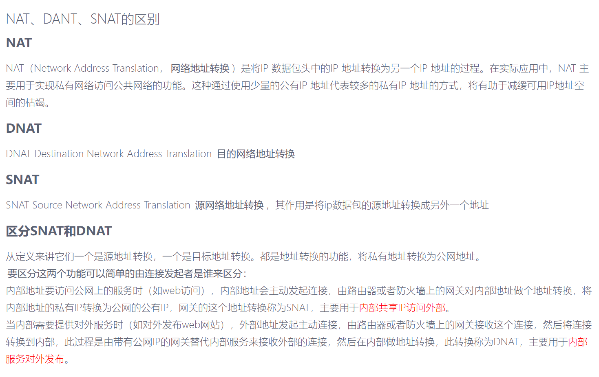
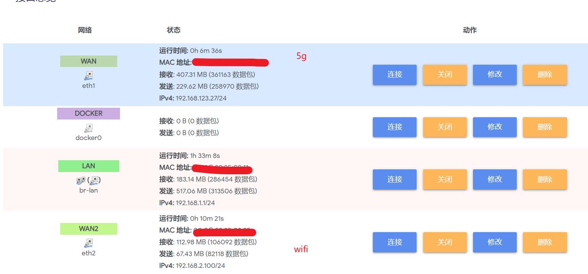
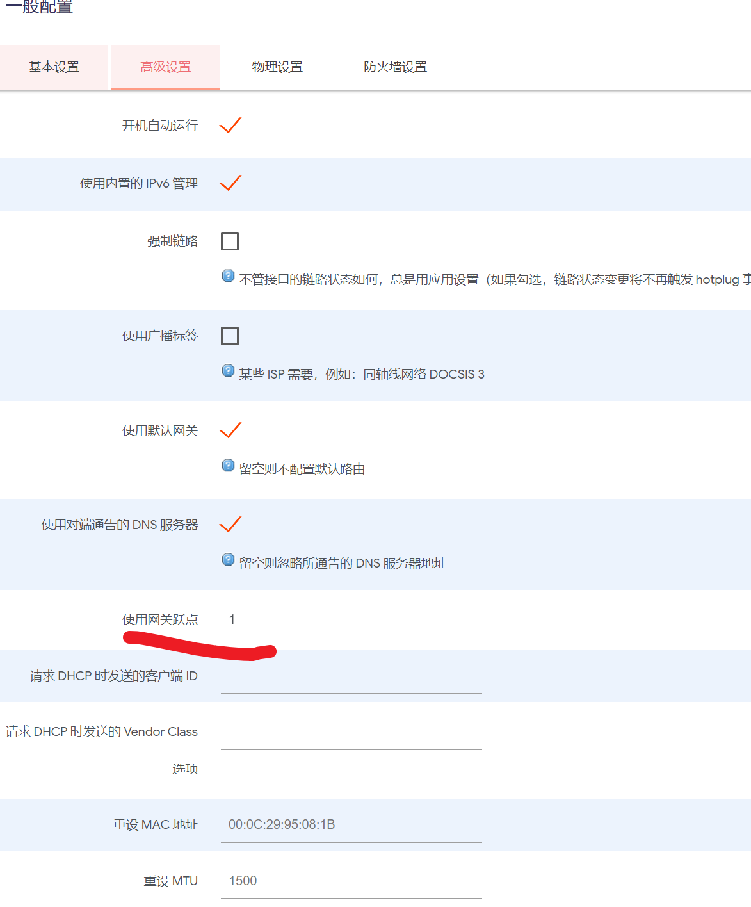
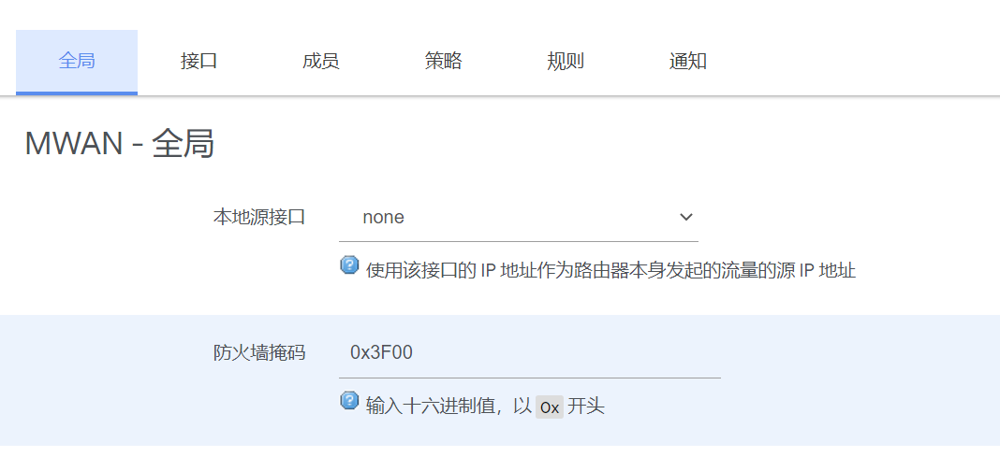
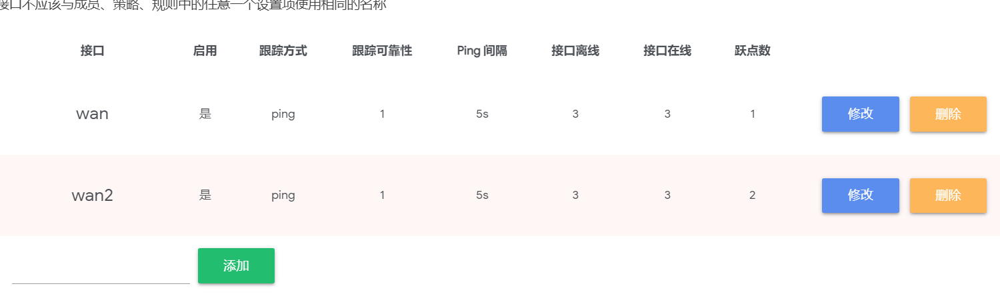
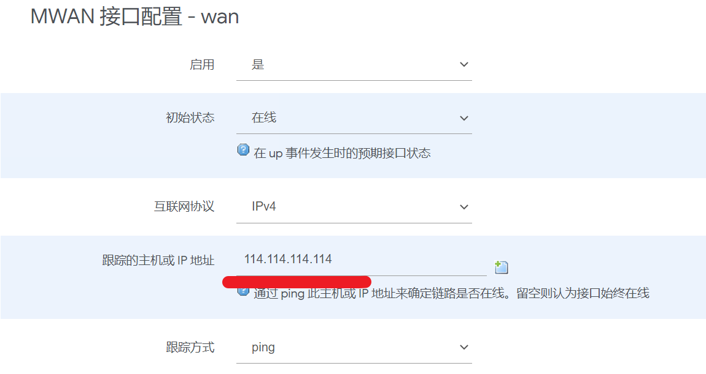
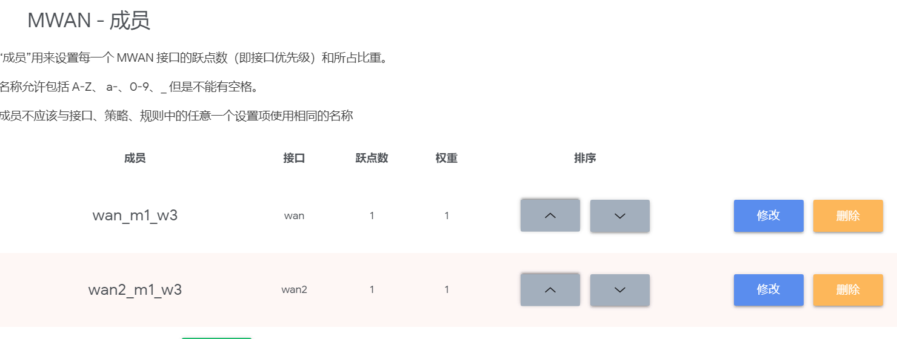
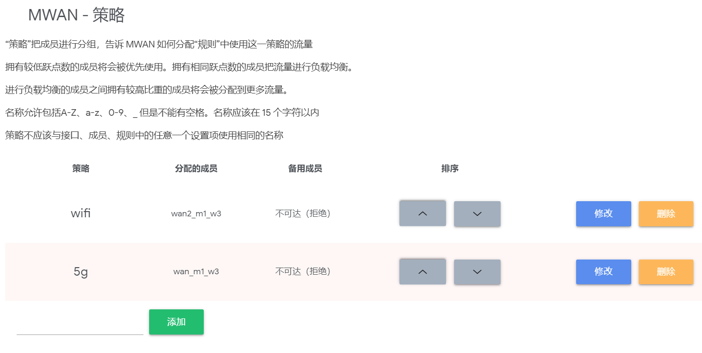
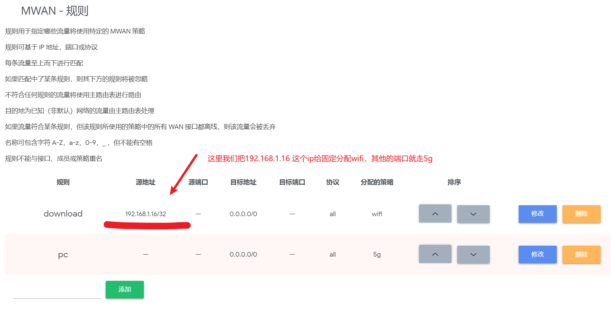

## 0.  基础知识

### 0.1 NAT、SNAT、DNAT区别



## 1. 语法说明

```bash
iptables(选项)(参数)
```

选项说明

```bash
-t, --table table 对指定的表 table 进行操作， table 必须是 raw， nat，filter，mangle 中的一个。如果不指定此选项，默认的是 filter 表。

# 通用匹配：源地址目标地址的匹配
-p：指定要匹配的数据包协议类型；
-s, --source [!] address[/mask] ：把指定的一个／一组地址作为源地址，按此规则进行过滤。当后面没有 mask 时，address 是一个地址，比如：192.168.1.1；当 mask 指定时，可以表示一组范围内的地址，比如：192.168.1.0/255.255.255.0。
-d, --destination [!] address[/mask] ：地址格式同上，但这里是指定地址为目的地址，按此进行过滤。
-i, --in-interface [!] <网络接口name> ：指定数据包的来自来自网络接口，比如最常见的 eth0 。注意：它只对 INPUT，FORWARD，PREROUTING 这三个链起作用。如果没有指定此选项， 说明可以来自任何一个网络接口。同前面类似，"!" 表示取反。
-o, --out-interface [!] <网络接口name> ：指定数据包出去的网络接口。只对 OUTPUT，FORWARD，POSTROUTING 三个链起作用。

# 查看管理命令
-L, --list [chain] 列出链 chain 上面的所有规则，如果没有指定链，列出表上所有链的所有规则。

# 规则管理命令
-A, --append chain rule-specification 在指定链 chain 的末尾插入指定的规则，也就是说，这条规则会被放到最后，最后才会被执行。规则是由后面的匹配来指定。
-I, --insert chain [rulenum] rule-specification 在链 chain 中的指定位置插入一条或多条规则。如果指定的规则号是1，则在链的头部插入。这也是默认的情况，如果没有指定规则号。
-D, --delete chain rule-specification -D, --delete chain rulenum 在指定的链 chain 中删除一个或多个指定规则。
-R num：Replays替换/修改第几条规则

# 链管理命令（这都是立即生效的）
-P, --policy chain target ：为指定的链 chain 设置策略 target。注意，只有内置的链才允许有策略，用户自定义的是不允许的。
-F, --flush [chain] 清空指定链 chain 上面的所有规则。如果没有指定链，清空该表上所有链的所有规则。
-N, --new-chain chain 用指定的名字创建一个新的链。
-X, --delete-chain [chain] ：删除指定的链，这个链必须没有被其它任何规则引用，而且这条上必须没有任何规则。如果没有指定链名，则会删除该表中所有非内置的链。
-E, --rename-chain old-chain new-chain ：用指定的新名字去重命名指定的链。这并不会对链内部造成任何影响。
-Z, --zero [chain] ：把指定链，或者表中的所有链上的所有计数器清零。

-j, --jump target <指定目标> ：即满足某条件时该执行什么样的动作。target 可以是内置的目标，比如 ACCEPT，也可以是用户自定义的链。
-h：显示帮助信息；
```

## 2. 基本参数

| 参数          | 作用                             |
| ----------- | ------------------------------ |
| -P          | 设置默认策略:iptables -P INPUT (DROP |
| -F          | 清空规则链                          |
| -L          | 查看规则链                          |
| -A          | 在规则链的末尾加入新规则                   |
| -I          | num 在规则链的头部加入新规则               |
| -D          | num 删除某一条规则                    |
| -s          | 匹配来源地址IP/MASK，加叹号"!"表示除这个IP外。  |
| -d          | 匹配目标地址                         |
| -i          | 网卡名称 匹配从这块网卡流入的数据              |
| -o          | 网卡名称 匹配从这块网卡流出的数据              |
| -p          | 匹配协议,如tcp,udp,icmp             |
| --dport num | 匹配目标端口号                        |
| --sport num | 匹配来源端口号                        |

一般我们命令选项的输入顺序如下

```bash
iptables -t 表名 <-A/I/D/R> 规则链名 [规则号] <-i/o 网卡名> -p 协议名 <-s 源IP/源子网> --sport 源端口 <-d 目标IP/目标子网> --dport 目标端口 -j 动作
```

整个iptable的工作机制如下

```bash
INPUT链 ：处理输入数据包。
OUTPUT链 ：处理输出数据包。
FORWARD链 ：处理转发数据包。
PREROUTING链 ：用于目标地址转换（DNAT）。
POSTOUTING链 ：用于源地址转换（SNAT）。
```

防火墙一般用的比较多的功能有3个

1. filter 定义允许或者不允许的，只能做在3个链上：INPUT ，FORWARD ，OUTPUT
2. nat 定义地址转换的，也只能做在3个链上：PREROUTING ，OUTPUT ，POSTROUTING
3. mangle功能:修改报文原数据，是5个链都可以做：PREROUTING，INPUT，FORWARD，OUTPUT，POSTROUTING

下面简单介绍iptable里面的一些概念

表名包括：

- **raw** ：高级功能，如：网址过滤。
- **mangle** ：数据包修改（QOS），用于实现服务质量。
- **nat** ：地址转换，用于网关路由器。
- **filter** ：包过滤，用于防火墙规则。

动作包括：

- **ACCEPT** ：接收数据包。
- **DROP** ：丢弃数据包。
- **REDIRECT** ：重定向、映射、透明代理。
- **SNAT** ：源地址转换。
- **DNAT** ：目标地址转换。
- **MASQUERADE** ：IP伪装（NAT），用于ADSL。
- **LOG** ：日志记录。
- **SEMARK** : 添加SEMARK标记以供网域内强制访问控制（MAC）

整体架构图如下

```bash
                             ┏╍╍╍╍╍╍╍╍╍╍╍╍╍╍╍┓
 ┌───────────────┐           ┃    Network    ┃
 │ table: filter │           ┗━━━━━━━┳━━━━━━━┛
 │ chain: INPUT  │◀────┐             │
 └───────┬───────┘     │             ▼
         │             │   ┌───────────────────┐
  ┌      ▼      ┐      │   │ table: nat        │
  │local process│      │   │ chain: PREROUTING │
  └             ┘      │   └─────────┬─────────┘
         │             │             │
         ▼             │             ▼              ┌─────────────────┐
┅┅┅┅┅┅┅┅┅┅┅┅┅┅┅┅┅┅┅    │     ┅┅┅┅┅┅┅┅┅┅┅┅┅┅┅┅┅      │table: nat       │
 Routing decision      └───── outing decision ─────▶│chain: PREROUTING│
┅┅┅┅┅┅┅┅┅┳┅┅┅┅┅┅┅┅┅          ┅┅┅┅┅┅┅┅┅┅┅┅┅┅┅┅┅      └────────┬────────┘
         │                                                   │
         ▼                                                   │
 ┌───────────────┐                                           │
 │ table: nat    │           ┅┅┅┅┅┅┅┅┅┅┅┅┅┅┅┅┅               │
 │ chain: OUTPUT │    ┌─────▶ outing decision ◀──────────────┘
 └───────┬───────┘    │      ┅┅┅┅┅┅┅┅┳┅┅┅┅┅┅┅┅
         │            │              │
         ▼            │              ▼
 ┌───────────────┐    │   ┌────────────────────┐
 │ table: filter │    │   │ chain: POSTROUTING │
 │ chain: OUTPUT ├────┘   └──────────┬─────────┘
 └───────────────┘                   │
                                     ▼
                             ┏╍╍╍╍╍╍╍╍╍╍╍╍╍╍╍┓
                             ┃    Network    ┃
                             ┗━━━━━━━━━━━━━━━┛

```

## 3. 例子

### 3.1 清空当前的所有规则和计数

```bash
iptables -F  # 清空所有的防火墙规则
iptables -X  # 删除用户自定义的空链
iptables -Z  # 清空计数
```

### 3.2 运行特定端口访问机器

```bash
iptables -A INPUT -s 192.168.1.0/24 -p tcp --dport 22 -j ACCEPT
# 22为你的ssh端口， -s 192.168.1.0/24表示允许这个网段的机器来连接，其它网段的ip地址是登陆不了你的机器的。 -j ACCEPT表示接受这样的请求
```

### 3.3 允许本地回环地址正常使用

```bash
iptables -A INPUT -i lo -j ACCEPT
#本地圆环地址就是那个127.0.0.1，是本机上使用的,它进与出都设置为允许
iptables -A OUTPUT -o lo -j ACCEPT
```

### 3.4 配置默认的规则

```bash
iptables -P INPUT DROP # 配置默认的不让进
iptables -P FORWARD DROP # 默认的不允许转发
iptables -P OUTPUT ACCEPT # 默认的可以出去
```

### 3.5 配置白名单

```bash
iptables -A INPUT -p all -s 192.168.1.0/24 -j ACCEPT  # 允许机房内网机器可以访问
iptables -A INPUT -p all -s 192.168.140.0/24 -j ACCEPT  # 允许机房内网机器可以访问
iptables -A INPUT -p tcp -s 183.121.3.7 --dport 3380 -j ACCEPT # 允许183.121.3.7访问本机的3380端口
```

### 3.6 开启对于的服务端口

```bash
iptables -A INPUT -p tcp --dport 80 -j ACCEPT # 开启80端口，因为web对外都是这个端口
iptables -A INPUT -p icmp --icmp-type 8 -j ACCEPT # 允许被ping
iptables -A INPUT -m state --state ESTABLISHED,RELATED -j ACCEPT # 已经建立的连接得让它进来
```

### 3.7保存规则到配置文件中

```bash
cp /etc/sysconfig/iptables /etc/sysconfig/iptables.bak # 任何改动之前先备份，请保持这一优秀的习惯
iptables-save > /etc/sysconfig/iptables
cat /etc/sysconfig/iptables
```

### 3.8 列出已设置的规则

> iptables -L [-t 表名] [链名]

- 四个表名 `raw`，`nat`，`filter`，`mangle`
- 五个规则链名 `INPUT`、`OUTPUT`、`FORWARD`、`PREROUTING`、`POSTROUTING`
- filter表包含`INPUT`、`OUTPUT`、`FORWARD`三个规则链

```shell
iptables -L -t nat                  # 列出 nat 上面的所有规则
#            ^ -t 参数指定，必须是 raw， nat，filter，mangle 中的一个
iptables -L -t nat  --line-numbers  # 规则带编号
iptables -L INPUT

iptables -L -nv  # 查看，这个列表看起来更详细
```

### 3.9 清除已有的规则

```bash
iptables -F INPUT  # 清空指定链 INPUT 上面的所有规则
iptables -X INPUT  # 删除指定的链，这个链必须没有被其它任何规则引用，而且这条上必须没有任何规则。
                   # 如果没有指定链名，则会删除该表中所有非内置的链。
iptables -Z INPUT  # 把指定链，或者表中的所有链上的所有计数器清零。
```

删除已经添加的规则

```bash
# 添加一条规则
iptables -A INPUT -s 192.168.1.5 -j DROP
```

将所有iptables以序号标记显示，执行：

```shell
iptables -L -n --line-numbers
```

比如要删除INPUT里序号为8的规则，执行：

```shell
iptables -D INPUT 8
```

### 3.10 开放指定端口

```bash
iptables -A INPUT -s 127.0.0.1 -d 127.0.0.1 -j ACCEPT               #允许本地回环接口(即运行本机访问本机)
iptables -A INPUT -m state --state ESTABLISHED,RELATED -j ACCEPT    #允许已建立的或相关连的通行
iptables -A OUTPUT -j ACCEPT         #允许所有本机向外的访问
iptables -A INPUT -p tcp --dport 22 -j ACCEPT    #允许访问22端口
iptables -A INPUT -p tcp --dport 80 -j ACCEPT    #允许访问80端口
iptables -A INPUT -p tcp --dport 21 -j ACCEPT    #允许ftp服务的21端口
iptables -A INPUT -p tcp --dport 20 -j ACCEPT    #允许FTP服务的20端口
iptables -A INPUT -j reject       #禁止其他未允许的规则访问
iptables -A FORWARD -j REJECT     #禁止其他未允许的规则访问

```

### 3.11 屏蔽ip

```bash
iptables -A INPUT -p tcp -m tcp -s 192.168.0.8 -j DROP  # 屏蔽恶意主机（比如，192.168.0.8
iptables -I INPUT -s 123.45.6.7 -j DROP       #屏蔽单个IP的命令
iptables -I INPUT -s 123.0.0.0/8 -j DROP      #封整个段即从123.0.0.1到123.255.255.254的命令
iptables -I INPUT -s 124.45.0.0/16 -j DROP    #封IP段即从123.45.0.1到123.45.255.254的命令
iptables -I INPUT -s 123.45.6.0/24 -j DROP    #封IP段即从123.45.6.1到123.45.6.254的命令是
```

### 3.12 指定数据包出去的网络接口

只对 OUTPUT，FORWARD，POSTROUTING 三个链起作用。

```shell
iptables -A FORWARD -o eth0
```

### 3.13 查看已添加的规则

```shell
iptables -L -n -v
Chain INPUT (policy DROP 48106 packets, 2690K bytes)
 pkts bytes target     prot opt in     out     source               destination
 5075  589K ACCEPT     all  --  lo     *       0.0.0.0/0            0.0.0.0/0
 191K   90M ACCEPT     tcp  --  *      *       0.0.0.0/0            0.0.0.0/0           tcp dpt:22
1499K  133M ACCEPT     tcp  --  *      *       0.0.0.0/0            0.0.0.0/0           tcp dpt:80
4364K 6351M ACCEPT     all  --  *      *       0.0.0.0/0            0.0.0.0/0           state RELATED,ESTABLISHED
 6256  327K ACCEPT     icmp --  *      *       0.0.0.0/0            0.0.0.0/0

Chain FORWARD (policy ACCEPT 0 packets, 0 bytes)
 pkts bytes target     prot opt in     out     source               destination

Chain OUTPUT (policy ACCEPT 3382K packets, 1819M bytes)
 pkts bytes target     prot opt in     out     source               destination
 5075  589K ACCEPT     all  --  *      lo      0.0.0.0/0            0.0.0.0/0
```

### 3.14  启动网络转发规则

公网`210.14.67.7`让内网`192.168.188.0/24`上网

```shell
iptables -t nat -A POSTROUTING -s 192.168.188.0/24 -j SNAT --to-source 210.14.67.127
```

### 3.15 端口映射

本机的 2222 端口映射到内网 虚拟机的22 端口

```shell
iptables -t nat -A PREROUTING -d 210.14.67.127 -p tcp --dport 2222  -j DNAT --to-dest 192.168.188.115:22
```

### 3.16 字符串匹配

比如，我们要过滤所有TCP连接中的字符串`test`，一旦出现它我们就终止这个连接，我们可以这么做：

```shell
iptables -A INPUT -p tcp -m string --algo kmp --string "test" -j REJECT --reject-with tcp-reset
iptables -L

# Chain INPUT (policy ACCEPT)
# target     prot opt source               destination
# REJECT     tcp  --  anywhere             anywhere            STRING match "test" ALGO name kmp TO 65535 reject-with tcp-reset
#
# Chain FORWARD (policy ACCEPT)
# target     prot opt source               destination
#
# Chain OUTPUT (policy ACCEPT)
# target     prot opt source               destination
```

### 3.17 阻止Windows蠕虫的攻击

```bash
iptables -I INPUT -j DROP -p tcp -s 0.0.0.0/0 -m string --algo kmp --string "cmd.exe"
```

### 3.18 防止SYN洪水攻击

```shell
iptables -A INPUT -p tcp --syn -m limit --limit 5/second -j ACCEPT
```

### 3.19  添加SECMARK记录

```shell
iptables -t mangle -A INPUT -p tcp --src 192.168.1.2 --dport 443 -j SECMARK --selctx system_u:object_r:myauth_packet_t
# 向从 192.168.1.2:443 以TCP方式发出到本机的包添加MAC安全上下文 system_u:object_r:myauth_packet_t
```

## 4. 策略路由 ip route命令

一些常用的命令，目前使用了另外一种方式来实现，所以这个先暂时不管

```bash
# 查看所有的路由表
ip rule list
# 显示所有的网络地址
ip address show 
# 显示主路由表
ip route show
# 显示邻居表
ip neigh show
# 查看某一个路由表的数据
ip route show table xxx
# 所有的路由表都在
/etc/iproute2/rt_tables
# 显示路由规则
ip rule show

ip route add default via 192.168.123.1 table 2
ip route add default via 192.168.2.1 table 3
ip route show table 2
ip route add 192.168.1.12 via 192.168.123.2 table 1
```

## 5.实际需求

### 4.1 有多个WAN口，想让内网不同ip走不同WAN口

> 事情是这样的，我的出租房有一个免费的wifi，但是速度比较慢，然后我自己又买了一个插卡的路由，速度比较快，但是流量有限，在加上自己平时有下载文件的需求，所以就想让下载服务器走那个免费的WiFi，然后自己的电脑走自己插卡的路由

这里采用了最简单的负载均衡，我们可以看到接口如下



高级设置的越点可以加一下



然后到网络-》负载均衡哪里，首先是全局设置，保存默认



然后是接口，接口哪里把我们的两个wan口添加进来，注意名字要和我们的实际接口对应



里面设置保持默认即可，这里可以加一个ping



然后就是成员，我们把每个wan口都设置为一个成员即可




然后是策略，策略这块就比较重要了，我们不需要负载均衡，所以每个成员单独分配了一个策略



最后就是规则了，规则这里我们就可以根据自己的喜好，给不同的ip分配不同的策略即可



这样我们就可以下载器使用wifi，然后我们使用5g来学习，两个操作互不耽误


## 参考文献

[iptables 命令，Linux iptables 命令详解：Linux上常用的防火墙软件 - Linux 命令搜索引擎](https://wangchujiang.com/linux-command/c/iptables.html)
