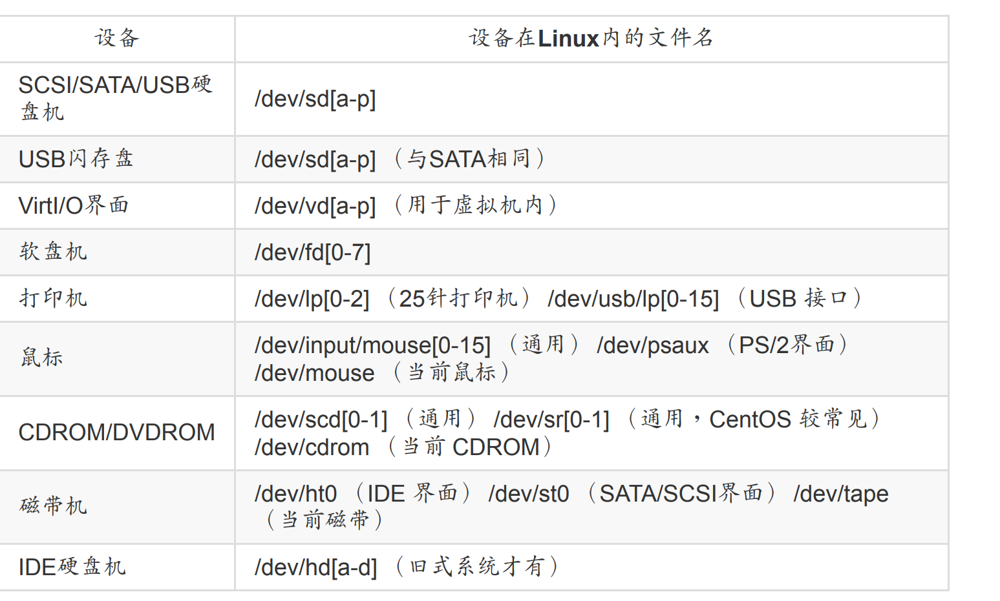
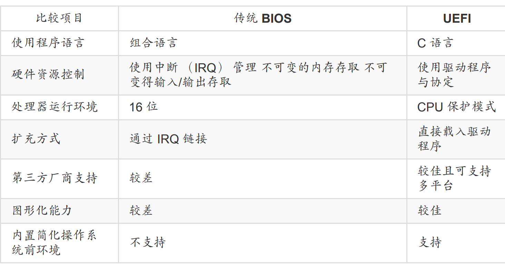
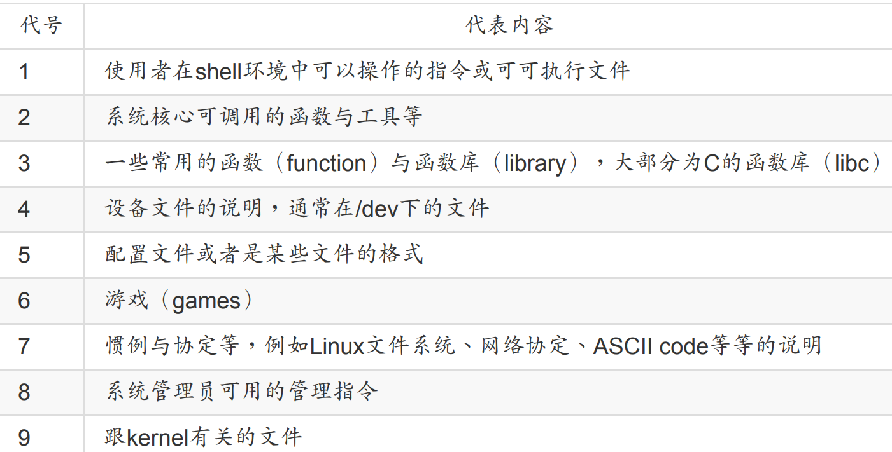
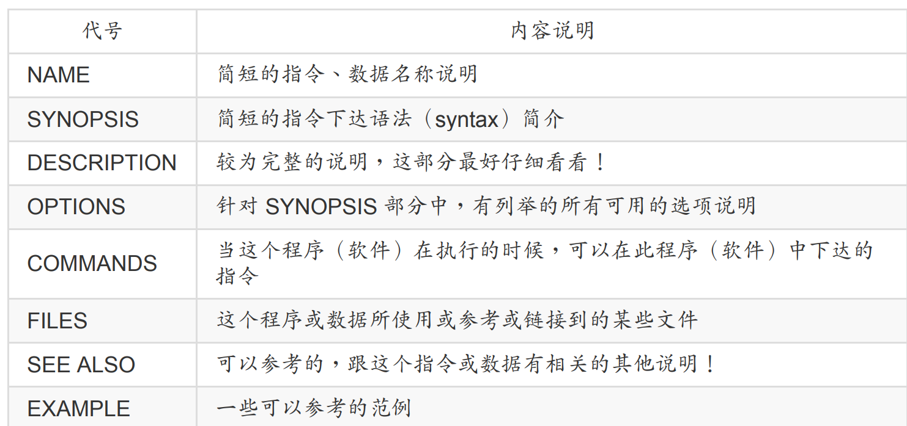
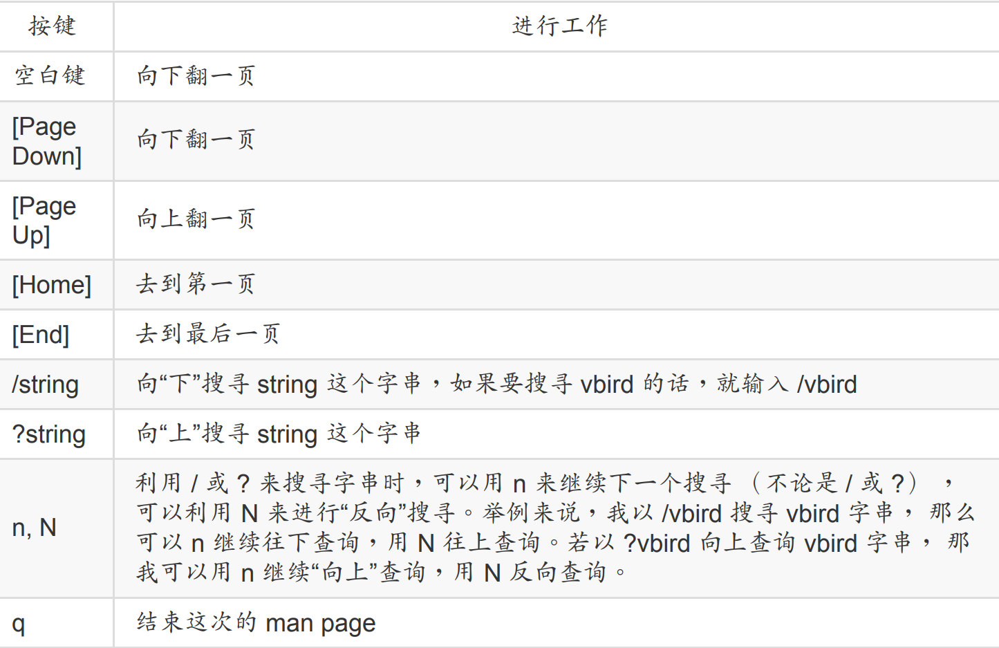

## 1.1 硬件相关

### 1.1.1 各硬件设备在Linux中的文件名

 

## 1.2 磁盘分区

不同启动方式比较



## 1.3 指令下达

### 1.3.1 常用命令

- 显示日期与时间的指令： date
  
  - 格式化显示日期 `date +%Y/%m/%d`
  
  - 格式化显示时间 `date +%H:%M`

- 显示日历的指令： cal
  
  - 显示全年的 `cal 2022``
  
  - 具体格式如下`cal [month] [year]`

- 简单好用的计算机： bc

### 1.3.2 常用快捷键

- `TAB`可以用于命令补全，连按两下可以显示所有的命令

- `ctrl+C`用于中断程序

- `ctrl+D`表示输入结束，一般用于exit

- 用`[shift]+{[PageUP]|[Page Down]}`来进行前后翻页

### 1.3.3 帮助

基本上所有的命令都可以使用 `--help`来查看帮助信息

比如 `date --help`的结果如下

```bash
xiaoyou@dev:~$ date --help
Usage: date [OPTION]... [+FORMAT]
  or:  date [-u|--utc|--universal] [MMDDhhmm[[CC]YY][.ss]]
Display the current time in the given FORMAT, or set the system date.

Mandatory arguments to long options are mandatory for short options too.
  -d, --date=STRING          display time described by STRING, not 'now'
      --debug                annotate the parsed date,
                              and warn about questionable usage to stderr
  -f, --file=DATEFILE        like --date; once for each line of DATEFILE
  -I[FMT], --iso-8601[=FMT]  output date/time in ISO 8601 format.
                               FMT='date' for date only (the default),
                               'hours', 'minutes', 'seconds', or 'ns'
                               for date and time to the indicated precision.
                               Example: 2006-08-14T02:34:56-06:00
  -R, --rfc-email            output date and time in RFC 5322 format.
                               Example: Mon, 14 Aug 2006 02:34:56 -0600
      --rfc-3339=FMT         output date/time in RFC 3339 format.
                               FMT='date', 'seconds', or 'ns'
                               for date and time to the indicated precision.
                               Example: 2006-08-14 02:34:56-06:00
  -r, --reference=FILE       display the last modification time of FILE
  -s, --set=STRING           set time described by STRING
  -u, --utc, --universal     print or set Coordinated Universal Time (UTC)
      --help     display this help and exit
      --version  output version information and exit

FORMAT controls the output.  Interpreted sequences are:

  %%   a literal %
  %a   locale's abbreviated weekday name (e.g., Sun)
  %A   locale's full weekday name (e.g., Sunday)
  %b   locale's abbreviated month name (e.g., Jan)
  %B   locale's full month name (e.g., January)
  %c   locale's date and time (e.g., Thu Mar  3 23:05:25 2005)
  %C   century; like %Y, except omit last two digits (e.g., 20)
  %d   day of month (e.g., 01)
  %D   date; same as %m/%d/%y
  %e   day of month, space padded; same as %_d
  %F   full date; same as %Y-%m-%d
  %g   last two digits of year of ISO week number (see %G)
  %G   year of ISO week number (see %V); normally useful only with %V
  %h   same as %b
  %H   hour (00..23)
  %I   hour (01..12)
  %j   day of year (001..366)
  %k   hour, space padded ( 0..23); same as %_H
  %l   hour, space padded ( 1..12); same as %_I
  %m   month (01..12)
  %M   minute (00..59)
  %n   a newline
  %N   nanoseconds (000000000..999999999)
  %p   locale's equivalent of either AM or PM; blank if not known
  %P   like %p, but lower case
  %q   quarter of year (1..4)
  %r   locale's 12-hour clock time (e.g., 11:11:04 PM)
  %R   24-hour hour and minute; same as %H:%M
  %s   seconds since 1970-01-01 00:00:00 UTC
  %S   second (00..60)
  %t   a tab
  %T   time; same as %H:%M:%S
  %u   day of week (1..7); 1 is Monday
  %U   week number of year, with Sunday as first day of week (00..53)
  %V   ISO week number, with Monday as first day of week (01..53)
  %w   day of week (0..6); 0 is Sunday
  %W   week number of year, with Monday as first day of week (00..53)
  %x   locale's date representation (e.g., 12/31/99)
  %X   locale's time representation (e.g., 23:13:48)
  %y   last two digits of year (00..99)
  %Y   year
  %z   +hhmm numeric time zone (e.g., -0400)
  %:z  +hh:mm numeric time zone (e.g., -04:00)
  %::z  +hh:mm:ss numeric time zone (e.g., -04:00:00)
  %:::z  numeric time zone with : to necessary precision (e.g., -04, +05:30)
  %Z   alphabetic time zone abbreviation (e.g., EDT)

By default, date pads numeric fields with zeroes.
The following optional flags may follow '%':

  -  (hyphen) do not pad the field
  _  (underscore) pad with spaces
  0  (zero) pad with zeros
  ^  use upper case if possible
  #  use opposite case if possible

After any flags comes an optional field width, as a decimal number;
then an optional modifier, which is either
E to use the locale's alternate representations if available, or
O to use the locale's alternate numeric symbols if available.

Examples:
Convert seconds since the epoch (1970-01-01 UTC) to a date
  $ date --date='@2147483647'

Show the time on the west coast of the US (use tzselect(1) to find TZ)
  $ TZ='America/Los_Angeles' date

Show the local time for 9AM next Friday on the west coast of the US
  $ date --date='TZ="America/Los_Angeles" 09:00 next Fri'

GNU coreutils online help: <https://www.gnu.org/software/coreutils/>
Full documentation at: <https://www.gnu.org/software/coreutils/date>
or available locally via: info '(coreutils) date invocation'
```

还可以使用man命令来寻求帮助`man date`，在man命令的左上角会有一个数字比如：“DATE（1）”，DATE我们知道是指令的名称， 那么（1）代表什么呢？他代表的是“一般使用者可使用的指令”的意思，其他几个常见数字的用途如下



然后man page的主要内容大致可以分为以下几个部分：



我们可以使用一些常用的按键进行快捷操作



可以使用 `man -f xx`来进行搜索，或者 `man -k xx`进行关键词搜索

除了man，我们还可以使用info命令来查找帮助信息，这里就不展开了

### 1.3.4 简单文本编辑器nano

直接使用`nano text.txt`就可以进入界面了，下面是几个常用的快捷键

- [ctrl]-G：取得线上说明（help），很有用的！

- [ctrl]-X：离开naon软件，若有修改过文件会提示是否需要储存喔！

- [ctrl]-O：储存盘案，若你有权限的话就能够储存盘案了；

- [ctrl]-R：从其他文件读入数据，可以将某个文件的内容贴在本文件中；

- [ctrl]-W：搜寻字串，这个也是很有帮助的指令喔！

- [ctrl]-C：说明目前光标所在处的行数与列数等信息；

- [ctrl]-_：可以直接输入行号，让光标快速移动到该行；

- [alt]-Y：校正语法功能打开或关闭（按一下开、再按一下关）

- [alt]-M：可以支持鼠标来移动光标的功能

## 1.4 关机

我们可以使用`who`来查看目前有谁在线上

可以使用`netstat -a`来查看网络连接状态

可以使用`ps -aux`查看后台执行的程序

其他一些和关机有关的命令

将数据同步写入硬盘中的指令： sync
惯用的关机指令： shutdown
重新开机，关机： reboot, halt, poweroff

一些常用的关机命令如下

```bash
[root@study ~]# shutdown -h now
立刻关机，其中 now 相当于时间为 0 的状态
[root@study ~]# shutdown -h 20:25
系统在今天的 20:25 分会关机，若在21:25才下达此指令，则隔天才关机
[root@study ~]# shutdown -h +10
系统再过十分钟后自动关机
[root@study ~]# shutdown -r now
系统立刻重新开机
[root@study ~]# shutdown -r +30 'The system will reboot'
再过三十分钟系统会重新开机，并显示后面的讯息给所有在线上的使用者
[root@study ~]# shutdown -k now 'This system will reboot'
仅发出警告信件的参数！系统并不会关机啦！吓唬人！
```
