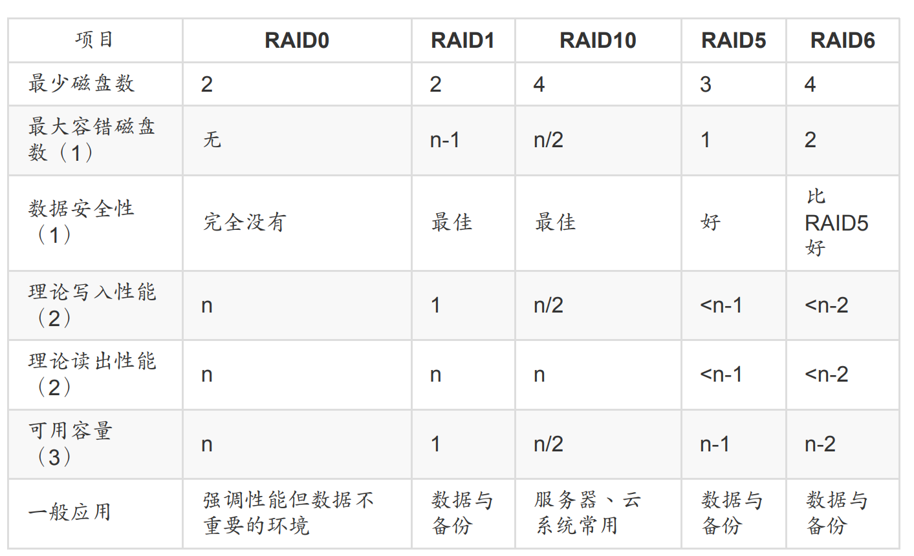
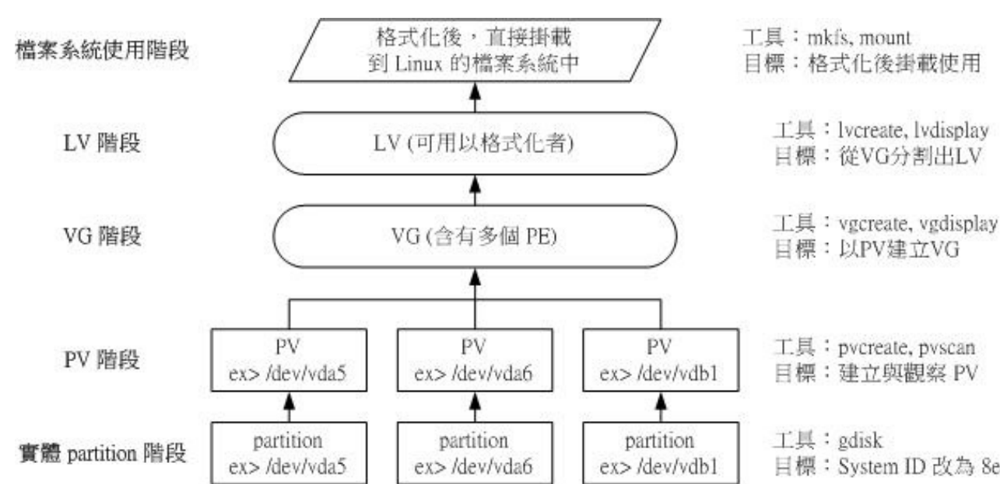

## 10.1 磁盘配额的应用

暂时用不到，跳过，另外这个是针对xfs来讲解的，如果是ext4的话只能针对整个文件系统来进行设置

## 10.2 软件磁盘阵列



### 10.2.1 软raid和硬raid

所谓的硬件磁盘阵列 （hardware RAID） 是通过磁盘阵列卡来达成阵列的目的。 磁盘阵列卡上面有一块专门的芯片在处理 RAID 的任务，因此在性能方面会比较好。在很多任务 （例如 RAID 5 的同位检查码计算） 磁盘阵列并不会重复消耗原本系统的 I/O 总线，理论上性能会较佳。此外目前一般的中高阶磁盘阵列卡都支持热拔插，亦即在不关机的情况下抽换损坏的磁盘，对于系统的复原与数据的可靠性方面非常的好用。


由于磁盘阵列有很多优秀的功能，然而硬件磁盘阵列卡偏偏又贵的很～因此就有发展出利用
软件来仿真磁盘阵列的功能， 这就是所谓的软件磁盘阵列 （software RAID）。软件磁盘阵
列主要是通过软件来仿真阵列的任务， 因此会损耗较多的系统资源，比如说 CPU 的运算与
I/O 总线的资源等。不过目前我们的个人计算机实在已经非常快速了， 因此以前的速度限制现在已经不存在！所以我们可以来玩一玩软件磁盘阵列！

### 10.2.2 软件磁盘阵列设置

软件磁盘阵列的设置很简单呢！简单到让你很想笑喔！因为你只要使用一个指令即可！那就是 mdadm 这个指令。

```bash
[root@study ~]# mdadm --detail /dev/md0
[root@study ~]# mdadm --create /dev/md[0-9] --auto=yes --level=[015] --chunk=NK \
> --raid-devices=N --spare-devices=N /dev/sdx /dev/hdx...
选项与参数：
--create ：为创建 RAID 的选项；
--auto=yes ：决定创建后面接的软件磁盘阵列设备，亦即 /dev/md0, /dev/md1...
--chunk=Nk ：决定这个设备的 chunk 大小，也可以当成 stripe 大小，一般是 64K 或 512K。
--raid-devices=N ：使用几个磁盘 （partition） 作为磁盘阵列的设备
--spare-devices=N ：使用几个磁盘作为备用 （spare） 设备
--level=[015] ：设置这组磁盘阵列的等级。支持很多，不过建议只要用 0, 1, 5 即可
--detail ：后面所接的那个磁盘阵列设备的详细信息
```

首先我们可以使用gdisk来分区

```bash
[root@study ~]# gdisk -l /dev/vda
Number Start （sector） End （sector） Size Code Name
1 2048 6143 2.0 MiB EF02
2 6144 2103295 1024.0 MiB 0700
3 2103296 65026047 30.0 GiB 8E00
4 65026048 67123199 1024.0 MiB 8300 Linux filesystem
5 67123200 69220351 1024.0 MiB FD00 Linux RAID
6 69220352 71317503 1024.0 MiB FD00 Linux RAID
7 71317504 73414655 1024.0 MiB FD00 Linux RAID
8 73414656 75511807 1024.0 MiB FD00 Linux RAID
9 75511808 77608959 1024.0 MiB FD00 Linux RAID
# 上面特殊字体的部份就是我们需要的那 5 个 partition 啰！注意注意！
[root@study ~]# lsblk
NAME MAJ:MIN RM SIZE RO TYPE MOUNTPOINT
vda 252:0 0 40G 0 disk
|-vda1 252:1 0 2M 0 part
|-vda2 252:2 0 1G 0 part /boot
|-vda3 252:3 0 30G 0 part
| |-centos-root 253:0 0 10G 0 lvm /
| |-centos-swap 253:1 0 1G 0 lvm [SWAP]
| `-centos-home 253:2 0 5G 0 lvm /home
|-vda4 252:4 0 1G 0 part /srv/myproject
|-vda5 252:5 0 1G 0 part
|-vda6 252:6 0 1G 0 part
|-vda7 252:7 0 1G 0 part
|-vda8 252:8 0 1G 0 part
`-vda9 252:9 0 1G 0 part
```

然后就可以创建磁盘阵列了

```bash
[root@study ~]# mdadm --create /dev/md0 --auto=yes --level=5 --chunk=256K \
> --raid-devices=4 --spare-devices=1 /dev/vda{5,6,7,8,9}
mdadm: /dev/vda5 appears to contain an ext2fs file system
size=1048576K mtime=Thu Jun 25 00:35:01 2015 # 某些时刻会出现这个东西！没关系的！
Continue creating array? y
mdadm: Defaulting to version 1.2 metadata
mdadm: array /dev/md0 started.
# 详细的参数说明请回去前面看看啰！这里我通过 {} 将重复的项目简化！
# 此外，因为鸟哥这个系统经常在创建测试的环境，因此系统可能会抓到之前的 filesystem
# 所以就会出现如上前两行的讯息！那没关系的！直接按下 y 即可删除旧系统
[root@study ~]# mdadm --detail /dev/md0
/dev/md0: # RAID 的设备文件名
Version : 1.2
Creation Time : Mon Jul 27 15:17:20 2015 # 创建 RAID 的时间
Raid Level : raid5 # 这就是 RAID5 等级！
Array Size : 3142656 （3.00 GiB 3.22 GB） # 整组 RAID 的可用容量
Used Dev Size : 1047552 （1023.17 MiB 1072.69 MB） # 每颗磁盘（设备）的容量
Raid Devices : 4 # 组成 RAID 的磁盘数量
Total Devices : 5 # 包括 spare 的总磁盘数
Persistence : Superblock is persistent
Update Time : Mon Jul 27 15:17:31 2015
State : clean # 目前这个磁盘阵列的使用状态
Active Devices : 4 # 启动（active）的设备数量
Working Devices : 5 # 目前使用于此阵列的设备数
Failed Devices : 0 # 损坏的设备数
Spare Devices : 1 # 预备磁盘的数量
Layout : left-symmetric
Chunk Size : 256K # 就是 chunk 的小区块容量
Name : study.centos.vbird:0 （local to host study.centos.vbird）
UUID : 2256da5f:4870775e:cf2fe320:4dfabbc6
Events : 18
Number Major Minor RaidDevice State
0 252 5 0 active sync /dev/vda5
1 252 6 1 active sync /dev/vda6
2 252 7 2 active sync /dev/vda7
5 252 8 3 active sync /dev/vda8
4 252 9 - spare /dev/vda9
# 最后五行就是这五个设备目前的情况，包括四个 active sync 一个 spare ！
# 至于 RaidDevice 指的则是此 RAID 内的磁盘顺序
```

由于磁盘阵列的创建需要一些时间，所以你最好等待数分钟后再使用“ mdadm --detail
/dev/md0 ”去查阅你的磁盘阵列详细信息！ 否则有可能看到某些磁盘正在“spare rebuilding”之类的创建字样！

除了指令之外，你也可以查阅如下的文件来看看系统软件磁盘阵列的情况：

```bash
[root@study ~]# cat /proc/mdstat
Personalities : [raid6] [raid5] [raid4]
md0 : active raid5 vda8[5] vda9[4]（S） vda7[2] vda6[1] vda5[0] <==第一行
3142656 blocks super 1.2 level 5, 256k chunk, algorithm 2 [4/4] [UUUU] <==第二行
unused devices: <none>
```

- 第一行部分：指出 md0 为 raid5 ，且使用了 vda8, vda7, vda6, vda5 等四颗磁盘设备。
  每个设备后面的中括号 [] 内的数字为此磁盘在 RAID 中的顺序 （RaidDevice）；至于vda9 后面的 [S] 则代表 vda9 为 spare 之意。

- 第二行：此磁盘阵列拥有 3142656 个block（每个 block 单位为 1K），所以总容量约为
  3GB， 使用 RAID 5 等级，写入磁盘的小区块 （chunk） 大小为 256K，使用 algorithm
  2 磁盘阵列演算法。 [m/n] 代表此阵列需要 m 个设备，且 n 个设备正常运行。因此本
  md0 需要 4 个设备且这 4 个设备均正常运行。 后面的 [UUUU] 代表的是四个所需的设备（就是 [m/n] 里面的 m） 的启动情况，U 代表正常运行，若为 _ 则代表不正常。

最后就是格式化挂载使用raid了所以整体来说，要优化这个 XFS 文件系统就变成这样：

```bash
[root@study ~]# mkfs.xfs -f -d su=256k,sw=3 -r extsize=768k /dev/md0
# 有趣吧！是 /dev/md0 做为设备被格式化呢！
[root@study ~]# mkdir /srv/raid
[root@study ~]# mount /dev/md0 /srv/raid
[root@study ~]# df -Th /srv/raid
Filesystem Type Size Used Avail Use% Mounted on
/dev/md0 xfs 3.0G 33M 3.0G 2% /srv/raid
# 看吧！多了一个 /dev/md0 的设备，而且真的可以让你使用呢！还不赖！
```

### 10.2.3 磁盘错误的救援模式

```bash
[root@study ~]# mdadm --manage /dev/md[0-9] [--add 设备] [--remove 设备] [--fail 设备]
选项与参数：
--add ：会将后面的设备加入到这个 md 中！
--remove ：会将后面的设备由这个 md 中移除
--fail ：会将后面的设备设置成为出错的状态
```

下面我们来简单把一个磁盘设置为错误

```bash
# 0\. 先复制一些东西到 /srv/raid 去，假设这个 RAID 已经在使用了
[root@study ~]# cp -a /etc /var/log /srv/raid
[root@study ~]# df -Th /srv/raid ; du -sm /srv/raid/*
Filesystem Type Size Used Avail Use% Mounted on
/dev/md0 xfs 3.0G 144M 2.9G 5% /srv/raid
28 /srv/raid/etc <==看吧！确实有数据在里面喔！
51 /srv/raid/log
# 1\. 假设 /dev/vda7 这个设备出错了！实际仿真的方式：
[root@study ~]# mdadm --manage /dev/md0 --fail /dev/vda7
mdadm: set /dev/vda7 faulty in /dev/md0 # 设置成为错误的设备啰！
/dev/md0:
.....（中间省略）.....
Update Time : Mon Jul 27 15:32:50 2015
State : clean, degraded, recovering
Active Devices : 3
Working Devices : 4
Failed Devices : 1 <==出错的磁盘有一个！
Spare Devices : 1
.....（中间省略）.....
Number Major Minor RaidDevice State
0 252 5 0 active sync /dev/vda5
1 252 6 1 active sync /dev/vda6
4 252 9 2 spare rebuilding /dev/vda9
5 252 8 3 active sync /dev/vda8
2 252 7 - faulty /dev/vda7
# 看到没！这的动作要快做才会看到！ /dev/vda9 启动了而 /dev/vda7 死掉了
```

上面的画面你得要快速的连续输入那些 mdadm 的指令才看的到！因为你的 RAID 5 正在重建系统！ 若你等待一段时间再输入后面的观察指令，则会看到如下的画面了：

```bash
# 2\. 已经借由 spare disk 重建完毕的 RAID 5 情况
[root@study ~]# mdadm --detail /dev/md0
....（前面省略）....
Number Major Minor RaidDevice State
0 252 5 0 active sync /dev/vda5
1 252 6 1 active sync /dev/vda6
4 252 9 2 active sync /dev/vda9
5 252 8 3 active sync /dev/vda8
2 252 7 - faulty /dev/vda7
```

然后我们可以这样来进行替换

```bash
# 3\. 拔除“旧的”/dev/vda7 磁盘
[root@study ~]# mdadm --manage /dev/md0 --remove /dev/vda7
# 假设接下来你就进行了上面谈到的第 2, 3 个步骤，然后重新开机成功了！
# 4\. 安装“新的”/dev/vda7 磁盘
[root@study ~]# mdadm --manage /dev/md0 --add /dev/vda7
[root@study ~]# mdadm --detail /dev/md0
....（前面省略）....
Number Major Minor RaidDevice State
0 252 5 0 active sync /dev/vda5
1 252 6 1 active sync /dev/vda6
4 252 9 2 active sync /dev/vda9
5 252 8 3 active sync /dev/vda8
6 252 7 - spare /dev/vda7
```

### 10.2.4 开机启动

新的 distribution 大多会自己搜寻 /dev/md[0-9] 然后在开机的时候给予设置好所需要的功能。不过鸟哥还是建议你， 修改一下配置文件吧！ ^_^。software RAID 也是有配置文件的，这个配置文件在 /etc/mdadm.conf ！

```bash
[root@study ~]# mdadm --detail /dev/md0 | grep -i uuid
UUID : 2256da5f:4870775e:cf2fe320:4dfabbc6
# 后面那一串数据，就是这个设备向系统注册的 UUID 识别码！
# 开始设置 mdadm.conf
[root@study ~]# vim /etc/mdadm.conf
ARRAY /dev/md0 UUID=2256da5f:4870775e:cf2fe320:4dfabbc6
# RAID设备 识别码内容
# 开始设置开机自动挂载并测试
[root@study ~]# blkid /dev/md0
/dev/md0: UUID="494cb3e1-5659-4efc-873d-d0758baec523" TYPE="xfs"
[root@study ~]# vim /etc/fstab
UUID=494cb3e1-5659-4efc-873d-d0758baec523 /srv/raid xfs defaults 0 0
[root@study ~]# umount /dev/md0; mount -a
[root@study ~]# df -Th /srv/raid
Filesystem Type Size Used Avail Use% Mounted on
/dev/md0 xfs 3.0G 111M 2.9G 4% /srv/raid
# 你得确定可以顺利挂载，并且没有发生任何错误！
```

### 10.2.5 关闭软raid

```bash
# 1\. 先卸载且删除配置文件内与这个 /dev/md0 有关的设置：
[root@study ~]# umount /srv/raid
[root@study ~]# vim /etc/fstab
UUID=494cb3e1-5659-4efc-873d-d0758baec523 /srv/raid xfs defaults 0 0
# 将这一行删除掉！或者是注解掉也可以！
# 2\. 先覆盖掉 RAID 的 metadata 以及 XFS 的 superblock，才关闭 /dev/md0 的方法
[root@study ~]# dd if=/dev/zero of=/dev/md0 bs=1M count=50
[root@study ~]# mdadm --stop /dev/md0
mdadm: stopped /dev/md0 <==不啰唆！这样就关闭了！
[root@study ~]# dd if=/dev/zero of=/dev/vda5 bs=1M count=10
[root@study ~]# dd if=/dev/zero of=/dev/vda6 bs=1M count=10
[root@study ~]# dd if=/dev/zero of=/dev/vda7 bs=1M count=10
[root@study ~]# dd if=/dev/zero of=/dev/vda8 bs=1M count=10
[root@study ~]# dd if=/dev/zero of=/dev/vda9 bs=1M count=10
[root@study ~]# cat /proc/mdstat
Personalities : [raid6] [raid5] [raid4]
unused devices: <none> <==看吧！确实不存在任何阵列设备！
[root@study ~]# vim /etc/mdadm.conf
#ARRAY /dev/md0 UUID=2256da5f:4870775e:cf2fe320:4dfabbc6
# 一样啦！删除他或是注解他！
```

## 10.3 逻辑卷轴管理员

LVM 的重点在于“可以弹性的调整 filesystem 的容量！”而并非在于性能与数据保全上面。 需
要文件的读写性能或者是数据的可靠性，

### 10.3.1 简单介绍

LVM 的作法是将几个实体的partitions （或 disk） 通过软件组合成为一块看起来是独立的大磁盘 （VG） ，然后将这块大磁盘再经过分区成为可使用分区 （LV）， 最终就能够挂载使用了。但是为什么这样的系统可以进行 filesystem 的扩充或缩小呢？其实与一个称为 PE 的项目有关！ 下面我们就得要针对这几个项目来好好聊聊！



么我的数据写入这个 LV 时，到底他是怎么写入硬盘当中的？有两种方式

- 线性模式 （linear）：假如我将 /dev/vda1, /dev/vdb1 这两个 partition 加入到 VG 当中，并且整个 VG 只有一个 LV 时，那么所谓的线性模式就是：当 /dev/vda1 的容量用完之后，/dev/vdb1 的硬盘才会被使用到， 这也是我们所建议的模式。

- 交错模式 （triped）：那什么是交错模式？很简单啊，就是我将一笔数据拆成两部分，分别写入 /dev/vda1 与 /dev/vdb1 的意思，感觉上有点像 RAID 0 啦！如此一来，一份数据用两颗硬盘来写入，理论上，读写的性能会比较好。

### 10.3.2 制作流程

- 使用 4 个 partition ，每个 partition 的容量均为 1GB 左右，且 system ID 需要为 8e；

- 全部的 partition 整合成为一个 VG，VG 名称设置为 vbirdvg；且 PE 的大小为 16MB；

- 创建一个名为 vbirdlv 的 LV，容量大约 2G 好了！

- 最终这个 LV 格式化为 xfs 的文件系统，且挂载在 /srv/lvm 中

首先先分个区

```bash
[root@study ~]# gdisk -l /dev/vda
Number Start （sector） End （sector） Size Code Name
1 2048 6143 2.0 MiB EF02
2 6144 2103295 1024.0 MiB 0700
3 2103296 65026047 30.0 GiB 8E00
4 65026048 67123199 1024.0 MiB 8300 Linux filesystem
5 67123200 69220351 1024.0 MiB 8E00 Linux LVM
6 69220352 71317503 1024.0 MiB 8E00 Linux LVM
7 71317504 73414655 1024.0 MiB 8E00 Linux LVM
8 73414656 75511807 1024.0 MiB 8E00 Linux LVM
9 75511808 77608959 1024.0 MiB 8E00 Linux LVM
# 其实 system ID 不改变也没关系！只是为了让我们管理员清楚知道该 partition 的内容，
# 所以这里建议还是修订成正确的磁盘内容较佳！
```

然后创建一个pv

pvcreate ：将实体 partition 创建成为 PV ；
pvscan ：搜寻目前系统里面任何具有 PV 的磁盘；
pvdisplay ：显示出目前系统上面的 PV 状态；
pvremove ：将 PV 属性移除，让该 partition 不具有 PV 属性。

```bash
# 1\. 检查有无 PV 在系统上，然后将 /dev/vda{5-8} 创建成为 PV 格式
[root@study ~]# pvscan
PV /dev/vda3 VG centos lvm2 [30.00 GiB / 14.00 GiB free]
Total: 1 [30.00 GiB] / in use: 1 [30.00 GiB] / in no VG: 0 [0 ]
# 其实安装的时候，我们就有使用 LVM 了喔！所以会有 /dev/vda3 存在的！
[root@study ~]# pvcreate /dev/vda{5,6,7,8}
Physical volume "/dev/vda5" successfully created
Physical volume "/dev/vda6" successfully created
Physical volume "/dev/vda7" successfully created
Physical volume "/dev/vda8" successfully created
# 这个指令可以一口气创建这四个 partition 成为 PV 啦！注意大括号的用途
[root@study ~]# pvscan
PV /dev/vda3 VG centos lvm2 [30.00 GiB / 14.00 GiB free]
PV /dev/vda8 lvm2 [1.00 GiB]
PV /dev/vda5 lvm2 [1.00 GiB]
PV /dev/vda7 lvm2 [1.00 GiB]
PV /dev/vda6 lvm2 [1.00 GiB]
Total: 5 [34.00 GiB] / in use: 1 [30.00 GiB] / in no VG: 4 [4.00 GiB]
# 这就分别显示每个 PV 的信息与系统所有 PV 的信息。尤其最后一行，显示的是：
# 整体 PV 的量 / 已经被使用到 VG 的 PV 量 / 剩余的 PV 量
# 2\. 更详细的列示出系统上面每个 PV 的个别信息：
[root@study ~]# pvdisplay /dev/vda5
"/dev/vda5" is a new physical volume of "1.00 GiB"
--- NEW Physical volume ---
PV Name /dev/vda5 <==实际的 partition 设备名称
VG Name <==因为尚未分配出去，所以空白！
PV Size 1.00 GiB <==就是容量说明
Allocatable NO <==是否已被分配，结果是 NO
PE Size 0 <==在此 PV 内的 PE 大小
Total PE 0 <==共分区出几个 PE
Free PE 0 <==没被 LV 用掉的 PE
Allocated PE 0 <==尚可分配出去的 PE 数量
PV UUID Cb717z-lShq-6WXf-ewEj-qg0W-MieW-oAZTR6
# 由于 PE 是在创建 VG 时才给予的参数，因此在这里看到的 PV 里头的 PE 都会是 0
# 而且也没有多余的 PE 可供分配 （allocatable）。
```

然后是创建VG

vgcreate ：就是主要创建 VG 的指令啦！他的参数比较多，等一下介绍。
vgscan ：搜寻系统上面是否有 VG 存在？
vgdisplay ：显示目前系统上面的 VG 状态；
vgextend ：在 VG 内增加额外的 PV ；
vgreduce ：在 VG 内移除 PV；
vgchange ：设置 VG 是否启动 （active）；
vgremove ：删除一个 VG 啊！

```bash
[root@study ~]# vgcreate [-s N[mgt]] VG名称 PV名称
选项与参数：
-s ：后面接 PE 的大小 （size） ，单位可以是 m, g, t （大小写均可）
# 1\. 将 /dev/vda5-7 创建成为一个 VG，且指定 PE 为 16MB 喔！
[root@study ~]# vgcreate -s 16M vbirdvg /dev/vda{5,6,7}
Volume group "vbirdvg" successfully created
[root@study ~]# vgscan
Reading all physical volumes. This may take a while...
Found volume group "vbirdvg" using metadata type lvm2 # 我们手动制作的
Found volume group "centos" using metadata type lvm2 # 之前系统安装时作的
[root@study ~]# pvscan
PV /dev/vda5 VG vbirdvg lvm2 [1008.00 MiB / 1008.00 MiB free]
PV /dev/vda6 VG vbirdvg lvm2 [1008.00 MiB / 1008.00 MiB free]
PV /dev/vda7 VG vbirdvg lvm2 [1008.00 MiB / 1008.00 MiB free]
PV /dev/vda3 VG centos lvm2 [30.00 GiB / 14.00 GiB free]
PV /dev/vda8 lvm2 [1.00 GiB]
Total: 5 [33.95 GiB] / in use: 4 [32.95 GiB] / in no VG: 1 [1.00 GiB]
# 嘿嘿！发现没！有三个 PV 被用去，剩下 1 个 /dev/vda8 的 PV 没被用掉！
[root@study ~]# vgdisplay vbirdvg
--- Volume group ---
VG Name vbirdvg
System ID
Format lvm2
Metadata Areas 3
Metadata Sequence No 1
VG Access read/write
VG Status resizable
MAX LV 0
Cur LV 0
Open LV 0
Max PV 0
Cur PV 3
Act PV 3
VG Size 2.95 GiB <==整体的 VG 容量有这么大
PE Size 16.00 MiB <==内部每个 PE 的大小
Total PE 189 <==总共的 PE 数量共有这么多！
Alloc PE / Size 0 / 0
Free PE / Size 189 / 2.95 GiB <==尚可配置给 LV 的 PE数量/总容量有这么多！
VG UUID Rx7zdR-y2cY-HuIZ-Yd2s-odU8-AkTW-okk4Ea
# 最后那三行指的就是 PE 能够使用的情况！由于尚未切出 LV，因此所有的 PE 均可自由使用。
```

最后我们增加一下VG的容量

```bash
# 2\. 将剩余的 PV （/dev/vda8） 丢给 vbirdvg 吧！
[root@study ~]# vgextend vbirdvg /dev/vda8
Volume group "vbirdvg" successfully extended
[root@study ~]# vgdisplay vbirdvg
....（前面省略）....
VG Size 3.94 GiB
PE Size 16.00 MiB
Total PE 252
Alloc PE / Size 0 / 0
Free PE / Size 252 / 3.94 GiB
# 基本上，不难吧！这样就可以抽换整个 VG 的大小啊！
```

然后就是分区了，也就是LV

lvcreate ：创建 LV 啦！
lvscan ：查询系统上面的 LV ；
lvdisplay ：显示系统上面的 LV 状态啊！
lvextend ：在 LV 里面增加容量！
lvreduce ：在 LV 里面减少容量；
lvremove ：删除一个 LV ！
lvresize ：对 LV 进行容量大小的调整！

```bash
[root@study ~]# lvcreate [-L N[mgt]] [-n LV名称] VG名称
[root@study ~]# lvcreate [-l N] [-n LV名称] VG名称
选项与参数：
-L ：后面接容量，容量的单位可以是 M,G,T 等，要注意的是，最小单位为 PE，
因此这个数量必须要是 PE 的倍数，若不相符，系统会自行计算最相近的容量。
-l ：后面可以接 PE 的“个数”，而不是数量。若要这么做，得要自行计算 PE 数。
-n ：后面接的就是 LV 的名称啦！
更多的说明应该可以自行查阅吧！ man lvcreate
# 1\. 将 vbirdvg 分 2GB 给 vbirdlv 喔！
[root@study ~]# lvcreate -L 2G -n vbirdlv vbirdvg
Logical volume "vbirdlv" created
# 由于本案例中每个 PE 为 16M ，如果要用 PE 的数量来处理的话，那使用下面的指令也 OK喔！
# lvcreate -l 128 -n vbirdlv vbirdvg
[root@study ~]# lvscan
ACTIVE '/dev/vbirdvg/vbirdlv' [2.00 GiB] inherit <==新增加的一个 LV 啰！
ACTIVE '/dev/centos/root' [10.00 GiB] inherit
ACTIVE '/dev/centos/home' [5.00 GiB] inherit
ACTIVE '/dev/centos/swap' [1.00 GiB] inherit
[root@study ~]# lvdisplay /dev/vbirdvg/vbirdlv
--- Logical volume ---
LV Path /dev/vbirdvg/vbirdlv # 这个是 LV 的全名喔！
LV Name vbirdlv
VG Name vbirdvg
LV UUID QJJrTC-66sm-878Y-o2DC-nN37-2nFR-0BwMmn
LV Write Access read/write
LV Creation host, time study.centos.vbird, 2015-07-28 02:22:49 +0800
LV Status available
# open 0
LV Size 2.00 GiB # 容量就是这么大！
Current LE 128
Segments 3
Allocation inherit
Read ahead sectors auto
- currently set to 8192
Block device 253:3
```

最后就是文件系统阶段

```bash
# 1\. 格式化、挂载与观察我们的 LV 吧！
[root@study ~]# mkfs.xfs /dev/vbirdvg/vbirdlv <==注意 LV 全名！
[root@study ~]# mkdir /srv/lvm
[root@study ~]# mount /dev/vbirdvg/vbirdlv /srv/lvm
[root@study ~]# df -Th /srv/lvm
Filesystem Type Size Used Avail Use% Mounted on
/dev/mapper/vbirdvg-vbirdlv xfs 2.0G 33M 2.0G 2% /srv/lvm
[root@study ~]# cp -a /etc /var/log /srv/lvm
[root@study ~]# df -Th /srv/lvm
Filesystem Type Size Used Avail Use% Mounted on
/dev/mapper/vbirdvg-vbirdlv xfs 2.0G 152M 1.9G 8% /srv/lvm <==确定是可用的啊！
```

### 10.3.3 放大LV容量

假设我们想要针对 /srv/lvm 再增加 500M 的容量，该如何处置？

```bash
# 1\. 由前面的过程我们知道 /srv/lvm 是 /dev/vbirdvg/vbirdlv 这个设备，所以检查 vbirdvg 吧！
[root@study ~]# vgdisplay vbirdvg
--- Volume group ---
VG Name vbirdvg
System ID
Format lvm2
Metadata Areas 4
Metadata Sequence No 3
VG Access read/write
VG Status resizable
MAX LV 0
Cur LV 1
Open LV 1
Max PV 0
Cur PV 4
Act PV 4
VG Size 3.94 GiB
PE Size 16.00 MiB
Total PE 252
Alloc PE / Size 128 / 2.00 GiB
Free PE / Size 124 / 1.94 GiB # 看起来剩余容量确实超过 500M 的！
VG UUID Rx7zdR-y2cY-HuIZ-Yd2s-odU8-AkTW-okk4Ea
# 既然 VG 的容量够大了！所以直接来放大 LV 吧！！
# 2\. 放大 LV 吧！利用 lvresize 的功能来增加！
[root@study ~]# lvresize -L +500M /dev/vbirdvg/vbirdlv
Rounding size to boundary between physical extents: 512.00 MiB
Size of logical volume vbirdvg/vbirdlv changed from 2.00 GiB （128 extents） to 2.50 GiB
（160 extents）.
Logical volume vbirdlv successfully resized
# 这样就增加了 LV 了喔！lvresize 的语法很简单，基本上同样通过 -l 或 -L 来增加！
# 若要增加则使用 + ，若要减少则使用 - ！详细的选项请参考 man lvresize 啰！
[root@study ~]# lvscan
ACTIVE '/dev/vbirdvg/vbirdlv' [2.50 GiB] inherit
ACTIVE '/dev/centos/root' [10.00 GiB] inherit
ACTIVE '/dev/centos/home' [5.00 GiB] inherit
ACTIVE '/dev/centos/swap' [1.00 GiB] inherit
# 可以发现 /dev/vbirdvg/vbirdlv 容量由 2G 增加到 2.5G 啰！
[root@study ~]# df -Th /srv/lvm
Filesystem Type Size Used Avail Use% Mounted on
/dev/mapper/vbirdvg-vbirdlv xfs 2.0G 111M 1.9G 6% /srv/lvm
```

但是还是得要处理一下文件系统的容量啦！开始观察一下文件系统，然后使用 xfs_growfs 来处理一下吧！

```bash
# 3.1 先看一下原本的文件系统内的 superblock 记录情况吧！
[root@study ~]# xfs_info /srv/lvm
meta-data=/dev/mapper/vbirdvg-vbirdlv isize=256 agcount=4, agsize=131072 blks
= sectsz=512 attr=2, projid32bit=1
= crc=0 finobt=0
data = bsize=4096 blocks=524288, imaxpct=25
= sunit=0 swidth=0 blks
naming =version 2 bsize=4096 ascii-ci=0 ftype=0
log =internal bsize=4096 blocks=2560, version=2
= sectsz=512 sunit=0 blks, lazy-count=1
realtime =none extsz=4096 blocks=0, rtextents=0
[root@study ~]# xfs_growfs /srv/lvm # 这一步骤才是最重要的！
[root@study ~]# xfs_info /srv/lvm
meta-data=/dev/mapper/vbirdvg-vbirdlv isize=256 agcount=5, agsize=131072 blks
= sectsz=512 attr=2, projid32bit=1
= crc=0 finobt=0
data = bsize=4096 blocks=655360, imaxpct=25
= sunit=0 swidth=0 blks
naming =version 2 bsize=4096 ascii-ci=0 ftype=0
log =internal bsize=4096 blocks=2560, version=2
= sectsz=512 sunit=0 blks, lazy-count=1
realtime =none extsz=4096 blocks=0, rtextents=0
[root@study ~]# df -Th /srv/lvm
Filesystem Type Size Used Avail Use% Mounted on
/dev/mapper/vbirdvg-vbirdlv xfs 2.5G 111M 2.4G 5% /srv/lvm
[root@study ~]# ls -l /srv/lvm
drwxr-xr-x. 131 root root 8192 Jul 28 00:12 etc
drwxr-xr-x. 16 root root 4096 Jul 28 00:01 log
# 刚刚复制进去的数据可还是存在的喔！并没有消失不见！
```

### 10.3.4 自动调整磁盘使用率

什么是 LVM thin Volume 呢？这东西其实挺好玩的，他的概念是：先创建一个可以实支实
付、用多少容量才分配实际写入多少容量的磁盘容量储存池 （thin pool）， 然后再由这个
thin pool 去产生一个“指定要固定容量大小的 LV 设备”，这个 LV 就有趣了！虽然你会看到“宣告上，他的容量可能有 10GB ，但实际上， 该设备用到多少容量时，才会从 thin pool 去实际取得所需要的容量”！就如同上面的环境说的，可能我们的 thin pool 仅有 1GB 的容量， 但是可以分配给一个 10GB 的 LV 设备！而该设备实际使用到 500M 时，整个 thin pool 才分配500M 给该 LV 的意思！

下面简单实战一下

```bash
# 1\. 先以 lvcreate 来创建 vbirdtpool 这个 thin pool 设备：
[root@study ~]# lvcreate -L 1G -T vbirdvg/vbirdtpool # 最重要的创建指令
[root@study ~]# lvdisplay /dev/vbirdvg/vbirdtpool
--- Logical volume ---
LV Name vbirdtpool
VG Name vbirdvg
LV UUID p3sLAg-Z8jT-tBuT-wmEL-1wKZ-jrGP-0xmLtk
LV Write Access read/write
LV Creation host, time study.centos.vbird, 2015-07-28 18:27:32 +0800
LV Pool metadata vbirdtpool_tmeta
LV Pool data vbirdtpool_tdata
LV Status available
# open 0
LV Size 1.00 GiB # 总共可分配出去的容量
Allocated pool data 0.00% # 已分配的容量百分比
Allocated metadata 0.24% # 已分配的中介数据百分比
Current LE 64
Segments 1
Allocation inherit
Read ahead sectors auto
- currently set to 8192
Block device 253:6
# 非常有趣吧！竟然在 LV 设备中还可以有再分配 （Allocated） 的项目耶！果然是储存池！
[root@study ~]# lvs vbirdvg # 语法为 lvs VGname
LV VG Attr LSize Pool Origin Data% Meta% Move Log Cpy%Sync Convert
vbirdlv vbirdvg -wi-ao---- 2.50g
vbirdtpool vbirdvg twi-a-tz-- 1.00g 0.00 0.24
# 这个 lvs 指令的输出更加简单明了！直接看比较清晰！
# 2\. 开始创建 vbirdthin1 这个有 10GB 的设备，注意！必须使用 --thin 与 vbirdtpool 链接喔！
[root@study ~]# lvcreate -V 10G -T vbirdvg/vbirdtpool -n vbirdthin1
[root@study ~]# lvs vbirdvg
LV VG Attr LSize Pool Origin Data% Meta% Move Log Cpy%Sync Convert
vbirdlv vbirdvg -wi-ao---- 2.50g
vbirdthin1 vbirdvg Vwi-a-tz-- 10.00g vbirdtpool 0.00
vbirdtpool vbirdvg twi-aotz-- 1.00g 0.00 0.27
# 很有趣吧！明明连 vbirdvg 这个 VG 都没有足够大到 10GB 的容量，通过 thin pool
# 竟然就产生了 10GB 的 vbirdthin1 这个设备了！好有趣！
# 3\. 开始创建文件系统
[root@study ~]# mkfs.xfs /dev/vbirdvg/vbirdthin1
[root@study ~]# mkdir /srv/thin
[root@study ~]# mount /dev/vbirdvg/vbirdthin1 /srv/thin
[root@study ~]# df -Th /srv/thin
Filesystem Type Size Used Avail Use% Mounted on
/dev/mapper/vbirdvg-vbirdthin1 xfs 10G 33M 10G 1% /srv/thin
# 真的有 10GB 耶！！
# 4\. 测试一下容量的使用！创建 500MB 的文件，但不可超过 1GB 的测试为宜！
[root@study ~]# dd if=/dev/zero of=/srv/thin/test.img bs=1M count=500
[root@study ~]# lvs vbirdvg
LV VG Attr LSize Pool Origin Data% Meta% Move Log Cpy%Sync Convert
vbirdlv vbirdvg -wi-ao---- 2.50g
vbirdthin1 vbirdvg Vwi-aotz-- 10.00g vbirdtpool 4.99
vbirdtpool vbirdvg twi-aotz-- 1.00g 49.93 1.81
# 很要命！这时已经分配出 49% 以上的容量了！而 vbirdthin1 却只看到用掉 5% 而已！
# 所以鸟哥认为，这个 thin pool 非常好用！但是在管理上，得要特别特别的留意！
```

### 10.3.5 磁盘快照

传统方式创建快照

```bash
# 1\. 先观察 VG 还剩下多少剩余容量
[root@study ~]# vgdisplay vbirdvg
....（其他省略）....
Total PE 252
Alloc PE / Size 226 / 3.53 GiB
Free PE / Size 26 / 416.00 MiB
# 就只有剩下 26 个 PE 了！全部分配给 vbirdsnap1 啰！
# 2\. 利用 lvcreate 创建 vbirdlv 的快照区，快照被取名为 vbirdsnap1，且给予 26 个 PE
[root@study ~]# lvcreate -s -l 26 -n vbirdsnap1 /dev/vbirdvg/vbirdlv
Logical volume "vbirdsnap1" created
# 上述的指令中最重要的是那个 -s 的选项！代表是 snapshot 快照功能之意！
# -n 后面接快照区的设备名称， /dev/.... 则是要被快照的 LV 完整文件名。
# -l 后面则是接使用多少个 PE 来作为这个快照区使用。
[root@study ~]# lvdisplay /dev/vbirdvg/vbirdsnap1
--- Logical volume ---
LV Path /dev/vbirdvg/vbirdsnap1
LV Name vbirdsnap1
VG Name vbirdvg
LV UUID I3m3Oc-RIvC-unag-DiiA-iQgI-I3z9-0OaOzR
LV Write Access read/write
LV Creation host, time study.centos.vbird, 2015-07-28 19:21:44 +0800
LV snapshot status active destination for vbirdlv
LV Status available
# open 0
LV Size 2.50 GiB # 原始碟，就是 vbirdlv 的原始容量
Current LE 160
COW-table size 416.00 MiB # 这个快照能够纪录的最大容量！
COW-table LE 26
Allocated to snapshot 0.00% # 目前已经被用掉的容量！
Snapshot chunk size 4.00 KiB
Segments 1
Allocation inherit
Read ahead sectors auto
- currently set to 8192
Block device 253:11
```

还可以直接挂载

```bash
[root@study ~]# mkdir /srv/snapshot1
[root@study ~]# mount -o nouuid /dev/vbirdvg/vbirdsnap1 /srv/snapshot1
[root@study ~]# df -Th /srv/lvm /srv/snapshot1
Filesystem Type Size Used Avail Use% Mounted on
/dev/mapper/vbirdvg-vbirdlv xfs 2.5G 111M 2.4G 5% /srv/lvm
/dev/mapper/vbirdvg-vbirdsnap1 xfs 2.5G 111M 2.4G 5% /srv/snapshot1
# 有没有看到！这两个咚咚竟然是一模一样喔！我们根本没有动过
# /dev/vbirdvg/vbirdsnap1 对吧！不过这里面会主动记录原 vbirdlv 的内容！
```

使用快照来复原系统

```bash
# 1\. 先将原本的 /dev/vbirdvg/vbirdlv 内容作些变更，增增减减一些目录吧！
[root@study ~]# df -Th /srv/lvm /srv/snapshot1
Filesystem Type Size Used Avail Use% Mounted on
/dev/mapper/vbirdvg-vbirdlv xfs 2.5G 111M 2.4G 5% /srv/lvm
/dev/mapper/vbirdvg-vbirdsnap1 xfs 2.5G 111M 2.4G 5% /srv/snapshot1
[root@study ~]# cp -a /usr/share/doc /srv/lvm
[root@study ~]# rm -rf /srv/lvm/log
[root@study ~]# rm -rf /srv/lvm/etc/sysconfig
[root@study ~]# df -Th /srv/lvm /srv/snapshot1
Filesystem Type Size Used Avail Use% Mounted on
/dev/mapper/vbirdvg-vbirdlv xfs 2.5G 146M 2.4G 6% /srv/lvm
/dev/mapper/vbirdvg-vbirdsnap1 xfs 2.5G 111M 2.4G 5% /srv/snapshot1
[root@study ~]# ll /srv/lvm /srv/snapshot1
/srv/lvm:
total 60
drwxr-xr-x. 887 root root 28672 Jul 20 23:03 doc
drwxr-xr-x. 131 root root 8192 Jul 28 00:12 etc
/srv/snapshot1:
total 16
drwxr-xr-x. 131 root root 8192 Jul 28 00:12 etc
drwxr-xr-x. 16 root root 4096 Jul 28 00:01 log
# 两个目录的内容看起来已经不太一样了喔！检测一下快照 LV 吧！
[root@study ~]# lvdisplay /dev/vbirdvg/vbirdsnap1
--- Logical volume ---
LV Path /dev/vbirdvg/vbirdsnap1
....（中间省略）....
Allocated to snapshot 21.47%
# 鸟哥仅列出最重要的部份！就是全部的容量已经被用掉了 21.4% 啰！
# 2\. 利用快照区将原本的 filesystem 备份，我们使用 xfsdump 来处理！
[root@study ~]# xfsdump -l 0 -L lvm1 -M lvm1 -f /home/lvm.dump /srv/snapshot1
# 此时你就会有一个备份数据，亦即是 /home/lvm.dump 了！
```

最后我们还原一下

```bash
# 3\. 将 vbirdsnap1 卸载并移除 （因为里面的内容已经备份起来了）
[root@study ~]# umount /srv/snapshot1
[root@study ~]# lvremove /dev/vbirdvg/vbirdsnap1
Do you really want to remove active logical volume "vbirdsnap1"? [y/n]: y
Logical volume "vbirdsnap1" successfully removed
[root@study ~]# umount /srv/lvm
[root@study ~]# mkfs.xfs -f /dev/vbirdvg/vbirdlv
[root@study ~]# mount /dev/vbirdvg/vbirdlv /srv/lvm
[root@study ~]# xfsrestore -f /home/lvm.dump -L lvm1 /srv/lvm
[root@study ~]# ll /srv/lvm
drwxr-xr-x. 131 root root 8192 Jul 28 00:12 etc
drwxr-xr-x. 16 root root 4096 Jul 28 00:01 log
# 是否与最初的内容相同啊！这就是通过快照来还原的一个简单的方法啰！
```


