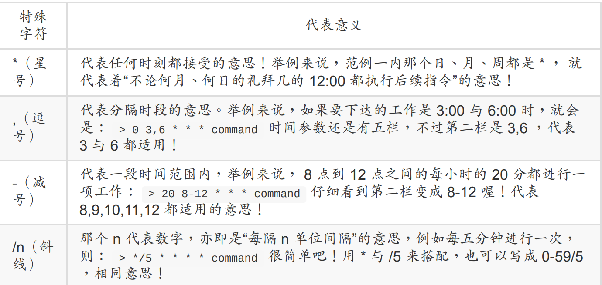

## 11.1 例行性工作调度

### 11.1.1 工作调度种类

一种是例行性的，就是每隔一定的周期要来办的事项；
一种是突发性的，就是这次做完以后就没有的那一种 （ 3C 大降价...）

那么在 Linux 下面如何达到这两个功能呢？那就得使用 at 与 crontab 这两个好东西啰！

- at ：at 是个可以处理仅执行一次就结束调度的指令，不过要执行 at 时， 必须要有 atd 这个服务 （第十七章） 的支持才行。在某些新版的 distributions 中，atd 可能默认并没有启动，那么 at 这个指令就会失效呢！不过我们的 CentOS 默认是启动的！

- crontab ：crontab 这个指令所设置的工作将会循环的一直进行下去！ 可循环的时间为分钟、小时、每周、每月或每年等。crontab 除了可以使用指令执行外，亦可编辑
  /etc/crontab 来支持。 至于让 crontab 可以生效的服务则是 crond 这个服务喔！

## 11.2 仅执行一次的工作调度

### 11.2.1 atd

我们可以使用atd来进行调度，可能需要手动启动一下

```bash
[root@study ~]# systemctl restart atd # 重新启动 atd 这个服务
[root@study ~]# systemctl enable atd # 让这个服务开机就自动启动
[root@study ~]# systemctl status atd # 查阅一下 atd 目前的状态
atd.service - Job spooling tools
Loaded: loaded （/usr/lib/systemd/system/atd.service; enabled） # 是否开机启动
Active: active （running） since Thu 2015-07-30 19:21:21 CST; 23s ago # 是否正在运行中
Main PID: 26503 （atd）
CGroup: /system.slice/atd.service
└─26503 /usr/sbin/atd -f
Jul 30 19:21:21 study.centos.vbird systemd[1]: Starting Job spooling tools...
Jul 30 19:21:21 study.centos.vbird systemd[1]: Started Job spooling tools.
```

我们可以利用 /etc/at.allow 与 /etc/at.deny 这两个文件来进行 at 的使用限制呢！ 加上这两个文件后， at 的工作情况其实是这样的：

- 先找寻 /etc/at.allow 这个文件，写在这个文件中的使用者才能使用 at ，没有在这个文件
  中的使用者则不能使用 at （即使没有写在 at.deny 当中）；

- 如果 /etc/at.allow 不存在，就寻找 /etc/at.deny 这个文件，若写在这个 at.deny 的使用者则不能使用 at ，而没有在这个 at.deny 文件中的使用者，就可以使用 at 咯；

- 如果两个文件都不存在，那么只有 root 可以使用 at 这个指令。

### 11.2.2 使用at命令

```bash
[root@study ~]# at [-mldv] TIME
[root@study ~]# at -c 工作号码
选项与参数：
-m ：当 at 的工作完成后，即使没有输出讯息，亦以 email 通知使用者该工作已完成。
-l ：at -l 相当于 atq，列出目前系统上面的所有该使用者的 at 调度；
-d ：at -d 相当于 atrm ，可以取消一个在 at 调度中的工作；
-v ：可以使用较明显的时间格式列出 at 调度中的工作列表；
-c ：可以列出后面接的该项工作的实际指令内容。
TIME：时间格式，这里可以定义出“什么时候要进行 at 这项工作”的时间，格式有：
HH:MM ex> 04:00
在今日的 HH:MM 时刻进行，若该时刻已超过，则明天的 HH:MM 进行此工作。
HH:MM YYYY-MM-DD ex> 04:00 2015-07-30
强制规定在某年某月的某一天的特殊时刻进行该工作！
HH:MM[am|pm] [Month] [Date] ex> 04pm July 30
也是一样，强制在某年某月某日的某时刻进行！
HH:MM[am|pm] + number [minutes|hours|days|weeks]
ex> now + 5 minutes ex> 04pm + 3 days
就是说，在某个时间点“再加几个时间后”才进行。
```

简单例子

```bash
范例一：再过五分钟后，将 /root/.bashrc 寄给 root 自己
[root@study ~]# at now + 5 minutes <==记得单位要加 s 喔！
at> /bin/mail -s "testing at job" root < /root/.bashrc
at> <EOT> <==这里输入 [ctrl] + d 就会出现 <EOF> 的字样！代表结束！
job 2 at Thu Jul 30 19:35:00 2015
# 上面这行信息在说明，第 2 个 at 工作将在 2015/07/30 的 19:35 进行！
# 而执行 at 会进入所谓的 at shell 环境，让你下达多重指令等待运行！
范例二：将上述的第 2 项工作内容列出来查阅
[root@study ~]# at -c 2
#!/bin/sh <==就是通过 bash shell 的啦！
# atrun uid=0 gid=0
# mail root 0
umask 22
....（中间省略许多的环境变量项目）....
cd /etc/cron\.d || {
echo 'Execution directory inaccessible' >&2
exit 1
}
${SHELL:-/bin/sh} << 'marcinDELIMITER410efc26'
/bin/mail -s "testing at job" root < /root/.bashrc # 这一行最重要！
marcinDELIMITER410efc26
# 你可以看到指令执行的目录 （/root），还有多个环境变量与实际的指令内容啦！
范例三：由于机房预计于 2015/08/05 停电，我想要在 2015/08/04 23:00 关机？
[root@study ~]# at 23:00 2015-08-04
at> /bin/sync
at> /bin/sync
at> /sbin/shutdown -h now
at> <EOT>
job 3 at Tue Aug 4 23:00:00 2015
# 您瞧瞧！ at 还可以在一个工作内输入多个指令呢！不错吧！
```

由于 at 工作调度的使用上，系统会将该项 at 工作独立出你的 bash 环境中， 直接交给系统的atd 程序来接管，因此，当你下达了 at 的工作之后就可以立刻离线了， 剩下的工作就完全交给 Linux 管理即可！所以啰，如果有长时间的网络工作时，嘿嘿！ 使用 at 可以让你免除网络断线后的困扰喔！ ^_^

那么万一我下达了 at 之后，才发现指令输入错误，该如何是好？就将他移除啊！利用 atq 与
atrm 吧！

```bash
[root@study ~]# atq
[root@study ~]# atrm （jobnumber）
范例一：查询目前主机上面有多少的 at 工作调度？
[root@study ~]# atq
3 Tue Aug 4 23:00:00 2015 a root
# 上面说的是：“在 2015/08/04 的 23:00 有一项工作，该项工作指令下达者为
# root”而且，该项工作的工作号码 （jobnumber） 为 3 号喔！
范例二：将上述的第 3 个工作移除！
[root@study ~]# atrm 3
[root@study ~]# atq
# 没有任何信息，表示该工作被移除了！
```

batch：系统有空时才进行背景任务

```bash
范例一：请执行 pi 的计算，然后在系统闲置时，执行 updatdb 的任务
[root@study ~]# echo "scale=100000; 4*a（1）" | bc -lq &
[root@study ~]# echo "scale=100000; 4*a（1）" | bc -lq &
[root@study ~]# echo "scale=100000; 4*a（1）" | bc -lq &
[root@study ~]# echo "scale=100000; 4*a（1）" | bc -lq &
# 然后等待个大约数十秒的时间，之后再来确认一下工作负载的情况！
[root@study ~]# uptime
19:56:45 up 2 days, 19:54, 2 users, load average: 3.93, 2.23, 0.96
[root@study ~]# batch
at> /usr/bin/updatedb
at> <EOT>
job 4 at Thu Jul 30 19:57:00 2015
[root@study ~]# date;atq
Thu Jul 30 19:57:47 CST 2015
4 Thu Jul 30 19:57:00 2015 b root
# 可以看得到，明明时间已经超过了，却没有实际执行 at 的任务！
[root@study ~]# jobs
[1] Running echo "scale=100000; 4*a（1）" | bc -lq &
[2] Running echo "scale=100000; 4*a（1）" | bc -lq &
[3]- Running echo "scale=100000; 4*a（1）" | bc -lq &
[4]+ Running echo "scale=100000; 4*a（1）" | bc -lq &
[root@study ~]# kill -9 %1 %2 %3 %4
# 这时先用 jobs 找出背景工作，再使用 kill 删除掉四个背景工作后，慢慢等待工作负载的下降
[root@study ~]# uptime; atq
20:01:33 up 2 days, 19:59, 2 users, load average: 0.89, 2.29, 1.40
4 Thu Jul 30 19:57:00 2015 b root
[root@study ~]# uptime; atq
20:02:52 up 2 days, 20:01, 2 users, load average: 0.23, 1.75, 1.28
# 在 19:59 时，由于 loading 还是高于 0.8，因此 atq 可以看得到 at job 还是持续再等待当中喔！
# 但是到了 20:01 时， loading 降低到 0.8 以下了，所以 atq 就执行完毕啰！
```

## 11.3  循环执行工作调度

相对于 at 是仅执行一次的工作，循环执行的例行性工作调度则是由 cron （crond） 这个系统服务来控制的。

### 11.3.1 使用者设置

使用的限制数据有：

/etc/cron.allow： 将可以使用 crontab 的帐号写入其中，若不在这个文件内的使用者则不
可使用 crontab；
/etc/cron.deny： 将不可以使用 crontab 的帐号写入其中，若未记录到这个文件当中的使
用者，就可以使用 crontab

当使用者使用 crontab 这个指令来创建工作调度之后，该项工作就会被纪录到
/var/spool/cron/ 里面去了，而且是以帐号来作为判别的喔！举例来说， dmtsai 使用 crontab后， 他的工作会被纪录到 /var/spool/cron/dmtsai 里头去！

```bash
[root@study ~]# crontab [-u username] [-l|-e|-r]
选项与参数：
-u ：只有 root 才能进行这个任务，亦即帮其他使用者创建/移除 crontab 工作调度；
-e ：编辑 crontab 的工作内容
-l ：查阅 crontab 的工作内容
-r ：移除所有的 crontab 的工作内容，若仅要移除一项，请用 -e 去编辑。
范例一：用 dmtsai 的身份在每天的 12:00 发信给自己
[dmtsai@study ~]$ crontab -e
# 此时会进入 vi 的编辑画面让您编辑工作！注意到，每项工作都是一行。
0 12 * * * mail -s "at 12:00" dmtsai < /home/dmtsai/.bashrc
#分 时 日 月 周 |<==============指令串========================>|
```

而每项工作 （每行） 的格式都是具有六个字段，这六个字段的意义为：


比较有趣的是那个“周”喔！周的数字为 0 或 7 时，都代表“星期天”的意思！另外，还有一些辅
助的字符，大概有下面这些：



假若你的女朋友生日是 5 月 2 日，你想要在 5 月 1 日的 23:59 发一封信给他，这封信
的内容已经写在 /home/dmtsai/lover.txt 内了，该如何进行？答：直接下达 crontab -e 之后，编辑成为：

```bash
> 59 23 1 5 * mail kiki < /home/dmtsai/lover.txt
```

假如每五分钟需要执行 /home/dmtsai/test.sh 一次，又该如何？答：同样使用 crontab
-e 进入编辑：

```bash
> */5 * * * * /home/dmtsai/test.sh
```

那么，该如何查询使用者目前的 crontab 内容呢？

```bash
[dmtsai@study ~]$ crontab -l
0 12 * * * mail -s "at 12:00" dmtsai < /home/dmtsai/.bashrc
59 23 1 5 * mail kiki < /home/dmtsai/lover.txt
*/5 * * * * /home/dmtsai/test.sh
30 16 * * 5 mail friend@his.server.name < /home/dmtsai/friend.txt
# 注意，若仅想要移除一项工作而已的话，必须要用 crontab -e 去编辑～
# 如果想要全部的工作都移除，才使用 crontab -r 喔！
[dmtsai@study ~]$ crontab -r
[dmtsai@study ~]$ crontab -l
no crontab for dmtsai
```

### 11.3.2 系统配置文件

这个“ crontab -e ”是针对使用者的 cron 来设计的，如果是“系统的例行性任务”时， 该怎么办
呢？是否还是需要以 crontab -e 来管理你的例行性工作调度呢？当然不需要，你只要编辑
/etc/crontab 这个文件就可以啦！有一点需要特别注意喔！那就是 crontab -e 这个 crontab 其实是 /usr/bin/crontab 这个可执行文件，但是 /etc/crontab 可是一个“纯文本文件”喔！你可以root 的身份编辑一下这个文件哩！

```bash
xiaoyou@dev:~$ cat /etc/crontab
# /etc/crontab: system-wide crontab
# Unlike any other crontab you don't have to run the `crontab'
# command to install the new version when you edit this file
# and files in /etc/cron.d. These files also have username fields,
# that none of the other crontabs do.

SHELL=/bin/sh
PATH=/usr/local/sbin:/usr/local/bin:/sbin:/bin:/usr/sbin:/usr/bin

# Example of job definition:
# .---------------- minute (0 - 59)
# |  .------------- hour (0 - 23)
# |  |  .---------- day of month (1 - 31)
# |  |  |  .------- month (1 - 12) OR jan,feb,mar,apr ...
# |  |  |  |  .---- day of week (0 - 6) (Sunday=0 or 7) OR sun,mon,tue,wed,thu,fri,sat
# |  |  |  |  |
# *  *  *  *  * user-name command to be executed
17 *    * * *   root    cd / && run-parts --report /etc/cron.hourly
25 6    * * *   root    test -x /usr/sbin/anacron || ( cd / && run-parts --report /etc/cron.daily )
47 6    * * 7   root    test -x /usr/sbin/anacron || ( cd / && run-parts --report /etc/cron.weekly )
52 6    1 * *   root    test -x /usr/sbin/anacron || ( cd / && run-parts --report /etc/cron.monthly )
```

那现在来瞧瞧 /etc/cron.d 里面的东西吧！

```bash
[root@study ~]# ls -l /etc/cron.d
-rw-r--r--. 1 root root 128 Jul 30 2014 0hourly
-rw-r--r--. 1 root root 108 Mar 6 10:12 raid-check
-rw-------. 1 root root 235 Mar 6 13:45 sysstat
-rw-r--r--. 1 root root 187 Jan 28 2014 unbound-anchor
# 其实说真的，除了 /etc/crontab 之外，crond 的配置文件还不少耶！上面就有四个设置！
# 先让我们来瞧瞧 0hourly 这个配置文件的内容吧！
[root@study ~]# cat /etc/cron.d/0hourly
# Run the hourly jobs
SHELL=/bin/bash
PATH=/sbin:/bin:/usr/sbin:/usr/bin
MAILTO=root
01 * * * * root run-parts /etc/cron.hourly
# 瞧一瞧，内容跟 /etc/crontab 几乎一模一样！但实际上是有设置值喔！就是最后一行！
```

## 11.4 可唤醒停机期间的工作任务

### 11.4.1 什么是anacron

anacron 并不是用来取代 crontab 的，anacron 存在的目的就在于我们上头提到的，在处理非24 小时一直启动的 Linux 系统的 crontab 的执行！ 以及因为某些原因导致的超过时间而没有被执行的调度工作。其实 anacron 也是每个小时被 crond 执行一次，然后 anacron 再去检测相关的调度任务有没有被执行，如果有超过期限的工作在， 就执行该调度任务，执行完毕或无须执行任何调度时，anacron 就停止了。

### 11.4.2 anacron 与 /etc/anacrontab

```bash
#!/bin/sh
# Check whether 0anacron was run today already
if test -r /var/spool/anacron/cron.daily; then
day=`cat /var/spool/anacron/cron.daily`
fi
if [ `date +%Y%m%d` = "$day" ]; then
exit 0;
fi
# 上面的语法在检验前一次执行 anacron 时的时间戳记！
# Do not run jobs when on battery power
if test -x /usr/bin/on_ac_power; then
/usr/bin/on_ac_power >/dev/null 2>&1
if test $? -eq 1; then
exit 0
fi
fi
/usr/sbin/anacron -s
# 所以其实也仅是执行 anacron -s 的指令！因此我们得来谈谈这支程序！
```

基本上， anacron 的语法如下：

```bash
[root@study ~]# anacron [-sfn] [job]..
[root@study ~]# anacron -u [job]..
选项与参数：
-s ：开始一连续的执行各项工作 （job），会依据时间记录文件的数据判断是否进行；
-f ：强制进行，而不去判断时间记录文件的时间戳记；
-n ：立刻进行未进行的任务，而不延迟 （delay） 等待时间；
-u ：仅更新时间记录文件的时间戳记，不进行任何工作。
job ：由 /etc/anacrontab 定义的各项工作名称。
```
