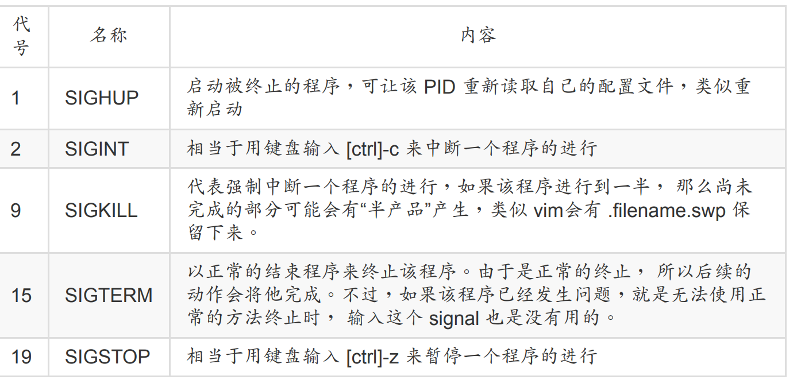
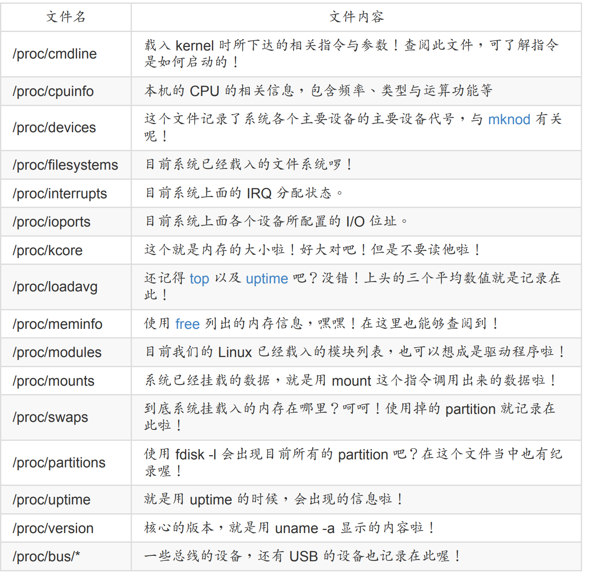

## 12.1 什么是程序

Linux 系统当中：“触发任何一个事件时，系统都会将他定义成为一个程序，并且给予这个程
序一个 ID ，称为 PID，同时依据启发这个程序的使用者与相关属性关系，给予这个 PID 一组
有效的权限设置。” 从此以后，这个 PID 能够在系统上面进行的动作，就与这个 PID 的权限
有关了！

## 12.2 工作管理

### 12.2.1 job control的管理

如同前面提到的，我们在只有一个 bash 的环境下，如果想要同时进行多个工作， 那么可以
将某些工作直接丢到背景环境当中，让我们可以继续操作前景的工作！那么如何将工作丢到
背景中？ 最简单的方法就是利用“ & ”这个玩意儿了！举个简单的例子，我们要将 /etc/ 整个备份成为 /tmp/etc.tar.gz 且不想要等待，那么可以这样做：

```bash
[root@study ~]# tar -zpcf /tmp/etc.tar.gz /etc &
[1] 14432 <== [job number] PID
[root@study ~]# tar: Removing leading `/' from member names
# 在中括号内的号码为工作号码 （job number），该号码与 bash 的控制有关。
# 后续的 14432 则是这个工作在系统中的 PID。至于后续出现的数据是 tar 执行的数据流，
# 由于我们没有加上数据流重导向，所以会影响画面！不过不会影响前景的操作喔！
```

仔细的瞧一瞧，我在输入一个指令后，在该指令的最后面加上一个“ & ”代表将该指令丢到背景中， 此时 bash 会给予这个指令一个“工作号码（job number）”，就是那个 [1] 啦！至于后面那个 14432 则是该指令所触发的“ PID ”了！而且，有趣的是，我们可以继续操作 bash 呢！很不赖吧！ 不过，那么丢到背景中的工作什么时候完成？完成的时候会显示什么？如果你输入几个指令后，突然出现这个数据：

```bash
[1]+ Done tar -zpcf /tmp/etc.tar.gz /etc
```

就代表 [1] 这个工作已经完成 （Done） ，该工作的指令则是接在后面那一串命令行。 这样了解了吧！另外，这个 & 代表：“将工作丢到背景中去执行”喔！ 注意到那个“执行”的字眼！此外，这样的情况最大的好处是： 不怕被 [ctrl]+c 中断的啦！ 此外，将工作丢到背景当中要特别注意数据的流向喔！包括上面的讯息就有出现错误讯息，导致我的前景被影响。

想个情况：如果我正在使用 vim ，却发现我有个文件不知道放在哪里，需要到 bash 环境下进行搜寻，此时是否要结束 vim 呢？呵呵！当然不需要啊！只要暂时将 vim 给他丢到背景当中等待即可。 例如以下的案例：

```bash
[root@study ~]# vim ~/.bashrc
# 在 vim 的一般模式下，按下 [ctrl]-z 这两个按键
[1]+ Stopped vim ~/.bashrc
[root@study ~]# <==顺利取得了前景的操控权！
[root@study ~]# find / -print
....（输出省略）....
# 此时屏幕会非常的忙碌！因为屏幕上会显示所有的文件名。请按下 [ctrl]-z 暂停
[2]+ Stopped find / -print
```

观察目前的背景工作状态： jobs

```bash
[root@study ~]# jobs [-lrs]
选项与参数：
-l ：除了列出 job number 与指令串之外，同时列出 PID 的号码；
-r ：仅列出正在背景 run 的工作；
-s ：仅列出正在背景当中暂停 （stop） 的工作。
范例一：观察目前的 bash 当中，所有的工作，与对应的 PID
[root@study ~]# jobs -l
[1]- 14566 Stopped vim ~/.bashrc
[2]+ 14567 Stopped find / -print
```

其实 + 代表最近被放到背景的工作号码， - 代表最近最后第二个被放置到背景中的工作号
码。 而超过最后第三个以后的工作，就不会有 +/- 符号存在了！

有没有可以将背景工作拿到前景来处理的？ 有啊！就是那个 fg （foreground） 啦！举例来说，我们想要将上头范例当中的工作拿出来处理时：

```bash
[root@study ~]# fg %jobnumber
选项与参数：
%jobnumber ：jobnumber 为工作号码（数字）。注意，那个 % 是可有可无的！
范例一：先以 jobs 观察工作，再将工作取出：
[root@study ~]# jobs -l
[1]- 14566 Stopped vim ~/.bashrc
[2]+ 14567 Stopped find / -print
[root@study ~]# fg <==默认取出那个 + 的工作，亦即 [2]。立即按下[ctrl]-z
[root@study ~]# fg %1 <==直接规定取出的那个工作号码！再按下[ctrl]-z
[root@study ~]# jobs -l
[1]+ 14566 Stopped vim ~/.bashrc
[2]- 14567 Stopped find / -print
```

我们刚刚提到，那个 [ctrl]-z 可以将目前的工作丢到背景下面去“暂停”， 那么如何让一个工作
在背景下面“ Run ”呢？我们可以在下面这个案例当中来测试！

```bash
范例一：一执行 find / -perm /7000 > /tmp/text.txt 后，立刻丢到背景去暂停！
[root@study ~]# find / -perm /7000 > /tmp/text.txt
# 此时，请立刻按下 [ctrl]-z 暂停！
[3]+ Stopped find / -perm /7000 > /tmp/text.txt
范例二：让该工作在背景下进行，并且观察他！！
[root@study ~]# jobs ; bg %3 ; jobs
[1] Stopped vim ~/.bashrc
[2]- Stopped find / -print
[3]+ Stopped find / -perm /7000 > /tmp/text.txt
[3]+ find / -perm /7000 > /tmp/text.txt &
[1]- Stopped vim ~/.bashrc
[2]+ Stopped find / -print
[3] Running find / -perm /7000 > /tmp/text.txt &
```

看到哪里有差异吗？呼呼！没错！就是那个状态列～以经由 Stopping 变成了 Running 啰！
看到差异点，嘿嘿！命令行最后方多了一个 & 的符号啰！ 代表该工作被启动在背景当中了
啦！ ^_^

管理背景当中的工作 kill

```bash
[root@study ~]# kill -signal %jobnumber
[root@study ~]# kill -l
选项与参数：
-l ：这个是 L 的小写，列出目前 kill 能够使用的讯号 （signal） 有哪些？
signal ：代表给予后面接的那个工作什么样的指示啰！用 man 7 signal 可知：
-1 ：重新读取一次参数的配置文件 （类似 reload）；
-2 ：代表与由键盘输入 [ctrl]-c 同样的动作；
-9 ：立刻强制删除一个工作；
-15：以正常的程序方式终止一项工作。与 -9 是不一样的。
范例一：找出目前的 bash 环境下的背景工作，并将该工作“强制删除”。
[root@study ~]# jobs
[1]+ Stopped vim ~/.bashrc
[2] Stopped find / -print
[root@study ~]# kill -9 %2; jobs
[1]+ Stopped vim ~/.bashrc
[2] Killed find / -print
# 再过几秒你再下达 jobs 一次，就会发现 2 号工作不见了！因为被移除了！
范例二：找出目前的 bash 环境下的背景工作，并将该工作“正常终止”掉。
[root@study ~]# jobs
[1]+ Stopped vim ~/.bashrc
[root@study ~]# kill -SIGTERM %1
# -SIGTERM 与 -15 是一样的！您可以使用 kill -l 来查阅！
# 不过在这个案例中， vim 的工作无法被结束喔！因为他无法通过 kill 正常终止的意思！
```

### 12.2.2 离线管理问题

如果我的工作需要进行一大段时间，我又不能放置在背景下面，那该如何处理呢？ 首先，你可以参考前一章的 at 来处理即可！因为 at 是将工作放置到系统背景， 而与终端机无关。如果不想要使用 at 的话，那你也可以尝试使用 nohup 这个指令来处理喔！这个nohup 可以让你在离线或登出系统后，还能够让工作继续进行。

```bash
[root@study ~]# nohup [指令与参数] <==在终端机前景中工作
[root@study ~]# nohup [指令与参数] & <==在终端机背景中工作
```

nohup 并不支持 bash 内置的指令，因此你的指令必须要是外部指令才行。 我们来尝试玩一下下面的任务吧！

```bash
# 1\. 先编辑一支会“睡着 500 秒”的程序：
[root@study ~]# vim sleep500.sh
#!/bin/bash
/bin/sleep 500s
/bin/echo "I have slept 500 seconds."
# 2\. 丢到背景中去执行，并且立刻登出系统：
[root@study ~]# chmod a+x sleep500.sh
[root@study ~]# nohup ./sleep500.sh &
[2] 14812
[root@study ~]# nohup: ignoring input and appending output to `nohup.out' <==会告知这个讯息！
[root@study ~]# exit
```

## 12.3 程序管理

### 12.3.1 程序的观察

那么我们如何查阅系统上面正在运行当中的程序呢？很简单啊！ 利用静态的 ps 或者是动态的 top，还能以 pstree 来查阅程序树之间的关系喔！

```bash
[root@study ~]# ps aux <==观察系统所有的程序数据
[root@study ~]# ps -lA <==也是能够观察所有系统的数据
[root@study ~]# ps axjf <==连同部分程序树状态
选项与参数：
-A ：所有的 process 均显示出来，与 -e 具有同样的效用；
-a ：不与 terminal 有关的所有 process ；
-u ：有效使用者 （effective user） 相关的 process ；
x ：通常与 a 这个参数一起使用，可列出较完整信息。
输出格式规划：
l ：较长、较详细的将该 PID 的的信息列出；
j ：工作的格式 （jobs format）
-f ：做一个更为完整的输出。
```

仅观察自己的 bash 相关程序： ps -l

```bash
范例一：将目前属于您自己这次登陆的 PID 与相关信息列示出来（只与自己的 bash 有关）
[root@study ~]# ps -l
F S UID PID PPID C PRI NI ADDR SZ WCHAN TTY TIME CMD
4 S 0 14830 13970 0 80 0 - 52686 poll_s pts/0 00:00:00 sudo
4 S 0 14835 14830 0 80 0 - 50511 wait pts/0 00:00:00 su
4 S 0 14836 14835 0 80 0 - 29035 wait pts/0 00:00:00 bash
0 R 0 15011 14836 0 80 0 - 30319 - pts/0 00:00:00 ps
# 还记得鸟哥说过，非必要不要使用 root 直接登陆吧？从这个 ps -l 的分析，你也可以发现，
# 鸟哥其实是使用 sudo 才转成 root 的身份～否则连测试机，鸟哥都是使用一般帐号登陆的！
```

这些参数的意义如下

F：代表这个程序旗标 （process flags），说明这个程序的总结权限，常见号码有：
若为 4 表示此程序的权限为 root ；
若为 1 则表示此子程序仅进行复制（fork）而没有实际执行（exec）。
S：代表这个程序的状态 （STAT），主要的状态有：
R （Running）：该程序正在运行中；
S （Sleep）：该程序目前正在睡眠状态（idle），但可以被唤醒（signal）。
D ：不可被唤醒的睡眠状态，通常这支程序可能在等待 I/O 的情况（ex>打印）
T ：停止状态（stop），可能是在工作控制（背景暂停）或除错 （traced） 状态；
Z （Zombie）：僵尸状态，程序已经终止但却无法被移除至内存外。
UID/PID/PPID：代表“此程序被该 UID 所拥有/程序的 PID 号码/此程序的父程序 PID 号
码”
C：代表 CPU 使用率，单位为百分比；
PRI/NI：Priority/Nice 的缩写，代表此程序被 CPU 所执行的优先顺序，数值越小代表该
程序越快被 CPU 执行。详细的 PRI 与 NI 将在下一小节说明。
ADDR/SZ/WCHAN：都与内存有关，ADDR 是 kernel function，指出该程序在内存的哪
个部分，如果是个 running 的程序，一般就会显示“ - ” / SZ 代表此程序用掉多少内存 /
WCHAN 表示目前程序是否运行中，同样的， 若为 - 表示正在运行中。
TTY：登陆者的终端机位置，若为远端登陆则使用动态终端接口 （pts/n）；
TIME：使用掉的 CPU 时间，注意，是此程序实际花费 CPU 运行的时间，而不是系统时
间；
CMD：就是 command 的缩写，造成此程序的触发程序之指令为何。

下面我们观察所有的程序

```bash
范例二：列出目前所有的正在内存当中的程序：
[root@study ~]# ps aux
USER PID %CPU %MEM VSZ RSS TTY STAT START TIME COMMAND
root 1 0.0 0.2 60636 7948 ? Ss Aug04 0:01 /usr/lib/systemd/systemd ...
root 2 0.0 0.0 0 0 ? S Aug04 0:00 [kthreadd]
.....（中间省略）.....
root 14830 0.0 0.1 210744 3988 pts/0 S Aug04 0:00 sudo su -
root 14835 0.0 0.1 202044 2996 pts/0 S Aug04 0:00 su -
root 14836 0.0 0.1 116140 2960 pts/0 S Aug04 0:00 -bash
.....（中间省略）.....
root 18459 0.0 0.0 123372 1380 pts/0 R+ 00:25 0:00 ps aux
```

你会发现 ps -l 与 ps aux 显示的项目并不相同！在 ps aux 显示的项目中，各字段的意义为：
USER：该 process 属于那个使用者帐号的？
PID ：该 process 的程序识别码。
%CPU：该 process 使用掉的 CPU 资源百分比；
%MEM：该 process 所占用的实体内存百分比；
VSZ ：该 process 使用掉的虚拟内存量 （KBytes）
RSS ：该 process 占用的固定的内存量 （KBytes）
TTY ：该 process 是在那个终端机上面运行，若与终端机无关则显示 ?，另外， tty1-tty6
是本机上面的登陆者程序，若为 pts/0 等等的，则表示为由网络连接进主机的程序。
STAT：该程序目前的状态，状态显示与 ps -l 的 S 旗标相同 （R/S/T/Z）
START：该 process 被触发启动的时间；
TIME ：该 process 实际使用 CPU 运行的时间。
COMMAND：该程序的实际指令为何？

```bash
范例三：以范例一的显示内容，显示出所有的程序：
[root@study ~]# ps -lA
F S UID PID PPID C PRI NI ADDR SZ WCHAN TTY TIME CMD
4 S 0 1 0 0 80 0 - 15159 ep_pol ? 00:00:01 systemd
1 S 0 2 0 0 80 0 - 0 kthrea ? 00:00:00 kthreadd
1 S 0 3 2 0 80 0 - 0 smpboo ? 00:00:00 ksoftirqd/0
....（以下省略）....
# 你会发现每个字段与 ps -l 的输出情况相同，但显示的程序则包括系统所有的程序。
范例四：列出类似程序树的程序显示：
[root@study ~]# ps axjf
PPID PID PGID SID TTY TPGID STAT UID TIME COMMAND
0 2 0 0 ? -1 S 0 0:00 [kthreadd]
2 3 0 0 ? -1 S 0 0:00 \_ [ksoftirqd/0]
.....（中间省略）.....
1 1326 1326 1326 ? -1 Ss 0 0:00 /usr/sbin/sshd -D
1326 13923 13923 13923 ? -1 Ss 0 0:00 \_ sshd: dmtsai [priv]
13923 13927 13923 13923 ? -1 S 1000 0:00 \_ sshd: dmtsai@pts/0
13927 13928 13928 13928 pts/0 18703 Ss 1000 0:00 \_ -bash
13928 13970 13970 13928 pts/0 18703 S 1000 0:00 \_ bash
13970 14830 14830 13928 pts/0 18703 S 0 0:00 \_ sudo su -
14830 14835 14830 13928 pts/0 18703 S 0 0:00 \_ su -
14835 14836 14836 13928 pts/0 18703 S 0 0:00 \_ -bash
14836 18703 18703 13928 pts/0 18703 R+ 0 0:00
```

```bash
范例五：找出与 cron 与 rsyslog 这两个服务有关的 PID 号码？
[root@study ~]# ps aux &#124; egrep '（cron&#124;rsyslog）'
root 742 0.0 0.1 208012 4088 ? Ssl Aug04 0:00 /usr/sbin/rsyslogd -n
root 1338 0.0 0.0 126304 1704 ? Ss Aug04 0:00 /usr/sbin/crond -n
root 18740 0.0 0.0 112644 980 pts/0 S+ 00:49 0:00 grep -E --color=auto （cron&#124;rsyslog）
# 所以号码是 742 及 1338 这两个啰！就是这样找的啦！
```

除此之外，我们必须要知道的是“僵尸 （zombie） ”程序是什么？ 通常，造成僵尸程序的成因是因为该程序应该已经执行完毕，或者是因故应该要终止了， 但是该程序的父程序却无法完整的将该程序结束掉，而造成那个程序一直存在内存当中。 如果你发现在某个程序的 CMD后面还接上 时，就代表该程序是僵尸程序啦


我们可以使用TOP来动态观察程序的实时变化，使用方法如下

```bash
[root@study ~]# top [-d 数字] &#124; top [-bnp]
选项与参数：
-d ：后面可以接秒数，就是整个程序画面更新的秒数。默认是 5 秒；
-b ：以批次的方式执行 top ，还有更多的参数可以使用喔！
通常会搭配数据流重导向来将批次的结果输出成为文件。
-n ：与 -b 搭配，意义是，需要进行几次 top 的输出结果。
-p ：指定某些个 PID 来进行观察监测而已。
在 top 执行过程当中可以使用的按键指令：
? ：显示在 top 当中可以输入的按键指令；
P ：以 CPU 的使用资源排序显示；
M ：以 Memory 的使用资源排序显示；
N ：以 PID 来排序喔！
T ：由该 Process 使用的 CPU 时间累积 （TIME+） 排序。
k ：给予某个 PID 一个讯号 （signal）
r ：给予某个 PID 重新制订一个 nice 值。
q ：离开 top 软件的按键。
```

```bash
范例一：每两秒钟更新一次 top ，观察整体信息：
[root@study ~]# top -d 2
top - 00:53:59 up 6:07, 3 users, load average: 0.00, 0.01, 0.05
Tasks: 179 total, 2 running, 177 sleeping, 0 stopped, 0 zombie
%Cpu（s）: 0.0 us, 0.0 sy, 0.0 ni,100.0 id, 0.0 wa, 0.0 hi, 0.0 si, 0.0 st
KiB Mem : 2916388 total, 1839140 free, 353712 used, 723536 buff/cache
KiB Swap: 1048572 total, 1048572 free, 0 used. 2318680 avail Mem
&lt;==如果加入 k 或 r 时，就会有相关的字样出现在这里喔！
PID USER PR NI VIRT RES SHR S %CPU %MEM TIME+ COMMAND
18804 root 20 0 130028 1872 1276 R 0.5 0.1 0:00.02 top
1 root 20 0 60636 7948 2656 S 0.0 0.3 0:01.70 systemd
2 root 20 0 0 0 0 S 0.0 0.0 0:00.01 kthreadd
3 root 20 0 0 0 0 S 0.0 0.0 0:00.00 ksoftirqd/0
```

top 主要分为两个画面，上面的画面为整个系统的资源使用状
态，基本上总共有六行，显示的内容依序是：
第一行（top...）：这一行显示的信息分别为：

- 目前的时间，亦即是 00:53:59 那个项目；

- 开机到目前为止所经过的时间，亦即是 up 6:07, 那个项目；

- 已经登陆系统的使用者人数，亦即是 3 users, 项目；

- 系统在 1, 5, 15 分钟的平均工作负载。我们在第十五章谈到的 batch 工作方式为负载
  小于 0.8 就是这个负载啰！代表的是 1, 5, 15 分钟，系统平均要负责运行几个程序
  （工作）的意思。 越小代表系统越闲置，若高于 1 得要注意你的系统程序是否太过
  繁复了！

第二行（Tasks...）：显示的是目前程序的总量与个别程序在什么状态（running,
sleeping, stopped, zombie）。 比较需要注意的是最后的 zombie 那个数值，如果不是 0！好好看看到底是那个 process 变成僵尸了吧？

第四行与第五行：表示目前的实体内存与虚拟内存 （Mem/Swap） 的使用情况。 再次重
申，要注意的是 swap 的使用量要尽量的少！如果 swap 被用的很大量，表示系统的实体
内存实在不足！

第六行：这个是当在 top 程序当中输入指令时，显示状态的地方。

至于 top 下半部分的画面，则是每个 process 使用的资源情况。比较需要注意的是：
PID ：每个 process 的 ID 啦！
USER：该 process 所属的使用者；
PR ：Priority 的简写，程序的优先执行顺序，越小越早被执行；
NI ：Nice 的简写，与 Priority 有关，也是越小越早被执行；
%CPU：CPU 的使用率；
%MEM：内存的使用率；
TIME+：CPU 使用时间的累加；

我们还可以把结果输出为文件

```bash
范例二：将 top 的信息进行 2 次，然后将结果输出到 /tmp/top.txt
[root@study ~]# top -b -n 2 &gt; /tmp/top.txt
# 这样一来，嘿嘿！就可以将 top 的信息存到 /tmp/top.txt 文件中了。
```

还可以只观察某一个程序

```bash
范例三：我们自己的 bash PID 可由 $$ 变量取得，请使用 top 持续观察该 PID
[root@study ~]# echo $$
14836 &lt;==就是这个数字！他是我们 bash 的 PID
[root@study ~]# top -d 2 -p 14836
top - 01:00:53 up 6:14, 3 users, load average: 0.00, 0.01, 0.05
Tasks: 1 total, 0 running, 1 sleeping, 0 stopped, 0 zombie
%Cpu（s）: 0.0 us, 0.1 sy, 0.0 ni, 99.9 id, 0.0 wa, 0.0 hi, 0.0 si, 0.0 st
KiB Mem : 2916388 total, 1839264 free, 353424 used, 723700 buff/cache
KiB Swap: 1048572 total, 1048572 free, 0 used. 2318848 avail Mem
PID USER PR NI VIRT RES SHR S %CPU %MEM TIME+ COMMAND
14836 root 20 0 116272 3136 1848 S 0.0 0.1 0:00.07 bash
```

那么如果我想要在 top 下面进行一些动作呢？ 比方说，修改 NI 这个数值呢？可以这样做：

```bash
范例四：承上题，上面的 NI 值是 0 ，想要改成 10 的话？
# 在范例三的 top 画面当中直接按下 r 之后，会出现如下的图样！
top - 01:02:01 up 6:15, 3 users, load average: 0.00, 0.01, 0.05
Tasks: 1 total, 0 running, 1 sleeping, 0 stopped, 0 zombie
%Cpu（s）: 0.1 us, 0.0 sy, 0.0 ni, 99.9 id, 0.0 wa, 0.0 hi, 0.0 si, 0.0 st
KiB Mem : 2916388 total, 1839140 free, 353576 used, 723672 buff/cache
KiB Swap: 1048572 total, 1048572 free, 0 used. 2318724 avail Mem
PID to renice [default pid = 14836] 14836
PID USER PR NI VIRT RES SHR S %CPU %MEM TIME+ COMMAND
14836 root 20 0 116272 3136 1848 S 0.0 0.1 0:00.07 bash
```

在你完成上面的动作后，在状态列会出现如下的信息：

```bash
Renice PID 14836 to value 10 &lt;==这是 nice 值
PID USER PR NI VIRT RES SHR S %CPU %MEM TIME+ COMMAND
```


pstree

```bash
[root@study ~]# pstree [-A&#124;U] [-up]
选项与参数：
-A ：各程序树之间的连接以 ASCII 字符来连接；
-U ：各程序树之间的连接以万国码的字符来连接。在某些终端接口下可能会有错误；
-p ：并同时列出每个 process 的 PID；
-u ：并同时列出每个 process 的所属帐号名称。
范例一：列出目前系统上面所有的程序树的相关性：
[root@study ~]# pstree -A
systemd-+-ModemManager---2*[{ModemManager}] # 这行是 ModenManager 与其子程序
&#124;-NetworkManager---3*[{NetworkManager}] # 前面有数字，代表子程序的数量！
....（中间省略）....
&#124;-sshd---sshd---sshd---bash---bash---sudo---su---bash---pstree &lt;==我们指令执行的相依性
....（下面省略）....
# 注意一下，为了节省版面，所以鸟哥已经删去很多程序了！
范例二：承上题，同时秀出 PID 与 users
[root@study ~]# pstree -Aup
systemd（1）-+-ModemManager（745）-+-{ModemManager}（785）
&#124; `-{ModemManager}（790）
&#124;-NetworkManager（870）-+-{NetworkManager}（907）
&#124; &#124;-{NetworkManager}（911）
&#124; `-{NetworkManager}（914）
....（中间省略）....
&#124;-sshd（1326）---sshd（13923）---sshd（13927,dmtsai）---bash（13928）---bash（13970）---
....（下面省略）....
# 在括号 （） 内的即是 PID 以及该程序的 owner 喔！一般来说，如果该程序的所有人与父程序同，
# 就不会列出，但是如果与父程序不一样，那就会列出该程序的拥有者！看上面 13927 就转变成 dmtsai 了
```

如果要找程序之间的相关性，这个 pstree 真是好用到不行！直接输入 pstree 可以查到程序相关性，如上表所示，还会使用线段将相关性程序链接起来哩！ 一般链接符号可以使用 ASCII码即可，但有时因为语系问题会主动的以 Unicode 的符号来链接， 但因为可能终端机无法支持该编码，或许会造成乱码问题。因此可以加上 -A 选项来克服此类线段乱码问题。

### 12.3.2 程序的管理

程序之间是可以互相控制的！举例来说，你可以关闭、重新启动服务器软件，服务器软件本
身是个程序， 你既然可以让她关闭或启动，当然就是可以控制该程序啦！

要给予某个已经存在背景中的工作某些动作时，是直接给予一个讯号给该工作号码即可。那么到底有多少 signal 呢？



kill 可以帮我们将这个 signal 传送给某个工作 （%jobnumber） 或者是某个 PID （直接输入
数字）。 要再次强调的是： kill 后面直接加数字与加上 %number 的情况是不同的！ 这个很
重要喔！因为工作控制中有 1 号工作，但是 PID 1 号则是专指“ systemd ”这支程序！你怎么
可以将 systemd 关闭呢？ 关闭 systemd ，你的系统就当掉了啊！所以记得那个 % 是专门用
在工作控制的喔！ 我们就活用一下 kill 与刚刚上面提到的 ps 来做个简单的练习吧！


至于找出 rsyslogd的 PID 可以是这样做：

> ps aux | grep 'rsyslogd' | grep -v 'grep'| awk '{print $2}'

接下来则是实际使用 kill -1 PID，因此，整串指令会是这样：

```bash
kill -SIGHUP $（ps aux | grep 'rsyslogd' | grep -v 'grep'| awk '{print $2}'）
```

如果要确认有没有重新启动 syslog ，可以参考登录文件的内容，使用如下指令查阅：

```bash
tail -5 /var/log/messages
```

由于 kill 后面必须要加上 PID （或者是 job number），所以，通常 kill 都会配合 ps, pstree 等指令，因为我们必须要找到相对应的那个程序的 ID 嘛！但是，如此一来，很麻烦～有没有可以利用“下达指令的名称”来给予讯号的？举例来说，能不能直接将 rsyslogd 这个程序给予一个 SIGHUP 的讯号呢？可以的！用 killall 吧！

```bash
[root@study ~]# killall [-iIe] [command name]
选项与参数：
-i ：interactive 的意思，互动式的，若需要删除时，会出现提示字符给使用者；
-e ：exact 的意思，表示“后面接的 command name 要一致”，但整个完整的指令
不能超过 15 个字符。
-I ：指令名称（可能含参数）忽略大小写。
范例一：给予 rsyslogd 这个指令启动的 PID 一个 SIGHUP 的讯号
[root@study ~]# killall -1 rsyslogd
# 如果用 ps aux 仔细看一下，若包含所有参数，则 /usr/sbin/rsyslogd -n 才是最完整的！
范例二：强制终止所有以 httpd 启动的程序 （其实并没有此程序在系统内）
[root@study ~]# killall -9 httpd
范例三：依次询问每个 bash 程序是否需要被终止运行！
[root@study ~]# killall -i -9 bash
Signal bash（13888） ? （y/N） n &lt;==这个不杀！
Signal bash（13928） ? （y/N） n &lt;==这个不杀！
Signal bash（13970） ? （y/N） n &lt;==这个不杀！
Signal bash（14836） ? （y/N） y &lt;==这个杀掉！
# 具有互动的功能！可以询问你是否要删除 bash 这个程序。要注意，若没有 -i 的参数，
# 所有的 bash 都会被这个 root 给杀掉！包括 root 自己的 bash 喔！ ^_^
```

### 12.3.3 程序的执行顺序

我们 Linux 给予程序一个所谓的“优先执行，序 （priority, PRI）”， 这个 PRI 值越低代表越优先的意思。不过这个 PRI 值是由核心动态调整的， 使用者无法直接调整 PRI 值的。先来瞧瞧 PRI 曾在哪里出现？

```bash
[root@study ~]# ps -l
F S UID PID PPID C PRI NI ADDR SZ WCHAN TTY TIME CMD
4 S 0 14836 14835 0 90 10 - 29068 wait pts/0 00:00:00 bash
0 R 0 19848 14836 0 90 10 - 30319 - pts/0 00:00:00 ps
# 你应该要好奇，怎么我的 NI 已经是 10 了？还记得刚刚 top 的测试吗？我们在那边就有改过一次喔！
```

由于 PRI 是核心动态调整的，我们使用者也无权去干涉 PRI ！那如果你想要调整程序的优先
执行序时，就得要通过 Nice 值了！Nice 值就是上表的 NI 啦！一般来说， PRI 与 NI 的相关
性如下：

```bash
PRI（new） = PRI（old） + nice
```

如果原本的 PRI 是 50 ，并不是我们给予一个 nice = 5 ，就会让 PRI
变成 55 喔！ 因为 PRI 是系统“动态”决定的，所以，虽然 nice 值是可以影响 PRI ，不过， 最
终的 PRI 仍是要经过系统分析后才会决定的。另外， nice 值是有正负的喔，而既然 PRI 越小
越早被执行， 所以，当 nice 值为负值时，那么该程序就会降低 PRI 值，亦即会变的较优先被
处理。此外，你必须要留意到：
nice 值可调整的范围为 -20 ~ 19 ；
root 可随意调整自己或他人程序的 Nice 值，且范围为 -20 ~ 19 ；
一般使用者仅可调整自己程序的 Nice 值，且范围仅为 0 ~ 19 （避免一般用户抢占系统资
源）；
一般使用者仅可将 nice 值越调越高，例如本来 nice 为 5 ，则未来仅能调整到大于 5；

那么如何给予某个程序 nice 值呢？有两种方式，分别是：
一开始执行程序就立即给予一个特定的 nice 值：用 nice 指令；
调整某个已经存在的 PID 的 nice 值：用 renice 指令

```bash
[root@study ~]# nice [-n 数字] command
选项与参数：
-n ：后面接一个数值，数值的范围 -20 ~ 19。
范例一：用 root 给一个 nice 值为 -5 ，用于执行 vim ，并观察该程序！
[root@study ~]# nice -n -5 vim &
[1] 19865
[root@study ~]# ps -l
F S UID PID PPID C PRI NI ADDR SZ WCHAN TTY TIME CMD
4 S 0 14836 14835 0 90 10 - 29068 wait pts/0 00:00:00 bash
4 T 0 19865 14836 0 85 5 - 37757 signal pts/0 00:00:00 vim
0 R 0 19866 14836 0 90 10 - 30319 - pts/0 00:00:00 ps
# 原本的 bash PRI 为 90 ，所以 vim 默认应为 90。不过由于给予 nice 为 -5 ，
# 因此 vim 的 PRI 降低了！RPI 与 NI 各减 5 ！但不一定每次都是正好相同喔！因为核心会动态调整
[root@study ~]# kill -9 %1 &lt;==测试完毕将 vim 关闭
```

renice ：已存在程序的 nice 重新调整

```bash
[root@study ~]# renice [number] PID
选项与参数：
PID ：某个程序的 ID 啊！
范例一：找出自己的 bash PID ，并将该 PID 的 nice 调整到 -5
[root@study ~]# ps -l
F S UID PID PPID C PRI NI ADDR SZ WCHAN TTY TIME CMD
4 S 0 14836 14835 0 90 10 - 29068 wait pts/0 00:00:00 bash
0 R 0 19900 14836 0 90 10 - 30319 - pts/0 00:00:00 ps
[root@study ~]# renice -5 14836
14836 （process ID） old priority 10, new priority -5
[root@study ~]# ps -l
F S UID PID PPID C PRI NI ADDR SZ WCHAN TTY TIME CMD
4 S 0 14836 14835 0 75 -5 - 29068 wait pts/0 00:00:00 bash
0 R 0 19910 14836 0 75 -5 - 30319 - pts/0 00:00:00 ps
```

### 12.3.4 系统资源的观察

free ：观察内存使用情况

```bash
[root@study ~]# free [-b&#124;-k&#124;-m&#124;-g&#124;-h] [-t] [-s N -c N]
选项与参数：
-b ：直接输入 free 时，显示的单位是 KBytes，我们可以使用 b（Bytes）, m（MBytes）
k（KBytes）, 及 g（GBytes） 来显示单位喔！也可以直接让系统自己指定单位 （-h）
-t ：在输出的最终结果，显示实体内存与 swap 的总量。
-s ：可以让系统每几秒钟输出一次，不间断的一直输出的意思！对于系统观察挺有效！
-c ：与 -s 同时处理～让 free 列出几次的意思～
范例一：显示目前系统的内存容量
[root@study ~]# free -m
total used free shared buff/cache available
Mem: 2848 346 1794 8 706 2263
Swap: 1023 0 1023
```

uname：查阅系统与核心相关信息

```bash
[root@study ~]# uname [-asrmpi]
选项与参数：
-a ：所有系统相关的信息，包括下面的数据都会被列出来；
-s ：系统核心名称
-r ：核心的版本
-m ：本系统的硬件名称，例如 i686 或 x86_64 等；
-p ：CPU 的类型，与 -m 类似，只是显示的是 CPU 的类型！
-i ：硬件的平台 （ix86）
范例一：输出系统的基本信息
[root@study ~]# uname -a
Linux study.centos.vbird 3.10.0-229.el7.x86_64 #1 SMP Fri Mar 6 11:36:42 UTC 2015
x86_64 x86_64 x86_64 GNU/Linux
```

uptime：观察系统启动时间与工作负载

```bash
[root@study ~]# uptime
02:35:27 up 7:48, 3 users, load average: 0.00, 0.01, 0.05
# [top](../Text/index.html#topm) 这个指令已经谈过相关信息，不再聊！
```

netstat ：追踪网络或插槽档

```bash
[root@study ~]# netstat -[atunlp]
选项与参数：
-a ：将目前系统上所有的连线、监听、Socket 数据都列出来
-t ：列出 tcp 网络封包的数据
-u ：列出 udp 网络封包的数据
-n ：不以程序的服务名称，以埠号 （port number） 来显示；
-l ：列出目前正在网络监听 （listen） 的服务；
-p ：列出该网络服务的程序 PID
范例一：列出目前系统已经创建的网络连线与 unix socket 状态
[root@study ~]# netstat
Active Internet connections （w/o servers） &lt;==与网络较相关的部分
Proto Recv-Q Send-Q Local Address Foreign Address State
tcp 0 0 172.16.15.100:ssh 172.16.220.234:48300 ESTABLISHED
Active UNIX domain sockets （w/o servers） &lt;==与本机的程序自己的相关性（非网络）
Proto RefCnt Flags Type State I-Node Path
unix 2 [ ] DGRAM 1902 @/org/freedesktop/systemd1/notify
unix 2 [ ] DGRAM 1944 /run/systemd/shutdownd
....（中间省略）....
unix 3 [ ] STREAM CONNECTED 25425 @/tmp/.X11-unix/X0
unix 3 [ ] STREAM CONNECTED 28893
unix 3 [ ] STREAM CONNECTED 21262
```

我们先来看看网际网络连线情况的部分：

Proto ：网络的封包协定，主要分为 TCP 与 UDP 封包，相关数据请参考服务器篇；
Recv-Q：非由使用者程序链接到此 socket 的复制的总 Bytes 数；
Send-Q：非由远端主机传送过来的 acknowledged 总 Bytes 数；
Local Address ：本地端的 IP:port 情况
Foreign Address：远端主机的 IP:port 情况
State ：连线状态，主要有创建（ESTABLISED）及监听（LISTEN）；

Proto ：一般就是 unix 啦；
RefCnt：连接到此 socket 的程序数量；
Flags ：连线的旗标；
Type ：socket 存取的类型。主要有确认连线的 STREAM 与不需确认的 DGRAM 两种；
State ：若为 CONNECTED 表示多个程序之间已经连线创建。
Path ：连接到此 socket 的相关程序的路径！或者是相关数据输出的路径。

利用 netstat 去看看我们的哪些程序有启动哪些网络的“后门”呢？

```bash
范例二：找出目前系统上已在监听的网络连线及其 PID
[root@study ~]# netstat -tulnp
Active Internet connections （only servers）
Proto Recv-Q Send-Q Local Address Foreign Address State PID/Program name
tcp 0 0 0.0.0.0:22 0.0.0.0:* LISTEN 1326/sshd
tcp 0 0 127.0.0.1:25 0.0.0.0:* LISTEN 2349/master
tcp6 0 0 :::22 :::* LISTEN 1326/sshd
tcp6 0 0 ::1:25 :::* LISTEN 2349/master
udp 0 0 0.0.0.0:123 0.0.0.0:* 751/chronyd
udp 0 0 127.0.0.1:323 0.0.0.0:* 751/chronyd
udp 0 0 0.0.0.0:57808 0.0.0.0:* 743/avahi-daemon: r
udp 0 0 0.0.0.0:5353 0.0.0.0:* 743/avahi-daemon: r
udp6 0 0 :::123 :::* 751/chronyd
udp6 0 0 ::1:323 :::* 751/chronyd
# 除了可以列出监听网络的接口与状态之外，最后一个字段还能够显示此服务的
# PID 号码以及程序的指令名称喔！例如上头的 1326 就是该 PID
范例三：将上述的 0.0.0.0:57808 那个网络服务关闭的话？
[root@study ~]# kill -9 743
[root@study ~]# killall -9 avahi-daemon
```

dmesg ：分析核心产生的讯息

```bash
范例一：输出所有的核心开机时的信息
[root@study ~]# dmesg &#124; more
范例二：搜寻开机的时候，硬盘的相关信息为何？
[root@study ~]# dmesg &#124; grep -i vda
[ 0.758551] vda: vda1 vda2 vda3 vda4 vda5 vda6 vda7 vda8 vda9
[ 3.964134] XFS （vda2）: Mounting V4 Filesystem
```

vmstat ：侦测系统资源变化

```bash
[root@study ~]# vmstat [-a] [延迟 [总计侦测次数]] &lt;==CPU/内存等信息
[root@study ~]# vmstat [-fs] &lt;==内存相关
[root@study ~]# vmstat [-S 单位] &lt;==设置显示数据的单位
[root@study ~]# vmstat [-d] &lt;==与磁盘有关
[root@study ~]# vmstat [-p 分区] &lt;==与磁盘有关
选项与参数：
-a ：使用 inactive/active（活跃与否） 取代 buffer/cache 的内存输出信息；
-f ：开机到目前为止，系统复制 （fork） 的程序数；
-s ：将一些事件 （开机至目前为止） 导致的内存变化情况列表说明；
-S ：后面可以接单位，让显示的数据有单位。例如 K/M 取代 Bytes 的容量；
-d ：列出磁盘的读写总量统计表
-p ：后面列出分区，可显示该分区的读写总量统计表
范例一：统计目前主机 CPU 状态，每秒一次，共计三次！
[root@study ~]# vmstat 1 3
procs ------------memory---------- ---swap-- -----io---- -system-- ------cpu-----
r b swpd free buff cache si so bi bo in cs us sy id wa st
1 0 0 1838092 1504 722216 0 0 4 1 6 9 0 0 100 0 0
0 0 0 1838092 1504 722200 0 0 0 0 13 23 0 0 100 0 0
0 0 0 1838092 1504 722200 0 0 0 0 25 46 0 0 100 0 0
```

那么上面的表格各项字段的意义为何？ 基本说明如下：

- 程序字段 （procs） 的项目分别为： r ：等待运行中的程序数量；b：不可被唤醒的程序
  数量。这两个项目越多，代表系统越忙碌 （因为系统太忙，所以很多程序就无法被执行
  或一直在等待而无法被唤醒之故）。

- 内存字段 （memory） 项目分别为： swpd：虚拟内存被使用的容量； free：未被使用的内存容量； buff：用于缓冲内存； cache：用于高速缓存内存。 这部份则与 free 是相同的。

- 内存交换空间 （swap） 的项目分别为： si：由磁盘中将程序取出的量； so：由于内存
  不足而将没用到的程序写入到磁盘的 swap 的容量。 如果 si/so 的数值太大，表示内存内的数据常常得在磁盘与内存之间传来传去，系统性能会很差！

- 磁盘读写 （io） 的项目分别为： bi：由磁盘读入的区块数量； bo：写入到磁盘去的区块数量。如果这部份的值越高，代表系统的 I/O 非常忙碌！

- 系统 （system） 的项目分别为： in：每秒被中断的程序次数； cs：每秒钟进行的事件
  切换次数；这两个数值越大，代表系统与周边设备的沟通非常频繁！ 这些周边设备当然
  包括磁盘、网卡、时间钟等。

- CPU 的项目分别为： us：非核心层的 CPU 使用状态； sy：核心层所使用的 CPU 状
  态； id：闲置的状态； wa：等待 I/O 所耗费的 CPU 状态； st：被虚拟机 （virtual
  machine） 所盗用的 CPU 使用状态 （2.6.11 以后才支持）。

```bash
范例二：系统上面所有的磁盘的读写状态
[root@study ~]# vmstat -d
disk- ------------reads------------ ------------writes----------- -----IO------
total merged sectors ms total merged sectors ms cur sec
vda 21928 0 992587 47490 7239 2225 258449 13331 0 26
sda 395 1 3168 213 0 0 0 0 0 0
sr0 0 0 0 0 0 0 0 0 0 0
dm-0 19139 0 949575 44608 7672 0 202251 16264 0 25
dm-1 336 0 2688 327 0 0 0 0 0 0
md0 212 0 1221 0 14 0 4306 0 0 0
dm-2 218 0 9922 565 54 0 4672 128 0 0
dm-3 179 0 957 182 11 0 4306 68 0 0
```

## 12.4 特殊文件与程序

### 12.4.1 具有 SUID/SGID 权限的指令执行状态

SUID 权限仅对二进制程序（binary program）有效；
执行者对于该程序需要具有 x 的可执行权限；
本权限仅在执行该程序的过程中有效 （run-time）；
执行者将具有该程序拥有者 （owner） 的权限。

```bash
[dmtsai@study ~]$ passwd
Changing password for user dmtsai.
Changing password for dmtsai
（current） UNIX password: &lt;==这里按下 [ctrl]-z 并且按下 [enter]
[1]+ Stopped passwd
[dmtsai@study ~]$ pstree -uA
systemd-+-ModemManager---2*[{ModemManager}]
....（中间省略）....
&#124;-sshd---sshd---sshd（dmtsai）---bash-+-passwd（root）
&#124; `-pstree
....（下面省略）....
```

从上表的结果我们可以发现，底线的部分是属于 dmtsai 这个一般帐号的权限，特殊字体的则是 root 的权限！ 但你看到了， passwd 确实是由 bash 衍生出来的！不过就是权限不一样！通过这样的解析， 你也会比较清楚为何不同程序所产生的权限不同了吧！这是由于“SUID 程序运行过程中产生的程序”的关系啦！

### 12.4.2 /proc/* 代表的意义

其实，我们之前提到的所谓的程序都是在内存当中嘛！而内存当中的数据又都是写入到
/proc/* 这个目录下的，所以啰，我们当然可以直接观察 /proc 这个目录当中的文件啊！ 如果你观察过 /proc 这个目录的话，应该会发现他有点像这样：

```bash
[root@study ~]# ll /proc
dr-xr-xr-x. 8 root root 0 Aug 4 18:46 1
dr-xr-xr-x. 8 root root 0 Aug 4 18:46 10
dr-xr-xr-x. 8 root root 0 Aug 4 18:47 10548
....（中间省略）....
-r--r--r--. 1 root root 0 Aug 5 17:48 uptime
-r--r--r--. 1 root root 0 Aug 5 17:48 version
-r--------. 1 root root 0 Aug 5 17:48 vmallocinfo
-r--r--r--. 1 root root 0 Aug 5 17:48 vmstat
-r--r--r--. 1 root root 0 Aug 5 17:48 zoneinfo
```

举例来说，我们开机所执行的第一支程序 systemd 他的 PID 是 1 ， 这个 PID 的所有相关信息都写入在/proc/1/* 当中！若我们直接观察 PID 为 1 的数据好了，他有点像这样：

```bash
[root@study ~]# ll /proc/1
dr-xr-xr-x. 2 root root 0 Aug 4 19:25 attr
-rw-r--r--. 1 root root 0 Aug 4 19:25 autogroup
-r--------. 1 root root 0 Aug 4 19:25 auxv
-r--r--r--. 1 root root 0 Aug 4 18:46 cgroup
--w-------. 1 root root 0 Aug 4 19:25 clear_refs
-r--r--r--. 1 root root 0 Aug 4 18:46 cmdline &lt;==就是指令串
-r--------. 1 root root 0 Aug 4 18:46 environ &lt;==一些环境变量
lrwxrwxrwx. 1 root root 0 Aug 4 18:46 exe
....（以下省略）....
```

里面的数据还挺多的，不过，比较有趣的其实是两个文件，分别是：
cmdline：这个程序被启动的指令串；
environ：这个程序的环境变量内容。

```bash
[root@study ~]# cat /proc/1/cmdline
/usr/lib/systemd/systemd--switched-root--system--deserialize24
```

还有一些特殊的文件



### 12.4.3 查询已打开文件

fuser：借由文件（或文件系统）找出正在使用该文件的程序

```bash
[root@study ~]# fuser [-umv] [-k [i] [-signal]] file/dir
选项与参数：
-u ：除了程序的 PID 之外，同时列出该程序的拥有者；
-m ：后面接的那个文件名会主动的上提到该文件系统的最顶层，对 umount 不成功很有效！
-v ：可以列出每个文件与程序还有指令的完整相关性！
-k ：找出使用该文件/目录的 PID ，并试图以 SIGKILL 这个讯号给予该 PID；
-i ：必须与 -k 配合，在删除 PID 之前会先询问使用者意愿！
-signal：例如 -1 -15 等等，若不加的话，默认是 SIGKILL （-9） 啰！
范例一：找出目前所在目录的使用 PID/所属帐号/权限 为何？
[root@study ~]# fuser -uv .
USER PID ACCESS COMMAND
/root: root 13888 ..c.. （root）bash
root 31743 ..c.. （root）bash
```

看到输出的结果没？他说“.”下面有两个 PID 分别为 13888, 31743 的程序，该程序属于 root
且指令为 bash 。 比较有趣的是那个 ACCESS 的项目，那个项目代表的意义为：
c ：此程序在当前的目录下（非次目录）；
e ：可被触发为执行状态；
f ：是一个被打开的文件；
r ：代表顶层目录 （root directory）；
F ：该文件被打开了，不过在等待回应中；
m ：可能为分享的动态函数库；

```bash
范例二：找到所有使用到 /proc 这个文件系统的程序吧！
[root@study ~]# fuser -uv /proc
/proc: root kernel mount （root）/proc
rtkit 768 .rc.. （rtkit）rtkit-daemon
# 数据量还不会很多，虽然这个目录很繁忙～没关系！我们可以继续这样作，看看其他的程序！
[root@study ~]# fuser -mvu /proc
USER PID ACCESS COMMAND
/proc: root kernel mount （root）/proc
root 1 f.... （root）systemd
root 2 ...e. （root）kthreadd
.....（下面省略）.....
# 有这几支程序在进行 /proc 文件系统的存取喔！这样清楚了吗？
范例三：找到所有使用到 /home 这个文件系统的程序吧！
[root@study ~]# echo $$
31743 # 先确认一下，自己的 bash PID 号码吧！
[root@study ~]# cd /home
[root@study home]# fuser -muv .
USER PID ACCESS COMMAND
/home: root kernel mount （root）/home
dmtsai 31535 ..c.. （dmtsai）bash
root 31571 ..c.. （root）passwd
root 31737 ..c.. （root）sudo
root 31743 ..c.. （root）bash # 果然，自己的 PID 在啊！
[root@study home]# cd ~
[root@study ~]# umount /home
umount: /home: target is busy.
（In some cases useful info about processes that use
the device is found by lsof（8） or fuser（1））
# 从 fuser 的结果可以知道，总共有五只 process 在该目录下运行，那即使 root 离开了 /home，
# 当然还是无法 umount 的！那要怎办？哈哈！可以通过如下方法一个一个删除～
[root@study ~]# fuser -mki /home
/home: 31535c 31571c 31737c # 你会发现， PID 跟上面查到的相同！
Kill process 31535 ? （y/N） # 这里会问你要不要删除！当然不要乱删除啦！通通取消！
```

既然可以针对整个文件系统，那么能不能仅针对单一文件啊？当然可以啰！看一下下面的案
例先：

```bash
范例四：找到 /run 下面属于 FIFO 类型的文件，并且找出存取该文件的程序
[root@study ~]# find /run -type p
.....（前面省略）.....
/run/systemd/sessions/165.ref
/run/systemd/sessions/1.ref
/run/systemd/sessions/c1.ref # 随便抓个项目！就是这个好了！来测试一下！
[root@study ~]# fuser -uv /run/systemd/sessions/c1.ref
USER PID ACCESS COMMAND
/run/systemd/sessions/c1.ref:
root 763 f.... （root）systemd-logind
root 5450 F.... （root）gdm-session-wor
# 通常系统的 FIFO 文件都会放置到 /run 下面，通过这个方式来追踪该文件被存取的 process！
# 也能够晓得系统有多忙碌啊！呵呵！
```

lsof ：列出被程序所打开的文件文件名

相对于 fuser 是由文件或者设备去找出使用该文件或设备的程序，反过来说，如何查出某个程序打开或者使用的文件与设备呢？呼呼！那就是使用 lsof 啰

```bash
[root@study ~]# lsof [-aUu] [+d]
选项与参数：
-a ：多项数据需要“同时成立”才显示出结果时！
-U ：仅列出 Unix like 系统的 socket 文件类型；
-u ：后面接 username，列出该使用者相关程序所打开的文件；
+d ：后面接目录，亦即找出某个目录下面已经被打开的文件！
范例一：列出目前系统上面所有已经被打开的文件与设备：
[root@study ~]# lsof
COMMAND PID TID USER FD TYPE DEVICE SIZE/OFF NODE NAME
systemd 1 root cwd DIR 253,0 4096 128 /
systemd 1 root rtd DIR 253,0 4096 128 /
systemd 1 root txt REG 253,0 1230920 967763 /usr/lib/systemd/systemd
....（下面省略）....
# 注意到了吗？是的，在默认的情况下， lsof 会将目前系统上面已经打开的
# 文件全部列出来～所以，画面多的吓人啊！您可以注意到，第一个文件 systemd 执行的
# 地方就在根目录，而根目录，嘿嘿！所在的 inode 也有显示出来喔！
范例二：仅列出关于 root 的所有程序打开的 socket 文件
[root@study ~]# lsof -u root -a -U
COMMAND PID USER FD TYPE DEVICE SIZE/OFF NODE NAME
systemd 1 root 3u unix 0xffff8800b7756580 0t0 13715 socket
systemd 1 root 7u unix 0xffff8800b7755a40 0t0 1902 @/org/freedesktop/systemd1/notify
systemd 1 root 9u unix 0xffff8800b7756d00 0t0 1903 /run/systemd/private
.....（中间省略）.....
Xorg 4496 root 1u unix 0xffff8800ab107480 0t0 25981 @/tmp/.X11-unix/X0
Xorg 4496 root 3u unix 0xffff8800ab107840 0t0 25982 /tmp/.X11-unix/X0
Xorg 4496 root 16u unix 0xffff8800b7754f00 0t0 25174 @/tmp/.X11-unix/X0
.....（下面省略）.....
# 注意到那个 -a 吧！如果你分别输入 lsof -u root 及 lsof -U ，会有啥信息？
# 使用 lsof -u root -U 及 lsof -u root -a -U ，呵呵！都不同啦！
# -a 的用途就是在解决同时需要两个项目都成立时啊！ ^_^
范例三：请列出目前系统上面所有的被启动的周边设备
[root@study ~]# lsof +d /dev
COMMAND PID USER FD TYPE DEVICE SIZE/OFF NODE NAME
systemd 1 root 0u CHR 1,3 0t0 1028 /dev/null
systemd 1 root 1u CHR 1,3 0t0 1028 /dev/null
# 看吧！因为设备都在 /dev 里面嘛！所以啰，使用搜寻目录即可啊！
范例四：秀出属于 root 的 bash 这支程序所打开的文件
[root@study ~]# lsof -u root &#124; grep bash
ksmtuned 781 root txt REG 253,0 960384 33867220 /usr/bin/bash
bash 13888 root cwd DIR 253,0 4096 50331777 /root
bash 13888 root rtd DIR 253,0 4096 128 /
bash 13888 root txt REG 253,0 960384 33867220 /usr/bin/bash
bash 13888 root mem REG 253,0 106065056 17331169 /usr/lib/locale/locale-archive
....（下面省略）....
```

pidof ：找出某支正在执行的程序的 PID

```bash
[root@study ~]# pidof [-sx] program_name
选项与参数：
-s ：仅列出一个 PID 而不列出所有的 PID
-x ：同时列出该 program name 可能的 PPID 那个程序的 PID
范例一：列出目前系统上面 systemd 以及 rsyslogd 这两个程序的 PID
[root@study ~]# pidof systemd rsyslogd
1 742
# 理论上，应该会有两个 PID 才对。上面的显示也是出现了两个 PID 喔。
# 分别是 systemd 及 rsyslogd 这两支程序的 PID 啦。
```

## 12.5 SELinux

### 12.5.1 什么是 SELinux

什么是 SELinux 呢？其实他是“ Security Enhanced Linux ”的缩写，字面上的意义就是安全强化的 Linux 之意！


这部分内容暂时不需要，需要的时候再补充


