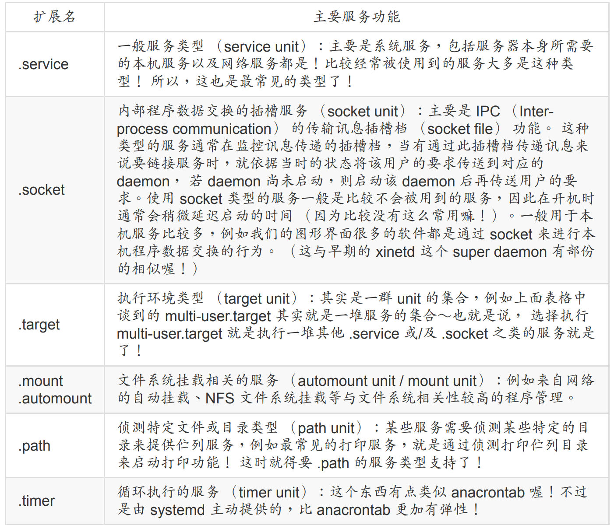
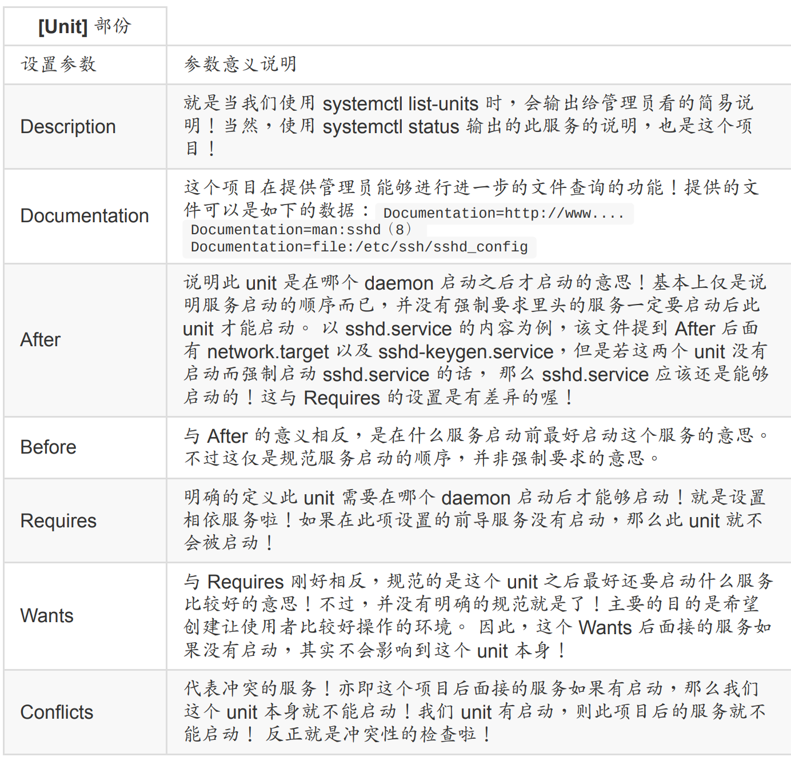
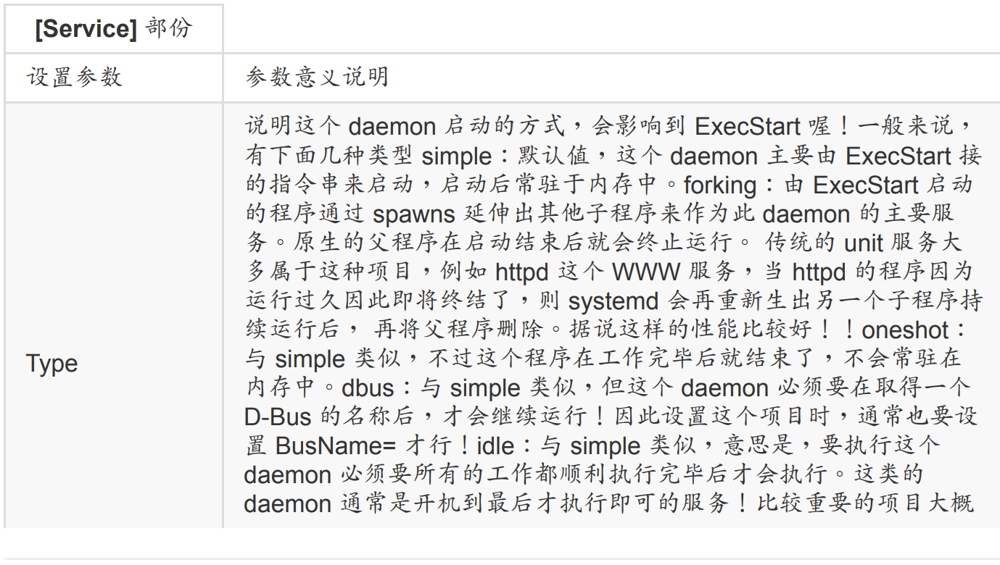
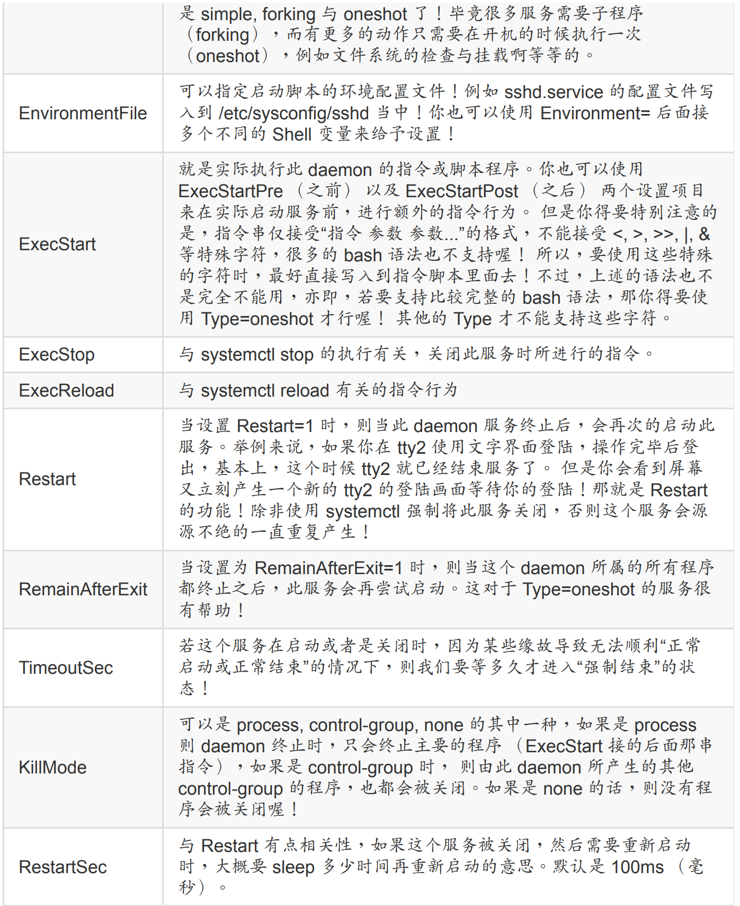
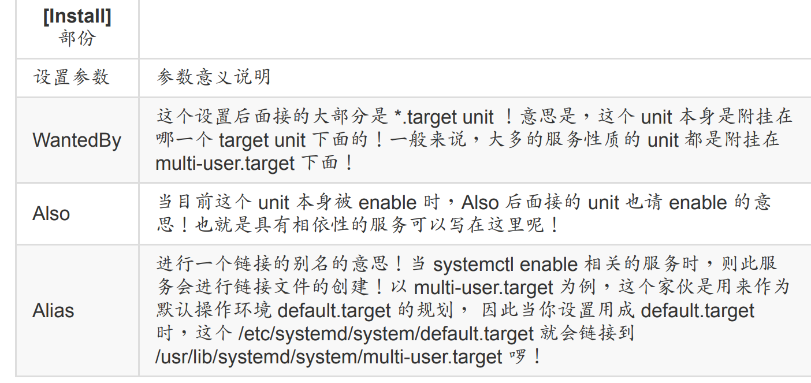
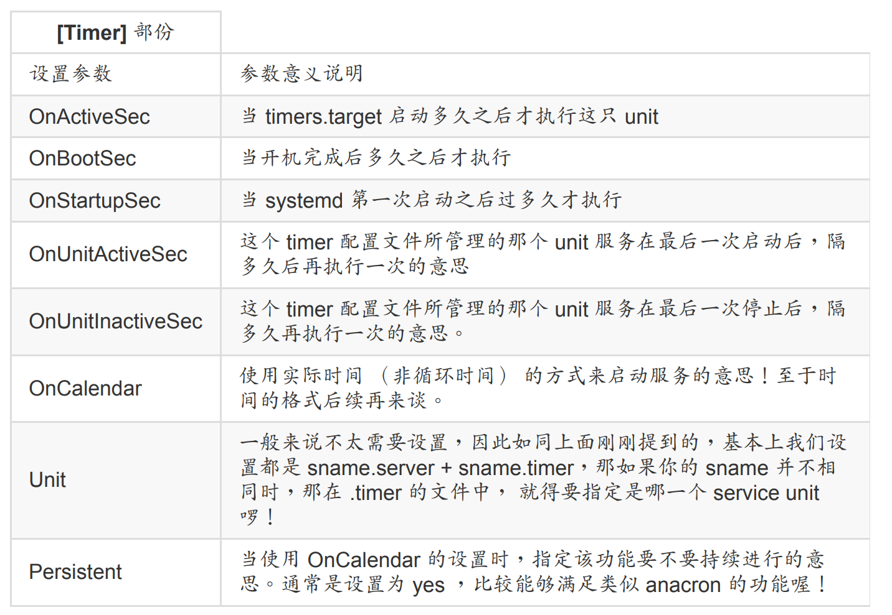
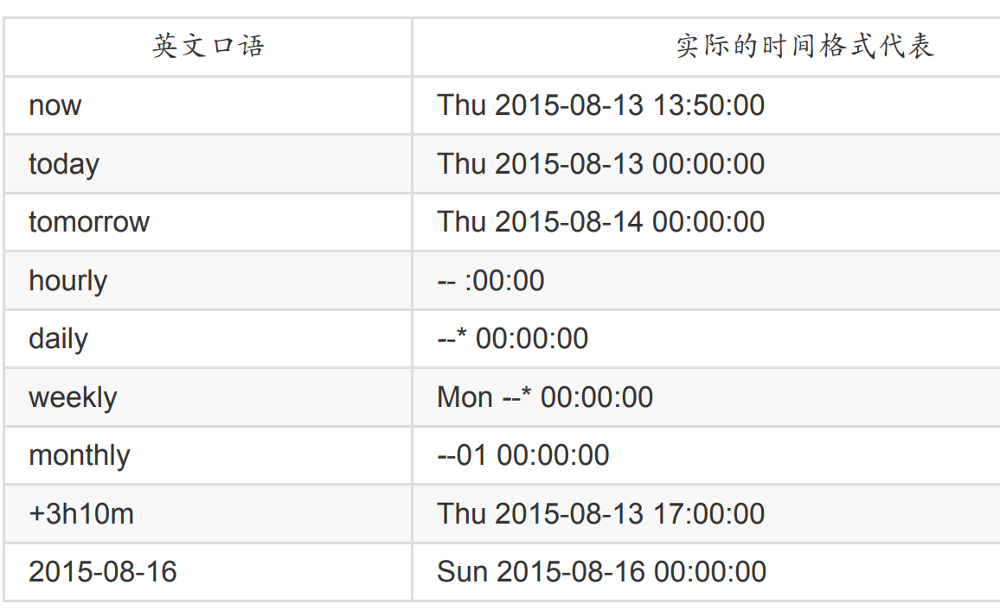
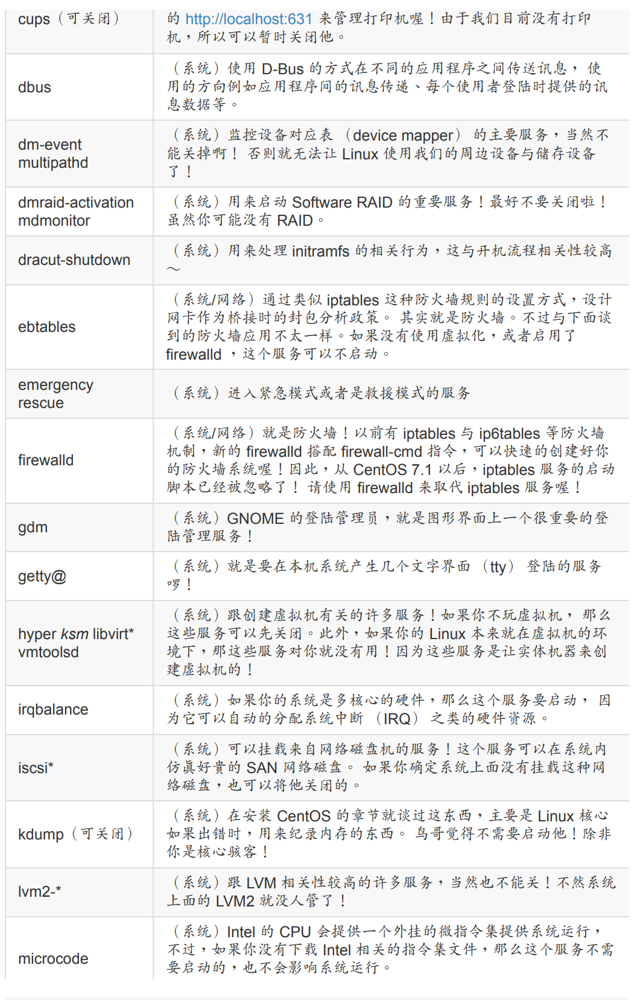
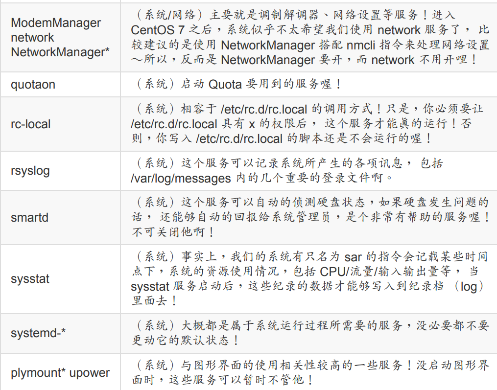
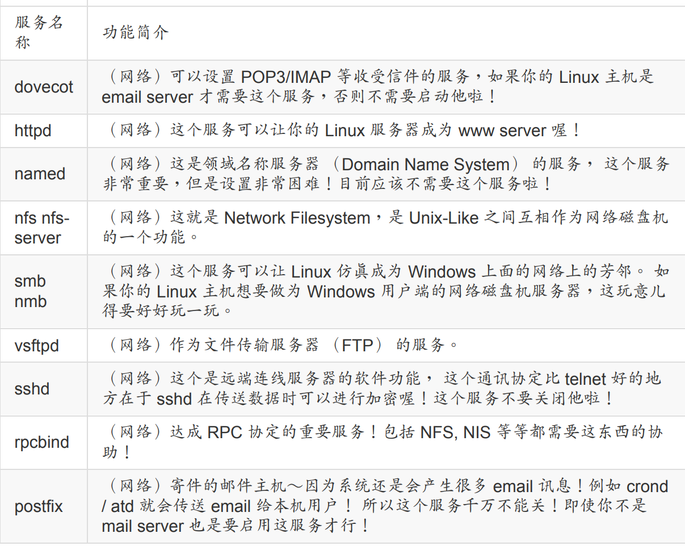

## 13.1 什么是 daemon 与服务 （service）

### 13.1.1 早期的init管理方式

基本上 init 的管理机制有几个特色如下：

服务的启动、关闭与观察等方式： 所有的服务启动脚本通通放置于 /etc/init.d/ 下面，基
本上都是使用 bash shell script 所写成的脚本程序，需要启动、关闭、重新启动、观察状
态时， 可以通过如下的方式来处理：
启动：/etc/init.d/daemon start
关闭：/etc/init.d/daemon stop
重新启动：/etc/init.d/daemon restart
状态观察：/etc/init.d/daemon status

### 13.1.2 systemd 使用unit分类

先看一下配置文件

/usr/lib/systemd/system/：每个服务最主要的启动脚本设置，有点类似以前的 /etc/init.d
下面的文件；
/run/systemd/system/：系统执行过程中所产生的服务脚本，这些脚本的优先序要比
/usr/lib/systemd/system/ 高！
/etc/systemd/system/：管理员依据主机系统的需求所创建的执行脚本，其实这个目录有
点像以前 /etc/rc.d/rc5.d/Sxx 之类的功能！执行优先序又比 /run/systemd/system/ 高喔！

systemd 的 unit 类型分类说明

```bash
[root@study ~]# ll /usr/lib/systemd/system/ &#124; grep -E '（vsftpd&#124;multi&#124;cron）'
-rw-r--r--. 1 root root 284 7月 30 2014 crond.service
-rw-r--r--. 1 root root 567 3月 6 06:51 multipathd.service
-rw-r--r--. 1 root root 524 3月 6 13:48 multi-user.target
drwxr-xr-x. 2 root root 4096 5月 4 17:52 multi-user.target.wants
lrwxrwxrwx. 1 root root 17 5月 4 17:52 runlevel2.target -> multi-user.target
lrwxrwxrwx. 1 root root 17 5月 4 17:52 runlevel3.target -> multi-user.target
lrwxrwxrwx. 1 root root 17 5月 4 17:52 runlevel4.target -> multi-user.target
-rw-r--r--. 1 root root 171 6月 10 2014 vsftpd.service
-rw-r--r--. 1 root root 184 6月 10 2014 vsftpd@.service
-rw-r--r--. 1 root root 89 6月 10 2014 vsftpd.target
# 比较重要的是上头提供的那三行特殊字体的部份！
```

常见的类型服务如下



## 13.2 通过 systemctl 管理服务

### 13.2.1 通过 systemctl 管理单一服务 （service unit） 的启动

```bash
[root@study ~]# systemctl [command] [unit]
command 主要有：
start ：立刻启动后面接的 unit
stop ：立刻关闭后面接的 unit
restart ：立刻关闭后启动后面接的 unit，亦即执行 stop 再 start 的意思
reload ：不关闭后面接的 unit 的情况下，重新载入配置文件，让设置生效
enable ：设置下次开机时，后面接的 unit 会被启动
disable ：设置下次开机时，后面接的 unit 不会被启动
status ：目前后面接的这个 unit 的状态，会列出有没有正在执行、开机默认执行否、登录等信息等！
is-active ：目前有没有正在运行中
is-enable ：开机时有没有默认要启用这个 unit
范例一：看看目前 atd 这个服务的状态为何？
[root@study ~]# systemctl status atd.service
atd.service - Job spooling tools
Loaded: loaded （/usr/lib/systemd/system/atd.service; enabled）
Active: active （running） since Mon 2015-08-10 19:17:09 CST; 5h 42min ago
Main PID: 1350 （atd）
CGroup: /system.slice/atd.service
└─1350 /usr/sbin/atd -f
Aug 10 19:17:09 study.centos.vbird systemd[1]: Started Job spooling tools.
# 重点在第二、三行喔～
# Loaded：这行在说明，开机的时候这个 unit 会不会启动，enabled 为开机启动，disabled 开机不会启动
# Active：现在这个 unit 的状态是正在执行 （running） 或没有执行 （dead）
# 后面几行则是说明这个 unit 程序的 PID 状态以及最后一行显示这个服务的登录文件信息！
# 登录文件信息格式为：“时间” “讯息发送主机” “哪一个服务的讯息” “实际讯息内容”
# 所以上面的显示讯息是：这个 atd 默认开机就启动，而且现在正在运行的意思！
范例二：正常关闭这个 atd 服务
[root@study ~]# systemctl stop atd.service
[root@study ~]# systemctl status atd.service
atd.service - Job spooling tools
Loaded: loaded （/usr/lib/systemd/system/atd.service; enabled）
Active: inactive （dead） since Tue 2015-08-11 01:04:55 CST; 4s ago
Process: 1350 ExecStart=/usr/sbin/atd -f $OPTS （code=exited, status=0/SUCCESS）
Main PID: 1350 （code=exited, status=0/SUCCESS）
Aug 10 19:17:09 study.centos.vbird systemd[1]: Started Job spooling tools.
Aug 11 01:04:55 study.centos.vbird systemd[1]: Stopping Job spooling tools...
Aug 11 01:04:55 study.centos.vbird systemd[1]: Stopped Job spooling tools.
# 目前这个 unit 下次开机还是会启动，但是现在是没在运行的状态中！同时，
# 最后两行为新增加的登录讯息，告诉我们目前的系统状态喔！
```

除了 running 跟 dead 之外， 有没有其他的状态呢？有的～基本上有几个常见的状态：

active （running）：正有一只或多只程序正在系统中执行的意思，举例来说，正在执行
中的 vsftpd 就是这种模式。
active （exited）：仅执行一次就正常结束的服务，目前并没有任何程序在系统中执行。

举例来说，开机或者是挂载时才会进行一次的 quotaon 功能，就是这种模式！ quotaon
不须一直执行～只须执行一次之后，就交给文件系统去自行处理啰！通常用 bash shell
写的小型服务，大多是属于这种类型 （无须常驻内存）。
active （waiting）：正在执行当中，不过还再等待其他的事件才能继续处理。举例来
说，打印的伫列相关服务就是这种状态！ 虽然正在启动中，不过，也需要真的有伫列进
来 （打印工作） 这样他才会继续唤醒打印机服务来进行下一步打印的功能。
inactive：这个服务目前没有运行的意思。

既然 daemon 目前的状态就有这么多种了，那么 daemon 的默认状态有没有可能除了
enable/disable 之外，还有其他的情况呢？当然有！

enabled：这个 daemon 将在开机时被执行
disabled：这个 daemon 在开机时不会被执行
static：这个 daemon 不可以自己启动 （enable 不可），不过可能会被其他的 enabled
的服务来唤醒 （相依属性的服务）
mask：这个 daemon 无论如何都无法被启动！因为已经被强制注销 （非删除）。可通过
systemctl unmask 方式改回原本状态

找到系统中名为 chronyd 的服务，观察此服务的状态，观察完毕后，将此服务设置
为： 1）开机不会启动 2）现在状况是关闭的情况！回答：我们直接使用指令的方式来查询与设置看看：

```bash
# 1\. 观察一下状态，确认是否为关闭/未启动呢？
[root@study ~]# systemctl status chronyd.service
hronyd.service - NTP client/server
Loaded: loaded （/usr/lib/systemd/system/chronyd.service; enabled）
Active: active （running） since Mon 2015-08-10 19:17:07 CST; 24h ago
.....（下面省略）.....
# 2\. 由上面知道目前是启动的，因此立刻将他关闭，同时开机不会启动才行！
[root@study ~]# systemctl stop chronyd.service
[root@study ~]# systemctl disable chronyd.service
rm '/etc/systemd/system/multi-user.target.wants/chronyd.service'
# 看得很清楚～其实就是从 /etc/systemd/system 下面删除一条链接文件而已～
[root@study ~]# systemctl status chronyd.service
chronyd.service - NTP client/server
Loaded: loaded （/usr/lib/systemd/system/chronyd.service; disabled）
Active: inactive （dead）
# 如此则将 chronyd 这个服务完整的关闭了！
```

下面我们把cpus关闭

```bash
# 1\. 先看看 cups 的服务是开还是关？
[root@study ~]# systemctl status cups.service
cups.service - CUPS Printing Service
Loaded: loaded （/usr/lib/systemd/system/cups.service; enabled）
Active: inactive （dead） since Tue 2015-08-11 19:19:20 CST; 3h 29min ago
# 有趣得很！竟然是 enable 但是却是 inactive 耶！相当特别！
# 2\. 那就直接关闭，同时确认没有启动喔！
[root@study ~]# systemctl stop cups.service
[root@study ~]# systemctl disable cups.service
rm '/etc/systemd/system/multi-user.target.wants/cups.path'
rm '/etc/systemd/system/sockets.target.wants/cups.socket'
rm '/etc/systemd/system/printer.target.wants/cups.service'
# 也是非常特别！竟然一口气取消掉三个链接文件！也就是说，这三个文件可能是有相依性的问题喔！
[root@study ~]# netstat -tlunp &#124; grep cups
# 现在应该不会出现任何数据！因为根本没有 cups 的任务在执行当中～所以不会有 port 产生
# 3\. 尝试启动 cups.socket 监听用户端的需求喔！
[root@study ~]# systemctl start cups.socket
[root@study ~]# systemctl status cups.service cups.socket cups.path
cups.service - CUPS Printing Service
Loaded: loaded （/usr/lib/systemd/system/cups.service; disabled）
Active: inactive （dead） since Tue 2015-08-11 22:57:50 CST; 3min 41s ago
cups.socket - CUPS Printing Service Sockets
Loaded: loaded （/usr/lib/systemd/system/cups.socket; disabled）
Active: active （listening） since Tue 2015-08-11 22:56:14 CST; 5min ago
cups.path - CUPS Printer Service Spool
Loaded: loaded （/usr/lib/systemd/system/cups.path; disabled）
Active: inactive （dead）
# 确定仅有 cups.socket 在启动，其他的并没有启动的状态！
# 4\. 尝试使用 lp 这个指令来打印看看？
[root@study ~]# echo "testing" &#124; lp
lp: Error - no default destination available. # 实际上就是没有打印机！所以有错误也没关系！
[root@study ~]# systemctl status cups.service
cups.service - CUPS Printing Service
Loaded: loaded （/usr/lib/systemd/system/cups.service; disabled）
Active: active （running） since Tue 2015-08-11 23:03:18 CST; 34s ago
[root@study ~]# netstat -tlunp &#124; grep cups
tcp 0 0 127.0.0.1:631 0.0.0.0:* LISTEN 25881/cupsd
tcp6 0 0 ::1:631 :::* LISTEN 25881/cupsd
# 见鬼！竟然 cups 自动被启动了！明明我们都没有驱动他啊！怎么回事啊？
```

强迫服务注销 （mask） 的练习

```bash
# 1\. 保持刚刚的状态，关闭 cups.service，启动 cups.socket，然后注销 cups.servcie
[root@study ~]# systemctl stop cups.service
[root@study ~]# systemctl mask cups.service
ln -s '/dev/null' '/etc/systemd/system/cups.service'
# 喔耶～其实这个 mask 注销的动作，只是让启动的脚本变成空的设备而已！
[root@study ~]# systemctl status cups.service
cups.service
Loaded: masked （/dev/null）
Active: inactive （dead） since Tue 2015-08-11 23:14:16 CST; 52s ago
[root@study ~]# systemctl start cups.service
Failed to issue method call: Unit cups.service is masked. # 再也无法唤醒！
```

那如何取消注销呢？当然就是 unmask 即可啊！

```bash
[root@study ~]# systemctl unmask cups.service
rm '/etc/systemd/system/cups.service'
[root@study ~]# systemctl status cups.service
cups.service - CUPS Printing Service
Loaded: loaded （/usr/lib/systemd/system/cups.service; disabled）
Active: inactive （dead） since Tue 2015-08-11 23:14:16 CST; 4min 35s ago
# 好佳在有恢复正常！
```

### 13.2.2 通过 systemctl 观察系统上所有的服务

```bash
[root@study ~]# systemctl [command] [--type=TYPE] [--all]
command:
list-units ：依据 unit 列出目前有启动的 unit。若加上 --all 才会列出没启动的。
list-unit-files ：依据 /usr/lib/systemd/system/ 内的文件，将所有文件列表说明。
--type=TYPE：就是之前提到的 unit type，主要有 service, socket, target 等
范例一：列出系统上面有启动的 unit
[root@study ~]# systemctl
UNIT LOAD ACTIVE SUB DESCRIPTION
proc-sys-fs-binfmt_mis... loaded active waiting Arbitrary Executable File Formats File System
sys-devices-pc...:0:1:... loaded active plugged QEMU_HARDDISK
sys-devices-pc...0:1-0... loaded active plugged QEMU_HARDDISK
sys-devices-pc...0:0-1... loaded active plugged QEMU_DVD-ROM
.....（中间省略）.....
vsftpd.service loaded active running Vsftpd ftp daemon
.....（中间省略）.....
cups.socket loaded failed failed CUPS Printing Service Sockets
.....（中间省略）.....
LOAD = Reflects whether the unit definition was properly loaded.
ACTIVE = The high-level unit activation state, i.e. generalization of SUB.
SUB = The low-level unit activation state, values depend on unit type.
141 loaded units listed. Pass --all to see loaded but inactive units, too.
To show all installed unit files use 'systemctl list-unit-files'.
# 列出的项目中，主要的意义是：
# UNIT ：项目的名称，包括各个 unit 的类别 （看扩展名）
# LOAD ：开机时是否会被载入，默认 systemctl 显示的是有载入的项目而已喔！
# ACTIVE ：目前的状态，须与后续的 SUB 搭配！就是我们用 systemctl status 观察时，active 的项目！
# DESCRIPTION ：详细描述啰
# cups 比较有趣，因为刚刚被我们玩过，所以 ACTIVE 竟然是 failed 的喔！被玩死了！ ^_^
# 另外，systemctl 都不加参数，其实默认就是 list-units 的意思！
范例二：列出所有已经安装的 unit 有哪些？
[root@study ~]# systemctl list-unit-files
UNIT FILE STATE
proc-sys-fs-binfmt_misc.automount static
dev-hugepages.mount static
dev-mqueue.mount static
proc-fs-nfsd.mount static
.....（中间省略）.....
systemd-tmpfiles-clean.timer static
336 unit files listed.
```

假设我不想要知道这么多的 unit 项目，我只想要知道 service 这种类别的 daemon 而已，而
且不论是否已经启动，通通要列出来！ 那该如何是好？

```bash
[root@study ~]# systemctl list-units --type=service --all
# 只剩下 *.service 的项目才会出现喔！
范例一：查询系统上是否有以 cpu 为名的服务？
[root@study ~]# systemctl list-units --type=service --all &#124; grep cpu
cpupower.service loaded inactive dead Configure CPU power related settings
# 确实有喔！可以改变 CPU 电源管理机制的服务哩！
```

### 13.2.3 通过 systemctl 管理不同的操作环境 （target unit）

那么可否列出跟操作界面比较有关的 target 项目呢？ 很简单啊！就这样搞一下：

```bash
[root@study ~]# systemctl list-units --type=target --all
UNIT LOAD ACTIVE SUB DESCRIPTION
basic.target loaded active active Basic System
cryptsetup.target loaded active active Encrypted Volumes
emergency.target loaded inactive dead Emergency Mode
final.target loaded inactive dead Final Step
getty.target loaded active active Login Prompts
graphical.target loaded active active Graphical Interface
local-fs-pre.target loaded active active Local File Systems （Pre）
local-fs.target loaded active active Local File Systems
multi-user.target loaded active active Multi-User System
network-online.target loaded inactive dead Network is Online
network.target loaded active active Network
nss-user-lookup.target loaded inactive dead User and Group Name Lookups
paths.target loaded active active Paths
remote-fs-pre.target loaded active active Remote File Systems （Pre）
remote-fs.target loaded active active Remote File Systems
rescue.target loaded inactive dead Rescue Mode
shutdown.target loaded inactive dead Shutdown
slices.target loaded active active Slices
sockets.target loaded active active Sockets
sound.target loaded active active Sound Card
swap.target loaded active active Swap
sysinit.target loaded active active System Initialization
syslog.target not-found inactive dead syslog.target
time-sync.target loaded inactive dead System Time Synchronized
timers.target loaded active active Timers
umount.target loaded inactive dead Unmount All Filesystems
LOAD = Reflects whether the unit definition was properly loaded.
ACTIVE = The high-level unit activation state, i.e. generalization of SUB.
SUB = The low-level unit activation state, values depend on unit type.
26 loaded units listed.
To show all installed unit files use 'systemctl list-unit-files'.
```

而跟操作界面相关性比较高的 target 主要有下面几个：

graphical.target：就是文字加上图形界面，这个项目已经包含了下面的 multi-user.target
项目！
multi-user.target：纯文本模式！
rescue.target：在无法使用 root 登陆的情况下，systemd 在开机时会多加一个额外的暂
时系统，与你原本的系统无关。这时你可以取得 root 的权限来维护你的系统。 但是这是
额外系统，因此可能需要动到 chroot 的方式来取得你原有的系统喔！再后续的章节我们
再来谈！
emergency.target：紧急处理系统的错误，还是需要使用 root 登陆的情况，在无法使用
rescue.target 时，可以尝试使用这种模式！
shutdown.target：就是关机的流程。
getty.target：可以设置你需要几个 tty 之类的，如果想要降低 tty 的项目，可以修改这个
东西的配置文件！

如何知道目前的模式是哪一种？又得要如何修改呢？下面来玩一玩吧！

```bash
[root@study ~]# systemctl [command] [unit.target]
选项与参数：
command:
get-default ：取得目前的 target
set-default ：设置后面接的 target 成为默认的操作模式
isolate ：切换到后面接的模式
范例一：我们的测试机器默认是图形界面，先观察是否真为图形模式，再将默认模式转为文字界面
[root@study ~]# systemctl get-default
graphical.target # 果然是图形界面喔！
[root@study ~]# systemctl set-default multi-user.target
[root@study ~]# systemctl get-default
multi-user.target
范例二：在不重新开机的情况下，将目前的操作环境改为纯文本模式，关掉图形界面
[root@study ~]# systemctl isolate multi-user.target
范例三：若需要重新取得图形界面呢？
[root@study ~]# systemctl isolate graphical.target
```

不过为了方便起见， systemd 也提供了数个简单的指令给我们切换操作模式之用喔！ 大致上如下所示：

```bash
[root@study ~]# systemctl poweroff 系统关机
[root@study ~]# systemctl reboot 重新开机
[root@study ~]# systemctl suspend 进入暂停模式
[root@study ~]# systemctl hibernate 进入休眠模式
[root@study ~]# systemctl rescue 强制进入救援模式
[root@study ~]# systemctl emergency 强制进入紧急救援模式
```

关机、重新开机、救援与紧急模式这没啥问题，那么什么是暂停与休眠模式呢？

- suspend：暂停模式会将系统的状态数据保存到内存中，然后关闭掉大部分的系统硬件-，当然，并没有实际关机喔！ 当使用者按下唤醒机器的按钮，系统数据会重内存中回复，然后重新驱动被大部分关闭的硬件，就开始正常运行！唤醒的速度较快。

- hibernate：休眠模式则是将系统状态保存到硬盘当中，保存完毕后，将计算机关机。当
  使用者尝试唤醒系统时，系统会开始正常运行， 然后将保存在硬盘中的系统状态恢复回
  来。因为数据是由硬盘读出，因此唤醒的性能与你的硬盘速度有关。

### 13.2.4 通过 systemctl 分析各服务之间的相依性

如何追踪某一个unit 的相依性呢？ 举例来说好了，我们怎么知道 graphical.target 会用到 multi-user.target呢？那 graphical.target 下面还有哪些东西呢？

```bash
[root@study ~]# systemctl list-dependencies [unit] [--reverse]
选项与参数：
--reverse ：反向追踪谁使用这个 unit 的意思！
范例一：列出目前的 target 环境下，用到什么特别的 unit
[root@study ~]# systemctl get-default
multi-user.target
[root@study ~]# systemctl list-dependencies
default.target
├─abrt-ccpp.service
├─abrt-oops.service
├─vsftpd.service
├─basic.target
│ ├─alsa-restore.service
│ ├─alsa-state.service
.....（中间省略）.....
│ ├─sockets.target
│ │ ├─avahi-daemon.socket
│ │ ├─dbus.socket
.....（中间省略）.....
│ ├─sysinit.target
│ │ ├─dev-hugepages.mount
│ │ ├─dev-mqueue.mount
.....（中间省略）.....
│ └─timers.target
│ └─systemd-tmpfiles-clean.timer
├─getty.target
│ └─getty@tty1.service
└─remote-fs.target
```

那么如果要查出谁会用到 multi-user.target 呢？就这么作！

```bash
[root@study ~]# systemctl list-dependencies --reverse
default.target
└─graphical.target
```

好～那再来，graphical.target 又使用了多少的服务呢？可以这样看：

```bash
[root@study ~]# systemctl list-dependencies graphical.target
graphical.target
├─accounts-daemon.service
├─gdm.service
├─network.service
├─rtkit-daemon.service
├─systemd-update-utmp-runlevel.service
└─multi-user.target
├─abrt-ccpp.service
├─abrt-oops.service
```

### 13.2.5 systemd相关目录

我们在前几小节曾经谈过比较重要的 systemd 启动脚本配置文件在 /usr/lib/systemd/system/,/etc/systemd/system/ 目录下，那还有哪些目录跟系统的 daemon 运行有关呢？ 基本上是这样的：

/usr/lib/systemd/system/： 使用 CentOS 官方提供的软件安装后，默认的启动脚本配置
文件都放在这里，这里的数据尽量不要修改～ 要修改时，请到 /etc/systemd/system 下面
修改较佳！
/run/systemd/system/： 系统执行过程中所产生的服务脚本，这些脚本的优先序要比
/usr/lib/systemd/system/ 高！
/etc/systemd/system/： 管理员依据主机系统的需求所创建的执行脚本，其实这个目录有
点像以前 /etc/rc.d/rc5.d/Sxx 之类的功能！执行优先序又比 /run/systemd/system/ 高喔！
/etc/sysconfig/*： 几乎所有的服务都会将初始化的一些选项设置写入到这个目录下，举
例来说，mandb 所要更新的 man page 索引中，需要加入的参数就写入到此目录下的
man-db 当中喔！而网络的设置则写在 /etc/sysconfig/network-scripts/ 这个目录内。所
以，这个目录内的文件也是挺重要的；
/var/lib/： 一些会产生数据的服务都会将他的数据写入到 /var/lib/ 目录中。举例来说，数
据库管理系统 Mariadb 的数据库默认就是写入 /var/lib/mysql/ 这个目录下啦！
/run/： 放置了好多 daemon 的暂存盘，包括 lock file 以及 PID file 等等。

那你怎么知道这些 socket file 放置在哪里呢？ 很简单！还是通过 systemctl 来管理！

```bash
[root@study ~]# systemctl list-sockets
LISTEN UNIT ACTIVATES
/dev/initctl systemd-initctl.socket systemd-initctl.service
/dev/log systemd-journald.socket systemd-journald.service
/run/dmeventd-client dm-event.socket dm-event.service
/run/dmeventd-server dm-event.socket dm-event.service
/run/lvm/lvmetad.socket lvm2-lvmetad.socket lvm2-lvmetad.service
/run/systemd/journal/socket systemd-journald.socket systemd-journald.service
/run/systemd/journal/stdout systemd-journald.socket systemd-journald.service
/run/systemd/shutdownd systemd-shutdownd.socket systemd-shutdownd.service
/run/udev/control systemd-udevd-control.socket systemd-udevd.service
/var/run/avahi-daemon/socket avahi-daemon.socket avahi-daemon.service
/var/run/cups/cups.sock cups.socket cups.service
/var/run/dbus/system_bus_socket dbus.socket dbus.service
/var/run/rpcbind.sock rpcbind.socket rpcbind.service
@ISCSIADM_ABSTRACT_NAMESPACE iscsid.socket iscsid.service
@ISCSID_UIP_ABSTRACT_NAMESPACE iscsiuio.socket iscsiuio.service
kobject-uevent 1 systemd-udevd-kernel.socket systemd-udevd.service
16 sockets listed.
Pass --all to see loaded but inactive sockets, too.
```

### 13.2.6 关闭网络服务

什么是网络服务呢？基本上，会产生一个网络监听端口 （port） 的程序，你就可以称他是个网络服务了！

```bash
[root@study ~]# netstat -tlunp
Proto Recv-Q Send-Q Local Address Foreign Address State PID/Program name
tcp 0 0 0.0.0.0:22 0.0.0.0:* LISTEN 1340/sshd
tcp 0 0 127.0.0.1:25 0.0.0.0:* LISTEN 2387/master
tcp6 0 0 :::555 :::* LISTEN 29113/vsftpd
tcp6 0 0 :::22 :::* LISTEN 1340/sshd
tcp6 0 0 ::1:25 :::* LISTEN 2387/master
udp 0 0 0.0.0.0:5353 0.0.0.0:* 750/avahi-daemon: r
udp 0 0 0.0.0.0:36540 0.0.0.0:* 750/avahi-daemon: r
```

其中 5353,36540 是由 avahi-daemon 这个东西所启动的！ 接下来我们使用 systemctl 去观察一下，到底有没有 avahi-daemon 为开头的服务呢？

```bash
[root@study ~]# systemctl list-units --all | grep avahi-daemon
avahi-daemon.service loaded active running Avahi mDNS/DNS-SD Stack
avahi-daemon.socket loaded active running Avahi mDNS/DNS-SD Stack Activation Socket
```

我们不需要这个服务，可以直接关闭

```bash
[root@study ~]# systemctl stop avahi-daemon.service
[root@study ~]# systemctl stop avahi-daemon.socket
[root@study ~]# systemctl disable avahi-daemon.service avahi-daemon.socket
[root@study ~]# netstat -tlunp
Proto Recv-Q Send-Q Local Address Foreign Address State PID/Program name
tcp 0 0 0.0.0.0:22 0.0.0.0:* LISTEN 1340/sshd
tcp 0 0 127.0.0.1:25 0.0.0.0:* LISTEN 2387/master
tcp6 0 0 :::555 :::* LISTEN 29113/vsftpd
tcp6 0 0 :::22 :::* LISTEN 1340/sshd
tcp6 0 0 ::1:25 :::* LISTEN 2387/master
```

## 13.3 针对非service类型的配置文件

### 13.3.1 systemctl 配置文件相关目录简介

/usr/lib/systemd/system/vsftpd.service：官方释出的默认配置文件；
/etc/systemd/system/vsftpd.service.d/custom.conf：在 /etc/systemd/system 下面创建与
配置文件相同文件名的目录，但是要加上 .d 的扩展名。然后在该目录下创建配置文件即
可。另外，配置文件最好附文件名取名为 .conf 较佳！ 在这个目录下的文件会“累加其他
设置”进入 /usr/lib/systemd/system/vsftpd.service 内喔！
/etc/systemd/system/vsftpd.service.wants/*：此目录内的文件为链接文件，设置相依服
务的链接。意思是启动了 vsftpd.service 之后，最好再加上这目录下面建议的服务。
/etc/systemd/system/vsftpd.service.requires/*：此目录内的文件为链接文件，设置相依
服务的链接。意思是在启动 vsftpd.service 之前，需要事先启动哪些服务的意思。

### 13.3.2 systemctl 配置文件的设置项目简介

```bash
[root@study ~]# cat /usr/lib/systemd/system/sshd.service
[Unit] # 这个项目与此 unit 的解释、执行服务相依性有关
Description=OpenSSH server daemon
After=network.target sshd-keygen.service
Wants=sshd-keygen.service
[Service] # 这个项目与实际执行的指令参数有关
EnvironmentFile=/etc/sysconfig/sshd
ExecStart=/usr/sbin/sshd -D $OPTIONS
ExecReload=/bin/kill -HUP $MAINPID
KillMode=process
Restart=on-failure
RestartSec=42s
[Install] # 这个项目说明此 unit 要挂载哪个 target 下面
WantedBy=multi-user.target
```

分析上面的配置文件，我们大概能够将整个设置分为三个部份，就是：
[Unit]： unit 本身的说明，以及与其他相依 daemon 的设置，包括在什么服务之后才启动
此 unit 之类的设置值；
[Service], [Socket], [Timer], [Mount], [Path]..：不同的 unit type 就得要使用相对应的设置
项目。我们拿的是 sshd.service 来当范本，所以这边就使用 [Service] 来设置。 这个项目
内主要在规范服务启动的脚本、环境配置文件文件名、重新启动的方式等等。
[Install]：这个项目就是将此 unit 安装到哪个 target 里面去的意思！

至于配置文件内有些设置规则还是得要说明一下：

- 设置项目通常是可以重复的，例如我可以重复设置两个 After 在配置文件中，不过，后面的设置会取代前面的喔！因此，如果你想要将设置值归零， 可以使用类似“ After= ”的设置，亦即该项目的等号后面什么都没有，就将该设置归零了 （reset）。

- 如果设置参数需要有“是/否”的项目 （布林值, boolean），你可以使用 1, yes, true, on 代表启动，用 0, no, false, off 代表关闭！随你喜好选择啰！

- 空白行、开头为 # 或 ; 的那一行，都代表注解！

下面对这些参数进行详细说明



接下来了解一下在 [Service] 当中有哪些项目可以使用！





最后，再来看看那么 Install 内还有哪些项目可用？



### 13.3.3 运行实例

```bash
# 1\. 先创建好所需要的配置文件
[root@study ~]# cd /etc/vsftpd
[root@study vsftpd]# cp vsftpd.conf vsftpd2.conf
[root@study vsftpd]# vim vsftpd.conf
#listen_port=555
[root@study vsftpd]# diff vsftpd.conf vsftpd2.conf
128c128
< #listen_port=555
---
> listen_port=555
# 注意这两个配置文件的差别喔！只有这一行不同而已！
# 2\. 开始处理启动脚本设置
[root@study vsftpd]# cd /etc/systemd/system
[root@study system]# cp /usr/lib/systemd/system/vsftpd.service vsftpd2.service
[root@study system]# vim vsftpd2.service
[Unit]
Description=Vsftpd second ftp daemon
After=network.target
[Service]
Type=forking
ExecStart=/usr/sbin/vsftpd /etc/vsftpd/vsftpd2.conf
[Install]
WantedBy=multi-user.target
# 重点在改了 vsftpd2.conf 这个配置文件喔！
# 3\. 重新载入 systemd 的脚本配置文件内容
[root@study system]# systemctl daemon-reload
[root@study system]# systemctl list-unit-files --all &#124; grep vsftpd
vsftpd.service enabled
vsftpd2.service disabled
vsftpd@.service disabled
vsftpd.target disabled
[root@study system]# systemctl status vsftpd2.service
vsftpd2.service - Vsftpd second ftp daemon
Loaded: loaded （/etc/systemd/system/vsftpd2.service; disabled）
Active: inactive （dead）
[root@study system]# systemctl restart vsftpd.service vsftpd2.service
[root@study system]# systemctl enable vsftpd.service vsftpd2.service
[root@study system]# systemctl status vsftpd.service vsftpd2.service
vsftpd.service - Vsftpd ftp daemon
Loaded: loaded （/usr/lib/systemd/system/vsftpd.service; enabled）
Active: active （running） since Wed 2015-08-12 22:00:17 CST; 35s ago
Main PID: 12670 （vsftpd）
CGroup: /system.slice/vsftpd.service
└─12670 /usr/sbin/vsftpd /etc/vsftpd/vsftpd.conf
Aug 12 22:00:17 study.centos.vbird systemd[1]: Started Vsftpd ftp daemon.
vsftpd2.service - Vsftpd second ftp daemon
Loaded: loaded （/etc/systemd/system/vsftpd2.service; enabled）
Active: active （running） since Wed 2015-08-12 22:00:17 CST; 35s ago
Main PID: 12672 （vsftpd）
CGroup: /system.slice/vsftpd2.service
└─12672 /usr/sbin/vsftpd /etc/vsftpd/vsftpd2.conf
[root@study system]# netstat -tlnp
Active Internet connections （only servers）
Proto Recv-Q Send-Q Local Address Foreign Address State PID/Program name
tcp 0 0 0.0.0.0:22 0.0.0.0:* LISTEN 1340/sshd
tcp 0 0 127.0.0.1:25 0.0.0.0:* LISTEN 2387/master
tcp6 0 0 :::555 :::* LISTEN 12672/vsftpd
tcp6 0 0 :::21 :::* LISTEN 12670/vsftpd
tcp6 0 0 :::22 :::* LISTEN 1340/sshd
tcp6 0 0 ::1:25 :::* LISTEN 2387/master
```

### 13.3.4 多重的重复设置方式

实际产生 tty1~tty6 的则是由 getty@.service 所提供的，先来查阅一下 /usr/lib/systemd/system/getty@.service 的内容好了：

```bash
[root@study ~]# cat //usr/lib/systemd/system/getty@.service
[Unit]
Description=Getty on %I
Documentation=man:agetty（8） man:systemd-getty-generator（8）
Documentation=http://0pointer.de/blog/projects/serial-console.html
After=systemd-user-sessions.service plymouth-quit-wait.service
After=rc-local.service
Before=getty.target
ConditionPathExists=/dev/tty0
[Service]
ExecStart=-/sbin/agetty --noclear %I $TERM
Type=idle
Restart=always
RestartSec=0
UtmpIdentifier=%I
TTYPath=/dev/%I
TTYReset=yes
TTYVHangup=yes
TTYVTDisallocate=yes
KillMode=process
IgnoreSIGPIPE=no
SendSIGHUP=yes
[Install]
WantedBy=getty.target
```

这个 @ 到底怎么回事呢？我们先来看看 getty@.service 的上游，亦即是 getty.target 这个东西的内容好了！

```bash
[root@study ~]# systemctl show getty.target
# 那个 show 的指令可以将 getty.target 的默认设置值也取出来显示！
Names=getty.target
Wants=getty@tty1.service
WantedBy=multi-user.target
Conflicts=shutdown.target
Before=multi-user.target
After=getty@tty1.service getty@tty2.service getty@tty3.service getty@tty4.service
getty@tty6.service getty@tty5.service
.....（后面省略）.....
```

我们拿 getty@tty1.service 来说明一下好了！当我们执行完 getty.target 之后， 他会持续要求 getty@tty1.service 等六个服务继续启动。那我们的 systemd 就会这么作：

- 先看 /usr/lib/systemd/system/, /etc/systemd/system/ 有没有 getty@tty1.service 的设置，若有就执行，若没有则执行下一步；

- 找 getty@.service 的设置，若有则将 @ 后面的数据带入成 %I 的变量，进入
  getty@.service 执行！这也就是说，其实 getty@tty1.service 实际上是不存在的！他主要是通过 getty@.service 来执行～也就是说， getty@.service 的目的是为了要简化多个执行的启动设置， 他的命名方式是这样的：

```bash
原始文件：执行服务名称@.service
可执行文件案：执行服务名称@范例名称.service
```

因此当有范例名称带入时，则会有一个新的服务名称产生出来！你再回头看看getty@.service的启动脚本：

```bash
ExecStart=-/sbin/agetty --noclear %I $TERM
```

上表中那个 %I 指的就是“范例名称”！根据 getty.target 的信息输出来看getty@tty1.service的 %I 就是 tty1 啰！因此执行脚本就会变成“ /sbin/agetty --noclear tty1 ”！ 所以我们才有办法以一个配置文件来启动多个 tty1 给用户登陆啰！

现在你应该要感到困扰的是，那么“ 6 个 tty 是谁规定的”为什么不是 5 个还是 7 个？这是因为systemd 的登陆配置文件 /etc/systemd/logind.conf 里面规范的啦！ 假如你想要让 tty 数量降低到剩下 4 个的话，那么可以这样实验看看：

```bash
# 1\. 修改默认的 logind.conf 内容，将原本 6 个虚拟终端机改成 4 个
[root@study ~]# vim /etc/systemd/logind.conf
[Login]
NAutoVTs=4
ReserveVT=0
# 原本是 6 个而且还注解，请取消注解，然后改成 4 吧！
# 2\. 关闭不小心启动的 tty5, tty6 并重新启动 getty.target 啰！
[root@study ~]# systemctl stop getty@tty5.service
[root@study ~]# systemctl stop getty@tty6.service
[root@study ~]# systemctl restart systemd-logind.service
```

### 13.3.5 制作自己的服务

我们来仿真自己作一个服务吧！假设我要作一只可以备份自己系统的服务，这只脚本我放在
/backups 下面，内容有点像这样：

```bash
[root@study ~]# vim /backups/backup.sh
#!/bin/bash
source="/etc /home /root /var/lib /var/spool/{cron,at,mail}"
target="/backups/backup-system-$（date +%Y-%m-%d）.tar.gz"
[ ! -d /backups ] && mkdir /backups
tar -zcvf ${target} ${source} &> /backups/backup.log
[root@study ~]# chmod a+x /backups/backup.sh
[root@study ~]# ll /backups/backup.sh
-rwxr-xr-x. 1 root root 220 Aug 13 01:57 /backups/backup.sh
# 记得要有可执行的权限才可以喔！
```

接下来，我们要如何设计一只名为 backup.service 的启动脚本设置呢？可以这样做喔！

```bash
[root@study ~]# vim /etc/systemd/system/backup.service
[Unit]
Description=backup my server
Requires=atd.service
[Service]
Type=simple
ExecStart=/bin/bash -c " echo /backups/backup.sh &#124; at now"
[Install]
WantedBy=multi-user.target
# 因为 ExecStart 里面有用到 at 这个指令，因此， atd.service 就是一定要的服务！
[root@study ~]# systemctl daemon-reload
[root@study ~]# systemctl start backup.service
[root@study ~]# systemctl status backup.service
backup.service - backup my server
Loaded: loaded （/etc/systemd/system/backup.service; disabled）
Active: inactive （dead）
Aug 13 07:50:31 study.centos.vbird systemd[1]: Starting backup my server...
Aug 13 07:50:31 study.centos.vbird bash[20490]: job 8 at Thu Aug 13 07:50:00 2015
Aug 13 07:50:31 study.centos.vbird systemd[1]: Started backup my server.
# 为什么 Active 是 inactive 呢？这是因为我们的服务仅是一个简单的 script 啊！
# 因此执行完毕就完毕了，不会继续存在内存中喔！
```

完成上述的动作之后，以后你都可以直接使用 systemctl start backup.service 进行系统的备份了！而且会直接丢进 atd 的管理中， 你就无须自己手动用 at 去处理这项任务了～好像还不赖喔！

## 13.4 systemctl 针对 timer 的配置文件

名为 timers.target的家伙，这家伙可以协助定期处理各种任务！ 那么，除了 crond 之外，如何使用 systemd 内置的 time 来处理各种任务呢？

你可以到 /etc/systemd/system 下面去创建这个 *.timer 档，那这个文件的内容要项有哪些东西呢？基本设置主要有下面这些： （man systemd.timer & man systemd.time）



如果你想要从 crontab 转成这个 timer 功能的话，那么对于时间设置的格式就得要了解了解～基本上的格式如下所示：

```bash
语法：英文周名 YYYY-MM-DD HH:MM:SS
范例：Thu 2015-08-13 13:40:00
```

也可以使用时间间隔来写

```bash
隔 3 小时： 3h 或 3hr 或 3hours
隔 300 分钟过 10 秒： 10s 300m
隔 5 天又 100 分钟： 100m 5day
# 通常英文的写法，小单位写前面，大单位写后面～所以先秒、再分、再小时、再天数等～
```

此外，你也可以使用英文常用的口语化日期代表



下面可以简单写一下

```bash
[root@study ~]# vim /etc/systemd/system/backup.timer
[Unit]
Description=backup my server timer
[Timer]
OnBootSec=2hrs
OnUnitActiveSec=2days
[Install]
WantedBy=multi-user.target
# 只要这样设置就够了！储存离开吧！
[root@study ~]# systemctl daemon-reload
[root@study ~]# systemctl enable backup.timer
[root@study ~]# systemctl restart backup.timer
[root@study ~]# systemctl list-unit-files &#124; grep backup
backup.service disabled # 这个不需要启动！只要 enable backup.timer 即可！
backup.timer enabled
[root@study ~]# systemctl show timers.target
ConditionTimestamp=Thu 2015-08-13 14:31:11 CST # timer 这个 unit 启动的时间！
[root@study ~]# systemctl show backup.service
ExecMainExitTimestamp=Thu 2015-08-13 14:50:19 CST # backup.service 上次执行的时间
[root@study ~]# systemctl show backup.timer
NextElapseUSecMonotonic=2d 19min 11.540653s # 下一次执行距离 timers.target 的时间
```

上面的案例是固定周期运行一次，那如果我希望不管上面如何运行了，我都希望星期天凌晨 2点运行这个备份程序一遍呢？

```bash
[root@study ~]# vim /etc/systemd/system/backup2.timer
[Unit]
Description=backup my server timer2
[Timer]
OnCalendar=Sun *-*-* 02:00:00
Persistent=true
Unit=backup.service
[Install]
WantedBy=multi-user.target
[root@study ~]# systemctl daemon-reload
[root@study ~]# systemctl enable backup2.timer
[root@study ~]# systemctl start backup2.timer
[root@study ~]# systemctl show backup2.timer
NextElapseUSecRealtime=45y 7month 1w 6d 10h 30min
```

## 13.5 默认启动服务









