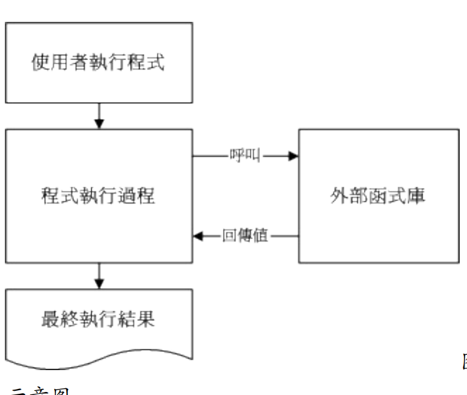
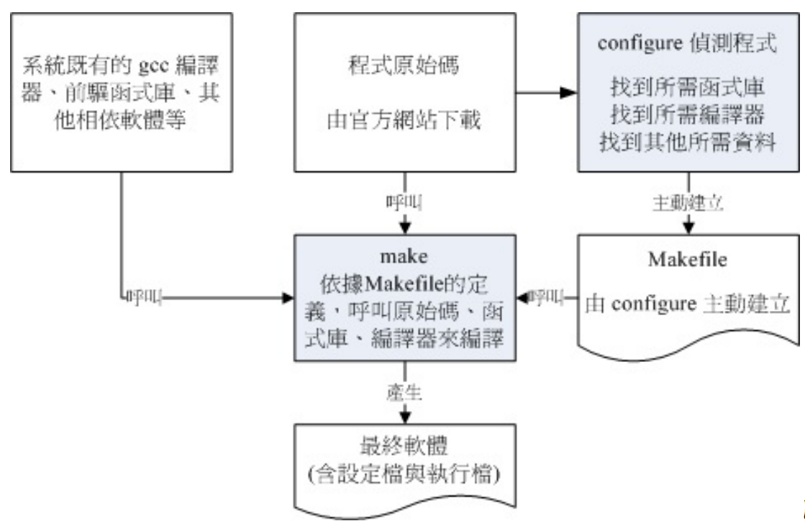
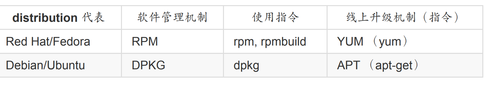
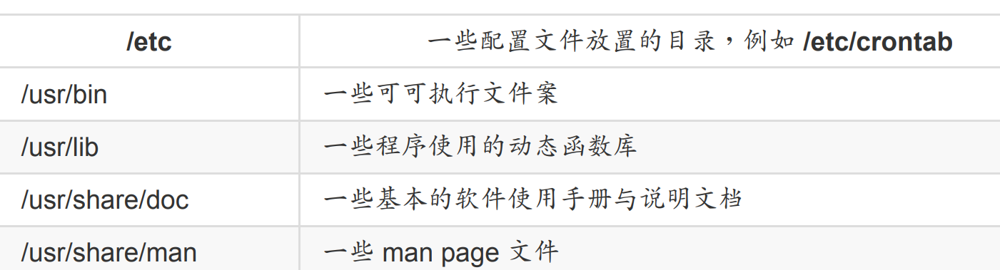
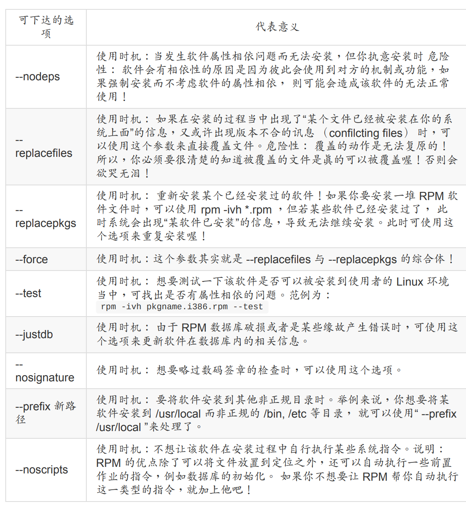
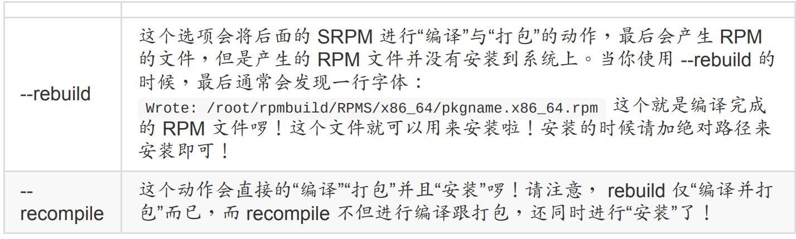

## 17.1 开放源码安装

我们可以使用file命令来查看二进制程序信息

```bash
# 先以系统的文件测试看看：
[root@study ~]# file /bin/bash
/bin/bash: ELF 64-bit LSB executable, x86-64, version 1 （SYSV）, dynamically linked
（uses shared libs）, for GNU/Linux 2.6.32, BuildID[sha1]=0x7e60e35005254...stripped
# 如果是系统提供的 /etc/init.d/network 呢？
[root@study ~]# file /etc/init.d/network
/etc/init.d/network: Bourne-Again shell script, ASCII text executable
```

### 17.1.1 什么是函数库

函数库又分为动态与静态函数库，这两个咚咚的分别我们在后面的小节再加以说明。 这里我
们以一个简单的流程图，来示意一支有调用外部函数库的程序的执行情况。



这些核心相关信息大多放置在 /usr/include, /usr/lib, /usr/lib64 里面哩！

### 17.1.2 什么事make与configure

当执行 make 时，make 会在当时的目录下搜寻 Makefile （or makefile） 这个文本文件，而Makefile 里面则记录了源代码如何编译的详细信息！ make 会自动的判别源代码是否经过变动了，而自动更新可执行文件，是软件工程师相当好用的一个辅助工具呢！

make 与 configure 运行流程的相关性，我们可以使用下面的图示来示意一下啊！ 下图
中，你要进行的任务其实只有两个，一个是执行 configure 来创建 Makefile ， 这个步骤一定要成功！成功之后再以 make 来调用所需要的数据来编译即可！非常简单！



### 17.1.3 什么是tarball

所谓的 Tarball 文件，其实就是将软件的所有源代码文件先以 tar 打包，然后再以压缩技术来
压缩，通常最常见的就是以 gzip 来压缩了。因为利用了 tar 与 gzip 的功能，所以 tarball 文件一般的扩展名就会写成 .tar.gz 或者是简写为 .tgz 啰！不过，近来由于 bzip2 与 xz 的压缩率较佳，所以 Tarball 渐渐的以 bzip2 及 xz 的压缩技术来取代 gzip 啰！因此文件名也会变成.tar.bz2, .tar.xz 之类的哩。所以说， Tarball 是一个软件包， 你将他解压缩之后，里面的文件通常就会有：

原始程序码文件；
侦测程序文件 （可能是 configure 或 config 等文件名）；
本软件的简易说明与安装说明 （INSTALL 或 README）。

## 17.2 使用传统程序语言进行编译

### 17.2.1 hello word打印

先简单写一段代码

```bash
[root@study ~]# vim hello.c <==用 C 语言写的程序扩展名建议用 .c
#include <stdio.h>
int main（void）
{
printf（"Hello World\n"）;
}
```

然后我们编译运行

```bash
[root@study ~]# gcc hello.c
[root@study ~]# ll hello.c a.out
-rwxr-xr-x. 1 root root 8503 Sep 4 11:33 a.out <==此时会产生这个文件名
-rw-r--r--. 1 root root 71 Sep 4 11:32 hello.c
[root@study ~]# ./a.out
Hello World <==呵呵！成果出现了！
```

那个 hello.c 就是源代码，而 gcc 就是编译器，至于 a.out 就是编译成功的可执行 binary program 啰！ 咦！那如果我想要产生目标文件 （object file） 来进行其他的动作，而且可执行文件的文件名也不要用默认的 a.out ，那该如何是好？其实你可以将上面的第 2 个步骤改成这样：

```bash
[root@study ~]# gcc -c hello.c
[root@study ~]# ll hello*
-rw-r--r--. 1 root root 71 Sep 4 11:32 hello.c
-rw-r--r--. 1 root root 1496 Sep 4 11:34 hello.o <==就是被产生的目标文件
[root@study ~]# gcc -o hello hello.o
[root@study ~]# ll hello*
-rwxr-xr-x. 1 root root 8503 Sep 4 11:35 hello <==这就是可可执行文件！ -o 的结果
-rw-r--r--. 1 root root 71 Sep 4 11:32 hello.c
-rw-r--r--. 1 root root 1496 Sep 4 11:34 hello.o
[root@study ~]# ./hello
Hello World
```

### 17.2.2 主副程序链接

如果我们在一个主程序里面又调用了另一个副程序呢？这是很常见的一个程序写法， 因为可
以简化整个程序的易读性！在下面的例子当中，我们以 thanks.c 这个主程序去调用
thanks_2.c 这个副程序，写法很简单：

```bash
# 1\. 编辑主程序：
[root@study ~]# vim thanks.c
#include <stdio.h>
int main（void）
{
printf（"Hello World\n"）;
thanks_2（）;
}
# 上面的 thanks_2（）; 那一行就是调用副程序啦！
[root@study ~]# vim thanks_2.c
#include <stdio.h>
void thanks_2（void）
{
printf（"Thank you!\n"）;
}
```

进行程序的编译与链接 （Link）

```bash
# 2\. 开始将源代码编译成为可执行的 binary file ：
[root@study ~]# gcc -c thanks.c thanks_2.c
[root@study ~]# ll thanks*
-rw-r--r--. 1 root root 75 Sep 4 11:43 thanks_2.c
-rw-r--r--. 1 root root 1496 Sep 4 11:43 thanks_2.o <==编译产生的！
-rw-r--r--. 1 root root 91 Sep 4 11:42 thanks.c
-rw-r--r--. 1 root root 1560 Sep 4 11:43 thanks.o <==编译产生的！
[root@study ~]# gcc -o thanks thanks.o thanks_2.o
[root@study ~]# ll thanks*
-rwxr-xr-x. 1 root root 8572 Sep 4 11:44 thanks <==最终结果会产生这玩意儿
# 3\. 执行一下这个文件：
[root@study ~]# ./thanks
Hello World
Thank you!
```

知道为什么要制作出目标文件了吗？由于我们的源代码文件有时并非仅只有一个文件，所以
我们无法直接进行编译。 这个时候就需要先产生目标文件，然后再以链接制作成为 binary 可可执行文件。另外，如果有一天，你更新了 thanks_2.c 这个文件的内容，则你只要重新编译thanks_2.c 来产生新的 thanks_2.o ，然后再以链接制作出新的 binary 可可执行文件即可！而不必重新编译其他没有更动过的源代码文件。

此外，如果你想要让程序在执行的时候具有比较好的性能，或者是其他的除错功能时， 可以
在编译的过程里面加入适当的参数，例如下面的例子：

```bash
[root@study ~]# gcc -O -c thanks.c thanks_2.c <== -O 为产生最优化的参数
[root@study ~]# gcc -Wall -c thanks.c thanks_2.c
thanks.c: In function ‘main’:
thanks.c:5:9: warning: implicit declaration of function ‘thanks_2’ [-Wimplicit-function-declaration]
thanks_2（）;
^
thanks.c:6:1: warning: control reaches end of non-void function [-Wreturn-type]
}
^
# -Wall 为产生更详细的编译过程信息。上面的讯息为警告讯息 （warning） 所以不用理会也没有关系！
```

### 17.2.3 调用外部函数库

```bash
[root@study ~]# vim sin.c
#include <stdio.h>
#include <math.h>
int main（void）
{
float value;
value = sin （ 3.14 / 2 ）;
printf（"%f\n",value）;
}
```

那要如何编译这支程序呢？我们先直接编译看看：

```bash
[root@study ~]# gcc sin.c
# 新的 GCC 会主动将函数抓进来给你用，所以只要加上 include <math.h> 就好了！
```

事实上，数学函数库使用的是 libm.so 这个函数库，你最好在编译的时候将这个函数库纳进去比较好～另外要注意， 这个函数库放置的地方是系统默认会去找的 /lib, /lib64 ，所以你无须使用下面的 -L 去加入搜寻的目录！ 而 libm.so 在编译的写法上，使用的是 -lm （lib 简写为 l喔！） 喔！因此就变成：

```bash
[root@study ~]# gcc sin.c -lm -L/lib -L/lib64 <==重点在 -lm
[root@study ~]# ./a.out <==尝试执行新文件！
1.000000
```

特别注意，使用 gcc 编译时所加入的那个 -lm 是有意义的，他可以拆开成两部份来看：

-l ：是“加入某个函数库（library）”的意思，
m ：则是 libm.so 这个函数库，其中， lib 与扩展名（.a 或 .so）不需要写

要注意的是，由于 Linux 默认是将函数库放置在 /lib 与 /lib64
当中，所以你没有写 -L/lib 与 -L/lib64 也没有关系的！不过，万一哪天你使用的函数库并非放置在这两个目录下，那么 -L/path 就很重要了！否则会找不到函数库喔！

除了链接的函数库之外，你或许已经发现一个奇怪的地方，那就是在我们的 sin.c 当中第一
行“ #include ”，这行说的是要将一些定义数据由 stdio.h 这个文件读入，这包括printf 的相关设置。这个文件其实是放置在 /usr/include/stdio.h 的！那么万一这个文件并非放置在这里呢？那么我们就可以使用下面的方式来定义出要读取的 include 文件放置的目录：

```bash
[root@study ~]# gcc sin.c -lm -I/usr/include
```

-I/path 后面接的路径（ Path ）就是设置要去搜寻相关的 include 文件的目录啦！不过，同样的，默认值是放置在 /usr/include 下面，除非你的 include 文件放置在其他路径，否则也可以略过这个项目！

### 17.2.4 gcc的简易用法

```bash
# 仅将源代码编译成为目标文件，并不制作链接等功能：
[root@study ~]# gcc -c hello.c
# 会自动的产生 hello.o 这个文件，但是并不会产生 binary 可执行文件。
# 在编译的时候，依据作业环境给予最优化执行速度
[root@study ~]# gcc -O hello.c -c
# 会自动的产生 hello.o 这个文件，并且进行最优化喔！
# 在进行 binary file 制作时，将链接的函数库与相关的路径填入
[root@study ~]# gcc sin.c -lm -L/lib -I/usr/include
# 这个指令较常下达在最终链接成 binary file 的时候，
# -lm 指的是 libm.so 或 libm.a 这个函数库文件；
# -L 后面接的路径是刚刚上面那个函数库的搜寻目录；
# -I 后面接的是源代码内的 include 文件之所在目录。
# 将编译的结果输出成某个特定文件名
[root@study ~]# gcc -o hello hello.c
# -o 后面接的是要输出的 binary file 文件名
# 在编译的时候，输出较多的讯息说明
[root@study ~]# gcc -o hello hello.c -Wall
# 加入 -Wall 之后，程序的编译会变的较为严谨一点，所以警告讯息也会显示出来！
```

## 17.3 make进行宏编译

### 17.3.1 为什么用make

假设我的可执行文件里面包含了四个源代码文件，分别是 main.c haha.c，sin_value.c cos_value.c 这四个文件，这四个文件的目的是：

·main.c ：主要的目的是让使用者输入角度数据与调用其他三支副程序；
haha.c ：输出一堆有的没有的讯息而已；
sin_value.c ：计算使用者输入的角度（360） sin 数值；
cos_value.c ：计算使用者输入的角度（360） cos 数值。

由于这四个文件里面包含了相关性，并且还用到数学函数在里面，所以如果你想要让这个程序可以跑， 那么就需要这样编译：

```bash
# 1\. 先进行目标文件的编译，最终会有四个 *.o 的文件名出现：
[root@study ~]# gcc -c main.c
[root@study ~]# gcc -c haha.c
[root@study ~]# gcc -c sin_value.c
[root@study ~]# gcc -c cos_value.c
# 2\. 再进行链接成为可执行文件，并加入 libm 的数学函数，以产生 main 可执行文件：
[root@study ~]# gcc -o main main.o haha.o sin_value.o cos_value.o -lm
# 3\. 本程序的执行结果，必须输入姓名、360 度角的角度值来计算：
[root@study ~]# ./main
Please input your name: VBird <==这里先输入名字
Please enter the degree angle （ex> 90）: 30 <==输入以 360 度角为主的角度
Hi, Dear VBird, nice to meet you. <==这三行为输出的结果喔！
The Sin is: 0.50
The Cos is: 0.87
```

如果可以的话，能不能一个步骤就给他完成上面所有的动作呢？那就利用 make 这个工具吧！ 先试看看在这个目录下创建一个名为 makefile 的文件，内容如下：

```bash
# 1\. 先编辑 makefile 这个规则档，内容只要作出 main 这个可执行文件
[root@study ~]# vim makefile
main: main.o haha.o sin_value.o cos_value.o
gcc -o main main.o haha.o sin_value.o cos_value.o -lm
# 注意：第二行的 gcc 之前是 <tab> 按键产生的空格喔！
# 2\. 尝试使用 makefile 制订的规则进行编译的行为：
[root@study ~]# rm -f main *.o <==先将之前的目标文件去除
[root@study ~]# make
cc -c -o main.o main.c
cc -c -o haha.o haha.c
cc -c -o sin_value.o sin_value.c
cc -c -o cos_value.o cos_value.c
gcc -o main main.o haha.o sin_value.o cos_value.o -lm
# 此时 make 会去读取 makefile 的内容，并根据内容直接去给他编译相关的文件啰！
# 3\. 在不删除任何文件的情况下，重新执行一次编译的动作：
[root@study ~]# make
make: `main' is up to date.
# 看到了吧！是否很方便呢！只会进行更新 （update） 的动作而已。
```

make 有这些好处：

简化编译时所需要下达的指令；
若在编译完成之后，修改了某个源代码文件，则 make 仅会针对被修改了的文件进行编
译，其他的 object file 不会被更动；
最后可以依照相依性来更新 （update） 可执行文件。

### 17.3.2 makefile的基本语法与变量

```bash
标的（target）: 目标文件1 目标文件2
<tab> gcc -o 欲创建的可执行文件 目标文件1 目标文件2
```

他的规则基本上是这样的：

在 makefile 当中的 # 代表注解；
需要在命令行 （例如 gcc 这个编译器指令） 的第一个字符；
标的 （target） 与相依文件（就是目标文件）之间需以“:”隔开。

我们以刚刚上一个小节的范例进一步说明，如果我想要有两个以上的执行动作时，例如下达一个指令就直接清除掉所有的目标文件与可执行文件，该如何制作呢？

```bash
# 1\. 先编辑 makefile 来创建新的规则，此规则的标的名称为 clean ：
[root@study ~]# vi makefile
main: main.o haha.o sin_value.o cos_value.o
gcc -o main main.o haha.o sin_value.o cos_value.o -lm
clean:
rm -f main main.o haha.o sin_value.o cos_value.o
# 2\. 以新的标的 （clean） 测试看看执行 make 的结果：
[root@study ~]# make clean <==就是这里！通过 make 以 clean 为标的
rm -rf main main.o haha.o sin_value.o cos_value.o
```

如此一来，我们的 makefile 里面就具有至少两个标的，分别是 main 与 clean ，如果我们想
要创建 main 的话，输入“make main”，如果想要清除有的没的，输入“make clean”即可啊！而如果想要先清除目标文件再编译 main 这个程序的话，就可以这样输入：“make clean
main”，如下所示：

```bash
[root@study ~]# make clean main
rm -rf main main.o haha.o sin_value.o cos_value.o
cc -c -o main.o main.c
cc -c -o haha.o haha.c
cc -c -o sin_value.o sin_value.c
cc -c -o cos_value.o cos_value.c
gcc -o main main.o haha.o sin_value.o cos_value.o -lm
```

makefile 里面怎么重复的数据这么多啊！没错！所以我们可以再借由 shell script 那时学到的“变量”来更简化 makefile 喔：

```bash
[root@study ~]# vi makefile
LIBS = -lm
OBJS = main.o haha.o sin_value.o cos_value.o
main: ${OBJS}
gcc -o main ${OBJS} ${LIBS}
clean:
rm -f main ${OBJS}
```

与 bash shell script 的语法有点不太相同，变量的基本语法为：

1. 变量与变量内容以“=”隔开，同时两边可以具有空格；
2. 变量左边不可以有 ，例如上面范例的第一行 LIBS 左边不可以是 ；
3. 变量与变量内容在“=”两边不能具有“:”；
4. 在习惯上，变量最好是以“大写字母”为主；
5. 运用变量时，以 ${变量} 或 $（变量） 使用；
6. 在该 shell 的环境变量是可以被套用的，例如提到的 CFLAGS 这个变量！
7. 在命令行界面也可以给予变量。

你可以直接在 shell 定义出这个环境变量，也可以在 makefile 文件里面去定义，更可以在命令行当中给予这个咚咚呢！

```bash
[root@study ~]# CFLAGS="-Wall" make clean main
# 这个动作在上 make 进行编译时，会去取用 CFLAGS 的变量内容！
```

也可以这样

```bash
[root@study ~]# vi makefile
LIBS = -lm
OBJS = main.o haha.o sin_value.o cos_value.o
CFLAGS = -Wall
main: ${OBJS}
gcc -o main ${OBJS} ${LIBS}
clean:
rm -f main ${OBJS}
```

那万一这个 CFLAGS 的内容在命令行与 makefile 里面并不相同时，以那个方式输入的为主？呵呵！问了个好问题啊！ 环境变量取用的规则是这样的：

1. make 命令行后面加上的环境变量为优先；
2. makefile 里面指定的环境变量第二；
3. shell 原本具有的环境变量第三。

此外，还有一些特殊的变量需要了解的喔：
$@：代表目前的标的（target）

所以我也可以将 makefile 改成：

```bash
[root@study ~]# vi makefile
LIBS = -lm
OBJS = main.o haha.o sin_value.o cos_value.o
CFLAGS = -Wall
main: ${OBJS}
gcc -o $@ ${OBJS} ${LIBS} <==那个 $@ 就是 main ！
clean:
rm -f main ${OBJS}
```

## 17.4tarball管理

### 17.4.1 安装步骤

1. ./configure 这个步骤就是在创建 Makefile 这个文件啰！通常程序开发者会写一支 scripts
   来检查你的 Linux 系统、相关的软件属性等等，这个步骤相当的重要， 因为未来你的安
   装信息都是这一步骤内完成的！另外，这个步骤的相关信息应该要参考一下该目录下的
   README 或 INSTALL 相关的文件！
2. make clean make 会读取 Makefile 中关于 clean 的工作。这个步骤不一定会有，但是希
   望执行一下，因为他可以去除目标文件！因为谁也不确定源代码里面到底有没有包含上
   次编译过的目标文件 （*.o） 存在，所以当然还是清除一下比较妥当的。 至少等一下新
   编译出来的可执行文件我们可以确定是使用自己的机器所编译完成的嘛！
3. make make 会依据 Makefile 当中的默认工作进行编译的行为！编译的工作主要是进行
   gcc 来将源代码编译成为可以被执行的 object files ，但是这些 object files 通常还需要一
   些函数库之类的 link 后，才能产生一个完整的可执行文件！使用 make 就是要将源代码
   编译成为可以被执行的可可执行文件，而这个可可执行文件会放置在目前所在的目录之
   下， 尚未被安装到预定安装的目录中；
4. make install 通常这就是最后的安装步骤了，make 会依据 Makefile 这个文件里面关于
   install 的项目，将上一个步骤所编译完成的数据给他安装到预定的目录中，就完成安装
   啦！

### 17.4.2 一个简单的步骤

解压缩下载的 tarball ，并参阅 README/INSTALL 文件

```bash
[root@study ~]# cd /usr/local/src <==切换目录
[root@study src]# tar -zxvf /root/ntp-4.2.8p3.tar.gz <==解压缩到此目录
ntp-4.2.8p3/ <==会创建这个目录喔！
ntp-4.2.8p3/CommitLog
....（下面省略）....
[root@study src]# cd ntp-4.2.8p3
[root@study ntp-4.2.8p3]# vi INSTALL <==记得 README 也要看一下！
# 特别看一下 28 行到 54 行之间的安装简介！可以了解如何安装的流程喔！
```

检查 configure 支持参数，并实际创建 makefile 规则档

```bash
[root@study ntp*]# ./configure --help &#124; more <==查询可用的参数有哪些
--prefix=PREFIX install architecture-independent files in PREFIX
--enable-all-clocks + include all suitable non-PARSE clocks:
--enable-parse-clocks - include all suitable PARSE clocks:
# 上面列出的是比较重要的，或者是你可能需要的参数功能！
[root@study ntp*]# ./configure --prefix=/usr/local/ntp \
> --enable-all-clocks --enable-parse-clocks <==开始创建makefile
checking for a BSD-compatible install... /usr/bin/install -c
checking whether build environment is sane... yes
....（中间省略）....
checking for gcc... gcc <==也有找到 gcc 编译器了！
....（中间省略）....
config.status: creating Makefile <==现在知道这个重要性了吧？
config.status: creating config.h
config.status: creating evconfig-private.h
config.status: executing depfiles commands
config.status: executing libtool commands
```

最后开始编译与安装噜！

```bash
[root@study ntp*]# make clean; make
[root@study ntp*]# make check
[root@study ntp*]# make install
# 将数据给他安装在 /usr/local/ntp 下面
```

## 17.5 函数库管理

### 17.5.1 动态与静态函数库

静态函数库的特色：
扩展名：（扩展名为 .a） 这类的函数库通常扩展名为 libxxx.a 的类型；
编译行为： 这类函数库在编译的时候会直接整合到执行程序当中，所以利用静态函数库
编译成的文件会比较大一些喔；
独立执行的状态： 这类函数库最大的优点，就是编译成功的可可执行文件可以独立执
行，而不需要再向外部要求读取函数库的内容 （请参照动态函数库的说明）。
升级难易度： 虽然可执行文件可以独立执行，但因为函数库是直接整合到可执行文件
中， 因此若函数库升级时，整个可执行文件必须要重新编译才能将新版的函数库整合到
程序当中。 也就是说，在升级方面，只要函数库升级了，所有将此函数库纳入的程序都
需要重新编译！

动态函数库的特色：
扩展名：（扩展名为 .so） 这类函数库通常扩展名为 libxxx.so 的类型；
编译行为： 动态函数库与静态函数库的编译行为差异挺大的。 与静态函数库被整个捉到
程序中不同的，动态函数库在编译的时候，在程序里面只有一个“指向 （Pointer）”的位
置而已。也就是说，动态函数库的内容并没有被整合到可执行文件当中，而是当可执行
文件要使用到函数库的机制时， 程序才会去读取函数库来使用。由于可执行文件当中仅
具有指向动态函数库所在的指标而已， 并不包含函数库的内容，所以他的文件会比较小
一点。

独立执行的状态： 这类型的函数库所编译出来的程序不能被独立执行， 因为当我们使用
到函数库的机制时，程序才会去读取函数库，所以函数库文件“必须要存在”才行，而且，
函数库的“所在目录也不能改变”，因为我们的可可执行文件里面仅有“指标”亦即当要取用
该动态函数库时， 程序会主动去某个路径下读取，呵呵！所以动态函数库可不能随意移
动或删除，会影响很多相依的程序软件喔！
升级难易度： 虽然这类型的可执行文件无法独立运行，然而由于是具有指向的功能， 所
以，当函数库升级后，可执行文件根本不需要进行重新编译的行为，因为可执行文件会
直接指向新的函数库文件 （前提是函数库新旧版本的文件名相同喔！）。

绝大多数的函数库都放置在：/lib64, /lib 目录下！ 此外，Linux 系统里面很多的函数库其实 kernel 就提供了，那么 kernel 的函数库放在哪里？呵呵！就是在 /lib/modules 里面啦！里面的数据可多着呢！不过要注意的是， 不同版本的核心提供的函数库差异性是挺大的

### 17.5.2 ldconfig 与 /etc/ld.so.conf

我们目前的 Linux 大多是将函数库做成动态函数库之后，再来要知道的就是，那有没有办法增加函数库的读取性能？ 我们知道内存的存取速度是硬盘的好几倍，所以，如果我们将常用到的动态函数库先载入内存当中 （高速缓存,cache），如此一来，当软件要取用动态函数库时，就不需要从头由硬盘里面读出啰！ 这样不就可以增进动态函数库的读取速度？没错，是这样的！这个时候就需要 ldconfig 与/etc/ld.so.conf 的协助了。

假设你想要将目前你系统下的 mariadb 函数库加入到高速缓存当中时，可以这样做：

```bash
[root@study ~]# ldconfig [-f conf] [ -C cache]
[root@study ~]# ldconfig [-p]
选项与参数：
-f conf ：那个 conf 指的是某个文件名称，也就是说，使用 conf 作为 libarary
函数库的取得路径，而不以 /etc/ld.so.conf 为默认值
-C cache：那个 cache 指的是某个文件名称，也就是说，使用 cache 作为高速缓存暂存
的函数库数据，而不以 /etc/ld.so.cache 为默认值
-p ：列出目前有的所有函数库数据内容 （在 /etc/ld.so.cache 内的数据！）
范例一：假设我的 Mariadb 数据库函数库在 /usr/lib64/mysql 当中，如何读进 cache ？
[root@study ~]# vim /etc/ld.so.conf.d/vbird.conf
/usr/lib64/mysql <==这一行新增的啦！
[root@study ~]# ldconfig <==画面上不会显示任何的信息，不要太紧张！正常的！
[root@study ~]# ldconfig -p
924 libs found in cache `/etc/ld.so.cache'
p11-kit-trust.so （libc6,x86-64） => /lib64/p11-kit-trust.so
libzapojit-0.0.so.0 （libc6,x86-64） => /lib64/libzapojit-0.0.so.0
....（下面省略）....
# 函数库名称 => 该函数库实际路径
```

通过上面的动作，我们可以将 Mariadb 的相关函数库给他读入高速缓存当中，这样可以加快
函数库读取的效率呢！ 在某些时候，你可能会自行加入某些 Tarball 安装的动态函数库，而你想要让这些动态函数库的相关链接可以被读入到高速缓存当中， 这个时候你可以将动态函数库所在的目录名称写入 /etc/ld.so.conf.d/yourfile.conf 当中，然后执行 ldconfig 就可以啦！

### 17.5.3 程序动态函数库解析

说了这么多，那么我如何判断某个可执行的 binary 文件含有什么动态函数库呢？很简单，利
用 ldd 就可以晓得了！例如我想要知道 /usr/bin/passwd 这个程序含有的动态函数库有哪些，可以这样做：

```bash
[root@study ~]# ldd [-vdr] [filename]
选项与参数：
-v ：列出所有内容信息；
-d ：重新将数据有遗失的 link 点秀出来！
-r ：将 ELF 有关的错误内容秀出来！
范例一：找出 /usr/bin/passwd 这个文件的函数库数据
[root@study ~]# ldd /usr/bin/passwd
....（前面省略）....
libpam.so.0 => /lib64/libpam.so.0 （0x00007f5e683dd000） <==PAM 模块
libpam_misc.so.0 => /lib64/libpam_misc.so.0 （0x00007f5e681d8000）
libaudit.so.1 => /lib64/libaudit.so.1 （0x00007f5e67fb1000） <==SELinux
libselinux.so.1 => /lib64/libselinux.so.1 （0x00007f5e67d8c000） <==SELinux
....（下面省略）....
# 我们前言的部分不是一直提到 passwd 有使用到 pam 的模块吗！怎么知道？
# 利用 ldd 察看一下这个文件，看到 libpam.so 了吧？这就是 pam 提供的函数库
范例二：找出 /lib64/libc.so.6 这个函数的相关其他函数库！
[root@study ~]# ldd -v /lib64/libc.so.6
/lib64/ld-linux-x86-64.so.2 （0x00007f7acc68f000）
linux-vdso.so.1 => （0x00007fffa975b000）
Version information: <==使用 -v 选项，增加显示其他版本信息！
/lib64/libc.so.6:
ld-linux-x86-64.so.2 （GLIBC_2.3） => /lib64/ld-linux-x86-64.so.2
ld-linux-x86-64.so.2 （GLIBC_PRIVATE） => /lib64/ld-linux-x86-64.so.2
```

## 17.6 校验软件的正确性

### 17.6.1 md5sum / sha1sum / sha256sum

我们可以这样

```bash
[root@study ~]# md5sum/sha1sum/sha256sum [-bct] filename
[root@study ~]# md5sum/sha1sum/sha256sum [--status&#124;--warn] --check filename
选项与参数：
-b ：使用 binary 的读档方式，默认为 Windows/DOS 文件型态的读取方式；
-c ：检验文件指纹；
-t ：以文字体态来读取文件指纹。
范例一：将刚刚的文件下载后，测试看看指纹码
[root@study ~]# md5sum ntp-4.2.8p3.tar.gz
b98b0cbb72f6df04608e1dd5f313808b ntp-4.2.8p3.tar.gz
# 看！显示的编码是否与上面相同呢？赶紧测试看看！
```

## 17.7 软件管理员

### 17.7.1 软件两大主流

目前在 Linux 界软件安装方式最常见的有两种，分别是：

dpkg： 这个机制最早是由 Debian Linux 社群所开发出来的，通过 dpkg 的机制，
Debian 提供的软件就能够简单的安装起来，同时还能提供安装后的软件信息，实在非常
不错。 只要是衍生于 Debian 的其他 Linux distributions 大多使用 dpkg 这个机制来管理
软件的， 包括 B2D, Ubuntu 等等。
RPM： 这个机制最早是由 Red Hat 这家公司开发出来的，后来实在很好用，因此很多
distributions 就使用这个机制来作为软件安装的管理方式。包括 Fedora, CentOS, SuSE
等等知名的开发商都是用这咚咚。



### 17.7.2 什么是RPM与SRPM

RPM 全名是“ RedHat Package Manager ”简称则为 RPM 啦！顾名思义，当初这个软件管理
的机制是由 Red Hat 这家公司发展出来的。 RPM 是以一种数据库记录的方式来将你所需要
的软件安装到你的 Linux 系统的一套管理机制

他最大的特点就是将你要安装的软件先编译过， 并且打包成为 RPM 机制的包装文件，通过
包装好的软件里头默认的数据库记录， 记录这个软件要安装的时候必须具备的相依属性软
件，当安装在你的 Linux 主机时， RPM 会先依照软件里头的数据查询 Linux 主机的相依属性软件是否满足， 若满足则予以安装，若不满足则不予安装。那么安装的时候就将该软件的信息整个写入 RPM 的数据库中，以便未来的查询、验证与反安装！

SRPM 是什么呢？顾名思义，他是 Source RPM 的意思，也就是这个 RPM 文件里面含有源代码哩！特别注意的是，这个 SRPM 所提供的软件内容“并没有经过编译”， 它提供的是源代码喔！


### 17.7.3 什么是 i386, i586, i686, noarch, x86_64

那么我们怎么知道这个软件的版本、适用的平台、编译释出的次数呢？只要通过文件名就可
以知道了！例如 rp-pppoe-3.11-5.el7.x86_64.rpm 这的文件的意义为：

```bash
rp-pppoe - 3.11 - 5 .el7.x86_64 .rpm
软件名称 软件的版本信息 释出的次数 适合的硬件平台 扩展名
```

软件名称： 当然就是每一个软件的名称了！上面的范例就是 rp-pppoe 。
版本信息： 每一次更新版本就需要有一个版本的信息，否则如何知道这一版是新是旧？
这里通常又分为主版本跟次版本。以上面为例，主版本为 3 ，在主版本的架构下更动部
分源代码内容，而释出一个新的版本，就是次版本啦！以上面为例，就是 11 啰！所以版
本名就为 3.11
释出版本次数： 通常就是编译的次数啦！那么为何需要重复的编译呢？这是由于同一版
的软件中，可能由于有某些 bug 或者是安全上的顾虑，所以必须要进行小幅度的 patch
或重设一些编译参数。 设置完成之后重新编译并打包成 RPM 文件！因此就有不同的打
包数出现了！
操作硬件平台： 这是个很好玩的地方，由于 RPM 可以适用在不同的操作平台上，但是
不同的平台设置的参数还是有所差异性！ 并且，我们可以针对比较高阶的 CPU 来进行
最优化参数的设置，这样才能够使用高阶 CPU 所带来的硬件加速功能。 所以就有所谓
的 i386, i586, i686, x86_64 与 noarch 等的文件名称出现了！

```bash
| 平台名称 | 适合平台说明 |
| --- | --- |
| i386 | 几乎适用于所有的 x86 平台，不论是旧的 pentum 或者是新的 Intel Core 2 与 K8 系列的 CPU 等等，都可以正常的工作！那个 i 指的是 Intel 相容的 CPU 的意思，至于 386 不用说，就是 CPU 的等级啦！ |
| i586 | 就是针对 586 等级的计算机进行最优化编译。那是哪些 CPU 呢？包括 pentum 第一代 MMX CPU， AMD 的 K5, K6 系列 CPU （socket 7 插脚） 等等的 CPU 都算是这个等级； |
| i686 | 在 pentun II 以后的 Intel 系列 CPU ，及 K7 以后等级的 CPU 都属于这个 686 等级！ 由于目前市面上几乎仅剩 P-II 以后等级的硬件平台，因此很多 distributions 都直接释出这种等级的 RPM 文件。 |
| x86_64 | 针对 64 位的 CPU 进行最优化编译设置，包括 Intel 的 Core 2 以上等级 CPU ，以及 AMD 的 Athlon64 以后等级的 CPU ，都属于这一类型的硬件平台。 |
| noarch | 就是没有任何硬件等级上的限制。一般来说，这种类型的 RPM 文件，里面应该没有 binary program 存在， 
```

### 17.7.4 rpm的优点

RPM 内含已经编译过的程序与配置文件等数据，可以让使用者免除重新编译的困扰；
RPM 在被安装之前，会先检查系统的硬盘容量、操作系统版本等，可避免文件被错误安
装；
RPM 文件本身提供软件版本信息、相依属性软件名称、软件用途说明、软件所含文件等
信息，便于了解软件；
RPM 管理的方式使用数据库记录 RPM 文件的相关参数，便于升级、移除、查询与验
证。

### 17.7.5 属性相依的克服方式： YUM 线上升级

当用户端有升级、安装的需求时， yum 会向软件库要求清单的更新，等到清单更新到本机的
/var/cache/yum 里面后， 等一下更新时就会用这个本机清单与本机的 RPM 数据库进行比
较，这样就知道该下载什么软件。接下来 yum 会跑到软件库服务器 （yum server） 下载所
需要的软件 （因为有记录软件所在的网址），然后再通过 RPM 的机制开始安装软件啦！这
就是整个流程！ 谈到最后，还是需要动到 RPM 的啦！所以下个小节就让我们来谈谈 RPM 这
咚咚吧！

## 17.8 软件管理程序： rpm

### 17.8.1 RPM 默认安装的路径

那么软件内的文件到底是放置到哪里去啊？当然与文件系统有关对吧！我们在第五章的目录
配置谈过每个目录的意义， 这里再次的强调啰：



### 17.8.2 rpm安装

用 rpm来安装很简单啦！假设我要安装一个文件名为 rp-pppoe-3.11-5.el7.x86_64.rpm 的文件，那么我可以这样：（假设原版光盘已经放在 /mnt 下面了）

```bash
[root@study ~]# rpm -i /mnt/Packages/rp-pppoe-3.11-5.el7.x86_64.rpm
```

不过，这样的参数其实无法显示安装的进度，所以，通常我们会这样下达安装指令：

```bash
[root@study ~]# rpm -ivh package_name
选项与参数：
-i ：install 的意思
-v ：察看更细部的安装信息画面
-h ：以安装信息列显示安装进度
范例一：安装原版光盘上的 rp-pppoe 软件
[root@study ~]# rpm -ivh /mnt/Packages/rp-pppoe-3.11-5.el7.x86_64.rpm
Preparing... ################################# [100%]
Updating / installing...
1:rp-pppoe-3.11-5.el7 ################################# [100%]
范例二、一口气安装两个以上的软件时：
[root@study ~]# rpm -ivh a.i386.rpm b.i386.rpm *.rpm
# 后面直接接上许多的软件文件！
范例三、直接由网络上面的某个文件安装，以网址来安装：
[root@study ~]# rpm -ivh http://website.name/path/pkgname.rpm
```

字段说明



### 17.8.3 RPM 升级与更新 （upgrade/freshen）


### 17.8.4 RPM查询

```bash
[root@study ~]# rpm -qa <==已安装软件
[root@study ~]# rpm -q[licdR] 已安装的软件名称 <==已安装软件
[root@study ~]# rpm -qf 存在于系统上面的某个文件名 <==已安装软件
[root@study ~]# rpm -qp[licdR] 未安装的某个文件名称 <==查阅RPM文件
选项与参数：
查询已安装软件的信息：
-q ：仅查询，后面接的软件名称是否有安装；
-qa ：列出所有的，已经安装在本机 Linux 系统上面的所有软件名称；
-qi ：列出该软件的详细信息 （information），包含开发商、版本与说明等；
-ql ：列出该软件所有的文件与目录所在完整文件名 （list）；
-qc ：列出该软件的所有配置文件 （找出在 /etc/ 下面的文件名而已）
-qd ：列出该软件的所有说明文档 （找出与 man 有关的文件而已）
-qR ：列出与该软件有关的相依软件所含的文件 （Required 的意思）
-qf ：由后面接的文件名称，找出该文件属于哪一个已安装的软件；
-q --scripts：列出是否含有安装后需要执行的脚本档，可用以 debug 喔！
查询某个 RPM 文件内含有的信息：
-qp[icdlR]：注意 -qp 后面接的所有参数以上面的说明一致。但用途仅在于找出
某个 RPM 文件内的信息，而非已安装的软件信息！注意！
```

下面来几个简单的案例

```bash
范例一：找出你的 Linux 是否有安装 logrotate 这个软件？
[root@study ~]# rpm -q logrotate
logrotate-3.8.6-4.el7.x86_64
[root@study ~]# rpm -q logrotating
package logrotating is not installed
# 注意到，系统会去找是否有安装后面接的软件名称。注意，不必要加上版本喔！
# 至于显示的结果，一看就知道有没有安装啦！
范例二：列出上题当中，属于该软件所提供的所有目录与文件：
[root@study ~]# rpm -ql logrotate
/etc/cron.daily/logrotate
/etc/logrotate.conf
....（以下省略）....
# 可以看出该软件到底提供了多少的文件与目录，也可以追踪软件的数据。
范例三：列出 logrotate 这个软件的相关说明数据：
[root@study ~]# rpm -qi logrotate
Name : logrotate # 软件名称
Version : 3.8.6 # 软件的版本
Release : 4.el7 # 释出的版本
Architecture: x86_64 # 编译时所针对的硬件等级
Install Date: Mon 04 May 2015 05:52:36 PM CST # 这个软件安装到本系统的时间
Group : System Environment/Base # 软件是放再哪一个软件群组中
Size : 102451 # 软件的大小
License : GPL+ # 释出的授权方式
Signature : RSA/SHA256, Fri 04 Jul 2014 11:34:56 AM CST, Key ID 24c6a8a7f4a80eb5
Source RPM : logrotate-3.8.6-4.el7.src.rpm # 这就是 SRPM 的文件名
Build Date : Tue 10 Jun 2014 05:58:02 AM CST # 软件编译打包的时间
Build Host : worker1.bsys.centos.org # 在哪一部主机上面编译的
Relocations : （not relocatable）
Packager : CentOS BuildSystem <http://bugs.centos.org>
Vendor : CentOS
URL : https://fedorahosted.org/logrotate/
Summary : Rotates, compresses, removes and mails system log files
Description : # 这个是详细的描述！
The logrotate utility is designed to simplify the administration of
log files on a system which generates a lot of log files. Logrotate
allows for the automatic rotation compression, removal and mailing of
log files. Logrotate can be set to handle a log file daily, weekly,
monthly or when the log file gets to a certain size. Normally,
logrotate runs as a daily cron job.
Install the logrotate package if you need a utility to deal with the
log files on your system.
# 列出该软件的 information （信息），里面的信息可多着呢，包括了软件名称、
# 版本、开发商、SRPM文件名称、打包次数、简单说明信息、软件打包者、
# 安装日期等等！如果想要详细的知道该软件的数据，用这个参数来了解一下
范例四：分别仅找出 logrotate 的配置文件与说明文档
[root@study ~]# rpm -qc logrotate
[root@study ~]# rpm -qd logrotate
范例五：若要成功安装 logrotate ，他还需要什么文件的帮忙？
[root@study ~]# rpm -qR logrotate
/bin/sh
config（logrotate） = 3.8.6-4.el7
coreutils >= 5.92
....（以下省略）....
# 由这里看起来，呵呵～还需要很多文件的支持才行喔！
范例六：由上面的范例五，找出 /bin/sh 是那个软件提供的？
[root@study ~]# rpm -qf /bin/sh
bash-4.2.46-12.el7.x86_64
# 这个参数后面接的可是“文件”呐！不像前面都是接软件喔！
# 这个功能在查询系统的某个文件属于哪一个软件所有的。
范例七：假设我有下载一个 RPM 文件，想要知道该文件的需求文件，该如何？
[root@study ~]# rpm -qpR filename.i386.rpm
# 加上 -qpR ，找出该文件需求的数据！
```

### 17.8.5 5 RPM 验证与数码签章 （Verify/signature）

```bash
[root@study ~]# rpm -Va
[root@study ~]# rpm -V 已安装的软件名称
[root@study ~]# rpm -Vp 某个 RPM 文件的文件名
[root@study ~]# rpm -Vf 在系统上面的某个文件
选项与参数：
-V ：后面加的是软件名称，若该软件所含的文件被更动过，才会列出来；
-Va ：列出目前系统上面所有可能被更动过的文件；
-Vp ：后面加的是文件名称，列出该软件内可能被更动过的文件；
-Vf ：列出某个文件是否被更动过～
范例一：列出你的 Linux 内的 logrotate 这个软件是否被更动过？
[root@study ~]# rpm -V logrotate
# 如果没有出现任何讯息，恭喜你，该软件所提供的文件没有被更动过。
# 如果有出现任何讯息，才是有出现状况啊！
范例二：查询一下，你的 /etc/crontab 是否有被更动过？
[root@study ~]# rpm -Vf /etc/crontab
.......T. c /etc/crontab
# 瞧！因为有被更动过，所以会列出被更动过的信息类型！
```

那么我怎么知道到底我的文件被更动过的内容是什么？例如上面的范例二。呵呵！简
单的说明一下吧！ 例如，我们检查一下 logrotate 这个软件：

```bash
[root@study ~]# rpm -ql logrotate
/etc/cron.daily/logrotate
/etc/logrotate.conf
/etc/logrotate.d
/usr/sbin/logrotate
/usr/share/doc/logrotate-3.8.6
/usr/share/doc/logrotate-3.8.6/CHANGES
/usr/share/doc/logrotate-3.8.6/COPYING
/usr/share/man/man5/logrotate.conf.5.gz
/usr/share/man/man8/logrotate.8.gz
/var/lib/logrotate.status
# 呵呵！共有 10 个文件啊！请修改 /etc/logrotate.conf 内的 rotate 变成 5
[root@study ~]# rpm -V logrotate
..5....T. c /etc/logrotate.conf
```

### 17.8.6 RPM 反安装与重建数据库 （erase/rebuilddb）

移除的选项很简单，就通过 -e 即可移除。不过，很常发生软件属性相依导致无法移除某些软
件的问题！ 我们以下面的例子来说明：

```bash
# 1\. 找出与 pam 有关的软件名称，并尝试移除 pam 这个软件：
[root@study ~]# rpm -qa &#124; grep pam
fprintd-pam-0.5.0-4.0.el7_0.x86_64
pam-1.1.8-12.el7.x86_64
gnome-keyring-pam-3.8.2-10.el7.x86_64
pam-devel-1.1.8-12.el7.x86_64
pam_krb5-2.4.8-4.el7.x86_64
[root@study ~]# rpm -e pam
error: Failed dependencies: <==这里提到的是相依性的问题
libpam.so.0（）（64bit） is needed by （installed） systemd-libs-208-20.el7.x86_64
libpam.so.0（）（64bit） is needed by （installed） libpwquality-1.2.3-4.el7.x86_64
....（以下省略）....
# 2\. 若仅移除 pam-devel 这个之前范例安装上的软件呢？
[root@study ~]# rpm -e pam-devel <==不会出现任何讯息！
[root@study ~]# rpm -q pam-devel
package pam-devel is not installed
```

由于 RPM 文件常常会安装/移除/升级等，某些动作或许可能会导致 RPM 数据库 /var/lib/rpm/内的文件破损。果真如此的话，那你该如何是好？别担心，我们可以使用 --rebuilddb 这个选项来重建一下数据库喔！ 作法如下：

```bash
[root@study ~]# rpm --rebuilddb <==重建数据库
```

## 17.9 YUM 线上升级机制

### 17.9.1 利用 yum 进行查询、安装、升级与移除功能

查询功能：yum [list|info|search|provides|whatprovides] 参数

```bash
[root@study ~]# yum [option] [查询工作项目] [相关参数]
选项与参数：
[option]：主要的选项，包括有：
-y ：当 yum 要等待使用者输入时，这个选项可以自动提供 yes 的回应；
--installroot=/some/path ：将该软件安装在 /some/path 而不使用默认路径
[查询工作项目] [相关参数]：这方面的参数有：
search ：搜寻某个软件名称或者是描述 （description） 的重要关键字；
list ：列出目前 yum 所管理的所有的软件名称与版本，有点类似 rpm -qa；
info ：同上，不过有点类似 rpm -qai 的执行结果；
provides：从文件去搜寻软件！类似 rpm -qf 的功能！
范例一：搜寻磁盘阵列 （raid） 相关的软件有哪些？
[root@study ~]# yum search raid
Loaded plugins: fastestmirror, langpacks # yum 系统自己找出最近的 yum server
Loading mirror speeds from cached hostfile # 找出速度最快的那一部 yum server
* base: ftp.twaren.net # 下面三个软件库，且来源为该服务器！
* extras: ftp.twaren.net
* updates: ftp.twaren.net
....（前面省略）....
dmraid-events-logwatch.x86_64 : dmraid logwatch-based email reporting
dmraid-events.x86_64 : dmevent_tool （Device-mapper event tool） and DSO
iprutils.x86_64 : Utilities for the IBM Power Linux RAID adapters
mdadm.x86_64 : The mdadm program controls Linux md devices （software RAID arrays）
....（后面省略）....
# 在冒号 （:） 左边的是软件名称，右边的则是在 RPM 内的 name 设置 （软件名）
```

```bash
# 瞧！上面的结果，这不就是与 RAID 有关的软件吗？如果想了解 mdadm 的软件内容呢？
范例二：找出 mdadm 这个软件的功能为何
[root@study ~]# yum info mdadm
Installed Packages <==这说明该软件是已经安装的了
Name : mdadm <==这个软件的名称
Arch : x86_64 <==这个软件的编译架构
Version : 3.3.2 <==此软件的版本
Release : 2.el7 <==释出的版本
Size : 920 k <==此软件的文件总容量
Repo : installed <==软件库回报说已安装的
From repo : anaconda
Summary : The mdadm program controls Linux md devices （software RAID arrays）
URL : http://www.kernel.org/pub/linux/utils/raid/mdadm/
License : GPLv2+
Description : The mdadm program is used to create, manage, and monitor Linux MD （software
: RAID） devices. As such, it provides similar functionality to the raidtools
: package. However, mdadm is a single program, and it can perform
: almost all functions without a configuration file, though a configuration
: file can be used to help with some common tasks.
# 不要跟我说，上面说些啥？自己找字典翻一翻吧！拜托拜托！
范例三：列出 yum 服务器上面提供的所有软件名称
[root@study ~]# yum list
Installed Packages <==已安装软件
GConf2.x86_64 3.2.6-8.el7 @anaconda
LibRaw.x86_64 0.14.8-5.el7.20120830git98d925 @base
ModemManager.x86_64 1.1.0-6.git20130913.el7 @anaconda
....（中间省略）....
Available Packages <==还可以安装的其他软件
389-ds-base.x86_64 1.3.3.1-20.el7_1 updates
389-ds-base-devel.x86_64 1.3.3.1-20.el7_1 updates
389-ds-base-libs.x86_64 1.3.3.1-20.el7_1 updates
....（下面省略）....
# 上面提供的意义为：“ 软件名称 版本 在那个软件库内 ”
范例四：列出目前服务器上可供本机进行升级的软件有哪些？
[root@study ~]# yum list updates <==一定要是 updates 喔！
Updated Packages
NetworkManager.x86_64 1:1.0.0-16.git20150121.b4ea599c.el7_1 updates
NetworkManager-adsl.x86_64 1:1.0.0-16.git20150121.b4ea599c.el7_1 updates
....（下面省略）....
# 上面就列出在那个软件库内可以提供升级的软件与版本！
范例五：列出提供 passwd 这个文件的软件有哪些
[root@study ~]# yum provides passwd
passwd-0.79-4.el7.x86_64 : An utility for setting or changing passwords using PAM
Repo : base
passwd-0.79-4.el7.x86_64 : An utility for setting or changing passwords using PAM
Repo : @anaconda
# 找到啦！就是上面的这个软件提供了 passwd 这个程序！
```

利用 yum 的功能，找出以 pam 为开头的软件名称有哪些？而其中尚未安装的又有哪
些？答：可以通过如下的方法来查询：

```bash
[root@study ~]# yum list pam*
Installed Packages
pam.x86_64 1.1.8-12.el7 @anaconda
pam_krb5.x86_64 2.4.8-4.el7 @base
Available Packages <==下面则是“可升级”的或“未安装”的
pam.i686 1.1.8-12.el7_1.1 updates
pam.x86_64 1.1.8-12.el7_1.1 updates
pam-devel.i686 1.1.8-12.el7_1.1 updates
pam-devel.x86_64 1.1.8-12.el7_1.1 updates
pam_krb5.i686 2.4.8-4.el7 base
pam_pkcs11.i686 0.6.2-18.el7 base
pam_pkcs11.x86_64 0.6.2-18.el7 base
```

安装/升级功能：yum [install|update] 软件

```bash
[root@study ~]# yum [option] [安装与升级的工作项目] [相关参数]
选项与参数：
install ：后面接要安装的软件！
update ：后面接要升级的软件，若要整个系统都升级，就直接 update 即可
范例一：将前一个练习找到的未安装的 pam-devel 安装起来
[root@study ~]# yum install pam-devel
Loaded plugins: fastestmirror, langpacks # 首先的 5 行在找出最快的 yum server
Loading mirror speeds from cached hostfile
* base: ftp.twaren.net
* extras: ftp.twaren.net
* updates: ftp.twaren.net
Resolving Dependencies # 接下来先处理“属性相依”的软件问题
--> Running transaction check
---> Package pam-devel.x86_64 0:1.1.8-12.el7_1.1 will be installed
--> Processing Dependency: pam（x86-64） = 1.1.8-12.el7_1.1 for package: pam-devel1.1.8-12.el7_1.1.x86_64
--> Running transaction check
---> Package pam.x86_64 0:1.1.8-12.el7 will be updated
---> Package pam.x86_64 0:1.1.8-12.el7_1.1 will be an update
--> Finished Dependency Resolution
Dependencies Resolved
# 由上面的检查发现到 pam 这个软件也需要同步升级，这样才能够安装新版 pam-devel 喔！
# 至于下面则是一个总结的表格显示！
==========================================================================================
Package Arch Version Repository Size
==========================================================================================
Installing:
pam-devel x86_64 1.1.8-12.el7_1.1 updates 183 k
Updating for dependencies:
pam x86_64 1.1.8-12.el7_1.1 updates 714 k
Transaction Summary
==========================================================================================
Install 1 Package # 要安装的是一个软件
Upgrade （ 1 Dependent package） # 因为相依属性问题，需要额外加装一个软件！
Total size: 897 k
Total download size: 183 k # 总共需要下载的容量！
Is this ok [y/d/N]: y # 你得要自己决定是否要下载与安装！当然是 y 啊！
Downloading packages: # 开始下载啰！
warning: /var/cache/yum/x86_64/7/updates/packages/pam-devel-1.1.8-12.el7_1.1.x86_64.rpm:
Header V3 RSA/SHA256 Signature, key ID f4a80eb5: NOKEY
```

移除功能：yum [remove] 软件

```bash
[root@study ~]# yum remove pam-devel
Loaded plugins: fastestmirror, langpacks
Resolving Dependencies <==同样的，先解决属性相依的问题
--> Running transaction check
---> Package pam-devel.x86_64 0:1.1.8-12.el7_1.1 will be erased
--> Finished Dependency Resolution
Dependencies Resolved
==========================================================================================
Package Arch Version Repository Size
==========================================================================================
Removing:
pam-devel x86_64 1.1.8-12.el7_1.1 @updates 528 k
Transaction Summary
==========================================================================================
Remove 1 Package # 还好！没有相依属性的问题，仅移除一个软件！
Installed size: 528 k
Is this ok [y/N]: y
Downloading packages:
Running transaction check
Running transaction test
Transaction test succeeded
Running transaction
Erasing : pam-devel-1.1.8-12.el7_1.1.x86_64 1/1
Verifying : pam-devel-1.1.8-12.el7_1.1.x86_64 1/1
Removed:
pam-devel.x86_64 0:1.1.8-12.el7_1.1
Complete!
```

### 17.9.2 yum配置文件

可以去修改一些信息

```bash
[root@study ~]# vim /etc/yum.repos.d/CentOS-Base.repo
[base]
name=CentOS-$releasever - Base
mirrorlist=http://mirrorlist.centos.org/?release=$releasever&arch=$basearch&repo=os&infra=$infra
#baseurl=http://mirror.centos.org/centos/$releasever/os/$basearch/
gpgcheck=1
gpgkey=file:///etc/pki/rpm-gpg/RPM-GPG-KEY-CentOS-7
```

接下来让我们修改整个文件的内容，让我们这部主机可以直接使用高速网络中心的资源吧！

```bash
[root@study ~]# vim /etc/yum.repos.d/CentOS-Base.repo
[base]
name=CentOS-$releasever - Base
baseurl=http://ftp.ksu.edu.tw/FTP/CentOS/7/os/x86_64/
gpgcheck=1
gpgkey=file:///etc/pki/rpm-gpg/RPM-GPG-KEY-CentOS-7
[updates]
name=CentOS-$releasever - Updates
baseurl=http://ftp.ksu.edu.tw/FTP/CentOS/7/updates/x86_64/
gpgcheck=1
gpgkey=file:///etc/pki/rpm-gpg/RPM-GPG-KEY-CentOS-7
[extras]
name=CentOS-$releasever - Extras
baseurl=http://ftp.ksu.edu.tw/FTP/CentOS/7/extras/x86_64/
gpgcheck=1
gpgkey=file:///etc/pki/rpm-gpg/RPM-GPG-KEY-CentOS-7
# 默认情况下，软件仓库仅有这三个有启用！所以鸟哥仅修改这三个软件库的 baseurl 而已喔！
```

清除数据的指令如下

```bash
[root@study ~]# yum clean [packages&#124;headers&#124;all]
选项与参数：
packages：将已下载的软件文件删除
headers ：将下载的软件文件开始删除
all ：将所有软件库数据都删除！
范例一：删除已下载过的所有软件库的相关数据 （含软件本身与清单）
[root@study ~]# yum clean all
```

### 17.9.3 yum群组功能

```bash
[root@study ~]# yum [群组功能] [软件群组]
选项与参数：
grouplist ：列出所有可使用的“软件群组组”，例如 Development Tools 之类的；
groupinfo ：后面接 group_name，则可了解该 group 内含的所有软件名；
groupinstall：这个好用！可以安装一整组的软件群组，相当的不错用！
groupremove ：移除某个软件群组；
范例一：查阅目前软件库与本机上面的可用与安装过的软件群组有哪些？
[root@study ~]# yum grouplist
Installed environment groups: # 已经安装的系统环境软件群组
Development and Creative Workstation
Available environment groups: # 还可以安装的系统环境软件群组
Minimal Install
Compute Node
Infrastructure Server
File and Print Server
Basic Web Server
Virtualization Host
Server with GUI
GNOME Desktop
KDE Plasma Workspaces
Installed groups: # 已经安装的软件群组！
Development Tools
Available Groups: # 还能额外安装的软件群组！
Compatibility Libraries
Console Internet Tools
Graphical Administration Tools
Legacy UNIX Compatibility
Scientific Support
Security Tools
Smart Card Support
System Administration Tools
System Management
Done
```

比如

```bash
[root@study ~]# yum groupinfo "Scientific Support"
Group: Scientific Support
Group-Id: scientific
Description: Tools for mathematical and scientific computations, and parallel computing.
Optional Packages:
atlas
fftw
fftw-devel
fftw-static
gnuplot
gsl-devel
lapack
mpich
....（以下省略）....
```

你会发现那就是一个科学运算、平行运算会用到的各种工具就是了！而下方则列出许多应该
会在该群组安装时被下载与安装的软件们！ 让我们直接来安装看看！

```bash
[root@study ~]# yum groupinstall "Scientific Support"
```

如果想要让 groupinstall 默认安装好所有的 optional 软件呢？那就得要修改配置文件！更改选 groupinstall 选择的软件项目即可！如下所示：

```bash
[root@study ~]# vim /etc/yum.conf
.....（前面省略）.....
distroverpkg=centos-release # 找到这一行，下面新增一行！
group_package_types=default, mandatory, optional
.....（下面省略）.....
[root@study ~]# yum groupinstall "Scientific Support"
```

## 17.10 SRPM 的使用 ： rpmbuild （Optional）

### 17.10.1 利用默认值安装 SRPM 文件 （--rebuid/--recompile）

假设我下载了一个 SRPM 的文件，又不想要修订这个文件内的源代码与相关的设置值， 那么
我可以直接编译并安装吗？当然可以！利用 rpmbuild 配合选项即可。选项主要有下面两个：



### 17.10.2 SRPM 使用的路径与需要的软件

```bash
# 1\. 鸟哥这里假设你用 root 的身份来进行安装的行为喔！
[root@study ~]# rpm -ivh ntp-4.2.6p5-19.el7.centos.1.src.rpm
Updating / installing...
1:ntp-4.2.6p5-19.el7.centos.1 ################################# [100%]
warning: user mockbuild does not exist - using root
warning: group mockbuild does not exist - using root
# 会有一堆 warning 的问题，那个不要理它！可以忽略没问题的！
# 2\. 查阅一下 /root/rpmbuild 目录的内容！
[root@study ~]# ll -l /root/rpmbuild
drwxr-xr-x. 3 root root 39 Sep 8 16:16 BUILD
drwxr-xr-x. 2 root root 6 Sep 8 16:16 BUILDROOT
drwxr-xr-x. 4 root root 32 Sep 8 16:16 RPMS
drwxr-xr-x. 2 root root 4096 Sep 9 09:43 SOURCES
drwxr-xr-x. 2 root root 39 Sep 9 09:43 SPECS # 这个家伙最重要！
drwxr-xr-x. 2 root root 6 Sep 8 14:51 SRPMS
[root@study ~]# ll -l /root/rpmbuild/{SOURCES,SPECS}
/root/rpmbuild/SOURCES:
-rw-rw-r--. 1 root root 559 Jun 24 07:44 ntp-4.2.4p7-getprecision.patch
-rw-rw-r--. 1 root root 661 Jun 24 07:44 ntp-4.2.6p1-cmsgalign.patch
.....（中间省略）.....
/root/rpmbuild/SPECS:
-rw-rw-r--. 1 root root 41422 Jun 24 07:44 ntp.spec # 这就是重点！
```

### 17.10.3 配置文件的主要内容 （*.spec）

我们知道在 /root/rpmbuild/SOURCES 里面会放置原始文件 （tarball）以及相关的修补档 （patch file）， 而我们也知道编译需要的步骤大抵就是 ./configure, make,make check, make install 等，那这些动作写入在哪里呢？ 就在 SPECS 目录中啦！让我们来瞧一瞧 SPECS 里面的文件说些什么吧！

```bash
[root@study ~]# cd /root/rpmbuild/SPECS
[root@study SPECS]# vim ntp.spec
# 1\. 首先，这个部分在介绍整个软件的基本相关信息！不论是版本还是释出次数等。
Summary: The NTP daemon and utilities # 简易的说明这个软件的功能
Name: ntp # 软件的名称
Version: 4.2.6p5 # 软件的版本
Release: 19%{?dist}.1 # 软件的释出版次
# primary license （COPYRIGHT） : MIT # 下面有很多 # 的.....（中间省略）.....
License: （MIT and BSD and BSD with advertising） and GPLv2
Group: System Environment/Daemons
Source0: http://www.eecis.udel.edu/~ntp/ntp_spool/ntp4/ntp-4.2/ntp-%{version}.tar.gz
Source1: ntp.conf # 写 SourceN 的就是源代码！
Source2: ntp.keys # 源代码可以有很多个！
.....（中间省略）.....
Patch1: ntp-4.2.6p1-sleep.patch # 接下来则是补丁文件，就是 PatchN 的目的！
Patch2: ntp-4.2.6p4-droproot.patch
.....（中间省略）.....
# 2\. 这部分则是在设置相依属性需求的地方！
URL: http://www.ntp.org # 下面则是说明这个软件的相依性，
Requires（post）: systemd-units # 还有编译过程需要的软件有哪些等等！
Requires（preun）: systemd-units
Requires（postun）: systemd-units
Requires: ntpdate = %{version}-%{release}
BuildRequires: libcap-devel openssl-devel libedit-devel perl-HTML-Parser
BuildRequires: pps-tools-devel autogen autogen-libopts-devel systemd-units
.....（中间省略）.....
%package -n ntpdate # 其实这个软件包含有很多次软件喔！
Summary: Utility to set the date and time via NTP
Group: Applications/System
Requires（pre）: shadow-utils
Requires（post）: systemd-units
Requires（preun）: systemd-units
Requires（postun）: systemd-units
.....（中间省略）.....
# 3\. 编译前的预处理，以及编译过程当中所需要进行的指令，都写在这里
# 尤其 %build 下面的数据，几乎就是 makefile 里面的信息啊！
%prep # 这部份大多在处理补丁的动作！
%setup -q -a 5
%patch1 -p1 -b .sleep # 这些 patch 当然与前面的 PatchN 有关！
%patch2 -p1 -b .droproot
.....（中间省略）.....
%build # 其实就是 ./configure, make 等动作！
sed -i 's&#124;$CFLAGS -Wstrict-overflow&#124;$CFLAGS&#124;' configure sntp/configure
export CFLAGS="$RPM_OPT_FLAGS -fPIE -fno-strict-aliasing -fno-strict-overflow"
export LDFLAGS="-pie -Wl,-z,relro,-z,now"
%configure \ # 不就是 ./configure 的意思吗！
--sysconfdir=%{_sysconfdir}/ntp/crypto \
--with-openssl-libdir=%{_libdir} \
--without-ntpsnmpd \
--enable-all-clocks --enable-parse-clocks \
--enable-ntp-signd=%{_localstatedir}/run/ntp_signd \
--disable-local-libopts
echo '#define KEYFILE "%{_sysconfdir}/ntp/keys"' >> ntpdate/ntpdate.h
echo '#define NTP_VAR "%{_localstatedir}/log/ntpstats/"' >> config.h
make %{?_smp_mflags} # 不就是 make 了吗！
.....（中间省略）.....
%install # 就是安装过程所进行的各项动作了！
make DESTDIR=$RPM_BUILD_ROOT bindir=%{_sbindir} install
mkdir -p $RPM_BUILD_ROOT%{_mandir}/man{5,8}
sed -i 's/sntp\.1/sntp\.8/' $RPM_BUILD_ROOT%{_mandir}/man1/sntp.1
mv $RPM_BUILD_ROOT%{_mandir}/man{1/sntp.1,8/sntp.8}
rm -rf $RPM_BUILD_ROOT%{_mandir}/man1
.....（中间省略）.....
# 4\. 这里列出，这个软件释出的文件有哪些的意思！
%files # 这软件所属的文件有哪些的意思！
%dir %{ntpdocdir}
%{ntpdocdir}/COPYRIGHT
%{ntpdocdir}/ChangeLog
.....（中间省略）.....
# 5\. 列出这个软件的更改历史纪录档！
%changelog
* Tue Jun 23 2015 - rebrand vendorzone
* Thu Apr 23 2015 Miroslav Lichvar <mlichvar@redhat.com> 4.2.6p5-19.el7_1.1
- don't step clock for leap second with -x option （#1191122）
.....（后面省略）.....entOS Sources <bugs@centos.org> - 4.2.6p5-19.el7.centos.1
注解说明！
```

### 17.10.4 SRPM 的编译指令 （-ba/-bb）

```bash
[root@study ~]# rpmbuild -ba ntp.spec <==编译并同时产生 RPM 与 SRPM 文件
[root@study ~]# rpmbuild -bb ntp.spec <==仅编译成 RPM 文件
```

1. 先进入到 BUILD 这个目录中，亦即是： /root/rpmbuild/BUILD 这个目录；
2. 依照 *.spec 文件内的 Name 与 Version 定义出工作的目录名称，以我们上面的例子为
   例，那么系统就会在 BUILD 目录中先删除 ntp-4.2.6p5 的目录，再重新创建一个 ntp4.2.6p5 的目录，并进入该目录；
3. 在新建的目录里面，针对 SOURCES 目录下的来源文件，也就是 .spec 里面的 Source
   设置的那个文件，以 tar 进行解压缩，以我们这个例子来说，则会在/root/rpmbuild/BUILD/ntp-4.2.6p5 当中，将 /root/rpmbuild/SOURCES/ntp- 等等多个源代码文件进行解压缩啦！
4. 再来开始 %build 及 %install 的设置与编译！
5. 最后将完成打包的文件给他放置到该放置的地方去，如果你的系统是 x86_64 的话，那么最后编译成功的 *.x86_64.rpm文件就会被放置在 /root/rpmbuild/RPMS/x86_64 里面啰！如果是 noarch 那么自然就是 /root/rpmbuild/RPMS/noarch 目录下啰！

### 17.10.5 打包自己的软件

先制作源码文件

```bash
# 1\. 先来处理源代码的部份，假设你的 /root/rpmbuild/SOURCES 已经存在了喔！
[root@study ~]# cd /root/rpmbuild/SOURCES
[root@study SOURCES]# wget http://linux.vbird.org/linux_basic/0520source/main-0.1.tgz
[root@study SOURCES]# wget http://linux.vbird.org/linux_basic/0520source/main_0.1_to_0.2.patch
[root@study SOURCES]# ll main*
-rw-r--r--. 1 root root 703 Sep 4 14:47 main-0.1.tgz
-rw-r--r--. 1 root root 1538 Sep 4 14:51 main_0.1_to_0.2.patch
```

然后是创建spec配置文件

```bash
[root@study ~]# cd /root/rpmbuild/SPECS
[root@study SPECS]# vim main.spec
Name: main
Version: 0.1
Release: 1%{?dist}
Summary: Shows sin and cos value.
Group: Scientific Support
License: GPLv2
URL: http://linux.vbird.org/
Source0: main-0.1.tgz # 这两个文件名要正确喔！
Patch0: main_0.1_to_0.2.patch
%description
This package will let you input your name and calculate sin cos value.
%prep
%setup -q
%patch0 -p1 # 要用来作为 patch 的动作！
%build
make clean main # 编译就好！不要安装！
%install
mkdir -p %{buildroot}/usr/local/bin
install -m 755 main %{buildroot}/usr/local/bin # 这才是顺利的安装行为！
%files
/usr/local/bin/main
%changelog
* Wed Sep 09 2015 VBird Tsai <vbird@mail.vbird.idv.tw> 0.2
- build the program
```

编译成为 RPM 与 SRPM

```bash
[root@study SPECS]# rpmbuild -ba main.spec
.....（前面省略）.....
Wrote: /root/rpmbuild/SRPMS/main-0.1-1.el7.centos.src.rpm
Wrote: /root/rpmbuild/RPMS/x86_64/main-0.1-1.el7.centos.x86_64.rpm
Wrote: /root/rpmbuild/RPMS/x86_64/main-debuginfo-0.1-1.el7.centos.x86_64.rpm
```

我们就已经创建了几个 RPM 文件啰！接下来让我们好好测试一下打包起来的成果
吧！安装/测试/实际查询

```bash
[root@study ~]# yum install /root/rpmbuild/RPMS/x86_64/main-0.1-1.el7.centos.x86_64.rpm
[root@study ~]# rpm -ql main
/usr/local/bin/main <==自己尝试执行 main 看看！
[root@study ~]# rpm -qi main
Name : main
Version : 0.1
Release : 1.el7.centos
Architecture: x86_64
Install Date: Wed 09 Sep 2015 04:29:08 PM CST
Group : Scientific Support
Size : 7200
License : GPLv2
Signature : （none）
Source RPM : main-0.1-1.el7.centos.src.rpm
Build Date : Wed 09 Sep 2015 04:27:29 PM CST
Build Host : study.centos.vbird
Relocations : （not relocatable）
URL : http://linux.vbird.org/
Summary : Shows sin and cos value.
Description :
This package will let you input your name and calculate sin cos value.
# 看到没？属于你自己的软件喔！真是很愉快的啦！
```
