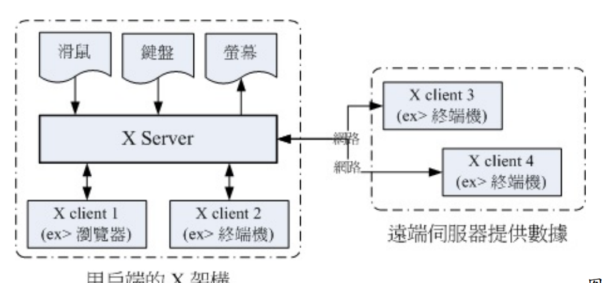

## 18.1什么是 X Window System

### 18.1.1 发展简史

X Window 系统最早是由 MIT （Massachusetts Institute of Technology, 麻省理工学院） 在1984 年发展出来的， 当初 X 就是在 Unix 的 System V 这个操作系统版本上面开发出来的。在开发 X 时，开发者就希望这个窗口接口不要与硬件有强烈的相关性，这是因为如果与硬件的相关性高，那就等于是一个操作系统了， 如此一来的应用性会比较局限。因此 X 在当初就是以应用程序的概念来开发的，而非以操作系统来开发。

主要有以下特点

在 Unix Like 上面的图形使用者接口 （GUI） 被称为 X 或 X11；
X11 是一个“软件”而不是一个操作系统；
X11 是利用网络架构来进行图形接口的执行与绘制；
较著名的 X 版本为 X11R6 这一版，目前大部分的 X 都是这一版演化出来的 （包括
X11R7）；
现在大部分的 distribution 使用的 X 都是由 Xorg 基金会所提供的 X11 软件；
X11 使用的是 MIT 授权，为类似 GPL 的开放源代码授权方式。

### 18.1.2 主要元件 X Server/X Client/Window



X Server：硬件管理、屏幕绘制与提供字体功能：

X Client：负责 X Server 要求的“事件”之处理：

这样做有什么好处啊？最大的好处是， X Client 不需要知道 X Server 的硬件配备与操作系
统！因为 X Client 单纯就是在处理绘图的数据而已，本身是不绘图的。所以，在用户端的 X
Server 用的是什么硬件？用的是哪套操作系统？服务器端的 X Client 根本不需要知道～相当
的先进与优秀～

刚刚前面提到，X Client 的主要工作是将来自 X Server 的数据处理成为绘图数据，再回传给
X server 而已， 所以 X client 本身是不知道他在 X Server 当中的位置、大小以及其他相关信
息的。这也是上面我们谈到的， X client 彼此不知道对方在屏幕的哪个位置啊！为了克服这个问题，因此就有 Window Manager （WM, 窗口管理员） 的产生了。 窗口管理员也是 X client，只是他主要在负责全部 X client 的控管，还包括提供某些特殊的功能，例如：

- 提供许多的控制元素，包括工作列、背景桌面的设置等等；

- 管理虚拟桌面 （virtual desktop）；

- 提供窗口控制参数，这包括窗口的大小、窗口的重叠显示、窗口的移动、窗口的最小化等等。

在 Linux 下面，每套 Window Manager 都是独特存在的，不是换了桌面与显示效果而已， 而是连显示的发动机都不会一样喔！下面是这些常见的窗口管理员全名与链接：

GNOME （GNU Network Object Model Environment）：http://www.gnome.org/
KDE （K Desktop Enviroment）：http://kde.org/
twm （Tab Window Manager）：http://xwinman.org/vtwm.php
XFCE （XForms Common Environment）：http://www.xfce.org/

### 18.1.3 X Window 的启动流程

现在我们知道要启动 X Window System 时，必须要先启动管理硬件与绘图的 X Server ，然
后才载入 X Client 。 基本上，目前都是使用 Window Manager 来管理窗口接口风格的。那么如何取得这样的窗口系统呢？ 你可以通过登陆本机的命令行后，输入 startx 来启动 X 窗口；也能够通过 display manager （如果有启动 graphical.target） 提供的登陆画面，输入你的帐号密码来登陆与取得 X 窗口的！

startx 最重要的任务就是找出使用者或者是系统默认的 X server 与 X client 的配置文件，而使用者也能够使用 startx 外接参数来取代配置文件的内容。这个意思是说：startx 可以直接启动，也能够外接参数，例如下面格式的启动方式：

```bash
[root@study ~]# startx [X client 参数] -- [X server 参数]
# 范例：以色彩深度为 16 bit 启动 X
[root@study ~]# startx -- -depth 16
```

事实上，当 startx 找到需要的设置值后，就调用 xinit 实际启动 X 的。他的语法是：

```bash
[root@study ~]# xinit [client option] -- [server or display option]
```

那为什么不要直接执行 xinit 而是使用 startx 来调用 xinit 呢？这是因为我们必须要取得一些参数嘛！ startx 可以帮我们快速的找到这些参数而不必手动输入的。因为单纯只是执行 xinit 的时候，系统的默认 X Client 与 X Server 的内容是这样的：

```bash
xinit xterm -geometry +1+1 -n login -display :0 -- X :0
```


这部分内容还是很多的，目前暂时用不到，等后续有需求再详细研究！


