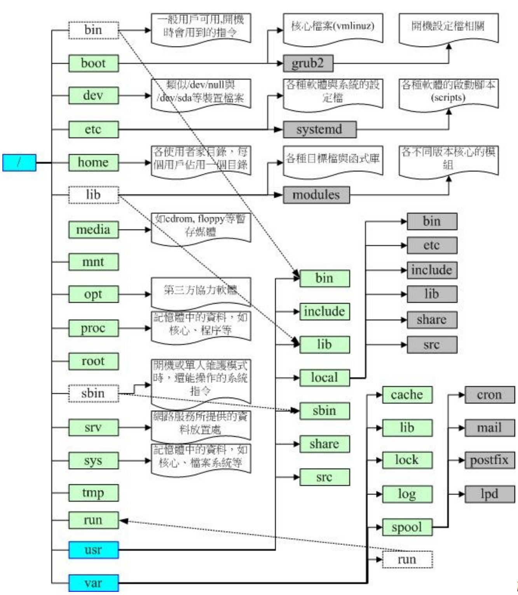
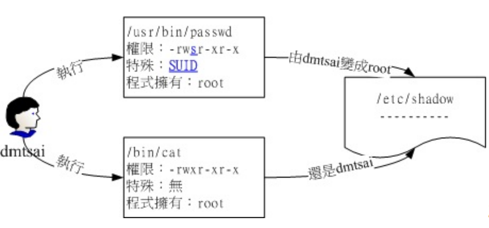

## 2.1 使用者与群组

root相关的信息记录在`/etc/passwd`下

个人密码记录在`etc/shaow`下

群组信息记录在`etc/group`下

## 2.2 文件权限

### 2.2.1 文件属性

使用`su -`来切换为root身份。使用完毕后可以使用`exit`退出root

然后使用`ls -al`可以查看所有的文件，执行的结果如下

```bash
root@dev:~# ls -al
total 36
drwx------  5 root root 4096 Sep 16 08:34 .
drwxr-xr-x 21 root root 4096 Jul 12 08:41 ..
-rw-------  1 root root  163 Jul  2 21:30 .bash_history
-rw-r--r--  1 root root 3106 Dec  5  2019 .bashrc
drwxr-xr-x  3 root root 4096 Sep 15 22:03 .cache
-rw-r--r--  1 root root  161 Dec  5  2019 .profile
drwx------  4 root root 4096 Jul  7 08:25 snap
drwx------  2 root root 4096 Jul  2 09:36 .ssh
-rw-------  1 root root 3222 Sep 16 08:34 .viminfo
```

这几个字段标识如下

```textile
[ 1 ][ 2 ][ 3 ][ 4 ][ 5 ][ 6 ] [ 7 ]
[ 权限 ][链接][拥有者][群组][文件大小][ 修改日期 ] [ 文件名 ]
```

首先我们可以看一下权限，这里总共有10个字符

第一个字符代表这个文件是“目录、文件或链接文件等等”：

- 当为[ d ]则是目录；

- 当为[ - ]则是文件；

- 若是[ l ]则表示为链接文件（link file）；

- 若是[ b ]则表示为设备文件里面的可供储存的周边设备（可随机存取设备）；

- 若是[ c ]则表示为设备文件里面的序列埠设备，例如键盘、鼠标（一次性读取设
  备）。

接下来的字符中，以三个为一组，且均为“rwx” 的三个参数的组合。其中，[ r ]代表可读
（read）、[ w ]代表可写（write）、[ x ]代表可执行（execute）。 要注意的是，这三个
权限的位置不会改变，如果没有权限，就会出现减号[ - ]而已。

- 第一组为“文件拥有者可具备的权限”

- 第二组为“加入此群组之帐号的权限”；

- 第三组为“非本人且没有加入本群组之其他帐号的权限”。

第二栏表示有多少文件名链接到此节点（i-node）

第三栏表示这个文件（或目录）的“拥有者帐号”

第四栏表示这个文件的所属群组

第五栏为这个文件的容量大小，默认单位为Bytes；

第六栏为这个文件的创建日期或者是最近的修改日期，如果这个文件被修改的时间距离现在太久了，那么时间部分会仅显示年份而已

使用`ls -l --full-time`可以显示完整的时间格式

第七栏为这个文件的文件名，如果文件名之前多一个“ . ”，则代表这个文件为“隐藏
文件”

### 2.2.2 改变文件属性

改变权限主要有以下几个命令

- chgrp ：改变文件所属群组
  
  - 直接使用`chgrp xiaoyou test.txt`就可以把group改成xiaoyou了

- chown ：改变文件拥有者
  
  - `chown [-R] 帐号名称 文件或目录`
  
  - 改变拥有者`chown xiaoyou test.txt`
  
  - 可以同时改变拥有者和组`chown xiaoyou:xiaoyou test.txt`

- chmod ：改变文件的权限, SUID, SGID, SBIT等等的特性

前面我们说过，基本权限有9个，然后我们使用如下的数字来代表各个权限

> r:4 > w:2 > x:1

每种身份（owner/group/others）各自的三个权限（r/w/x）分数是需要累加的，例如当权
限为： [-rwxrwx---] 分数则是770，计算规则如下

> owner = rwx = 4+2+1 = 7 
> 
>  group = rwx = 4+2+1 = 7 
> 
>  others= --- = 0+0+0 =0

所以我们可以这样`chmod 777 test.txt`来直接改变权限

除了使用数字，我们还可以使用符号，具体规则如下

```bash
| chmod | u g o a | +（加入） -（除去） =（设置） | r w x | 文件或目录 |
```

比如我们给用户设置读、写、执行权限，然后给group和其他用户设置可读与可执行权限，那么就可以这样做

```bash
chmod u=rwx,go=rx test.txt
```

如果想给每个人都添加写的权限可以这样

```shell
chmod a+w test.txt
```

如果想去掉其他人的权限可以

```shell
chmod a-x test.txt
```

### 2.2.3 目录与文件的权限

文件和目录的权限规则如下，对于文件来说

r （read）：可读取此一文件的实际内容，如读取文本文件的文字内容等；
w （write）：可以编辑、新增或者是修改该文件的内容（但不含删除该文件）；
x （eXecute）：该文件具有可以被系统执行的权限。

> 这个w表示我们只能编辑，不能删除
> 
> 然后linux文件是否可以执行是通过x来判断的，而不是扩展名

对于目录来说

r （read contents in directory）：
表示具有读取目录结构清单的权限，所以当你具有读取（r）一个目录的权限时，表示你
可以查询该目录下的文件名数据。 所以你就可以利用 ls 这个指令将该目录的内容列表显
示出来！

w （modify contents of directory）：
这个可写入的权限对目录来说，是很了不起的！ 因为他表示你具有异动该目录结构清单
的权限，也就是下面这些权限：

- 创建新的文件与目录；

- 删除已经存在的文件与目录（不论该文件的权限为何！）

- 将已存在的文件或目录进行更名；

- 搬移该目录内的文件、目录位置。 总之，目录的w权限就与该目录下面的文件名异
  动有关就对了啦！

x （access directory）：
咦！目录的执行权限有啥用途啊？目录只是记录文件名而已，总不能拿来执行吧？没
错！目录不可以被执行，目录的x代表的是使用者能否进入该目录成为工作目录的用途！
所谓的工作目录（work directory）就是你目前所在的目录啦！

### 2.2.3 文件种类和扩展名

Linux文件主要有以下几种

- 正规文件（regular file ）： 就是一般我们在进行存取的类型的文件，在由 ls -al 所显示出来的属性方面，第一个字符为 [ - ]
  
  - 纯文本文件（ASCII）
  
  - 二进制档（binary）
  
  - 数据格式文件（data）

- 目录（directory）：第一个属性为 [ d ]

- 链接文件（link）就是软链接

- 设备与设备文件（device）： 与系统周边及储存等相关的一些文件， 通常都集中在/dev
  这个目录之下！通常又分为两种：
  
  - 区块（block）设备文件 ：就是一些储存数据， 以提供系统随机存取的周边设备，举例来说，硬盘与软盘，第一个属性为b
  
  - 字符（character）设备文件：亦即是一些序列埠的周边设备， 例如键盘、鼠标等
    等！这些设备的特色就是“一次性读取”的，不能够截断输出。 举例来说，你不可能
    让鼠标“跳到”另一个画面，而是“连续性滑动”到另一个地方啊！第一个属性为 [ c ]

- 数据接口文件（sockets）： 既然被称为数据接口文件， 想当然尔，这种类型的文件通
  常被用在网络上的数据承接了。我们可以启动一个程序来监听用户端的要求， 而用户端
  就可以通过这个socket来进行数据的沟通了。第一个属性为 [ s ]， 最常在/run或/tmp这些个目录中看到这种文件类型了。

- 数据输送档（FIFO, pipe）： FIFO也是一种特殊的文件类型，他主要的目的在解决多个
  程序同时存取一个文件所造成的错误问题。 FIFO是first-in-first-out的缩写。第一个属性为[p] 。

单一文件或目录的最大容许文件名为 255Bytes，以一个 ASCII 英文占用一个 Bytes 来
说，则大约可达 255 个字符长度。若是以每个中文字占用 2Bytes 来说， 最大文件名就
是大约在 128 个中文字之间！

## 2.3 目录配置

### 2.3.1 常见的目录

目前Linux的分级分类大概有以下几种

|     | 可分享的                   | 不可分享的            |
| --- | ---------------------- | ---------------- |
| 不变的 | /usr （软件放置处）           | /etc （配置文件）      |
|     | /opt （第三方协力软件）         | /boot （开机与核心档）   |
| 可变的 | /var/mail （使用者邮件信箱）    | /var/run （程序相关）  |
|     | /var/spool/news （新闻群组） | /var/lock （程序相关） |

主要的三个目录定义如下

/ （root, 根目录）：与开机系统有关；
/usr （unix software resource）：与软件安装/执行有关；
/var （variable）：与系统运行过程有关。

> 根目录是整个系统最重要的一个目录，因为不但所有的目录都是由根目录衍生出来的，同时根目录也与开机/还原/系统修复等动作有关。 由于系统开机时需要特定的开机软件、核心文件、开机所需程序、函数库等等文件数据，若系统出现错误时，根目录也必须要包含有能够修复文件系统的程序才行。 因为根目录是这么的重要，所以在FHS的要求方面，他希望根目录不要放在非常大的分区内， 因为越大的分区你会放入越多的数据，如此一来根目录所在分区就可能会有较多发生错误的机会。

此FHS标准建议：根目录（/）所在分区应该越小越好， 且应用程序所安装的软件最好不要
与根目录放在同一个分区内，保持根目录越小越好。 如此不但性能较佳，根目录所在的文件
系统也较不容易发生问题。

其他一些目录说明如下

| 目录          | 放置的内容                                                                                                                                                                                                                                                                                                                                                                                                       |
| ----------- | ----------------------------------------------------------------------------------------------------------------------------------------------------------------------------------------------------------------------------------------------------------------------------------------------------------------------------------------------------------------------------------------------------------- |
|             | 必须存在的目录                                                                                                                                                                                                                                                                                                                                                                                                     |
| /bin        | 系统有很多放置可执行文件的目录，但/bin比较特殊。因为/bin放置的是在单人维护模式下还能够被操作的指令。 在/bin下面的指令可以被root与一般帐号所使用，主要有：cat, chmod, chown, date, mv, mkdir, cp, bash等等常用的指令。                                                                                                                                                                                                                                                                   |
| /boot       | 这个目录主要在放置开机会使用到的文件，包括Linux核心文件以及开机菜单与开机所需配置文件等等。 Linux kernel常用的文件名为：vmlinuz，如果使用的是grub2这个开机管理程序， 则还会存在/boot/grub2/这个目录喔！                                                                                                                                                                                                                                                                                   |
| /dev        | 在Linux系统上，任何设备与周边设备都是以文件的型态存在于这个目录当中的。 你只要通过存取这个目录下面的某个文件，就等于存取某个设备啰～ 比要重要的文件有/dev/null, /dev/zero, /dev/tty, /dev/loop, /dev/sd等等                                                                                                                                                                                                                                                                          |
| /etc        | 系统主要的配置文件几乎都放置在这个目录内，例如人员的帐号密码档、各种服务的启始档等等。一般来说，这个目录下的各文件属性是可以让一般使用者查阅的， 但是只有root有权力修改。FHS建议不要放置可可执行文件（binary）在这个目录中喔。比较重要的文件有： /etc/modprobe.d/,/etc/passwd, /etc/fstab, /etc/issue 等等。另外 FHS 还规范几个重要的目录最好要存在 /etc/ 目录下喔：/etc/opt（必要）：这个目录在放置第三方协力软件 /opt 的相关配置文件 /etc/X11/（建议）：与 X Window 有关的各种配置文件都在这里，尤其是 xorg.conf 这个 X Server 的配置文件。 /etc/sgml/（建议）：与 SGML 格式有关的各项配置文件 /etc/xml/（建议）：与 XML格式有关的各项配置文件 |
| /lib        | 系统的函数库非常的多，而/lib放置的则是在开机时会用到的函数库， 以及在/bin或/sbin下面的指令会调用的函数库而已。 什么是函数库呢？你可以将他想成是“外挂”，某些指令必须要有这些“外挂”才能够顺利完成程序的执行之意。 另外 FSH 还要求下面的目录必须要存在：/lib/modules/：这个目录主要放置可抽换式的核心相关模块（驱动程序）喔！                                                                                                                                                                                                                            |
| /media      | media是“媒体”的英文，顾名思义，这个/media下面放置的就是可移除的设备啦！ 包括软盘、光盘、DVD等等设备都暂时挂载于此。常见的文件名有：/media/floppy, /media/cdrom等等。                                                                                                                                                                                                                                                                                                    |
| /mnt        | 如果你想要暂时挂载某些额外的设备，一般建议你可以放置到这个目录中。在古早时候，这个目录的用途与/media相同啦！只是有了/media之后，这个目录就用来暂时挂载用了。                                                                                                                                                                                                                                                                                                                        |
| /opt        | 这个是给第三方协力软件放置的目录。什么是第三方协力软件啊？ 举例来说，KDE这个桌面管理系统是一个独立的计划，不过他可以安装到Linux系统中，因此KDE的软件就建议放置到此目录下了。 另外，如果你想要自行安装额外的软件（非原本的distribution提供的），那么也能够将你的软件安装到这里来。 不过，以前的Linux系统中，我们还是习惯放置在/usr/local目录下呢！                                                                                                                                                                                                               |
| /run        | 早期的 FHS 规定系统开机后所产生的各项信息应该要放置到 /var/run 目录下，新版的 FHS 则规范到 /run 下面。 由于 /run 可以使用内存来仿真，因此性能上会好很多！                                                                                                                                                                                                                                                                                                               |
| /sbin       | Linux有非常多指令是用来设置系统环境的，这些指令只有root才能够利用来“设置”系统，其他使用者最多只能用来“查询”而已。 放在/sbin下面的为开机过程中所需要的，里面包括了开机、修复、还原系统所需要的指令。 至于某些服务器软件程序，一般则放置到/usr/sbin/当中。至于本机自行安装的软件所产生的系统可执行文件（system binary）， 则放置到/usr/local/sbin/当中了。常见的指令包括：fdisk, fsck, ifconfig, mkfs等等。                                                                                                                                                            |
| /srv        | srv可以视为“service”的缩写，是一些网络服务启动之后，这些服务所需要取用的数据目录。 常见的服务例如WWW, FTP等等。举例来说，WWW服 务器需要的网页数据就可以放置在/srv/www/里面。 不过，系统的服务数据 如果尚未要提供给网际网络任何人浏览的话，默认还是建议放置到 /var/lib 下面即可。                                                                                                                                                                                                                                             |
| /tmp        | 这是让一般使用者或者是正在执行的程序暂时放置文件的地方。 这个目录 是任何人都能够存取的，所以你需要定期的清理一下。当然，重要数据不可 放置在此目录啊！ 因为FHS甚至建议在开机时，应该要将/tmp下的数据都删除唷！                                                                                                                                                                                                                                                                                                |
| /usr        |                                                                                                                                                                                                                                                                                                                                                                                                             |
| /var        | 主要为放置变动性的数据                                                                                                                                                                                                                                                                                                                                                                                                 |
|             | FHS建议可以存在的目录                                                                                                                                                                                                                                                                                                                                                                                                |
| /home       | 这是系统默认的使用者主文件夹（home directory）。在你新增一个一般使用者帐号时， 默认的使用者主文件夹都会规范到这里来。比较重要的是，主文件夹有两种代号喔：~：代表目前这个使用者的主文件夹 ~dmtsai ：则代表 dmtsai 的主文件夹！                                                                                                                                                                                                                                                                             |
| /lib        | 用来存放与 /lib 不同的格式的二进制函数库，例如支持 64 位的 /lib64 函数库等                                                                                                                                                                                                                                                                                                                                                              |
| /root       | 系统管理员（root）的主文件夹。之所以放在这里，是因为如果进入单人维护模式而仅挂载根目录时， 该目录就能够拥有root的主文件夹，所以我们会希望root的主文件夹与根目录放置在同一个分区中。                                                                                                                                                                                                                                                                                                            |
|             | 其他                                                                                                                                                                                                                                                                                                                                                                                                          |
| /lost+found | 这个目录是使用标准的ext2/ext3/ext4文件系统格式才会产生的一个目录，目的在于当文件系统发生错误时， 将一些遗失的片段放置到这个目录下。不过如果使用的是 xfs 文件系统的话，就不会存在这个目录了                                                                                                                                                                                                                                                                                                     |
| /proc       | 这个目录本身是一个“虚拟文件系统（virtual filesystem）”喔！他放置的数据都是在内存当中， 例如系统核心、行程信息（process）、周边设备的状态及网络状态等等。因为这个目录下的数据都是在内存当中， 所以本身不占任何硬盘空间啊！比较重要的文件例如：/proc/cpuinfo, /proc/dma,/proc/interrupts, /proc/ioports, /proc/net/* 等等。                                                                                                                                                                                              |
| /sys        | 这个目录其实跟/proc非常类似，也是一个虚拟的文件系统，主要也是记录核心与系统硬件信息较相关的信息。 包括目前已载入的核心模块与核心侦测到的硬件设备信息等等。这个目录同样不占硬盘容量喔！                                                                                                                                                                                                                                                                                                              |

这里讲一下user目录

很多读者都会误会/usr为user的缩写，其实usr是Unix Software Resource的缩写， 也就是“Unix操作系统软件资源”所放置的目录，而不是使用者的数据啦！

| 目录              | 放置的文件内容                                                                                                                                                     |
| --------------- | ----------------------------------------------------------------------------------------------------------------------------------------------------------- |
|                 | 第一部份： FHS 要求必须要存在的目录                                                                                                                                        |
| /usr/bin/       | 所有一般用户能够使用的指令都放在这里！目前新的 CentOS 7 已经将全部的使用者指令放置于此，而使用链接文件的方式将 /bin 链接至此！/usr/bin 与 /bin 是一模一样了！另外，FHS 要求在此目录                                                 |
| /usr/lib/       | 基本上，与 /lib 功能相同，所以 /lib 就是链接到此目录中的！                                                                                                                         |
| /usr/local/     | 系统管理员在本机自行安装自己下载的软件（非distribution默认提供者），建议安装到此目录， 这样会比较便于管理。举例来说，你的ibution提供的软件较旧，你想安装较新的软件但又不想移除旧版，安装于/usr/local/目录下，可与原先的旧版软件r/local去看看，该目录下也是具有bin, etc, |
| /usr/sbin/      | 非系统正常运行所需要的系统指令。最常见的就是某些网络服务器软件的服务指令（daemon）啰！不过基本功能与 /sbin 也差不多， 因此目in 就是链接到此目录中的                                                                          |
| /usr/share/     | 主要放置只读架构的数据文件，当然也包括共享文件。在这个目录下放置的数据几乎是不分硬件架构均可读取的数据， 因为几乎都是文字文目录下常见的还有这些次目录：/usr/share/man：线上说明 /user/share/doc：软件杂项的文件说明/usr/share/zoneinfo：与时区有关的时区文件     |
|                 | 第二部份：FHS 建议可以                                                                                                                                               |
| /usr/games/     | 与游戏比较相关的数据放置处                                                                                                                                               |
| /usr/include/   | c/c++等程序语言的文件开始（header）与包含档（include）放置处，当我们以tarball方式 （*.tar.gz 的方式安装软件）安装某些数据时，会的许多包含档喔！                                                                   |
| /usr/libexec/   | 某些不被一般使用者惯用的可执行文件或脚本（script）等等，都会放置在此目录中。例如大部分的 X 窗口下面的操作指令， 很多都是放在                                                                                         |
| /usr/lib<qual>/ | 与 /lib<qual>/功能相同，因此目前 /lib<qual> 就是链接到此目录中                                                                                                                 |
| /usr/src/       | 一般源代码建议放置到这里，src有source的意思。至于核心源代码则建议放置到/usr/src/linux/目录下。                                                                                                 |

然后还有/var目录

如果/usr是安装时会占用较大硬盘容量的目录，那么/var就是在系统运行后才会渐渐占用硬盘容量的目录。 因为/var目录主要针对常态性变动的文件，包括高速缓存（cache）、登录文件（log file）以及某些软件运行所产生的文件， 包括程序文件（lock file, run file），或者例如MySQL数据库的文件等等。

| 目录          | 应放置的文件内容                                                                                                                                                           |
| ----------- | ------------------------------------------------------------------------------------------------------------------------------------------------------------------ |
|             | 第一部份：FHS目录                                                                                                                                                         |
| /var/cache/ | 应用程序本身运行过程中会产生的一些暂存盘；                                                                                                                                              |
| /var/lib/   | 程序本身执行的过程中，需要使用到的数据文件放置的目录。在此目录下各自的软件应该要有各自的目录。 举例来说，MySQL的数据库放置/lib/mysql/而rpm的数据库则放到/var/lib/rpm去！                                                               |
| /var/lock/  | 某些设备或者是文件资源一次只能被一个应用程序所使用，如果同时有两个程序使用该设备时， 就可能产生一些错误的状况，因此就得要将该设备ck），以确保该设备只会给单一软件所使用。 举例来说，烧录机想一下，会不会有两个人同时在使用一个烧录机烧子写入的是谁的数据？所以当第一个人在要该设备被解除锁定（就是前到 /run/lock 中！ |
| /var/log/   | 重要到不行！这是登录文件放置的目录！里面比较重要的文件如/var/log/messages, /var/log/wtmp（记录登陆者的信息）等。                                                                                           |
| /var/mail/  | 放置个人电子邮件信箱的目录，不过这个目录也被放置到/var/spool/mail/目录中！ 通常这两个目录是互为链接文件啦！                                                                                                     |
| /var/run/   | 某些程序或者是服务启动后，会将他们的PID放置在这个目录下喔！至于PID的意义我们会在后续章节提到的。 与 /run 相同，这个目录链接到 /run                                                                                         |
| /var/spool/ | 这个目录通常放置一些伫列数据，所谓的“伫列”就是排队等待其他程序使用的数据啦！ 这些数据被使用后通常都会被删除。举例来说，系统收到新/var/spool/mail/中， 但使用者收下该信件后该封信原则上就会寄不出去会被放到/var/spool/mqueue/中， 等到被数据（crontab），就会被放置           |

### 2.3.2 目录树

整个目录树的架构如下



### 2.3.3 绝对路径与相对路径

- 绝对路径：由根目录（/）开始写起的文件名或目录名称， 例如 /home/dmtsai/.bashrc；

- 相对路径：相对于目前路径的文件名写法。 例如 ./home/dmtsai 或 ../../home/dmtsai/ 等
  等。反正开头不是 / 就属于相对路径的写法

- . ：代表当前的目录，也可以使用 ./ 来表示；

- .. ：代表上一层目录，也可以 ../ 来代表。

### 2.3.4 查看系统信息

```shell
# 查看核心版本
uname -r
# 查看操作系统位数
uname -m 
# 查看更详细的信息
lsb_release -a
```

## 2.4 目录与路径

### 2.4.1 目录相关的操作

Linux有一些特殊的目录，如下

```shell
. 代表此层目录
.. 代表上一层目录
- 代表前一个工作目录
~ 代表“目前使用者身份”所在的主文件夹
~account 代表 account 这个使用者的主文件夹（account是个帐号名称）
```

几个常用的目录指令

```shell
cd：变换目录
pwd：显示目前的目录
mkdir：创建一个新的目录
rmdir：删除一个空的目录
```

主要常用的有以下几个

```shell
# 递归创建文件
mkdir -p test1/test2
# 创建文件的时候手动设置权限
mkdir -m 777 test2
# 递归删除空目录
rmkdir -p test1/test2
```

### 2.4.2 可执行文件的路径变量

当我们在执行一个指令的时候，举例来说“ls”好了，系统会依照PATH的设置去每个PATH定义
的目录下搜寻文件名为ls的可可执行文件， 如果在PATH定义的目录中含有多个文件名为ls的
可可执行文件，那么先搜寻到的同名指令先被执行！

我们可以看一下当前的PATH是啥

```bash
xiaoyou@dev:/tmp$ echo $PATH
/usr/local/lib/nodejs/node-v16.15.1-linux-x64/bin:/usr/local/sbin:/usr/local/bin:/usr/sbin:/usr/bin:/sbin:/bin:/usr/games:/usr/local/games:/snap/bin
```

每个目录都使用:来隔开，我们可以这样手动加入新的目录

```bash
PATH="${PATH}:/root" 
```

## 2.5 文件与目录管理

### 2.5.1 常用命令

ls 命令

```bash
[root@study ~]# ls [--full-time] 文件名或目录名称..
选项与参数：
-a ：全部的文件，连同隐藏文件（ 开头为 . 的文件） 一起列出来（常用）
-A ：全部的文件，连同隐藏文件，但不包括 . 与 .. 这两个目录
-d ：仅列出目录本身，而不是列出目录内的文件数据（常用）
-f ：直接列出结果，而不进行排序 （ls 默认会以文件名排序！）
-F ：根据文件、目录等信息，给予附加数据结构，例如：
*:代表可可执行文件； /:代表目录； =:代表 socket 文件； &#124;:代表 FIFO 文件；
-h ：将文件大小以人类较易读的方式（例如 GB, KB 等等）列出来；
-i ：列出 inode 号码，inode 的意义下一章将会介绍；
-l ：长数据串行出，包含文件的属性与权限等等数据；（常用）
-n ：列出 UID 与 GID 而非使用者与群组的名称 （UID与GID会在帐号管理提到！）
-r ：将排序结果反向输出，例如：原本文件名由小到大，反向则为由大到小；
-R ：连同子目录内容一起列出来，等于该目录下的所有文件都会显示出来；
-S ：以文件大小大小排序，而不是用文件名排序；
-t ：依时间排序，而不是用文件名。
--color=never ：不要依据文件特性给予颜色显示；
--color=always ：显示颜色
--color=auto ：让系统自行依据设置来判断是否给予颜色
--full-time ：以完整时间模式 （包含年、月、日、时、分） 输出
--time={atime,ctime} ：输出 access 时间或改变权限属性时间 （ctime）
而非内容变更时间 （modification time）
```

cp命令

```bash
[root@study ~]# cp [-adfilprsu] 来源文件（source） 目标文件（destination）
[root@study ~]# cp [options] source1 source2 source3 .... directory
选项与参数：
-a ：相当于 -dr --preserve=all 的意思，至于 dr 请参考下列说明；（常用）
-d ：若来源文件为链接文件的属性（link file），则复制链接文件属性而非文件本身；
-f ：为强制（force）的意思，若目标文件已经存在且无法打开，则移除后再尝试一次；
-i ：若目标文件（destination）已经存在时，在覆盖时会先询问动作的进行（常用）
-l ：进行硬式链接（hard link）的链接文件创建，而非复制文件本身；
-p ：连同文件的属性（权限、用户、时间）一起复制过去，而非使用默认属性（备份常用）；
-r ：递回持续复制，用于目录的复制行为；（常用）
-s ：复制成为符号链接文件 （symbolic link），亦即“捷径”文件；
-u ：destination 比 source 旧才更新 destination，或 destination 不存在的情况下才复制。
--preserve=all ：除了 -p 的权限相关参数外，还加入 SELinux 的属性, links, xattr 等也复制了。
最后需要注意的，如果来源文件有两个以上，则最后一个目的文件一定要是“目录”才行！
```

 -r 是可以复制目录，但是，文件与目录的权限可能会被改变。所以，也可以利用“ cp -a /etc /tmp ”来下达指令喔！尤其是在备份的情况下！

如果要复制多个文件到同一个目录可以

```bash
#将主文件夹的 .bashrc 及 .bash_history 复制到 /tmp 下面
cp ~/.bashrc ~/.bash_history /tmp
```

rm命令

```bash
[root@study ~]# rm [-fir] 文件或目录
选项与参数：
-f ：就是 force 的意思，忽略不存在的文件，不会出现警告讯息；
-i ：互动模式，在删除前会询问使用者是否动作
-r ：递回删除啊！最常用在目录的删除了！这是非常危险的选项！！！
```

mv命令

```bash
[root@study ~]# mv [-fiu] source destination
[root@study ~]# mv [options] source1 source2 source3 .... directory
选项与参数：
-f ：force 强制的意思，如果目标文件已经存在，不会询问而直接覆盖；
-i ：若目标文件 （destination） 已经存在时，就会询问是否覆盖！
-u ：若目标文件已经存在，且 source 比较新，才会更新 （update）

# 把多个文件移动到一个目录如果有多个来源文件或目录，则最后一个目标文件一定是“目录！”
# 意思是说，将所有的数据移动到该目录的意思！
mv bashrc1 bashrc2 mvtest2
```

获取路径名称与目录名称

```bash
xiaoyou@dev:/tmp$ basename /etc/sysconfig/network
network # 很简单！就取得最后的文件名～
xiaoyou@dev:/tmp$ dirname /etc/sysconfig/network
/etc/sysconfig # 取得的变成目录名了！
```

## 2.6 文件内容查询

主要有以下几个常用的

- cat 由第一行开始显示文件内容

- tac 从最后一行开始显示，可以看出 tac 是 cat 的倒着写！

- nl 显示的时候，顺道输出行号！

- more 一页一页的显示文件内容

- less 与 more 类似，但是比 more 更好的是，他可以往前翻页！

- head 只看头几行

- tail 只看尾巴几行

- od 以二进制的方式读取文件内容！
  
  下面简单介绍一下这些命令的用法

cat

```bash
[root@study ~]# cat [-AbEnTv]
选项与参数：
-A ：相当于 -vET 的整合选项，可列出一些特殊字符而不是空白而已；
-b ：列出行号，仅针对非空白行做行号显示，空白行不标行号！
-E ：将结尾的断行字符 $ 显示出来；
-n ：打印出行号，连同空白行也会有行号，与 -b 的选项不同；
-T ：将 [tab] 按键以 ^I 显示出来；
-v ：列出一些看不出来的特殊字符
```

tac是反向显示和cat刚好相反

nl是添加行号打印、和cat不一样，可以用于行数较多的情况下打印

```bash
[root@study ~]# nl [-bnw] 文件
选项与参数：
-b ：指定行号指定的方式，主要有两种：
-b a ：表示不论是否为空行，也同样列出行号（类似 cat -n）；
-b t ：如果有空行，空的那一行不要列出行号（默认值）；
-n ：列出行号表示的方法，主要有三种：
-n ln ：行号在屏幕的最左方显示；
-n rn ：行号在自己字段的最右方显示，且不加 0 ；
-n rz ：行号在自己字段的最右方显示，且加 0 ；
-w ：行号字段的占用的字符数。
```

more 可以翻页查看

```bash
more /etc/manpath.config
# 主要有以下几个快捷键
空白键 （space）：代表向下翻一页；
Enter ：代表向下翻“一行”；
/字串 ：代表在这个显示的内容当中，向下搜寻“字串”这个关键字；
:f ：立刻显示出文件名以及目前显示的行数；
q ：代表立刻离开 more ，不再显示该文件内容。
b 或 [ctrl]-b ：代表往回翻页，不过这动作只对文件有用，对管线无用。
```

less可以一页一页的翻动，用法如下

```bash
less /etc/manpath.config
# 常用快捷键
空白键 ：向下翻动一页；
鸟哥的 Linux 私房菜：基础学习篇 第四版
6.3 文件内容查阅 312
[pagedown]：向下翻动一页；
[pageup] ：向上翻动一页；
/字串 ：向下搜寻“字串”的功能；
?字串 ：向上搜寻“字串”的功能；
n ：重复前一个搜寻 （与 / 或 ? 有关！）
N ：反向的重复前一个搜寻 （与 / 或 ? 有关！）
g ：前进到这个数据的第一行去；
G ：前进到这个数据的最后一行去 （注意大小写）；
q ：离开 less 这个程序；
```

head用于只获取某几行

```bash
[root@study ~]# head [-n number] 文件
选项与参数：
-n ：后面接数字，代表显示几行的意思
```

tail获取后面几行

```bash
[root@study ~]# tail [-n number] 文件
选项与参数：
-n ：后面接数字，代表显示几行的意思
-f ：表示持续侦测后面所接的文件名，要等到按下[ctrl]-c才会结束tail的侦测
```

可以使用od查看非文本文件

```bash
[root@study ~]# od [-t TYPE] 文件
选项或参数：
-t ：后面可以接各种“类型 （TYPE）”的输出，例如：
a ：利用默认的字符来输出；
c ：使用 ASCII 字符来输出
d[size] ：利用十进制（decimal）来输出数据，每个整数占用 size Bytes ；
f[size] ：利用浮点数值（floating）来输出数据，每个数占用 size Bytes ；
o[size] ：利用八进位（octal）来输出数据，每个整数占用 size Bytes ；
x[size] ：利用十六进制（hexadecimal）来输出数据，每个整数占用 size Bytes ；
```

修改文件时间或者创建新文件

```bash
[root@study ~]# touch [-acdmt] 文件
选项与参数：
-a ：仅修订 access time；
-c ：仅修改文件的时间，若该文件不存在则不创建新文件；
-d ：后面可以接欲修订的日期而不用目前的日期，也可以使用 --date="日期或时间"
-m ：仅修改 mtime ；
-t ：后面可以接欲修订的时间而不用目前的时间，格式为[YYYYMMDDhhmm]
```

一些常用的命令，这些时间改变的都是mtime

```bash
# 修改文件的时间为2天前
touch -d "2 days ago" bashrc
# 手动修改时间
touch -t 201406150202 bashrc
```

## 2.7 默认权限与隐藏权限

### 2.7.1 文件默认权限

```bash
# 查看当前的权限
xiaoyou@dev:/tmp$ umask
0002
# 
xiaoyou@dev:/tmp$ umask -S
u=rwx,g=rwx,o=rx
```

要注意的是，umask 的分数指的是“该默认值需要减掉的权限！”因为 r、w、x 分别是 4、2、1 分，所以啰！也就是说，当要拿掉能写的权限，就是输入 2 分，而如果要拿掉能读的权
限，也就是 4 分，那么要拿掉读与写的权限，也就是 6 分，而要拿掉执行与写入的权限，也
就是 3 分

如果想设置umask内容可以`umask 002`

### 2.7.2 文件隐藏属性

```bash
[root@study ~]# chattr [+-=][ASacdistu] 文件或目录名称
选项与参数：
+ ：增加某一个特殊参数，其他原本存在参数则不动。
- ：移除某一个特殊参数，其他原本存在参数则不动。
= ：设置一定，且仅有后面接的参数
A ：当设置了 A 这个属性时，若你有存取此文件（或目录）时，他的存取时间 atime 将不会被修改，
可避免 I/O 较慢的机器过度的存取磁盘。（目前建议使用文件系统挂载参数处理这个项目）
S ：一般文件是非同步写入磁盘的（原理请参考[前一章sync](../Text/index.html#sync)的说明），如果加上 S 这个属性时，
当你进行任何文件的修改，该更动会“同步”写入磁盘中。
a ：当设置 a 之后，这个文件将只能增加数据，而不能删除也不能修改数据，只有root 才能设置这属性
c ：这个属性设置之后，将会自动的将此文件“压缩”，在读取的时候将会自动解压缩，
但是在储存的时候，将会先进行压缩后再储存（看来对于大文件似乎蛮有用的！）
d ：当 dump 程序被执行的时候，设置 d 属性将可使该文件（或目录）不会被 dump 备份
i ：这个 i 可就很厉害了！他可以让一个文件“不能被删除、改名、设置链接也无法写入或新增数据！”
对于系统安全性有相当大的助益！只有 root 能设置此属性
s ：当文件设置了 s 属性时，如果这个文件被删除，他将会被完全的移除出这个硬盘空间，
所以如果误删了，完全无法救回来了喔！
u ：与 s 相反的，当使用 u 来设置文件时，如果该文件被删除了，则数据内容其实还存在磁盘中，
可以使用来救援该文件喔！
注意1：属性设置常见的是 a 与 i 的设置值，而且很多设置值必须要身为 root 才能设置
注意2：xfs 文件系统仅支持 AadiS 而已
```

比如这样

```bash
# 我们给文件添加一个特殊权限，无法删除
root@dev:/tmp# chattr +i attrtest 
root@dev:/tmp# rm attrtest 
rm: cannot remove 'attrtest': Operation not permitted
# 那么如何解除呢
root@dev:/tmp# chattr -i attrtest 
root@dev:/tmp# rm attrtest 
```

使用lsattr查看隐藏文件属性

```bash
[root@study ~]# lsattr [-adR] 文件或目录
选项与参数：
-a ：将隐藏文件的属性也秀出来；
-d ：如果接的是目录，仅列出目录本身的属性而非目录内的文件名；
-R ：连同子目录的数据也一并列出来！
[root@study tmp]# chattr +aiS attrtest
[root@study tmp]# lsattr attrtest
--S-ia---------- attrtest
```

### 2.7.3 文件特殊权限

主要是SUID, SGID, SBIT三个

当 s 这个标志出现在文件拥有者的 x 权限上时，例如刚刚提到的 /usr/bin/passwd 这个文件的权限状态：“-rwsr-xr-x”，此时就被称为 Set UID，简称为 SUID 的特殊权限。 那么SUID的权限对于一个文件的特殊功能是什么呢？基本上SUID有这样的限制与功能：

- SUID 权限仅对二进制程序（binary program）有效；

- 执行者对于该程序需要具有 x 的可执行权限；

- 本权限仅在执行该程序的过程中有效 （run-time）；

- 执行者将具有该程序拥有者 （owner） 的权限。

> 在 /etc/shadow这个文件的权限是root，所以普通用户无法修改，但是我们却可以修改自己的密码，因为passwd这个命令可以暂时获得root权限，这个程序就可以修改了，但是cat这个命令没有特殊权限，所以我们无法查看密码



当 s 标志在文件拥有者的 x 项目为 SUID，那 s 在群组的 x 时则称为 Set GID, SGID 啰！是
这样没错！^_^。 举例来说，你可以用下面的指令来观察到具有 SGID 权限的文件喔``

```bash
[root@study ~]# ls -l /usr/bin/locate
-rwx--s--x. 1 root slocate 40496 Jun 10 2014 /usr/bin/locate
```

与 SUID 非常的类似，若我使用 dmtsai 这个帐号去执行 locate 时，那 dmtsai 将会取得
slocate 群组的支持， 因此就能够去读取 mlocate.db 啦！非常有趣吧！
除了 binary program 之外，事实上 SGID 也能够用在目录上，这也是非常常见的一种用途！
当一个目录设置了 SGID 的权限后，他将具有如下的功能：

- 使用者若对于此目录具有 r 与 x 的权限时，该使用者能够进入此目录；

- 使用者在此目录下的有效群组（effective group）将会变成该目录的群组；

- 用途：若使用者在此目录下具有 w 的权限（可以新建文件），则使用者所创建的新文
  件，该新文件的群组与此目录的群组相同。

Sticky Bit
这个 Sticky Bit, SBIT 目前只针对目录有效，对于文件已经没有效果了。SBIT 对于目录的作用
是：

- 当使用者对于此目录具有 w, x 权限，亦即具有写入的权限时；

- 当使用者在该目录下创建文件或目录时，仅有自己与 root 才有权力删除该文件

换句话说：当甲这个使用者于 A 目录是具有群组或其他人的身份，并且拥有该目录 w 的权限， 这表示“甲使用者对该目录内任何人创建的目录或文件均可进行 "删除/更名/搬移" 等动作。” 不过，如果将 A 目录加上了 SBIT 的权限项目时， 则甲只能够针对自己创建的文件或目录进行删除/更名/移动等动作，而无法删除他人的文件。

前面介绍过 SUID 与 SGID 的功能，那么如何设置文件使成为具有 SUID 与 SGID 的权限呢？
这就需要第五章的数字更改权限的方法了！ 现在你应该已经知道数字体态更改权限的方式
为“三个数字”的组合， 那么如果在这三个数字之前再加上一个数字的话，最前面的那个数字
就代表这几个权限了！

- 4 为 SUID

- 2 为 SGID

- 1 为 SBIT

假设要将一个文件权限改为“-rwsr-xr-x”时，由于 s 在使用者权限中，所以是 SUID ，因此，
在原先的 755 之前还要加上 4 ，也就是：“ chmod 4755 filename ”来设置！此外，还有大 S
与大 T 的产生喔！参考下面的范例啦！

```bash
[root@study ~]# cd /tmp
[root@study tmp]# touch test #创建一个测试用空档
[root@study tmp]# chmod 4755 test; ls -l test #加入具有 SUID 的权限
-rwsr-xr-x 1 root root 0 Jun 16 02:53 test
[root@study tmp]# chmod 6755 test; ls -l test #加入具有 SUID/SGID 的权限
-rwsr-sr-x 1 root root 0 Jun 16 02:53 test
[root@study tmp]# chmod 1755 test; ls -l test #加入 SBIT 的功能！
-rwxr-xr-t 1 root root 0 Jun 16 02:53 test
[root@study tmp]# chmod 7666 test; ls -l test #具有空的 SUID/SGID 权限
-rwSrwSrwT 1 root root 0 Jun 16 02:53 test
```

### 2.7.4 查看文件的类型

```bash
root@dev:/tmp# file ~/.bashrc 
/root/.bashrc: ASCII text
# 可执行文件的数据可就多的不得了！包括这个文件的 suid 权限、相容于 Intel x86-64 等级的硬件平台
# 使用的是 Linux 核心 2.6.32 的动态函数库链接等等。
root@dev:/tmp# file /usr/bin/passwd
/usr/bin/passwd: setuid ELF 64-bit LSB shared object, x86-64, version 1 (SYSV), dynamically linked, interpreter /lib64/ld-linux-x86-64.so.2, BuildID[sha1]=6af93256cb810d90b2f96fc052b05b43b954f5b2, for GNU/Linux 3.2.0, stripped
# 查看数据库文件
root@dev:/tmp# file /var/lib/mlocate/mlocate.db 
/var/lib/mlocate/mlocate.db: mlocate database, version 0, require visibility, root /
```

## 2.8 文件搜索

### 2.8.1 指令文件搜索

```bash
[root@study ~]# which [-a] command
选项或参数：
-a ：将所有由 PATH 目录中可以找到的指令均列出，而不止第一个被找到的指令名称
范例一：搜寻 ifconfig 这个指令的完整文件名
[root@study ~]# which ifconfig
/sbin/ifconfig
```

> history 这个常用的指令找不到！为什么呢？这是因为history 是“bash 内置的指令”啦！ 但是 which 默认是找 PATH 内所规范的目录，所以当然一定找不到的啊（有 bash 就有 history！）

### 2.8.2 文件名搜索

whereis 只找系统中某些特定目录下面的文件而已

```bash
[root@study ~]# whereis [-bmsu] 文件或目录名
选项与参数：
-l :可以列出 whereis 会去查询的几个主要目录而已
-b :只找 binary 格式的文件
-m :只找在说明文档 manual 路径下的文件
-s :只找 source 来源文件
-u :搜寻不在上述三个项目当中的其他特殊文件
范例一：请找出 ifconfig 这个文件名
[root@study ~]# whereis ifconfig
ifconfig: /sbin/ifconfig /usr/share/man/man8/ifconfig.8.gz
```

locate是从数据库中取查找的

```bash
[root@study ~]# locate [-ir] keyword
选项与参数：
-i ：忽略大小写的差异；
-c ：不输出文件名，仅计算找到的文件数量
-l ：仅输出几行的意思，例如输出五行则是 -l 5
-S ：输出 locate 所使用的数据库文件的相关信息，包括该数据库纪录的文件/目录数量等
-r ：后面可接正则表达式的显示方式
范例一：找出系统中所有与 passwd 相关的文件名，且只列出 5 个
[root@study ~]# locate -l 5 passwd
/etc/passwd
/etc/passwd-
/etc/pam.d/passwd
/etc/security/opasswd
/usr/bin/gpasswd
```

locate 寻找的数据是由“已创建的数据库 /var/lib/mlocate/” 里面的数据所搜寻到的，所以不用直接在去硬盘当中存取数据，呵呵！当然是很快速啰！
那么有什么限制呢？就是因为他是经由数据库来搜寻的，而数据库的创建默认是在每天执行
一次 （每个 distribution 都不同，CentOS 7.x 是每天更新数据库一次！），所以当你新创建
起来的文件， 却还在数据库更新之前搜寻该文件，那么 locate 会告诉你“找不到！”呵呵！因
为必须要更新数据库呀！

那能否手动更新数据库哪？当然可以啊！更新 locate 数据库的方法非常简单，直接输入“
updatedb ”就可以了！ updatedb 指令会去读取 /etc/updatedb.conf 这个配置文件的设置，然后再去硬盘里面进行搜寻文件名的动作， 最后就更新整个数据库文件啰！因为 updatedb 会去搜寻硬盘，所以当你执行 updatedb 时，可能会等待数分钟的时间喔！

最后就是最强大的find命令了

```bash
[root@study ~]# find [PATH] [option] [action]
选项与参数：
1\. 与时间有关的选项：共有 -atime, -ctime 与 -mtime ，以 -mtime 说明
-mtime n ：n 为数字，意义为在 n 天之前的“一天之内”被更动过内容的文件；
-mtime +n ：列出在 n 天之前（不含 n 天本身）被更动过内容的文件文件名；
-mtime -n ：列出在 n 天之内（含 n 天本身）被更动过内容的文件文件名。
-newer file ：file 为一个存在的文件，列出比 file 还要新的文件文件名
范例一：将过去系统上面 24 小时内有更动过内容 （mtime） 的文件列出
[root@study ~]# find / -mtime 0
# 那个 0 是重点！0 代表目前的时间，所以，从现在开始到 24 小时前，
# 有变动过内容的文件都会被列出来！那如果是三天前的 24 小时内？
# find / -mtime 3 有变动过的文件都被列出的意思！
```

```bash
# 范例二：寻找 /etc 下面的文件，如果文件日期比 /etc/passwd 新就列出
[root@study ~]# find /etc -newer /etc/passwd
# -newer 用在分辨两个文件之间的新旧关系是很有用的！
```

find还有与群组有关的参数，具体如下

```bash
2\. 与使用者或群组名称有关的参数：
-uid n ：n 为数字，这个数字是使用者的帐号 ID，亦即 UID ，这个 UID 是记录在
/etc/passwd 里面与帐号名称对应的数字。这方面我们会在第四篇介绍。
-gid n ：n 为数字，这个数字是群组名称的 ID，亦即 GID，这个 GID 记录在
/etc/group，相关的介绍我们会第四篇说明～
-user name ：name 为使用者帐号名称喔！例如 dmtsai
-group name：name 为群组名称喔，例如 users ；
-nouser ：寻找文件的拥有者不存在 /etc/passwd 的人！
-nogroup ：寻找文件的拥有群组不存在于 /etc/group 的文件！
当你自行安装软件时，很可能该软件的属性当中并没有文件拥有者，
这是可能的！在这个时候，就可以使用 -nouser 与 -nogroup 搜寻。
范例三：搜寻 /home 下面属于 dmtsai 的文件
[root@study ~]# find /home -user dmtsai
# 这个东西也很有用的～当我们要找出任何一个使用者在系统当中的所有文件时，
# 就可以利用这个指令将属于某个使用者的所有文件都找出来喔！
范例四：搜寻系统中不属于任何人的文件
[root@study ~]# find / -nouser
# 通过这个指令，可以轻易的就找出那些不太正常的文件。如果有找到不属于系统任何人的文件时，
# 不要太紧张，那有时候是正常的～尤其是你曾经以源代码自行编译软件时。
```

然后还有与文件有关的参数

```bash
选项与参数：
3\. 与文件权限及名称有关的参数：
-name filename：搜寻文件名称为 filename 的文件；
-size [+-]SIZE：搜寻比 SIZE 还要大（+）或小（-）的文件。这个 SIZE 的规格有：
c: 代表 Byte， k: 代表 1024Bytes。所以，要找比 50KB
还要大的文件，就是“ -size +50k ”
-type TYPE ：搜寻文件的类型为 TYPE 的，类型主要有：一般正规文件 （f）, 设备文件 （b, c）,
目录 （d）, 链接文件 （l）, socket （s）, 及 FIFO （p） 等属性。
-perm mode ：搜寻文件权限“刚好等于” mode 的文件，这个 mode 为类似 chmod
的属性值，举例来说， -rwsr-xr-x 的属性为 4755 ！
-perm -mode ：搜寻文件权限“必须要全部囊括 mode 的权限”的文件，举例来说，
我们要搜寻 -rwxr--r-- ，亦即 0744 的文件，使用 -perm -0744，
当一个文件的权限为 -rwsr-xr-x ，亦即 4755 时，也会被列出来，
因为 -rwsr-xr-x 的属性已经囊括了 -rwxr--r-- 的属性了。
-perm /mode ：搜寻文件权限“包含任一 mode 的权限”的文件，举例来说，我们搜寻
-rwxr-xr-x ，亦即 -perm /755 时，但一个文件属性为 -rw-------
也会被列出来，因为他有 -rw.... 的属性存在！
范例五：找出文件名为 passwd 这个文件
[root@study ~]# find / -name passwd
范例五-1：找出文件名包含了 passwd 这个关键字的文件
[root@study ~]# find / -name "*passwd*"
# 利用这个 -name 可以搜寻文件名啊！默认是完整文件名，如果想要找关键字，
# 可以使用类似 * 的任意字符来处理
范例六：找出 /run 目录下，文件类型为 Socket 的文件名有哪些？
[root@study ~]# find /run -type s
# 这个 -type 的属性也很有帮助喔！尤其是要找出那些怪异的文件，
# 例如 socket 与 FIFO 文件，可以用 find /run -type p 或 -type s 来找！
范例七：搜寻文件当中含有 SGID 或 SUID 或 SBIT 的属性
[root@study ~]# find / -perm /7000
# 所谓的 7000 就是 ---s--s--t ，那么只要含有 s 或 t 的就列出，所以当然要使用 /7000，
# 使用 -7000 表示要同时含有 ---s--s--t 的所有三个权限。而只需要任意一个，就是 /7000 
```

find还有一些特殊的功能

```bash
选项与参数：
4\. 额外可进行的动作：
-exec command ：command 为其他指令，-exec 后面可再接额外的指令来处理搜寻到的结果。
-print ：将结果打印到屏幕上，这个动作是默认动作！
范例八：将上个范例找到的文件使用 ls -l 列出来～
[root@study ~]# find /usr/bin /usr/sbin -perm /7000 -exec ls -l {} \;
# 注意到，那个 -exec 后面的 ls -l 就是额外的指令，指令不支持命令别名，
# 所以仅能使用 ls -l 不可以使用 ll 喔！注意注意！
范例九：找出系统中，大于 1MB 的文件
[root@study ~]# find / -size +1M
```

我们还可以使用通配符进行匹配`find /etc -name '*httpd*'`
