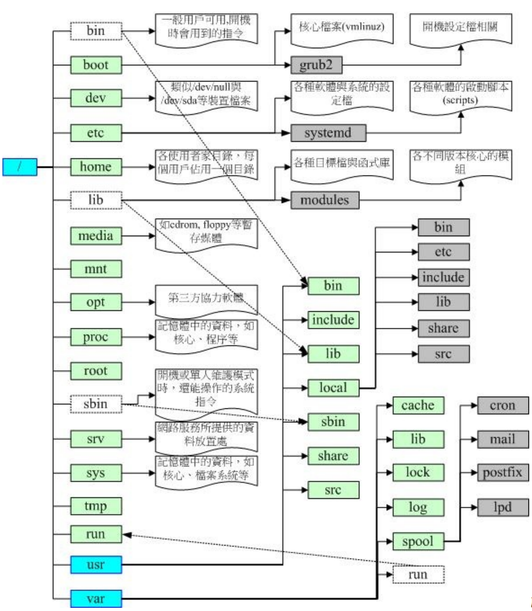

## 2.1 使用者与群组

root相关的信息记录在`/etc/passwd`下

个人密码记录在`etc/shaow`下

群组信息记录在`etc/group`下

## 2.2 文件权限

### 2.2.1 文件属性

使用`su -`来切换为root身份。使用完毕后可以使用`exit`退出root

然后使用`ls -al`可以查看所有的文件，执行的结果如下

```bash
root@dev:~# ls -al
total 36
drwx------  5 root root 4096 Sep 16 08:34 .
drwxr-xr-x 21 root root 4096 Jul 12 08:41 ..
-rw-------  1 root root  163 Jul  2 21:30 .bash_history
-rw-r--r--  1 root root 3106 Dec  5  2019 .bashrc
drwxr-xr-x  3 root root 4096 Sep 15 22:03 .cache
-rw-r--r--  1 root root  161 Dec  5  2019 .profile
drwx------  4 root root 4096 Jul  7 08:25 snap
drwx------  2 root root 4096 Jul  2 09:36 .ssh
-rw-------  1 root root 3222 Sep 16 08:34 .viminfo
```

这几个字段标识如下

```textile
[ 1 ][ 2 ][ 3 ][ 4 ][ 5 ][ 6 ] [ 7 ]
[ 权限 ][链接][拥有者][群组][文件大小][ 修改日期 ] [ 文件名 ]
```

首先我们可以看一下权限，这里总共有10个字符

第一个字符代表这个文件是“目录、文件或链接文件等等”：

- 当为[ d ]则是目录；

- 当为[ - ]则是文件；

- 若是[ l ]则表示为链接文件（link file）；

- 若是[ b ]则表示为设备文件里面的可供储存的周边设备（可随机存取设备）；

- 若是[ c ]则表示为设备文件里面的序列埠设备，例如键盘、鼠标（一次性读取设
  备）。

接下来的字符中，以三个为一组，且均为“rwx” 的三个参数的组合。其中，[ r ]代表可读
（read）、[ w ]代表可写（write）、[ x ]代表可执行（execute）。 要注意的是，这三个
权限的位置不会改变，如果没有权限，就会出现减号[ - ]而已。

- 第一组为“文件拥有者可具备的权限”

- 第二组为“加入此群组之帐号的权限”；

- 第三组为“非本人且没有加入本群组之其他帐号的权限”。

第二栏表示有多少文件名链接到此节点（i-node）

第三栏表示这个文件（或目录）的“拥有者帐号”

第四栏表示这个文件的所属群组

第五栏为这个文件的容量大小，默认单位为Bytes；

第六栏为这个文件的创建日期或者是最近的修改日期，如果这个文件被修改的时间距离现在太久了，那么时间部分会仅显示年份而已

使用`ls -l --full-time`可以显示完整的时间格式

第七栏为这个文件的文件名，如果文件名之前多一个“ . ”，则代表这个文件为“隐藏
文件”

### 2.2.2 改变文件属性

改变权限主要有以下几个命令

- chgrp ：改变文件所属群组
  
  - 直接使用`chgrp xiaoyou test.txt`就可以把group改成xiaoyou了

- chown ：改变文件拥有者
  
  - `chown [-R] 帐号名称 文件或目录`
  
  - 改变拥有者`chown xiaoyou test.txt`
  
  - 可以同时改变拥有者和组`chown xiaoyou:xiaoyou test.txt`

- chmod ：改变文件的权限, SUID, SGID, SBIT等等的特性

前面我们说过，基本权限有9个，然后我们使用如下的数字来代表各个权限

> r:4 > w:2 > x:1

每种身份（owner/group/others）各自的三个权限（r/w/x）分数是需要累加的，例如当权
限为： [-rwxrwx---] 分数则是770，计算规则如下

> owner = rwx = 4+2+1 = 7 
> 
>  group = rwx = 4+2+1 = 7 
> 
>  others= --- = 0+0+0 =0

所以我们可以这样`chmod 777 test.txt`来直接改变权限

除了使用数字，我们还可以使用符号，具体规则如下

```bash
| chmod | u g o a | +（加入） -（除去） =（设置） | r w x | 文件或目录 |
```

比如我们给用户设置读、写、执行权限，然后给group和其他用户设置可读与可执行权限，那么就可以这样做

```bash
chmod u=rwx,go=rx test.txt
```

如果想给每个人都添加写的权限可以这样

```shell
chmod a+w test.txt
```

如果想去掉其他人的权限可以

```shell
chmod a-x test.txt
```

### 2.2.3 目录与文件的权限

文件和目录的权限规则如下，对于文件来说

r （read）：可读取此一文件的实际内容，如读取文本文件的文字内容等；
w （write）：可以编辑、新增或者是修改该文件的内容（但不含删除该文件）；
x （eXecute）：该文件具有可以被系统执行的权限。

> 这个w表示我们只能编辑，不能删除
> 
> 然后linux文件是否可以执行是通过x来判断的，而不是扩展名

对于目录来说

r （read contents in directory）：
表示具有读取目录结构清单的权限，所以当你具有读取（r）一个目录的权限时，表示你
可以查询该目录下的文件名数据。 所以你就可以利用 ls 这个指令将该目录的内容列表显
示出来！

w （modify contents of directory）：
这个可写入的权限对目录来说，是很了不起的！ 因为他表示你具有异动该目录结构清单
的权限，也就是下面这些权限：

- 创建新的文件与目录；

- 删除已经存在的文件与目录（不论该文件的权限为何！）

- 将已存在的文件或目录进行更名；

- 搬移该目录内的文件、目录位置。 总之，目录的w权限就与该目录下面的文件名异
  动有关就对了啦！

x （access directory）：
咦！目录的执行权限有啥用途啊？目录只是记录文件名而已，总不能拿来执行吧？没
错！目录不可以被执行，目录的x代表的是使用者能否进入该目录成为工作目录的用途！
所谓的工作目录（work directory）就是你目前所在的目录啦！

### 2.2.3 文件种类和扩展名

Linux文件主要有以下几种

- 正规文件（regular file ）： 就是一般我们在进行存取的类型的文件，在由 ls -al 所显示出来的属性方面，第一个字符为 [ - ]
  
  - 纯文本文件（ASCII）
  
  - 二进制档（binary）
  
  - 数据格式文件（data）

- 目录（directory）：第一个属性为 [ d ]

- 链接文件（link）就是软链接

- 设备与设备文件（device）： 与系统周边及储存等相关的一些文件， 通常都集中在/dev
  这个目录之下！通常又分为两种：
  
  - 区块（block）设备文件 ：就是一些储存数据， 以提供系统随机存取的周边设备，举例来说，硬盘与软盘，第一个属性为b
  
  - 字符（character）设备文件：亦即是一些序列埠的周边设备， 例如键盘、鼠标等
    等！这些设备的特色就是“一次性读取”的，不能够截断输出。 举例来说，你不可能
    让鼠标“跳到”另一个画面，而是“连续性滑动”到另一个地方啊！第一个属性为 [ c ]

- 数据接口文件（sockets）： 既然被称为数据接口文件， 想当然尔，这种类型的文件通
  常被用在网络上的数据承接了。我们可以启动一个程序来监听用户端的要求， 而用户端
  就可以通过这个socket来进行数据的沟通了。第一个属性为 [ s ]， 最常在/run或/tmp这些个目录中看到这种文件类型了。

- 数据输送档（FIFO, pipe）： FIFO也是一种特殊的文件类型，他主要的目的在解决多个
  程序同时存取一个文件所造成的错误问题。 FIFO是first-in-first-out的缩写。第一个属性为[p] 。

单一文件或目录的最大容许文件名为 255Bytes，以一个 ASCII 英文占用一个 Bytes 来
说，则大约可达 255 个字符长度。若是以每个中文字占用 2Bytes 来说， 最大文件名就
是大约在 128 个中文字之间！

## 2.3 目录配置

### 2.3.1 常见的目录

目前Linux的分级分类大概有以下几种

|     | 可分享的                   | 不可分享的            |
| --- | ---------------------- | ---------------- |
| 不变的 | /usr （软件放置处）           | /etc （配置文件）      |
|     | /opt （第三方协力软件）         | /boot （开机与核心档）   |
| 可变的 | /var/mail （使用者邮件信箱）    | /var/run （程序相关）  |
|     | /var/spool/news （新闻群组） | /var/lock （程序相关） |

主要的三个目录定义如下

/ （root, 根目录）：与开机系统有关；
/usr （unix software resource）：与软件安装/执行有关；
/var （variable）：与系统运行过程有关。

> 根目录是整个系统最重要的一个目录，因为不但所有的目录都是由根目录衍生出来的，同时根目录也与开机/还原/系统修复等动作有关。 由于系统开机时需要特定的开机软件、核心文件、开机所需程序、函数库等等文件数据，若系统出现错误时，根目录也必须要包含有能够修复文件系统的程序才行。 因为根目录是这么的重要，所以在FHS的要求方面，他希望根目录不要放在非常大的分区内， 因为越大的分区你会放入越多的数据，如此一来根目录所在分区就可能会有较多发生错误的机会。

此FHS标准建议：根目录（/）所在分区应该越小越好， 且应用程序所安装的软件最好不要
与根目录放在同一个分区内，保持根目录越小越好。 如此不但性能较佳，根目录所在的文件
系统也较不容易发生问题。

其他一些目录说明如下

| 目录          | 放置的内容                                                                                                                                                                                                                                                                                                                                                                                                       |
| ----------- | ----------------------------------------------------------------------------------------------------------------------------------------------------------------------------------------------------------------------------------------------------------------------------------------------------------------------------------------------------------------------------------------------------------- |
|             | 必须存在的目录                                                                                                                                                                                                                                                                                                                                                                                                     |
| /bin        | 系统有很多放置可执行文件的目录，但/bin比较特殊。因为/bin放置的是在单人维护模式下还能够被操作的指令。 在/bin下面的指令可以被root与一般帐号所使用，主要有：cat, chmod, chown, date, mv, mkdir, cp, bash等等常用的指令。                                                                                                                                                                                                                                                                   |
| /boot       | 这个目录主要在放置开机会使用到的文件，包括Linux核心文件以及开机菜单与开机所需配置文件等等。 Linux kernel常用的文件名为：vmlinuz，如果使用的是grub2这个开机管理程序， 则还会存在/boot/grub2/这个目录喔！                                                                                                                                                                                                                                                                                   |
| /dev        | 在Linux系统上，任何设备与周边设备都是以文件的型态存在于这个目录当中的。 你只要通过存取这个目录下面的某个文件，就等于存取某个设备啰～ 比要重要的文件有/dev/null, /dev/zero, /dev/tty, /dev/loop, /dev/sd等等                                                                                                                                                                                                                                                                          |
| /etc        | 系统主要的配置文件几乎都放置在这个目录内，例如人员的帐号密码档、各种服务的启始档等等。一般来说，这个目录下的各文件属性是可以让一般使用者查阅的， 但是只有root有权力修改。FHS建议不要放置可可执行文件（binary）在这个目录中喔。比较重要的文件有： /etc/modprobe.d/,/etc/passwd, /etc/fstab, /etc/issue 等等。另外 FHS 还规范几个重要的目录最好要存在 /etc/ 目录下喔：/etc/opt（必要）：这个目录在放置第三方协力软件 /opt 的相关配置文件 /etc/X11/（建议）：与 X Window 有关的各种配置文件都在这里，尤其是 xorg.conf 这个 X Server 的配置文件。 /etc/sgml/（建议）：与 SGML 格式有关的各项配置文件 /etc/xml/（建议）：与 XML格式有关的各项配置文件 |
| /lib        | 系统的函数库非常的多，而/lib放置的则是在开机时会用到的函数库， 以及在/bin或/sbin下面的指令会调用的函数库而已。 什么是函数库呢？你可以将他想成是“外挂”，某些指令必须要有这些“外挂”才能够顺利完成程序的执行之意。 另外 FSH 还要求下面的目录必须要存在：/lib/modules/：这个目录主要放置可抽换式的核心相关模块（驱动程序）喔！                                                                                                                                                                                                                            |
| /media      | media是“媒体”的英文，顾名思义，这个/media下面放置的就是可移除的设备啦！ 包括软盘、光盘、DVD等等设备都暂时挂载于此。常见的文件名有：/media/floppy, /media/cdrom等等。                                                                                                                                                                                                                                                                                                    |
| /mnt        | 如果你想要暂时挂载某些额外的设备，一般建议你可以放置到这个目录中。在古早时候，这个目录的用途与/media相同啦！只是有了/media之后，这个目录就用来暂时挂载用了。                                                                                                                                                                                                                                                                                                                        |
| /opt        | 这个是给第三方协力软件放置的目录。什么是第三方协力软件啊？ 举例来说，KDE这个桌面管理系统是一个独立的计划，不过他可以安装到Linux系统中，因此KDE的软件就建议放置到此目录下了。 另外，如果你想要自行安装额外的软件（非原本的distribution提供的），那么也能够将你的软件安装到这里来。 不过，以前的Linux系统中，我们还是习惯放置在/usr/local目录下呢！                                                                                                                                                                                                               |
| /run        | 早期的 FHS 规定系统开机后所产生的各项信息应该要放置到 /var/run 目录下，新版的 FHS 则规范到 /run 下面。 由于 /run 可以使用内存来仿真，因此性能上会好很多！                                                                                                                                                                                                                                                                                                               |
| /sbin       | Linux有非常多指令是用来设置系统环境的，这些指令只有root才能够利用来“设置”系统，其他使用者最多只能用来“查询”而已。 放在/sbin下面的为开机过程中所需要的，里面包括了开机、修复、还原系统所需要的指令。 至于某些服务器软件程序，一般则放置到/usr/sbin/当中。至于本机自行安装的软件所产生的系统可执行文件（system binary）， 则放置到/usr/local/sbin/当中了。常见的指令包括：fdisk, fsck, ifconfig, mkfs等等。                                                                                                                                                            |
| /srv        | srv可以视为“service”的缩写，是一些网络服务启动之后，这些服务所需要取用的数据目录。 常见的服务例如WWW, FTP等等。举例来说，WWW服 务器需要的网页数据就可以放置在/srv/www/里面。 不过，系统的服务数据 如果尚未要提供给网际网络任何人浏览的话，默认还是建议放置到 /var/lib 下面即可。                                                                                                                                                                                                                                             |
| /tmp        | 这是让一般使用者或者是正在执行的程序暂时放置文件的地方。 这个目录 是任何人都能够存取的，所以你需要定期的清理一下。当然，重要数据不可 放置在此目录啊！ 因为FHS甚至建议在开机时，应该要将/tmp下的数据都删除唷！                                                                                                                                                                                                                                                                                                |
| /usr        |                                                                                                                                                                                                                                                                                                                                                                                                             |
| /var        | 主要为放置变动性的数据                                                                                                                                                                                                                                                                                                                                                                                                 |
|             | FHS建议可以存在的目录                                                                                                                                                                                                                                                                                                                                                                                                |
| /home       | 这是系统默认的使用者主文件夹（home directory）。在你新增一个一般使用者帐号时， 默认的使用者主文件夹都会规范到这里来。比较重要的是，主文件夹有两种代号喔：~：代表目前这个使用者的主文件夹 ~dmtsai ：则代表 dmtsai 的主文件夹！                                                                                                                                                                                                                                                                             |
| /lib        | 用来存放与 /lib 不同的格式的二进制函数库，例如支持 64 位的 /lib64 函数库等                                                                                                                                                                                                                                                                                                                                                              |
| /root       | 系统管理员（root）的主文件夹。之所以放在这里，是因为如果进入单人维护模式而仅挂载根目录时， 该目录就能够拥有root的主文件夹，所以我们会希望root的主文件夹与根目录放置在同一个分区中。                                                                                                                                                                                                                                                                                                            |
|             | 其他                                                                                                                                                                                                                                                                                                                                                                                                          |
| /lost+found | 这个目录是使用标准的ext2/ext3/ext4文件系统格式才会产生的一个目录，目的在于当文件系统发生错误时， 将一些遗失的片段放置到这个目录下。不过如果使用的是 xfs 文件系统的话，就不会存在这个目录了                                                                                                                                                                                                                                                                                                     |
| /proc       | 这个目录本身是一个“虚拟文件系统（virtual filesystem）”喔！他放置的数据都是在内存当中， 例如系统核心、行程信息（process）、周边设备的状态及网络状态等等。因为这个目录下的数据都是在内存当中， 所以本身不占任何硬盘空间啊！比较重要的文件例如：/proc/cpuinfo, /proc/dma,/proc/interrupts, /proc/ioports, /proc/net/* 等等。                                                                                                                                                                                              |
| /sys        | 这个目录其实跟/proc非常类似，也是一个虚拟的文件系统，主要也是记录核心与系统硬件信息较相关的信息。 包括目前已载入的核心模块与核心侦测到的硬件设备信息等等。这个目录同样不占硬盘容量喔！                                                                                                                                                                                                                                                                                                              |

这里讲一下user目录

很多读者都会误会/usr为user的缩写，其实usr是Unix Software Resource的缩写， 也就是“Unix操作系统软件资源”所放置的目录，而不是使用者的数据啦！

| 目录                                               | 放置的文件内容                                     |
| ------------------------------------------------ | ------------------------------------------- |
|                                                  | 第一部份： FHS 要求必须要存在的目录                        |
| /usr/bin/                                        | 所有一般用户能够使用的指令都放在这里！目前新的 CentOS 7 已经将        |
| 全部的使用者指令放置于此，而使用链接文件的方式将 /bin 链接至此！              |                                             |
| /usr/bin 与 /bin 是一模一样了！另外，FHS 要求在此目录             |                                             |
| /usr/lib/                                        | 基本上，与 /lib 功能相同，所以 /lib 就是链接到此目录中的！         |
| /usr/local/                                      | 系统管理员在本机自行安装自己下载的软件（非distribution默认提供       |
| 者），建议安装到此目录， 这样会比较便于管理。举例来说，你的                   |                                             |
| ibution提供的软件较旧，你想安装较新的软件但又不想移除旧版，                |                                             |
| 安装于/usr/local/目录下，可与原先的旧版软件                      |                                             |
| r/local去看看，该目录下也是具有bin, etc,                     |                                             |
| ！                                                |                                             |
| /usr/sbin/                                       | 非系统正常运行所需要的系统指令。最常见的就是某些网络服务器软件             |
| 的服务指令（daemon）啰！不过基本功能与 /sbin 也差不多， 因此目           |                                             |
| in 就是链接到此目录中的。                                   |                                             |
| /usr/share/                                      | 主要放置只读架构的数据文件，当然也包括共享文件。在这个目录下放             |
| 置的数据几乎是不分硬件架构均可读取的数据， 因为几乎都是文字文                  |                                             |
| 目录下常见的还有这些次目录：/usr/share/man：线上说明                |                                             |
| are/doc：软件杂项的文件说明 /usr/share/zoneinfo：与时区有关的时区文件 |                                             |
|                                                  | 第二部份：                                       |
| FHS 建议可以                                         |                                             |
| /usr/games/                                      | 与游戏比较相关的数据放置处                               |
| /usr/include/                                    | c/c++等程序语言的文件开始（header）与包含档（include）放置处，    |
| 当我们以tarball方式 （*.tar.gz 的方式安装软件）安装某些数据时，会        |                                             |
| 的许多包含档喔！                                         |                                             |
| /usr/libexec/                                    | 某些不被一般使用者惯用的可执行文件或脚本（script）等等，都会放          |
| 置在此目录中。例如大部分的 X 窗口下面的操作指令， 很多都是放在                |                                             |
| 。                                                |                                             |
| /usr/lib<qual>/                                  | 与 /lib<qual>/功能相同，因此目前 /lib<qual> 就是链接到此目录中 |
| /usr/src/                                        | 一般源代码建议放置到这里，src有source的意思。至于核心源代码则         |
| 建议放置到/usr/src/linux/目录下。                         |                                             |

然后还有/var目录

如果/usr是安装时会占用较大硬盘容量的目录，那么/var就是在系统运行后才会渐渐占用硬盘容量的目录。 因为/var目录主要针对常态性变动的文件，包括高速缓存（cache）、登录文件（log file）以及某些软件运行所产生的文件， 包括程序文件（lock file, run file），或者例如MySQL数据库的文件等等。

| 目录                                            | 应放置的文件内容                                  |
| --------------------------------------------- | ----------------------------------------- |
|                                               | 第一部                                       |
| 份：FHS                                         |                                           |
| 目录                                            |                                           |
| /var/cache/                                   | 应用程序本身运行过程中会产生的一些暂存盘；                     |
| /var/lib/                                     | 程序本身执行的过程中，需要使用到的数据文件放置的目录。在此目录下          |
| 各自的软件应该要有各自的目录。 举例来说，MySQL的数据库放置              |                                           |
| /lib/mysql/而rpm的数据库则放到/var/lib/rpm去！          |                                           |
| /var/lock/                                    | 某些设备或者是文件资源一次只能被一个应用程序所使用，如果同时有两          |
| 个程序使用该设备时， 就可能产生一些错误的状况，因此就得要将该设备             |                                           |
| ck），以确保该设备只会给单一软件所使用。 举例来说，烧录机                |                                           |
| 想一下，会不会有两个人同时在使用一个烧录机烧                        |                                           |
| 子写入的是谁的数据？所以当第一个人在                            |                                           |
| 要该设备被解除锁定（就是前                                 |                                           |
| 到 /run/lock 中！                                |                                           |
| /var/log/                                     | 重要到不行！这是登录文件放置的目录！里面比较重要的文件               |
| 如/var/log/messages, /var/log/wtmp（记录登陆者的信息）等。 |                                           |
| /var/mail/                                    | 放置个人电子邮件信箱的目录，不过这个目录也被放置到/var/spool/mail/ |
| 目录中！ 通常这两个目录是互为链接文件啦！                         |                                           |
| /var/run/                                     | 某些程序或者是服务启动后，会将他们的PID放置在这个目录下喔！至于         |
| PID的意义我们会在后续章节提到的。 与 /run 相同，这个目录链接到 /run     |                                           |
| /var/spool/                                   | 这个目录通常放置一些伫列数据，所谓的“伫列”就是排队等待其他程序使         |
| 用的数据啦！ 这些数据被使用后通常都会被删除。举例来说，系统收到新             |                                           |
| /var/spool/mail/中， 但使用者收下该信件后该封信原则上就会         |                                           |
| 寄不出去会被放到/var/spool/mqueue/中， 等到被              |                                           |
| 数据（crontab），就会被放置                             |                                           |
| ！                                             |                                           |

### 2.3.2 目录树

整个目录树的架构如下



### 2.3.3 绝对路径与相对路径

- 绝对路径：由根目录（/）开始写起的文件名或目录名称， 例如 /home/dmtsai/.bashrc；

- 相对路径：相对于目前路径的文件名写法。 例如 ./home/dmtsai 或 ../../home/dmtsai/ 等
  等。反正开头不是 / 就属于相对路径的写法

- . ：代表当前的目录，也可以使用 ./ 来表示；

- .. ：代表上一层目录，也可以 ../ 来代表。

### 2.3.4 查看系统信息

```shell
# 查看核心版本
uname -r
# 查看操作系统位数
uname -m 
# 查看更详细的信息
lsb_release -a
```

## 2.4 目录与路径

### 2.4.1 目录相关的操作

Linux有一些特殊的目录，如下

```shell
. 代表此层目录
.. 代表上一层目录
- 代表前一个工作目录
~ 代表“目前使用者身份”所在的主文件夹
~account 代表 account 这个使用者的主文件夹（account是个帐号名称）
```

几个常用的目录指令

```shell
cd：变换目录
pwd：显示目前的目录
mkdir：创建一个新的目录
rmdir：删除一个空的目录
```

主要常用的有以下几个

```shell
# 递归创建文件
mkdir -p test1/test2
# 创建文件的时候手动设置权限
mkdir -m 777 test2
# 递归删除空目录
rmkdir -p test1/test2
```

### 2.4.2 可执行文件的路径变量

当我们在执行一个指令的时候，举例来说“ls”好了，系统会依照PATH的设置去每个PATH定义
的目录下搜寻文件名为ls的可可执行文件， 如果在PATH定义的目录中含有多个文件名为ls的
可可执行文件，那么先搜寻到的同名指令先被执行！

我们可以看一下当前的PATH是啥

```bash
xiaoyou@dev:/tmp$ echo $PATH
/usr/local/lib/nodejs/node-v16.15.1-linux-x64/bin:/usr/local/sbin:/usr/local/bin:/usr/sbin:/usr/bin:/sbin:/bin:/usr/games:/usr/local/games:/snap/bin
```

每个目录都使用:来隔开，我们可以这样手动加入新的目录

```bash
PATH="${PATH}:/root" 
```

## 2.5 文件与目录管理

### 2.5.1 常用命令

ls 命令

```bash
[root@study ~]# ls [--full-time] 文件名或目录名称..
选项与参数：
-a ：全部的文件，连同隐藏文件（ 开头为 . 的文件） 一起列出来（常用）
-A ：全部的文件，连同隐藏文件，但不包括 . 与 .. 这两个目录
-d ：仅列出目录本身，而不是列出目录内的文件数据（常用）
-f ：直接列出结果，而不进行排序 （ls 默认会以文件名排序！）
-F ：根据文件、目录等信息，给予附加数据结构，例如：
*:代表可可执行文件； /:代表目录； =:代表 socket 文件； &#124;:代表 FIFO 文件；
-h ：将文件大小以人类较易读的方式（例如 GB, KB 等等）列出来；
-i ：列出 inode 号码，inode 的意义下一章将会介绍；
-l ：长数据串行出，包含文件的属性与权限等等数据；（常用）
-n ：列出 UID 与 GID 而非使用者与群组的名称 （UID与GID会在帐号管理提到！）
-r ：将排序结果反向输出，例如：原本文件名由小到大，反向则为由大到小；
-R ：连同子目录内容一起列出来，等于该目录下的所有文件都会显示出来；
-S ：以文件大小大小排序，而不是用文件名排序；
-t ：依时间排序，而不是用文件名。
--color=never ：不要依据文件特性给予颜色显示；
--color=always ：显示颜色
--color=auto ：让系统自行依据设置来判断是否给予颜色
--full-time ：以完整时间模式 （包含年、月、日、时、分） 输出
--time={atime,ctime} ：输出 access 时间或改变权限属性时间 （ctime）
而非内容变更时间 （modification time）
```

cp命令

```bash
[root@study ~]# cp [-adfilprsu] 来源文件（source） 目标文件（destination）
[root@study ~]# cp [options] source1 source2 source3 .... directory
选项与参数：
-a ：相当于 -dr --preserve=all 的意思，至于 dr 请参考下列说明；（常用）
-d ：若来源文件为链接文件的属性（link file），则复制链接文件属性而非文件本身；
-f ：为强制（force）的意思，若目标文件已经存在且无法打开，则移除后再尝试一次；
-i ：若目标文件（destination）已经存在时，在覆盖时会先询问动作的进行（常用）
-l ：进行硬式链接（hard link）的链接文件创建，而非复制文件本身；
-p ：连同文件的属性（权限、用户、时间）一起复制过去，而非使用默认属性（备份常用）；
-r ：递回持续复制，用于目录的复制行为；（常用）
-s ：复制成为符号链接文件 （symbolic link），亦即“捷径”文件；
-u ：destination 比 source 旧才更新 destination，或 destination 不存在的情况下才复制。
--preserve=all ：除了 -p 的权限相关参数外，还加入 SELinux 的属性, links, xattr 等也复制了。
最后需要注意的，如果来源文件有两个以上，则最后一个目的文件一定要是“目录”才行！
```

 -r 是可以复制目录，但是，文件与目录的权限可能会被改变。所以，也可以利用“ cp -a /etc /tmp ”来下达指令喔！尤其是在备份的情况下！

如果要复制多个文件到同一个目录可以

```bash
#将主文件夹的 .bashrc 及 .bash_history 复制到 /tmp 下面
cp ~/.bashrc ~/.bash_history /tmp
```

rm命令

```bash
[root@study ~]# rm [-fir] 文件或目录
选项与参数：
-f ：就是 force 的意思，忽略不存在的文件，不会出现警告讯息；
-i ：互动模式，在删除前会询问使用者是否动作
-r ：递回删除啊！最常用在目录的删除了！这是非常危险的选项！！！
```

mv命令

```bash
[root@study ~]# mv [-fiu] source destination
[root@study ~]# mv [options] source1 source2 source3 .... directory
选项与参数：
-f ：force 强制的意思，如果目标文件已经存在，不会询问而直接覆盖；
-i ：若目标文件 （destination） 已经存在时，就会询问是否覆盖！
-u ：若目标文件已经存在，且 source 比较新，才会更新 （update）

# 把多个文件移动到一个目录如果有多个来源文件或目录，则最后一个目标文件一定是“目录！”
# 意思是说，将所有的数据移动到该目录的意思！
mv bashrc1 bashrc2 mvtest2
```

获取路径名称与目录名称

```bash
xiaoyou@dev:/tmp$ basename /etc/sysconfig/network
network # 很简单！就取得最后的文件名～
xiaoyou@dev:/tmp$ dirname /etc/sysconfig/network
/etc/sysconfig # 取得的变成目录名了！
```

## 2.6 文件内容查询
