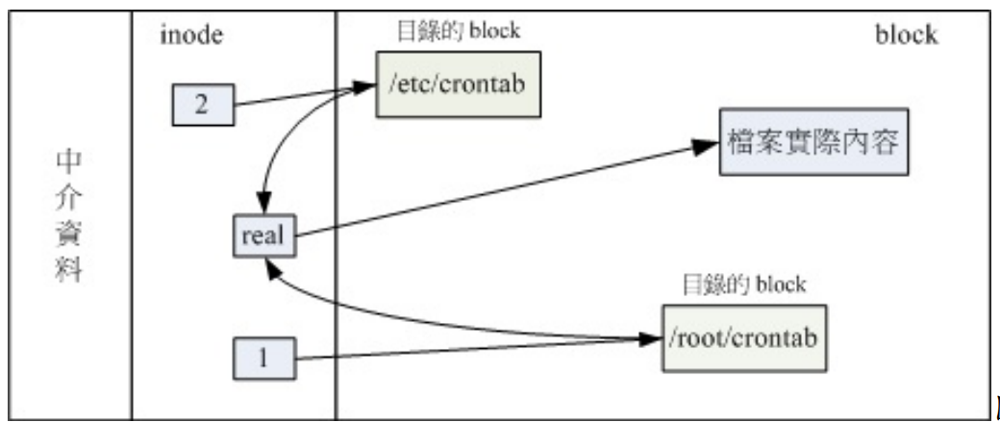
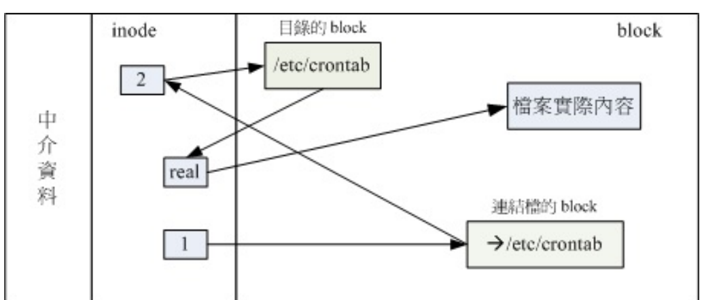
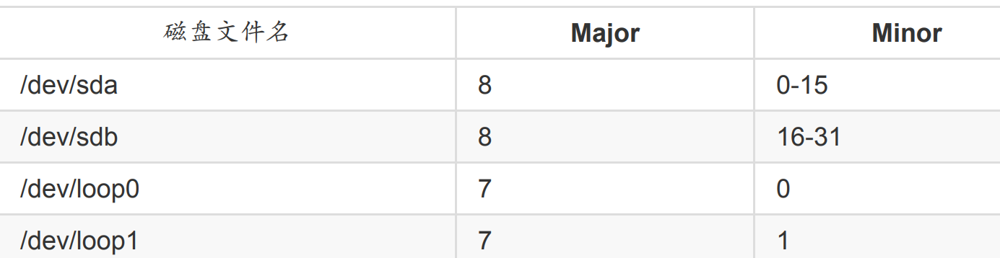
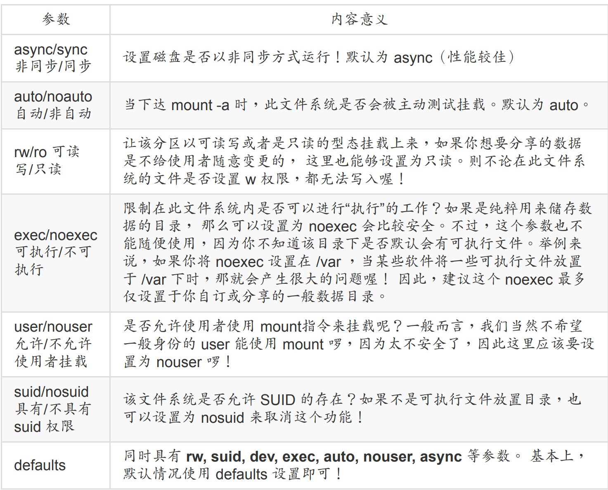

## 3.1 Linux文件系统

下面我们来简单查看一些文件系统

```bash
[root@study ~]# dumpe2fs [-bh] 设备文件名
选项与参数：
-b ：列出保留为坏轨的部分（一般用不到吧！？）
-h ：仅列出 superblock 的数据，不会列出其他的区段内容！
```

查看目前被格式化的设备

```bash
root@dev:/tmp# blkid
/dev/sr0: UUID="2021-08-24-09-09-05-00" LABEL="Ubuntu-Server 20.04.3 LTS amd64" TYPE="iso9660" PTUUID="7fcaeaa1" PTTYPE="dos"
/dev/sda2: UUID="2d35665c-edbd-4472-ac4b-ef29fb1d56c4" TYPE="ext4" PARTUUID="e92ec5fe-f54b-46aa-ae7c-b312875b1b01"
/dev/sda3: UUID="Si0o8o-4bRq-nIdp-pRdz-H4BH-Zbnf-4UMepV" TYPE="LVM2_member" PARTUUID="f0c1a465-637d-46df-a5e4-42536927fe03"
/dev/mapper/ubuntu--vg-ubuntu--lv: UUID="1d69656e-d74c-4d5c-88cd-280ba8944c49" TYPE="ext4"
/dev/loop0: TYPE="squashfs"
/dev/loop1: TYPE="squashfs"
/dev/loop2: TYPE="squashfs"
/dev/loop3: TYPE="squashfs"
/dev/loop5: TYPE="squashfs"
/dev/loop6: TYPE="squashfs"
/dev/loop7: TYPE="squashfs"
/dev/loop8: TYPE="squashfs"
/dev/loop9: TYPE="squashfs"
/dev/loop10: TYPE="squashfs"
/dev/loop11: TYPE="squashfs"
/dev/loop12: TYPE="squashfs"
/dev/sda1: PARTUUID="3ea90036-ca1d-4f19-9436-ad901fb2ee7f"
```

这里我们查看一些sda2这个ext4格式的设备

```bash
root@dev:/tmp# dumpe2fs /dev/sda2 
dumpe2fs 1.45.5 (07-Jan-2020)
Filesystem volume name:   <none> # 文件系统名称
Last mounted on:          /boot # 挂载目录位置
Filesystem UUID:          2d35665c-edbd-4472-ac4b-ef29fb1d56c4
Filesystem magic number:  0xEF53 # 上方的 UUID 为 Linux 对设备的定义码
Filesystem revision #:    1 (dynamic) # 下方的 features 为文件系统的特征数据
Filesystem features:      has_journal ext_attr resize_inode dir_index filetype needs_recovery extent 64bit flex_bg sparse_super large_file huge_file dir_nlink extra_isize metadata_csum
Filesystem flags:         signed_directory_hash 
Default mount options:    user_xattr acl # 默认在挂载时会主动加上的挂载参数
Filesystem state:         clean # 这块文件系统的状态为何，clean 是没问题
Errors behavior:          Continue
Filesystem OS type:       Linux
Inode count:              65536 # inode 的总数
Block count:              262144 # block 的总数
Reserved block count:     13107 # 保留的 block 总数
Free blocks:              171591 # 还有多少的 block 可用数量
Free inodes:              65216 # 还有多少的 inode 可用数量
First block:              0
Block size:               4096 # 单个 block 的容量大小
Fragment size:            4096
Group descriptor size:    64
Reserved GDT blocks:      127
Blocks per group:         32768
Fragments per group:      32768
Inodes per group:         8192
Inode blocks per group:   512
Flex block group size:    16
Filesystem created:       Sat Jul  2 09:18:05 2022
Last mount time:          Tue Nov  1 00:51:44 2022
Last write time:          Tue Nov  1 00:51:44 2022
Mount count:              8
Maximum mount count:      -1
Last checked:             Sat Jul  2 09:18:05 2022
Check interval:           0 (<none>)
Lifetime writes:          1001 MB
Reserved blocks uid:      0 (user root)
Reserved blocks gid:      0 (group root)
First inode:              11
Inode size:               256 # inode 的容量大小！已经是 256 了喔！
Required extra isize:     32
Desired extra isize:      32
Journal inode:            8
Default directory hash:   half_md4
Directory Hash Seed:      e3c1e913-4ffa-4700-ae68-6af192dd88c8
Journal backup:           inode blocks
Checksum type:            crc32c
Checksum:                 0xdc9e659d
Journal features:         journal_64bit journal_checksum_v3
Journal size:             32M # Journal 日志式数据的可供纪录总容量
Journal length:           8192
Journal sequence:         0x000001b9
Journal start:            1
Journal checksum type:    crc32c
Journal checksum:         0x7a62f0fd


Group 0: (Blocks 0-32767) csum 0x62f1 [ITABLE_ZEROED] # 第一块 block group 位置
  Primary superblock at 0, Group descriptors at 1-1 # 主要 superblock 的所在喔！
  Reserved GDT blocks at 2-128
  Block bitmap at 129 (+129), csum 0xf3a07d42
  Inode bitmap at 137 (+137), csum 0xa26434ee
  Inode table at 145-656 (+145) # inode table 的所在喔！
  28516 free blocks, 7877 free inodes, 4 directories, 7868 unused inodes
  Free blocks: 4252-32767 # 下面两行说明剩余的容量有多少
  Free inodes: 14, 16-18, 21-22, 317-318, 324-8192
Group 1: (Blocks 32768-65535) csum 0x7c9f [ITABLE_ZEROED]
  Backup superblock at 32768, Group descriptors at 32769-32769
  Reserved GDT blocks at 32770-32896
  Block bitmap at 130 (bg #0 + 130), csum 0xa8daf2b8
  Inode bitmap at 138 (bg #0 + 138), csum 0x9c331be0
  Inode table at 657-1168 (bg #0 + 657)
  9107 free blocks, 8191 free inodes, 1 directories, 8191 unused inodes
  Free blocks: 32898-32927, 32958-33279, 33792-35327, 35401-35839, 35841-40202, 40429-40453, 40457-40959, 61005, 61014-61439, 62025-62463, 63488-64511
  Free inodes: 8194-16384
Group 2: (Blocks 65536-98303) csum 0x7778 [INODE_UNINIT, ITABLE_ZEROED]
  Block bitmap at 131 (bg #0 + 131), csum 0xae420924
  Inode bitmap at 139 (bg #0 + 139), csum 0x00000000
  Inode table at 1169-1680 (bg #0 + 1169)
  29237 free blocks, 8192 free inodes, 0 directories, 8192 unused inodes
  Free blocks: 65671-65727, 65787-67583, 70921-98303
  Free inodes: 16385-24576
Group 3: (Blocks 98304-131071) csum 0xdf63 [INODE_UNINIT, ITABLE_ZEROED]
  Backup superblock at 98304, Group descriptors at 98305-98305
  Reserved GDT blocks at 98306-98432
  Block bitmap at 132 (bg #0 + 132), csum 0xcdef0faa
  Inode bitmap at 140 (bg #0 + 140), csum 0x00000000
  Inode table at 1681-2192 (bg #0 + 1681)
  9650 free blocks, 8192 free inodes, 0 directories, 8192 unused inodes
  Free blocks: 98433-99327, 113664-114687, 114826-114879, 114939-115711, 120072-126975
  Free inodes: 24577-32768
Group 4: (Blocks 131072-163839) csum 0x4b14 [INODE_UNINIT, ITABLE_ZEROED]
  Block bitmap at 133 (bg #0 + 133), csum 0x37a83db2
  Inode bitmap at 141 (bg #0 + 141), csum 0x00000000
  Inode table at 2193-2704 (bg #0 + 2193)
  22309 free blocks, 8192 free inodes, 0 directories, 8192 unused inodes
  Free blocks: 141531-163839
  Free inodes: 32769-40960
Group 5: (Blocks 163840-196607) csum 0x0afd [INODE_UNINIT, ITABLE_ZEROED]
  Backup superblock at 163840, Group descriptors at 163841-163841
  Reserved GDT blocks at 163842-163968
  Block bitmap at 134 (bg #0 + 134), csum 0xabf389ba
  Inode bitmap at 142 (bg #0 + 142), csum 0x00000000
  Inode table at 2705-3216 (bg #0 + 2705)
  32639 free blocks, 8192 free inodes, 0 directories, 8192 unused inodes
  Free blocks: 163969-196607
  Free inodes: 40961-49152
Group 6: (Blocks 196608-229375) csum 0x6542 [INODE_UNINIT, BLOCK_UNINIT, ITABLE_ZEROED]
  Block bitmap at 135 (bg #0 + 135), csum 0x00000000
  Inode bitmap at 143 (bg #0 + 143), csum 0x00000000
  Inode table at 3217-3728 (bg #0 + 3217)
  32768 free blocks, 8192 free inodes, 0 directories, 8192 unused inodes
  Free blocks: 196608-229375
  Free inodes: 49153-57344
Group 7: (Blocks 229376-262143) csum 0x3291 [INODE_UNINIT, ITABLE_ZEROED]
  Backup superblock at 229376, Group descriptors at 229377-229377
  Reserved GDT blocks at 229378-229504
  Block bitmap at 136 (bg #0 + 136), csum 0xabf389ba
  Inode bitmap at 144 (bg #0 + 144), csum 0x00000000
  Inode table at 3729-4240 (bg #0 + 3729)
  32639 free blocks, 8192 free inodes, 0 directories, 8192 unused inodes
  Free blocks: 229505-262143
  Free inodes: 57345-65536
```

如果想要实际观察 root 主文件夹内的文件所占用的 inode 号码时，可以使用 ls -i 这个选项来处理：

```bash
[root@study ~]# ls -li
total 8
53735697 -rw-------. 1 root root 1816 May 4 17:57 anaconda-ks.cfg
53745858 -rw-r--r--. 1 root root 1864 May 4 18:01 initial-setup-ks.cfg
```

我们可以通过inode来判断是否为同一个文件

```bash
root@dev:/tmp# ls -ild / /. /..
2 drwxr-xr-x 21 root root 4096 Jul 12 08:41 /
2 drwxr-xr-x 21 root root 4096 Jul 12 08:41 /.
2 drwxr-xr-x 21 root root 4096 Jul 12 08:41 /..
```

我们可以通过下面的命令来查看目前已经载入的系统

```bash
cat /proc/filesystems
```

## 3.2 文件系统的简单操作

### 3.2.1 磁盘与目录容量

- df：列出文件系统的整体磁盘使用量；

- du：评估文件系统的磁盘使用量（常用在推估目录所占容量）

```bash
[root@study ~]# df [-ahikHTm] [目录或文件名]
选项与参数：
-a ：列出所有的文件系统，包括系统特有的 /proc 等文件系统；
-k ：以 KBytes 的容量显示各文件系统；
-m ：以 MBytes 的容量显示各文件系统；
-h ：以人们较易阅读的 GBytes, MBytes, KBytes 等格式自行显示；
-H ：以 M=1000K 取代 M=1024K 的进位方式；
-T ：连同该 partition 的 filesystem 名称 （例如 xfs） 也列出；
-i ：不用磁盘容量，而以 inode 的数量来显示
范例一：将系统内所有的 filesystem 列出来！
[root@study ~]# df
Filesystem 1K-blocks Used Available Use% Mounted on
/dev/mapper/centos-root 10475520 3409408 7066112 33% /
devtmpfs 627700 0 627700 0% /dev
tmpfs 637568 80 637488 1% /dev/shm
tmpfs 637568 24684 612884 4% /run
tmpfs 637568 0 637568 0% /sys/fs/cgroup
/dev/mapper/centos-home 5232640 67720 5164920 2% /home
/dev/vda2 1038336 133704 904632 13% /boot
# 在 Linux 下面如果 df 没有加任何选项，那么默认会将系统内所有的
# （不含特殊内存内的文件系统与 swap） 都以 1 KBytes 的容量来列出来！
# 至于那个 /dev/shm 是与内存有关的挂载，先不要理他！
```

du命令

```bash
[root@study ~]# du [-ahskm] 文件或目录名称
选项与参数：
-a ：列出所有的文件与目录容量，因为默认仅统计目录下面的文件量而已。
-h ：以人们较易读的容量格式 （G/M） 显示；
-s ：列出总量而已，而不列出每个各别的目录占用容量；
-S ：不包括子目录下的总计，与 -s 有点差别。
-k ：以 KBytes 列出容量显示；
-m ：以 MBytes 列出容量显示；
范例一：列出目前目录下的所有文件大小
[root@study ~]# du
4 ./.cache/dconf <==每个目录都会列出来
4 ./.cache/abrt
8 ./.cache
....（中间省略）....
0 ./test4
4 ./.ssh <==包括隐藏文件的目录
76 . <==这个目录（.）所占用的总量
# 直接输入 du 没有加任何选项时，则 du 会分析“目前所在目录”
# 的文件与目录所占用的磁盘空间。但是，实际显示时，仅会显示目录容量（不含文件），
# 因此 . 目录有很多文件没有被列出来，所以全部的目录相加不会等于 . 的容量喔！
# 此外，输出的数值数据为 1K 大小的容量单位。
范例二：同范例一，但是将文件的容量也列出来
[root@study ~]# du -a
4 ./.bash_logout <==有文件的列表了
4 ./.bash_profile
4 ./.bashrc
....（中间省略）....
4 ./.ssh/known_hosts
4 ./.ssh
76 .
范例三：检查根目录下面每个目录所占用的容量
[root@study ~]# du -sm /*
0 /bin
99 /boot
....（中间省略）....
du: cannot access ‘/proc/17772/task/17772/fd/4’: No such file or directory
du: cannot access ‘/proc/17772/fdinfo/4’: No such file or directory
0 /proc <==不会占用硬盘空间！
1 /root
25 /run
....（中间省略）....
3126 /usr <==系统初期最大就是他了啦！
117 /var
# 这是个很常被使用的功能～利用万用字符 * 来代表每个目录，如果想要检查某个目录下，
# 哪个次目录占用最大的容量，可以用这个方法找出来。值得注意的是，如果刚刚安装好 Linux 时，
# 那么整个系统容量最大的应该是 /usr 。而 /proc 虽然有列出容量，但是那个容量是在内存中，
# 不占磁盘空间。至于 /proc 里头会列出一堆“No such file or directory” 的错误，
# 别担心！因为是内存内的程序，程序执行结束就会消失，因此会有些目录找不到，是正确的！
```

### 3.2.2 链接操作

主要包括软链接和硬链接

- 每个文件都会占用一个 inode ，文件内容由 inode 的记录来指向；

- 想要读取该文件，必须要经过目录记录的文件名来指向到正确的 inode 号码才能读取。

hard link 只是在某个目录下新增一笔文件名链接到某 inode 号码的关连记录而已，下面我们来实际操作一下

```bash
root@dev:/tmp# ln /etc/crontab .
root@dev:/tmp# ll -i /etc/crontab crontab
1835693 -rw-r--r-- 2 root root 1042 Feb 13  2020 crontab
1835693 -rw-r--r-- 2 root root 1042 Feb 13  2020 /etc/crontab
```

我们可以这样理解



上图的意思是，你可以通过 1 或 2 的目录之 inode 指定的 block 找到两个不同的文件名，而
不管使用哪个文件名均可以指到 real 那个 inode 去读取到最终数据！那这样有什么好处呢？
最大的好处就是“安全”！如同上图中， 如果你将任何一个“文件名”删除，其实 inode 与 block
都还是存在的！ 此时你可以通过另一个“文件名”来读取到正确的文件数据喔！此外，不论你
使用哪个“文件名”来编辑， 最终的结果都会写入到相同的 inode 与 block 中，因此均能进行数据的修改哩！

因为hardLink与innode有关，所以会有如下限制

- 不能跨 Filesystem；

- 不能 link 目录。

下面介绍Symbolic Link （符号链接，亦即是捷径）

```bash
root@dev:/tmp# ln -s /etc/crontab crontab2
root@dev:/tmp# ll -i /etc/crontab /tmp/crontab2
1835693 -rw-r--r-- 2 root root 1042 Feb 13  2020 /etc/crontab
2898171 lrwxrwxrwx 1 root root   12 Nov  5 09:56 /tmp/crontab2 -> /etc/crontab
```

上面的命令可以看到会有->来标识这个链接到了那个文件，具体可以这样理解



所以如果目标文件（/etc/crontab）被删除了，那么整个环节就会无法继续进行下去， 所以就会发生无法通过链接文件读取的问题了！

当我们创建一个新目录的时候，会有2个link，比如，当我们创建一个新目录名称为/tmp/testing 时，基本上会有三个东西，那就是：
/tmp/testing
/tmp/testing/.
/tmp/testing/..

我们可以简单测试一下

```bash
[root@study ~]# ls -ld /tmp
drwxrwxrwt. 14 root root 4096 Jun 23 22:42 /tmp
[root@study ~]# mkdir /tmp/testing1
[root@study ~]# ls -ld /tmp
drwxrwxrwt. 15 root root 4096 Jun 23 22:45 /tmp # 这里的 link 数量加 1 了！
[root@study ~]# ls -ld /tmp/testing1
drwxr-xr-x. 2 root root 6 Jun 23 22:45 /tmp/testing1/
```

## 3.3 磁盘分区、格式化

### 3.3.1 查看分区状态

首先我们可以列出所有的磁盘列表

```bash
[root@study ~]# lsblk [-dfimpt] [device]
选项与参数：
-d ：仅列出磁盘本身，并不会列出该磁盘的分区数据
-f ：同时列出该磁盘内的文件系统名称
-i ：使用 ASCII 的线段输出，不要使用复杂的编码 （再某些环境下很有用）
-m ：同时输出该设备在 /dev 下面的权限数据 （rwx 的数据）
-p ：列出该设备的完整文件名！而不是仅列出最后的名字而已。
-t ：列出该磁盘设备的详细数据，包括磁盘伫列机制、预读写的数据量大小等
范例一：列出本系统下的所有磁盘与磁盘内的分区信息
[root@study ~]# lsblk
NAME MAJ:MIN RM SIZE RO TYPE MOUNTPOINT
sr0 11:0 1 1024M 0 rom
vda 252:0 0 40G 0 disk # 一整颗磁盘
```

我刚才新增了一个硬盘也就sdb，可以看到类型为disk,也就是磁盘

```bash
xiaoyou@dev:~$ lsblk
NAME                      MAJ:MIN RM  SIZE RO TYPE MOUNTPOINT
sda                         8:0    0  100G  0 disk 
├─sda1                      8:1    0    1M  0 part 
├─sda2                      8:2    0    1G  0 part /boot
└─sda3                      8:3    0   99G  0 part 
  └─ubuntu--vg-ubuntu--lv 253:0    0 98.5G  0 lvm  /
sdb                         8:16   0   10G  0 disk 
sr0                        11:0    1  1.2G  0 rom  
```

blkid 列出设备的 UUID 等参数

```bash
xiaoyou@dev:~$ blkid
/dev/sr0: UUID="2021-08-24-09-09-05-00" LABEL="Ubuntu-Server 20.04.3 LTS amd64" TYPE="iso9660" PTUUID="7fcaeaa1" PTTYPE="dos"
/dev/sda2: UUID="2d35665c-edbd-4472-ac4b-ef29fb1d56c4" TYPE="ext4" PARTUUID="e92ec5fe-f54b-46aa-ae7c-b312875b1b01"
/dev/sda3: UUID="Si0o8o-4bRq-nIdp-pRdz-H4BH-Zbnf-4UMepV" TYPE="LVM2_member" PARTUUID="f0c1a465-637d-46df-a5e4-42536927fe03"
/dev/mapper/ubuntu--vg-ubuntu--lv: UUID="1d69656e-d74c-4d5c-88cd-280ba8944c49" TYPE="ext4"
```

parted 列出磁盘的分区表类型与分区信息

```bash
[root@study ~]# parted device_name print
范例一：列出 /dev/vda 磁盘的相关数据
[root@study ~]# parted /dev/vda print
Model: Virtio Block Device （virtblk） # 磁盘的模块名称（厂商）
Disk /dev/vda: 42.9GB # 磁盘的总容量
Sector size （logical/physical）: 512B/512B # 磁盘的每个逻辑/物理扇区容量
Partition Table: gpt # 分区表的格式 （MBR/GPT）
Disk Flags: pmbr_boot
Number Start End Size File system Name Flags # 下面才是分区数据
1 1049kB 3146kB 2097kB bios_grub
2 3146kB 1077MB 1074MB xfs
3 1077MB 33.3GB 32.2GB lvm
```

### 3.3.2 磁盘分区

接下来我们想要进行磁盘分区啰！要注意的是：“MBR 分区表请使用 fdisk 分区， GPT 分区
表请使用 gdisk 分区！” 这个不要搞错～否则会分区失败的！

```bash
[root@study ~]# gdisk 设备名称
范例：由前一小节的 lsblk 输出，我们知道系统有个 /dev/vda，请观察该磁盘的分区与相关数据
[root@study ~]# gdisk /dev/vda <==仔细看，不要加上数字喔！
GPT fdisk （gdisk） version 0.8.6
Partition table scan:
MBR: protective
BSD: not present
APM: not present
GPT: present
Found valid GPT with protective MBR; using GPT. <==找到了 GPT 的分区表！
Command （? for help）: <==这里可以让你输入指令动作，可以按问号 （?） 来查看可用指令
Command （? for help）: ?
b back up GPT data to a file
c change a partition's name
d delete a partition # 删除一个分区
i show detailed information on a partition
l list known partition types
n add a new partition # 增加一个分区
o create a new empty GUID partition table （GPT）
p print the partition table # 印出分区表 （常用）
q quit without saving changes # 不储存分区就直接离开 gdisk
r recovery and transformation options （experts only）
s sort partitions
t change a partition's type code
v verify disk
w write table to disk and exit # 储存分区操作后离开 gdisk
x extra functionality （experts only）
? print this menu
Command （? for help）:
```

其中比较不一样的是“q 与 w”这两个玩意儿！ 不管你进行了什么动作，只要离开 gdisk 时按下“q”，那么所有的动作“都不会生效！”相反的， 按下“w”就是动作生效的意思。所以，你可以随便玩gdisk ，只要离开时按下的是“q”即可。

首先我们可以n来创建一个分区，用法如下

```bash
root@dev:~# gdisk /dev/sdb
Command (? for help): n  # 这里是新建分区
Partition number (1-128, default 1): 1 # 分区号，因为我们是新硬盘。直接+1即可
First sector (34-20971486, default = 2048) or {+-}size{KMGTP}: +1G # 开始位置，这里可以只有默认，也可以自己手动设置
Last sector (2099200-20971486, default = 20971486) or {+-}size{KMGTP}: 
Current type is 8300 (Linux filesystem)
Hex code or GUID (L to show codes, Enter = 8300):  # 这里是文件系统ID，直接默认即可
Changed type of partition to 'Linux filesystem'

Command (? for help): p # 然后我们查看一下分好的区
Disk /dev/sdb: 20971520 sectors, 10.0 GiB
Model: Virtual disk    
Sector size (logical/physical): 512/512 bytes
Disk identifier (GUID): F13959F4-865E-479F-9212-9DA7C98B7179
Partition table holds up to 128 entries
Main partition table begins at sector 2 and ends at sector 33
First usable sector is 34, last usable sector is 20971486
Partitions will be aligned on 2048-sector boundaries
Total free space is 2099166 sectors (1025.0 MiB)

Number  Start (sector)    End (sector)  Size       Code  Name
   1         2099200        20971486   9.0 GiB     8300  Linux filesystem
```

这里比较重要的是文件系统ID，一般来说， Linux 大概都是 8200/8300/8e00 等三种格式， Windows几乎都用 0700 这样，如果忘记这些数字，可以在 gdisk 内按下：“ L ”来显示喔！

```bash
Command (? for help): l
Type search string, or <Enter> to show all codes: 
0700 Microsoft basic data                0c01 Microsoft reserved                
2700 Windows RE                          3000 ONIE boot                         
3001 ONIE config                         3900 Plan 9                            
4100 PowerPC PReP boot                   4200 Windows LDM data                  
4201 Windows LDM metadata                4202 Windows Storage Spaces            
7501 IBM GPFS                            7f00 ChromeOS kernel                   
7f01 ChromeOS root                       7f02 ChromeOS reserved                 
8200 Linux swap                          8300 Linux filesystem                  
8301 Linux reserved                      8302 Linux /home                       
8303 Linux x86 root (/)                  8304 Linux x86-64 root (/)             
8305 Linux ARM64 root (/)                8306 Linux /srv                        
8307 Linux ARM32 root (/)                8308 Linux dm-crypt                    
8309 Linux LUKS                          830a Linux IA-64 root (/)              
830b Linux x86 root verity               830c Linux x86-64 root verity          
830d Linux ARM32 root verity             830e Linux ARM64 root verity           
830f Linux IA-64 root verity             8310 Linux /var                        
8311 Linux /var/tmp                      8400 Intel Rapid Start                 
8500 Container Linux /usr                8501 Container Linux resizable rootfs  
8502 Container Linux /OEM customization  8503 Container Linux root on RAID      
8e00 Linux LVM                           a000 Android bootloader                
a001 Android bootloader 2                a002 Android boot 1   
```

如果没啥问题的话，就输入w结束分区，然后就可以只有`lsblk`来查看我们分好的区了

如果磁盘正在使用，那么不会立即更新分区表，我们可以这样操作

```bash
root@dev:~# partprobe -s # 更新分区表，这里还可以把状态显示出来
/dev/sda: gpt partitions 1 2 3
/dev/sdb: gpt partitions 1
/dev/mapper/ubuntu--vg-ubuntu--lv: loop partitions 1
Warning: Unable to open /dev/sr0 read-write (Read-only file system).  /dev/sr0 has been opened read-only.
/dev/sr0: mac partitions 1 2
# 最后在看一下核心分区记录
cat /proc/partitions
major minor  #blocks  name
   7        0      45568 loop0
   7        1      56896 loop1
   7        2      56896 loop2
   7        3      49144 loop3
   7        4     101904 loop4
   7        5      64740 loop5
   7        6     101968 loop6
   7        7      45760 loop7
  11        0    1231808 sr0
   8       16   10485760 sdb
   8       17    1048576 sdb1 # 这里已经可以看到了
   8        0  104857600 sda
   8        1       1024 sda1
   8        2    1048576 sda2
   8        3  103805952 sda3
 253        0  103284736 dm-0
   7        8      72000 loop8
   7        9      49140 loop9
   7       10      69440 loop10
   7       11      64712 loop11
```

下面我们来演示一下删除分区

```bash
root@dev:~# gdisk /dev/sdb
GPT fdisk (gdisk) version 1.0.5

Partition table scan:
  MBR: protective
  BSD: not present
  APM: not present
  GPT: present

Found valid GPT with protective MBR; using GPT.

Command (? for help): p
Disk /dev/sdb: 20971520 sectors, 10.0 GiB
Model: Virtual disk    
Sector size (logical/physical): 512/512 bytes
Disk identifier (GUID): A800722B-1A3F-48D9-910B-7A18E00609B4
Partition table holds up to 128 entries
Main partition table begins at sector 2 and ends at sector 33
First usable sector is 34, last usable sector is 20971486
Partitions will be aligned on 2048-sector boundaries
Total free space is 18874301 sectors (9.0 GiB)

Number  Start (sector)    End (sector)  Size       Code  Name
   1            2048         2099199   1024.0 MiB  8300  Linux filesystem

Command (? for help): d # 删除分区·如果你有多个分区，这里会让你输入号码
Using 1

Command (? for help): p # 再打印一下可以看到每轮
Disk /dev/sdb: 20971520 sectors, 10.0 GiB
Model: Virtual disk    
Sector size (logical/physical): 512/512 bytes
Disk identifier (GUID): A800722B-1A3F-48D9-910B-7A18E00609B4
Partition table holds up to 128 entries
Main partition table begins at sector 2 and ends at sector 33
First usable sector is 34, last usable sector is 20971486
Partitions will be aligned on 2048-sector boundaries
Total free space is 20971453 sectors (10.0 GiB)

Number  Start (sector)    End (sector)  Size       Code  Name
```

### 3.3.3 磁盘格式化

格式化好分区后，我们可以开始创建文件系统了

```bash
[root@study ~]# mkfs.xfs [-b bsize] [-d parms] [-i parms] [-l parms] [-L label] [-f] \
[-r parms] 设备名称
选项与参数：
关於单位：下面只要谈到“数值”时，没有加单位则为 Bytes 值，可以用 k,m,g,t,p （小写）等来解释
比较特殊的是 s 这个单位，它指的是 sector 的“个数”喔！
-b ：后面接的是 block 容量，可由 512 到 64k，不过最大容量限制为 Linux 的 4k 喔！
-d ：后面接的是重要的 data section 的相关参数值，主要的值有：
agcount=数值 ：设置需要几个储存群组的意思（AG），通常与 CPU 有关
agsize=数值 ：每个 AG 设置为多少容量的意思，通常 agcount/agsize 只选一个设置即可
file ：指的是“格式化的设备是个文件而不是个设备”的意思！（例如虚拟磁盘）
size=数值 ：data section 的容量，亦即你可以不将全部的设备容量用完的意思
su=数值 ：当有 RAID 时，那个 stripe 数值的意思，与下面的 sw 搭配使用
sw=数值 ：当有 RAID 时，用于储存数据的磁盘数量（须扣除备份碟与备用碟）
sunit=数值 ：与 su 相当，不过单位使用的是“几个 sector（512Bytes大小）”的意思
swidth=数值 ：就是 su*sw 的数值，但是以“几个 sector（512Bytes大小）”来设置
-f ：如果设备内已经有文件系统，则需要使用这个 -f 来强制格式化才行！
-i ：与 inode 有较相关的设置，主要的设置值有：
size=数值 ：最小是 256Bytes 最大是 2k，一般保留 256 就足够使用了！
internal=[0|1]：log 设备是否为内置？默认为 1 内置，如果要用外部设备，使用下面设置
logdev=device ：log 设备为后面接的那个设备上头的意思，需设置 internal=0 才可！
size=数值 ：指定这块登录区的容量，通常最小得要有 512 个 block，大约 2M 以上才行！
-L ：后面接这个文件系统的标头名称 Label name 的意思！
-r ：指定 realtime section 的相关设置值，常见的有：
extsize=数值 ：就是那个重要的 extent 数值，一般不须设置，但有 RAID 时，
最好设置与 swidth 的数值相同较佳！最小为 4K 最大为 1G 。
范例：将前一小节分区出来的 /dev/vda4 格式化为 xfs 文件系统
[root@study ~]# mkfs.xfs /dev/vda4
meta-data=/dev/vda4 isize=256 agcount=4, agsize=65536 blks
= sectsz=512 attr=2, projid32bit=1
= crc=0 finobt=0
data = bsize=4096 blocks=262144, imaxpct=25
= sunit=0 swidth=0 blks
naming =version 2 bsize=4096 ascii-ci=0 ftype=0
log =internal log bsize=4096 blocks=2560, version=2
= sectsz=512 sunit=0 blks, lazy-count=1
realtime =none extsz=4096 blocks=0, rtextents=0
# 很快格是化完毕！都用默认值！较重要的是 inode 与 block 的数值
[root@study ~]# blkid /dev/vda4
/dev/vda4: UUID="39293f4f-627b-4dfd-a015-08340537709c" TYPE="xfs"
# 确定创建好 xfs 文件系统了！
```

除了xfs文件系统，我们也可以使用ext4的文件系统

```bash
[root@study ~]# mkfs.ext4 [-b size] [-L label] 设备名称
选项与参数：
-b ：设置 block 的大小，有 1K, 2K, 4K 的容量，
-L ：后面接这个设备的标头名称。
范例：将 /dev/vda5 格式化为 ext4 文件系统
[root@study ~]# mkfs.ext4 /dev/vda5
mke2fs 1.42.9 （28-Dec-2013）
Filesystem label= # 显示 Label name
OS type: Linux
Block size=4096 （log=2） # 每一个 block 的大小
Fragment size=4096 （log=2）
Stride=0 blocks, Stripe width=0 blocks # 跟 RAID 相关性较高
65536 inodes, 262144 blocks # 总计 inode/block 的数量
13107 blocks （5.00%） reserved for the super user
First data block=0
Maximum filesystem blocks=268435456
8 block groups # 共有 8 个 block groups 喔！
32768 blocks per group, 32768 fragments per group
8192 inodes per group
Superblock backups stored on blocks:
32768, 98304, 163840, 229376
Allocating group tables: done
Writing inode tables: done
Creating journal （8192 blocks）: done
Writing superblocks and filesystem accounting information: done
[root@study ~]# dumpe2fs -h /dev/vda5
dumpe2fs 1.42.9 （28-Dec-2013）
Filesystem volume name: <none>
Last mounted on: <not available>
Filesystem UUID: 3fd5cc6f-a47d-46c0-98c0-d43b072e0e12
....（中间省略）....
Inode count: 65536
Block count: 262144
Block size: 4096
Blocks per group: 32768
Inode size: 256
Journal size: 32M
```

除了这两个，linux上面还有很多其他的命令，常用的如下

```bash
root@dev:~# mkfs.
mkfs.bfs     mkfs.btrfs   mkfs.cramfs  mkfs.ext2    mkfs.ext3    mkfs.ext4    mkfs.fat     mkfs.minix   mkfs.msdos   mkfs.ntfs    mkfs.vfat    mkfs.xfs
```

### 3.3.4 文件系统校验

```bash
[root@study ~]# xfs_repair [-fnd] 设备名称
选项与参数：
-f ：后面的设备其实是个文件而不是实体设备
-n ：单纯检查并不修改文件系统的任何数据 （检查而已）
-d ：通常用在单人维护模式下面，针对根目录 （/） 进行检查与修复的动作！很危险！不要随便使用
范例：检查一下刚刚创建的 /dev/vda4 文件系统
[root@study ~]# xfs_repair /dev/vda4
Phase 1 - find and verify superblock...
Phase 2 - using internal log
Phase 3 - for each AG...
Phase 4 - check for duplicate blocks...
Phase 5 - rebuild AG headers and trees...
Phase 6 - check inode connectivity...
Phase 7 - verify and correct link counts...
done
# 共有 7 个重要的检查流程！详细的流程介绍可以 man xfs_repair 即可！
范例：检查一下系统原本就有的 /dev/centos/home 文件系统
[root@study ~]# xfs_repair /dev/centos/home
xfs_repair: /dev/centos/home contains a mounted filesystem
xfs_repair: /dev/centos/home contains a mounted and writable filesystem
fatal error -- couldn't initialize XFS library
```

fsck 是个综合指令，如果是针对 ext4 的话，建议直接使用 fsck.ext4 来检测比较妥当！那
fsck.ext4 的选项有下面几个常见的项目：

```bash
[root@study ~]# fsck.ext4 [-pf] [-b superblock] 设备名称
选项与参数：
-p ：当文件系统在修复时，若有需要回复 y 的动作时，自动回复 y 来继续进行修复动作。
-f ：强制检查！一般来说，如果 fsck 没有发现任何 unclean 的旗标，不会主动进入
细部检查的，如果您想要强制 fsck 进入细部检查，就得加上 -f 旗标啰！
-D ：针对文件系统下的目录进行最优化配置。
-b ：后面接 superblock 的位置！一般来说这个选项用不到。但是如果你的 superblock 因故损毁时，
通过这个参数即可利用文件系统内备份的 superblock 来尝试救援。一般来说，superblock 备份在：
1K block 放在 8193, 2K block 放在 16384, 4K block 放在 32768
范例：找出刚刚创建的 /dev/vda5 的另一块 superblock，并据以检测系统
[root@study ~]# dumpe2fs -h /dev/vda5 | grep 'Blocks per group'
Blocks per group: 32768
# 看起来每个 block 群组会有 32768 个 block，因此第二个 superblock 应该就在 32768 上！
# 因为 block 号码为 0 号开始编的！
[root@study ~]# fsck.ext4 -b 32768 /dev/vda5
e2fsck 1.42.9 （28-Dec-2013）
/dev/vda5 was not cleanly unmounted, check forced.
Pass 1: Checking inodes, blocks, and sizes
Deleted inode 1577 has zero dtime. Fix<y>? yes
Pass 2: Checking directory structure
Pass 3: Checking directory connectivity
Pass 4: Checking reference counts
Pass 5: Checking group summary information
/dev/vda5: ***** FILE SYSTEM WAS MODIFIED ***** # 文件系统被改过，所以这里会有警告！
/dev/vda5: 11/65536 files （0.0% non-contiguous）, 12955/262144 blocks
# 好巧合！鸟哥使用这个方式来检验系统，恰好遇到文件系统出问题！于是可以有比较多的解释方向！
# 当文件系统出问题，它就会要你选择是否修复～如果修复如上所示，按下 y 即可！
# 最终系统会告诉你，文件系统已经被更改过，要注意该项目的意思！
范例：已默认设置强制检查一次 /dev/vda5
[root@study ~]# fsck.ext4 /dev/vda5
e2fsck 1.42.9 （28-Dec-2013）
/dev/vda5: clean, 11/65536 files, 12955/262144 blocks
# 文件系统状态正常，它并不会进入强制检查！会告诉你文件系统没问题 （clean）
[root@study ~]# fsck.ext4 -f /dev/vda5
e2fsck 1.42.9 （28-Dec-2013）
Pass 1: Checking inodes, blocks, and sizes
```

### 3.3.5 文件系统挂载与卸载

```bash
[root@study ~]# mount -a
[root@study ~]# mount [-l]
[root@study ~]# mount [-t 文件系统] LABEL='' 挂载点
[root@study ~]# mount [-t 文件系统] UUID='' 挂载点 # 鸟哥近期建议用这种方式喔！
[root@study ~]# mount [-t 文件系统] 设备文件名 挂载点
选项与参数：
-a ：依照配置文件 [/etc/fstab](../Text/index.html#fstab) 的数据将所有未挂载的磁盘都挂载上来
-l ：单纯的输入 mount 会显示目前挂载的信息。加上 -l 可增列 Label 名称！
-t ：可以加上文件系统种类来指定欲挂载的类型。常见的 Linux 支持类型有：xfs, ext3, ext4,
reiserfs, vfat, iso9660（光盘格式）, nfs, cifs, smbfs （后三种为网络文件系统类型）
-n ：在默认的情况下，系统会将实际挂载的情况实时写入 /etc/mtab 中，以利其他程序的运行。
但在某些情况下（例如单人维护模式）为了避免问题会刻意不写入。此时就得要使用 -n 选项。
-o ：后面可以接一些挂载时额外加上的参数！比方说帐号、密码、读写权限等：
async, sync: 此文件系统是否使用同步写入 （sync） 或非同步 （async） 的
内存机制，请参考[文件系统运行方式](../Text/index.html#harddisk-filerun)。默认为 async。
atime,noatime: 是否修订文件的读取时间（atime）。为了性能，某些时刻可使用 noatime
ro, rw: 挂载文件系统成为只读（ro） 或可读写（rw）
auto, noauto: 允许此 filesystem 被以 mount -a 自动挂载（auto）
dev, nodev: 是否允许此 filesystem 上，可创建设备文件？ dev 为可允许
suid, nosuid: 是否允许此 filesystem 含有 suid/sgid 的文件格式？
exec, noexec: 是否允许此 filesystem 上拥有可执行 binary 文件？
user, nouser: 是否允许此 filesystem 让任何使用者执行 mount ？一般来说，
mount 仅有 root 可以进行，但下达 user 参数，则可让
一般 user 也能够对此 partition 进行 mount 。
defaults: 默认值为：rw, suid, dev, exec, auto, nouser, and async
remount: 重新挂载，这在系统出错，或重新更新参数时，很有用！
```

那我怎么知道我的 Linux 有没有相关文件系统类型的驱动程序呢？我们 Linux 支持的文件系统之驱动程序都写在如下的目录中：可以看下每个文件对于一个驱动

```bash
root@dev:~# ls /lib/modules/$(uname -r)/kernel/fs
9p    afs     befs            btrfs       cifs    dlm    f2fs      fscache  hfs      isofs  lockd  nfs_common  nls    omfs       pstore  quota     shiftfs.ko  udf
adfs  aufs    bfs             cachefiles  coda    efs    fat       fuse     hfsplus  jffs2  minix  nfsd        ntfs   orangefs   qnx4    reiserfs  sysv        ufs
affs  autofs  binfmt_misc.ko  ceph        cramfs  erofs  freevxfs  gfs2     hpfs     jfs    nfs    nilfs2      ocfs2  overlayfs  qnx6    romfs     ubifs       xfs
```

下面简单实战一下

```bash
范例：找出 /dev/vda4 的 UUID 后，用该 UUID 来挂载文件系统到 /data/xfs 内
[root@study ~]# blkid /dev/vda4
/dev/vda4: UUID="e0a6af55-26e7-4cb7-a515-826a8bd29e90" TYPE="xfs"
[root@study ~]# mount UUID="e0a6af55-26e7-4cb7-a515-826a8bd29e90" /data/xfs
mount: mount point /data/xfs does not exist # 非正规目录！所以手动创建它！
[root@study ~]# mkdir -p /data/xfs
[root@study ~]# mount UUID="e0a6af55-26e7-4cb7-a515-826a8bd29e90" /data/xfs
[root@study ~]# df /data/xfs
Filesystem 1K-blocks Used Available Use% Mounted on
/dev/vda4 1038336 32864 1005472 4% /data/xfs
# 顺利挂载，且容量约为 1G 左右没问题！
范例：使用相同的方式，将 /dev/vda5 挂载于 /data/ext4
[root@study ~]# blkid /dev/vda5
/dev/vda5: UUID="899b755b-1da4-4d1d-9b1c-f762adb798e1" TYPE="ext4"
[root@study ~]# mkdir /data/ext4
[root@study ~]# mount UUID="899b755b-1da4-4d1d-9b1c-f762adb798e1" /data/ext4
[root@study ~]# df /data/ext4
Filesystem 1K-blocks Used Available Use% Mounted on
/dev/vda5 999320 2564 927944 1% /data/ext4
```

我的运行结果

```bash
root@dev:~# blkid /dev/sdb1
/dev/sdb1: UUID="99845b5c-accf-4d3b-afd0-49b6f2afa164" TYPE="xfs" PARTLABEL="Linux filesystem" PARTUUID="fa110070-850c-4ce2-bc86-757b7b4ae053"
root@dev:~# mkdir -p /data/xfs
root@dev:~# mount UUID="99845b5c-accf-4d3b-afd0-49b6f2afa164" /data/xfs
root@dev:~# df -h
Filesystem                         Size  Used Avail Use% Mounted on
/dev/sdb1                          2.0G   47M  2.0G   3% /data/xfs
```

我们还可以手动挂载光盘

```bash
范例：将你用来安装 Linux 的 CentOS 原版光盘拿出来挂载到 /data/cdrom！
[root@study ~]# blkid
.....（前面省略）.....
/dev/sr0: UUID="2015-04-01-00-21-36-00" LABEL="CentOS 7 x86_64" TYPE="iso9660" PTTYPE="dos"
[root@study ~]# mkdir /data/cdrom
[root@study ~]# mount /dev/sr0 /data/cdrom
mount: /dev/sr0 is write-protected, mounting read-only
[root@study ~]# df /data/cdrom
Filesystem 1K-blocks Used Available Use% Mounted on
/dev/sr0 7413478 7413478 0 100% /data/cdrom
# 怎么会使用掉 100% 呢？是啊！因为是 DVD 啊！所以无法再写入了啊！
```

也可以挂载U盘

```bash
范例：找出你的U盘设备的 UUID，并挂载到 /data/usb 目录中
[root@study ~]# blkid
/dev/sda1: UUID="35BC-6D6B" TYPE="vfat"
[root@study ~]# mkdir /data/usb
[root@study ~]# mount -o codepage=950,iocharset=utf8 UUID="35BC-6D6B" /data/usb
[root@study ~]# # mount -o codepage=950,iocharset=big5 UUID="35BC-6D6B" /data/usb
[root@study ~]# df /data/usb
Filesystem 1K-blocks Used Available Use% Mounted on
/dev/sda1 2092344 4 2092340 1% /data/usb
```

我们也可以把某个目录挂载到另外一个目录下去

```bash
范例：将 /var 这个目录暂时挂载到 /data/var 下面：
[root@study ~]# mkdir /data/var
[root@study ~]# mount --bind /var /data/var
[root@study ~]# ls -lid /var /data/var
16777346 drwxr-xr-x. 22 root root 4096 Jun 15 23:43 /data/var
16777346 drwxr-xr-x. 22 root root 4096 Jun 15 23:43 /var
# 内容完全一模一样啊！因为挂载目录的缘故！
[root@study ~]# mount | grep var
/dev/mapper/centos-root on /data/var type xfs （rw,relatime,seclabel,attr2,inode64,noquota）
```

最后就是设备文件卸载了

```bash
[root@study ~]# umount [-fn] 设备文件名或挂载点
选项与参数：
-f ：强制卸载！可用在类似网络文件系统 （NFS） 无法读取到的情况下；
-l ：立刻卸载文件系统，比 -f 还强！
-n ：不更新 /etc/mtab 情况下卸载。
```

直接`umount /data/xfs`就可以卸载了

### 2.3.6 磁盘文件系统的参数修改

我们可以先查看一下设备的信息

```bash
root@dev:~# ll /dev/sd*
brw-rw---- 1 root disk 8,  0 Nov  5 10:26 /dev/sda
brw-rw---- 1 root disk 8,  1 Nov  5 10:26 /dev/sda1
brw-rw---- 1 root disk 8,  2 Nov  5 10:26 /dev/sda2
brw-rw---- 1 root disk 8,  3 Nov  5 10:26 /dev/sda3
brw-rw---- 1 root disk 8, 16 Nov  5 10:33 /dev/sdb
brw-rw---- 1 root disk 8, 17 Nov  5 10:40 /dev/sdb1
```

上表当中 252 为主要设备代码 （Major） 而 0~5 则为次要设备代码 （Minor）



一般情况下不需要动，但是特殊情况下可能需要修改

```bash
[root@study ~]# mknod 设备文件名 [bcp] [Major] [Minor]
选项与参数：
设备种类：
b ：设置设备名称成为一个周边储存设备文件，例如磁盘等；
c ：设置设备名称成为一个周边输入设备文件，例如鼠标/键盘等；
p ：设置设备名称成为一个 FIFO 文件；
Major ：主要设备代码；
Minor ：次要设备代码；
范例：由上述的介绍我们知道 /dev/vda10 设备代码 252, 10，请创建并查阅此设备
[root@study ~]# mknod /dev/vda10 b 252 10
[root@study ~]# ll /dev/vda10
brw-r--r--. 1 root root 252, 10 Jun 24 23:40 /dev/vda10
# 上面那个 252 与 10 是有意义的，不要随意设置啊！
范例：创建一个 FIFO 文件，文件名为 /tmp/testpipe
[root@study ~]# mknod /tmp/testpipe p
[root@study ~]# ll /tmp/testpipe
prw-r--r--. 1 root root 0 Jun 24 23:44 /tmp/testpipe
# 注意啊！这个文件可不是一般文件，不可以随便就放在这里！
# 测试完毕之后请删除这个文件吧！看一下这个文件的类型！是 p 喔！^_^
[root@study ~]# rm /dev/vda10 /tmp/testpipe
rm: remove block special file '/dev/vda10' ? y
rm: remove fifo '/tmp/testpipe' ? y
```

xfs_admin 修改 XFS 文件系统的 UUID 与 Label name

```bash
[root@study ~]# xfs_admin [-lu] [-L label] [-U uuid] 设备文件名
选项与参数：
-l ：列出这个设备的 label name
-u ：列出这个设备的 UUID
-L ：设置这个设备的 Label name
-U ：设置这个设备的 UUID 喔！
范例：设置 /dev/vda4 的 label name 为 vbird_xfs，并测试挂载
[root@study ~]# xfs_admin -L vbird_xfs /dev/vda4
writing all SBs
new label = "vbird_xfs" # 产生新的 LABEL 名称啰！
[root@study ~]# xfs_admin -l /dev/vda4
label = "vbird_xfs"
[root@study ~]# mount LABEL=vbird_xfs /data/xfs/
范例：利用 uuidgen 产生新 UUID 来设置 /dev/vda4，并测试挂载
[root@study ~]# umount /dev/vda4 # 使用前，请先卸载！
[root@study ~]# uuidgen
e0fa7252-b374-4a06-987a-3cb14f415488 # 很有趣的指令！可以产生新的 UUID 喔！
[root@study ~]# xfs_admin -u /dev/vda4
UUID = e0a6af55-26e7-4cb7-a515-826a8bd29e90
[root@study ~]# xfs_admin -U e0fa7252-b374-4a06-987a-3cb14f415488 /dev/vda4
Clearing log and setting UUID
writing all SBs
new UUID = e0fa7252-b374-4a06-987a-3cb14f415488
[root@study ~]# mount UUID=e0fa7252-b374-4a06-987a-3cb14f415488 /data/xfs
```

也可修改ext4的

```bash
[root@study ~]# tune2fs [-l] [-L Label] [-U uuid] 设备文件名
选项与参数：
-l ：类似 dumpe2fs -h 的功能～将 superblock 内的数据读出来～
-L ：修改 LABEL name
-U ：修改 UUID 啰！
范例：列出 /dev/vda5 的 label name 之后，将它改成 vbird_ext4
[root@study ~]# dumpe2fs -h /dev/vda5 | grep name
dumpe2fs 1.42.9 （28-Dec-2013）
Filesystem volume name: <none> # 果然是没有设置的！
[root@study ~]# tune2fs -L vbird_ext4 /dev/vda5
[root@study ~]# dumpe2fs -h /dev/vda5 | grep name
Filesystem volume name: vbird_ext4
[root@study ~]# mount LABEL=vbird_ext4 /data/ext4
```

## 3.4 设置开机挂载

### 3.4.1 开机挂载 /etc/fstab 及 /etc/mtab

系统挂载有一些限制，具体如下

- 根目录 / 是必须挂载的﹐而且一定要先于其它 mount point 被挂载进来。

- 其它 mount point 必须为已创建的目录﹐可任意指定﹐但一定要遵守必须的系统目录架构原则 （FHS）

- 所有 mount point 在同一时间之内﹐只能挂载一次。

- 所有 partition 在同一时间之内﹐只能挂载一次。

- 如若进行卸载﹐您必须先将工作目录移到 mount point（及其子目录） 之外。

我们可以简单看一下文件的内容

```bash
root@dev:~# cat /etc/fstab 
# /etc/fstab: static file system information.
#
# Use 'blkid' to print the universally unique identifier for a
# device; this may be used with UUID= as a more robust way to name devices
# that works even if disks are added and removed. See fstab(5).
#
# <file system> <mount point>   <type>  <options>       <dump>  <pass>
# / was on /dev/ubuntu-vg/ubuntu-lv during curtin installation
/dev/disk/by-id/dm-uuid-LVM-2eJq2GMAZzCrFYxfAEzAdlib97p4HBOfiudN8Z9qG6MSiwrjr0i0GeI3HZk8zfRs / ext4 defaults 0 1
# /boot was on /dev/sda2 during curtin installation
/dev/disk/by-uuid/2d35665c-edbd-4472-ac4b-ef29fb1d56c4 /boot ext4 defaults 0 1
/swap.img       none    swap    sw      0       0
```

具体每栏的格式如下

```bash
[设备/UUID等] [挂载点] [文件系统] [文件系统参数] [dump] [fsck]
```

第一栏：磁盘设备文件名/UUID/LABEL name：
这个字段可以填写的数据主要有三个项目：

- 文件系统或磁盘的设备文件名，如 /dev/vda2 等

- 文件系统的 UUID 名称，如 UUID=xxx

- 文件系统的 LABEL 名称，例如 LABEL=xxx

第三栏：磁盘分区的文件系统：
在手动挂载时可以让系统自动测试挂载，但在这个文件当中我们必须要手动写入文件系统才
行！ 包括 xfs, ext4, vfat, reiserfs, nfs 等等。

第四栏：文件系统参数：
记不记得我们在 mount 这个指令中谈到很多特殊的文件系统参数？ 还有我们使用过的“-o
codepage=950”？这些特殊的参数就是写入在这个字段啦！下面是这些字段的说明



第六栏：是否以 fsck 检验扇区：
早期开机的流程中，会有一段时间去检验本机的文件系统，看看文件系统是否完整
（clean）。 不过这个方式使用的主要是通过 fsck 去做的，我们现在用的 xfs 文件系统就没有办法适用，因为 xfs 会自己进行检验，不需要额外进行这个动作！所以直接填 0 就好了。

所以，我们实际的挂载命令如下

```bash
[root@study ~]# nano /etc/fstab
UUID="e0fa7252-b374-4a06-987a-3cb14f415488" /data/xfs xfs defaults 0 0
```

最后测试一下刚刚我们写入 /etc/fstab 的语法有没有错误！这点很重要！因为这个文件如果写错了， 则你的 Linux 很可能将无法顺利开机完成！所以请务必要测试测试喔！

```bash
[root@study ~]# mount -a
[root@study ~]# df /data/xfs
```

万一发生你在 /etc/fstab 输入的数据错误，导致无法顺利开机成功，而进入
单人维护模式当中，那时候的 / 可是 read only 的状态，当然你就无法修改 /etc/fstab ，也无法更新 /etc/mtab 啰～那怎么办？没关系，可以利用下面这一招：

```bash
[root@study ~]# mount -n -o remount,rw /
```

### 3.4.2 特殊设备挂载

如果有光盘镜像文件，或者是使用文件作为磁盘的方式时，那就得要使用特别的方法来将他
挂载起来，不需要烧录啦！

```bash
[root@study ~]# ll -h /tmp/CentOS-7.0-1406-x86_64-DVD.iso
-rw-r--r--. 1 root root 3.9G Jul 7 2014 /tmp/CentOS-7.0-1406-x86_64-DVD.iso
# 看到上面的结果吧！这个文件就是镜像文件，文件非常的大吧！
[root@study ~]# mkdir /data/centos_dvd
[root@study ~]# mount -o loop /tmp/CentOS-7.0-1406-x86_64-DVD.iso /data/centos_dvd
[root@study ~]# df /data/centos_dvd
Filesystem 1K-blocks Used Available Use% Mounted on
/dev/loop0 4050860 4050860 0 100% /data/centos_dvd
# 就是这个项目！ .iso 镜像文件内的所有数据可以在 /data/centos_dvd 看到！
[root@study ~]# ll /data/centos_dvd
total 607
-rw-r--r--. 1 500 502 14 Jul 5 2014 CentOS_BuildTag <==瞧！就是DVD的内容啊！
drwxr-xr-x. 3 500 502 2048 Jul 4 2014 EFI
-rw-r--r--. 1 500 502 611 Jul 5 2014 EULA
-rw-r--r--. 1 500 502 18009 Jul 5 2014 GPL
drwxr-xr-x. 3 500 502 2048 Jul 4 2014 images
.....（下面省略）.....
[root@study ~]# umount /data/centos_dvd/
# 测试完成！记得将数据给他卸载！同时这个镜像文件也被鸟哥删除了...测试机容量不够大！
```

既然能够挂载 DVD 的镜像文件，那么我能不能制作出一个大文件，然后将这个文件
格式化后挂载呢？ 好问题！这是个有趣的动作！而且还能够帮助我们解决很多系统的分区不
良的情况呢！举例来说，如果当初在分区时， 你只有分区出一个根目录，假设你已经没有多
余的容量可以进行额外的分区的！偏偏根目录的容量还很大！ 此时你就能够制作出一个大文
件，然后将这个文件挂载！如此一来感觉上你就多了一个分区啰！用途非常的广泛啦！

```bash
[root@study ~]# dd if=/dev/zero of=/srv/loopdev bs=1M count=512
512+0 records in <==读入 512 笔数据
512+0 records out <==输出 512 笔数据
536870912 Bytes （537 MB） copied, 12.3484 seconds, 43.5 MB/s
# 这个指令的简单意义如下：
# if 是 input file ，输入文件。那个 /dev/zero 是会一直输出 0 的设备！
# of 是 output file ，将一堆零写入到后面接的文件中。
# bs 是每个 block 大小，就像文件系统那样的 block 意义；
# count 则是总共几个 bs 的意思。所以 bs*count 就是这个文件的容量了！
[root@study ~]# ll -h /srv/loopdev
-rw-r--r--. 1 root root 512M Jun 25 19:46 /srv/loopdev
```

dd 就好像在叠砖块一样，将 512 块，每块 1MB 的砖块堆叠成为一个大文件 （/srv/loopdev）！ 最终就会出现一个 512MB 的文件！

然后我们可以对这个文件进行格式化

```bash
[root@study ~]# mkfs.xfs -f /srv/loopdev
[root@study ~]# blkid /srv/loopdev
/srv/loopdev: UUID="7dd97bd2-4446-48fd-9d23-a8b03ffdd5ee" TYPE="xfs"
```

最后我们手动挂载一下

```bash
[root@study ~]# mount -o loop UUID="7dd97bd2-4446-48fd-9d23-a8b03ffdd5ee" /mnt
[root@study ~]# df /mnt
Filesystem 1K-blocks Used Available Use% Mounted on
/dev/loop0 520876 26372 494504 6% /mnt
```

## 3.5 内存交换空间

以前的年代因为内存不足，因此那个可以暂时将内存的程序拿到硬盘中暂放的内存交换空间
（swap） 就显的非常的重要！ 否则，如果突然间某支程序用掉你大部分的内存，那你的系统恐怕有损毁的情况发生喔！所以，早期在安装 Linux 之前，大家常常会告诉你： 安装时一定需要的两个 partition ，一个是根目录，另外一个就是 swap（内存交换空间）。

下面我们手动创建一个交换分区，首先进行分区

```bash
[root@study ~]# gdisk /dev/vda
Command （? for help）: n
Partition number （6-128, default 6）:
First sector （34-83886046, default = 69220352） or {+-}size{KMGTP}:
Last sector （69220352-83886046, default = 83886046） or {+-}size{KMGTP}: +512M
Current type is 'Linux filesystem'
Hex code or GUID （L to show codes, Enter = 8300）: 8200
Changed type of partition to 'Linux swap'
Command （? for help）: p
Number Start （sector） End （sector） Size Code Name
6 69220352 70268927 512.0 MiB 8200 Linux swap # 重点就是产生这东西！
Command （? for help）: w
Do you want to proceed? （Y/N）: y
[root@study ~]# partprobe
[root@study ~]# lsblk
NAME MAJ:MIN RM SIZE RO TYPE MOUNTPOINT
vda 252:0 0 40G 0 disk
.....（中间省略）.....
`-vda6 252:6 0 512M 0 part # 确定这里是存在的才行！
# 鸟哥有简化输出喔！结果可以看到我们多了一个 /dev/vda6 可以使用于 swap 喔！
```

然后创建swap格式

```bash
[root@study ~]# mkswap /dev/vda6
Setting up swapspace version 1, size = 524284 KiB
no label, UUID=6b17e4ab-9bf9-43d6-88a0-73ab47855f9d
[root@study ~]# blkid /dev/vda6
/dev/vda6: UUID="6b17e4ab-9bf9-43d6-88a0-73ab47855f9d" TYPE="swap"
# 确定格式化成功！且使用 blkid 确实可以抓到这个设备了喔！
```

然后我们可以看一下结果

```bash
[root@study ~]# free
total used free shared buff/cache available
Mem: 1275140 227244 330124 7804 717772 875536 # 实体内存
Swap: 1048572 101340 947232 # swap 相关
# 我有 1275140K 的实体内存，使用 227244K 剩余 330124K ，使用掉的内存有
# 717772K 用在缓冲/高速缓存的用途中。至于 swap 已经有 1048572K 啰！这样会看了吧？！
[root@study ~]# swapon /dev/vda6
[root@study ~]# free
total used free shared buff/cache available
Mem: 1275140 227940 329256 7804 717944 874752
Swap: 1572856 101260 1471596 <==有看到增加了没？
[root@study ~]# swapon -s
Filename Type Size Used Priority
/dev/dm-1 partition 1048572 101260 -1
/dev/vda6 partition 524284 0 -2
# 上面列出目前使用的 swap 设备有哪些的意思！
[root@study ~]# nano /etc/fstab
UUID="6b17e4ab-9bf9-43d6-88a0-73ab47855f9d" swap swap defaults 0 0
# 当然要写入配置文件，只不过不是文件系统，所以没有挂载点！第二个字段写入 swap 即可。
```

当然也可以使用文件来创建swap分区，先使用dd命令

```bash
[root@study ~]# dd if=/dev/zero of=/tmp/swap bs=1M count=128
128+0 records in
128+0 records out
134217728 Bytes （134 MB） copied, 1.7066 seconds, 78.6 MB/s
[root@study ~]# ll -h /tmp/swap
-rw-r--r--. 1 root root 128M Jun 26 17:47 /tmp/swap
```

然后使用mkswap格式为swap

```bash
[root@study ~]# mkswap /tmp/swap
Setting up swapspace version 1, size = 131068 KiB
no label, UUID=4746c8ce-3f73-4f83-b883-33b12fa7337c
# 这个指令下达时请“特别小心”，因为下错字符控制，将可能使您的文件系统挂掉！
```

然后使用swapon 来将 /tmp/swap 启动

```bash
[root@study ~]# swapon /tmp/swap
[root@study ~]# swapon -s
Filename Type Size Used Priority
/dev/dm-1 partition 1048572 100380 -1
/dev/vda6 partition 524284 0 -2
/tmp/swap file 131068 0 -3
```

最后swapoff 关掉 swap file，并设置自动启用

```bash
[root@study ~]# nano /etc/fstab
/tmp/swap swap swap defaults 0 0
# 为何这里不要使用 UUID 呢？这是因为系统仅会查询区块设备 （block device） 不会查询文件！
# 所以，这里千万不要使用 UUID，不然系统会查不到喔！
[root@study ~]# swapoff /tmp/swap /dev/vda6
[root@study ~]# swapon -s
Filename Type Size Used Priority
/dev/dm-1 partition 1048572 100380 -1
# 确定已经回复到原本的状态了！然后准备来测试！！
[root@study ~]# swapon -a
[root@study ~]# swapon -s
# 最终你又会看正确的三个 swap 出现啰！这也才确定你的 /etc/fstab 设置无误！
```

## 3.6 文件系统的特殊观察与操作

虽然你可以使用 gdisk/fdisk 很快速的将你的分区切割妥当，不过 gdisk 主要针对 GPT 而
fdisk 主要支持 MBR ，对 GPT 的支持还不够！ 所以使用不同的分区时，得要先查询到正确
的分区表才能用适合的指令，好麻烦！有没有同时支持的指令呢？有的！那就是 parted 啰！

常用语法如下

```bash
[root@study ~]# parted [设备] [指令 [参数]]
选项与参数：
指令功能：
新增分区：mkpart [primary|logical|extended] [ext4|vfat|xfs] 开始 结束
显示分区：print
删除分区：rm [partition]
范例一：以 parted 列出目前本机的分区表数据
[root@study ~]# parted /dev/vda print
Model: Virtio Block Device （virtblk） <==磁盘接口与型号
Disk /dev/vda: 42.9GB <==磁盘文件名与容量
Sector size （logical/physical）: 512B/512B <==每个扇区的大小
Partition Table: gpt <==是 GPT 还是 MBR 分区
Disk Flags: pmbr_boot
Number Start End Size File system Name Flags
1 1049kB 3146kB 2097kB bios_grub
2 3146kB 1077MB 1074MB xfs
3 1077MB 33.3GB 32.2GB lvm
4 33.3GB 34.4GB 1074MB xfs Linux filesystem
5 34.4GB 35.4GB 1074MB ext4 Microsoft basic data
6 35.4GB 36.0GB 537MB linux-swap（v1） Linux swap
[ 1 ] [ 2 ] [ 3 ] [ 4 ] [ 5 ] [ 6 ]
```

我们可以使用mb单位来进行显示

```bash
root@dev:/tmp# parted /dev/sdb unit mb print
Model: VMware Virtual disk (scsi)
Disk /dev/sdb: 10737MB
Sector size (logical/physical): 512B/512B
Partition Table: gpt
Disk Flags: 

Number  Start   End     Size    File system  Name              Flags
 1      1.05MB  2149MB  2147MB  xfs          Linux filesystem
```

可以拿来转换分区

```bash
范例二：将 /dev/sda 这个原本的 MBR 分区表变成 GPT 分区表！（危险！危险！勿乱搞！无法复原！）
[root@study ~]# parted /dev/sda print
Model: ATA QEMU HARDDISK （scsi）
Disk /dev/sda: 2148MB
Sector size （logical/physical）: 512B/512B
Partition Table: msdos # 确实显示的是 MBR 的 msdos 格式喔！
[root@study ~]# parted /dev/sda mklabel gpt
Warning: The existing disk label on /dev/sda will be destroyed and all data on
this disk will be lost. Do you want to continue?
Yes/No? y
[root@study ~]# parted /dev/sda print
# 你应该就会看到变成 gpt 的模样！只是...后续的分区就全部都死掉了！
```

最后就是演示一下整体创建流程

```bash
范例三：创建一个约为 512MB 容量的分区
[root@study ~]# parted /dev/vda print
.....（前面省略）.....
Number Start End Size File system Name Flags
.....（中间省略）.....
6 35.4GB 36.0GB 537MB linux-swap（v1） Linux swap # 要先找出来下一个分区的起始点！
[root@study ~]# parted /dev/vda mkpart primary fat32 36.0GB 36.5GB
# 由于新的分区的起始点在前一个分区的后面，所以当然要先找出前面那个分区的 End 位置！
# 然后再请参考 mkpart 的指令功能，就能够处理好相关的动作！
[root@study ~]# parted /dev/vda print
.....（前面省略）.....
Number Start End Size File system Name Flags
7 36.0GB 36.5GB 522MB primary
[root@study ~]# partprobe
[root@study ~]# lsblk /dev/vda7
NAME MAJ:MIN RM SIZE RO TYPE MOUNTPOINT
vda7 252:7 0 498M 0 part # 要确定它是真的存在才行！
[root@study ~]# mkfs -t vfat /dev/vda7
[root@study ~]# blkid /dev/vda7
/dev/vda7: SEC_TYPE="msdos" UUID="6032-BF38" TYPE="vfat"
[root@study ~]# nano /etc/fstab
UUID="6032-BF38" /data/win vfat defaults 0 0
[root@study ~]# mkdir /data/win
[root@study ~]# mount -a
[root@study ~]# df /data/win
Filesystem 1K-blocks Used Available Use% Mounted on
/dev/vda7 509672 0 509672 0% /data/win
```
