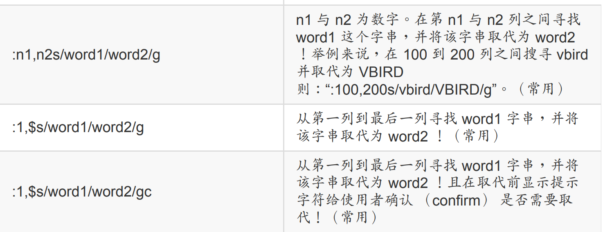
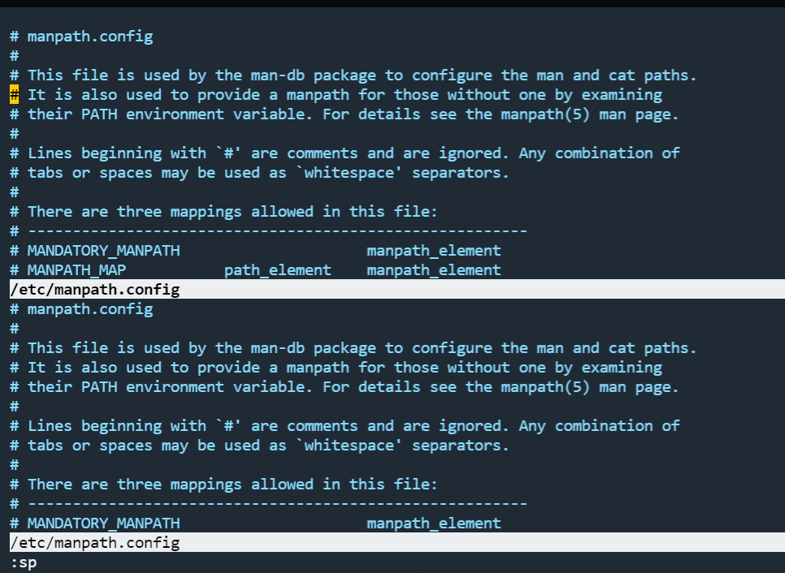
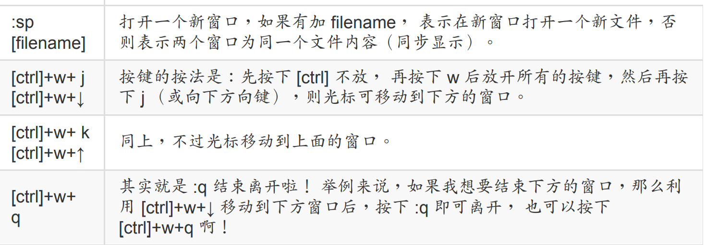
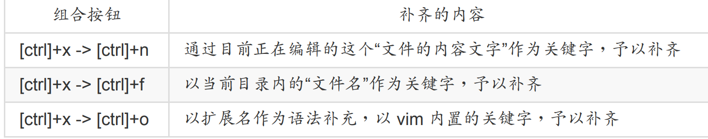
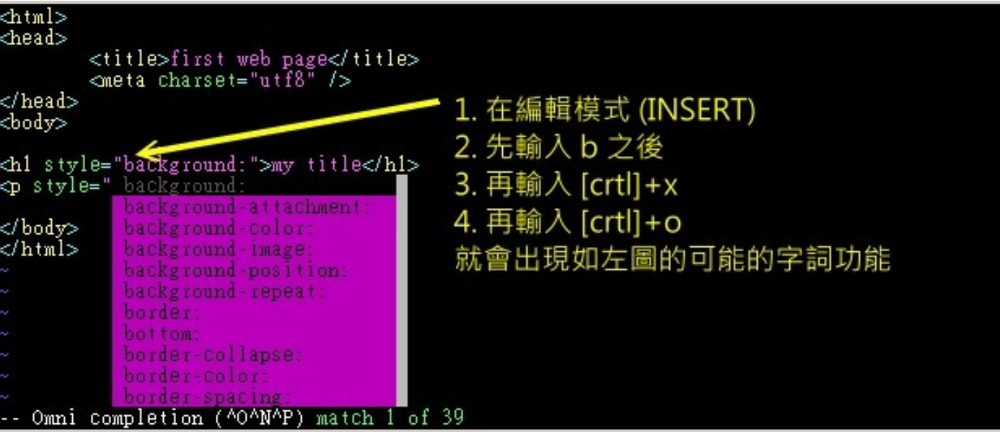
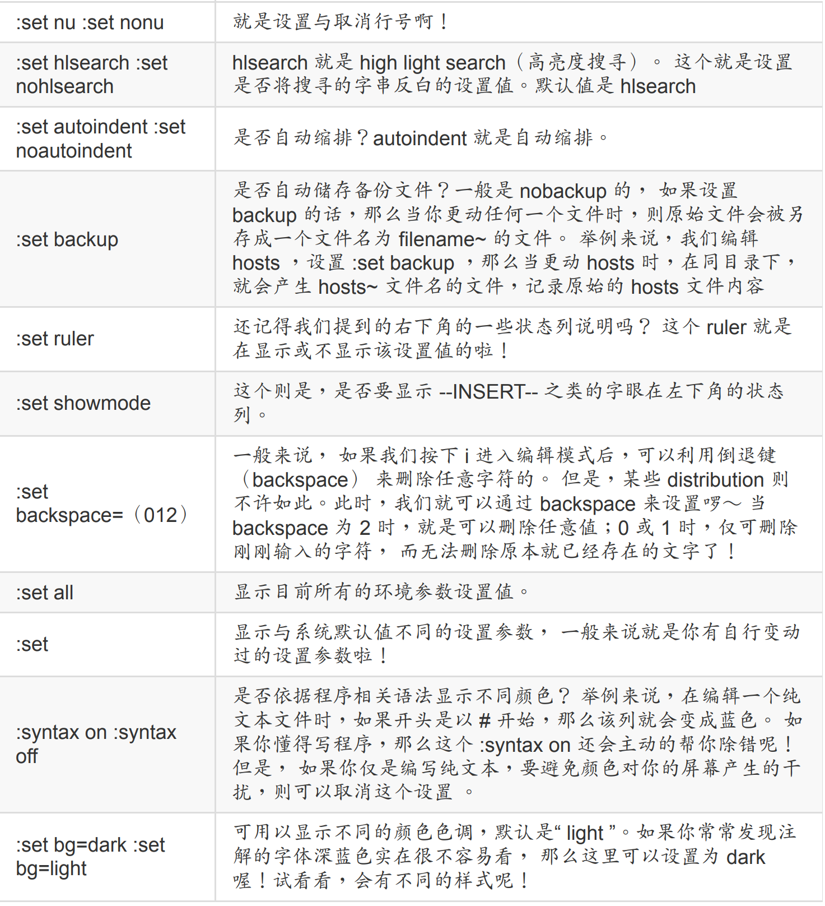
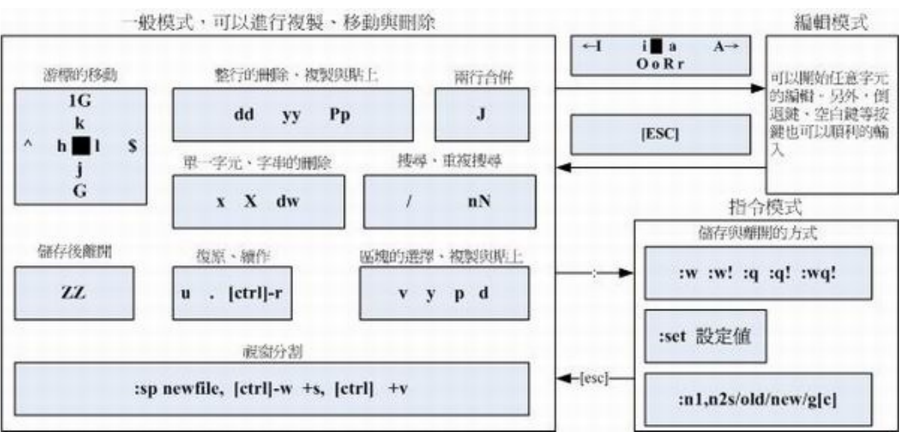

## 5.1 vi编辑器

一些常用的按键如下

- h 或 向左方向键（←） 光标向左移动一个字符

- j 或 向下方向键（↓） 光标向下移动一个字符

- k 或 向上方向键（↑） 光标向上移动一个字符

- l 或 向右方向键（→） 光标向右移动一个字符

- [Ctrl] + [f] 屏幕“向下”移动一页，相当于 [Page Down]按
  键 （常用）

- [Ctrl] + [b] 屏幕“向上”移动一页，相当于 [Page Up] 按键
  （常用）

- [Ctrl] + [d] 屏幕“向下”移动半页

- [Ctrl] + [u] 屏幕“向上”移动半页

- +光标移动到非空白字符的下一列

- -光标移动到非空白字符的上一列

- n 空格 那个 n 表示“数字”，例如 20 。按下数字后再按空白键，光标会向右移动这一列的 n 个字符。例如 20 则光标会向后面移动 20个字符距离。

- 0 或功能键[Home] 这是数字“ 0 ”：移动到这一列的最前面字符处
  （常用）

- $ 或功能键[End] 移动到这一列的最后面字符处（常用）

- H 光标移动到这个屏幕的最上方那一列的第一个字符

- M 光标移动到这个屏幕的中央那一列的第一个字符

- L 光标移动到这个屏幕的最下方那一列的第一个字符

- G 移动到这个文件的最后一列（常用）

- nG n 为数字。移动到这个文件的第 n 列。例如20G 则会移动到这个文件的第 20 列（可配合:set nu）

- gg 移动到这个文件的第一列，相当于 1G 啊！（常用）

- n n 为数字。光标向下移动 n 列（常用）

- /word 向光标之下寻找一个名称为 word 的字串。例
  如要在文件内搜寻 vbird 这个字串，就输入
  /vbird 即可！ （常用）

- ?word 向光标之上寻找一个字串名称为 word 的字串。

- n 这个 n 是英文按键。代表“重复前一个搜寻的动作”。举例来说， 如果刚刚我们执行 /vbird 去向下搜寻 vbird 这个字串，则按下n 后，会向下继续搜寻下一个名称为 vbird 的字串。如果是执行 ?vbird 的话，那么按下 n则会向上继续搜寻名称为 vbird 的字串！

- N 这个 N 是英文按键。与 n 刚好相反，为“反向”进行前一个搜寻动作。 例如 /vbird 后，按下 N 则表示“向上”搜寻 vbird 。

- 使用 /word 配合 n 及 N 是非常有帮助的！可以让你重复的找到一些你搜寻的
  关键字！

- :n1,n2s/word1/word2/g n1 与 n2 为数字。在第 n1 与 n2 列之间寻找word1 这个字串，并将该字串取代为 word2！举例来说，在 100 到 200 列之间搜寻 vbird
  并取代为 VBIRD则：“:100,200s/vbird/VBIRD/g”。（常用）



- x, X 在一列字当中，x 为向后删除一个字符 （相当于 [del] 按键）， X 为向前删除一个字符（相当于 [backspace] 亦即是倒退键） （常用）

- nx n 为数字，连续向后删除 n 个字符。举例来说，我要连续删除 10 个字符， “10x”。
  dd 删除光标所在的那一整列（常用）

- ndd n 为数字。删除光标所在的向下 n 列，例如20dd 则是删除 20 列 （常用）

- d1G 删除光标所在到第一列的所有数据

- dG 删除光标所在到最后一列的所有数据

- d 美元符 删除光标所在处，到该列的最后一个字符d0 那个是数字的 0 ，删除光标所在处，到该列的最前面一个字符

- yy 复制光标所在的那一列（常用）

- nyy n 为数字。复制光标所在的向下 n 列，例如

- 20yy 则是复制 20 列（常用）

- y1G 复制光标所在列到第一列的所有数据

- yG 复制光标所在列到最后一列的所有数据

- y0 复制光标所在的那个字符到该列行首的所有数据

- y$ 复制光标所在的那个字符到该列行尾的所有数据

- p, P p 为将已复制的数据在光标下一列贴上，P 则为贴在光标上一列！ 举例来说，我目前光标在第 20 列，且已经复制了 10 列数据。则按下 p 后， 那 10 列数据会贴在原本的 20 列之后，亦即由 21 列开始贴。但如果是按下 P呢？ 那么原本的第 20 列会被推到变成 30列。 （常用）

- J 将光标所在列与下一列的数据结合成同一列

- c 重复删除多个数据，例如向下删除 10 列，[10cj ]

- u 复原前一个动作。（常用）

- [Ctrl]+r 重做上一个动作。（常用）这个 u 与 [Ctrl]+r 是很常用的指令！一个是复原，另一个则是重做一次～ 利用这两个功能按键，你的编辑，嘿嘿！很快乐的啦！

- . 不要怀疑！这就是小数点！意思是重复前一个动作的意思。 如果你想要重复删除、重复贴上等等动作，按下小数点“.”就好了！ （常用）

## 5.2 vim的额外功能

### 5.2.1 区块选择

当我们进入浏览界面的时候，按下v就能进入选择界面，会把光输入的地方选白

- v 字符选择，会将光标经过的地方反白选择！

- V 列选择，会将光标经过的列反白选择！

- [Ctrl]+v 区块选择，可以用长方形的方式选择数据

- y 将反白的地方复制起来

- d 将反白的地方删除掉

- p 将刚刚复制的区块，在光标所在处贴上！
1. 将光标移动到第一列的 host 那个 h 上头，然后按下 [ctrl]-v ，左下角出现区块示意字样

2. 此时你可以按下“ y ”来进行复制，当你按下 y 之后，反白的区块就会消失不见啰！

3. 最后，将光标移动到第一列的最右边，并且再用编辑模式向右按两个空白键，回到一般
   指令模式后， 再按下“ p ”后，就会粘贴上去了

### 5.2.2 多文件编辑

- :n 编辑下一个文件

- :N 编辑上一个文件

- :files 列出目前这个 vim 的打开的所有文件

我们可以打开两个文件

```bash
vim test.txt test2.txt
```

3.  在 vim 中先使用“ :files ”察看一下编辑的文件数据有啥？

4. 在第一列输入“ 4yy ”复制四列；

5. 在 vim 的环境下输入“ :n ”会来到第二个编辑的文件，亦即 /etc/hosts 内；

6. 在 /etc/hosts 下按“ G ”到最后一列，再输入“ p ”贴上；

7. 按下多次的“ u ”来还原原本的文件数据；

8. 最终按下“ :q ”来离开 vim 的多文件编辑吧！

### 5.2.3 多窗口切换

让我们来测试一下，你先使用“ vim /etc/man_db.conf ”打开这个文件，然后“ 1G ”去到第一
列，之后输入“ :sp ” 再次的打开这个文件一次，然后再输入“ G ”，结果会变成下面这样喔



两个文件同时在一个屏幕上面显示，你还可以利用“[ctrl]+w+↑”及“[ctrl]+w+↓” 在两个窗口之间移动呢！这样的话，复制啊、查阅啊等等的，就变的很简单啰～ 分区窗口的相关指令功能有很多，不过你只要记得这几个就好了：



### 5.2.4 文字补全功能

主要有以下几种组合按钮



我们可以自己新建一个html文件，然后测试一下补全功能



### 5.2.5 环境记录

一些常用的命令如下



我们可以自己手动配置文件，这样下次打开就不需要在手动配置了

```bash
[dmtsai@study ~]$ vim ~/.vimrc
"这个文件的双引号 （"） 是注解
set hlsearch "高亮度反白
set backspace=2 "可随时用倒退键删除
set autoindent "自动缩排
set ruler "可显示最后一列的状态
set showmode "左下角那一列的状态
set nu "可以在每一列的最前面显示行号啦！
set bg=dark "显示不同的底色色调
syntax on "进行语法检验，颜色显示。
```

### 5.2.6 常用指令




