## 6.1 BASH

### 6.1.1 BASH的主要功能

- 命令历史功能 history命令支持，东西会放在`.bash_history`目录下

- 命令补全功能 就是`tab`

- 命令别名功能：使用`alias`就可以看到所有的别名了

- 工作控制和自动化脚本

如何判断一个指令是内部的还是外部的

```bash
[dmtsai@study ~]$ type [-tpa] name
选项与参数：
：不加任何选项与参数时，type 会显示出 name 是外部指令还是 bash 内置指令
-t ：当加入 -t 参数时，type 会将 name 以下面这些字眼显示出他的意义：
file ：表示为外部指令；
alias ：表示该指令为命令别名所设置的名称；
builtin ：表示该指令为 bash 内置的指令功能；
-p ：如果后面接的 name 为外部指令时，才会显示完整文件名；
-a ：会由 PATH 变量定义的路径中，将所有含 name 的指令都列出来，包含 alias
范例一：查询一下 ls 这个指令是否为 bash 内置？
[dmtsai@study ~]$ type ls
ls is aliased to `ls --color=auto' <==未加任何参数，列出 ls 的最主要使用情况
[dmtsai@study ~]$ type -t ls
alias <<列出 ls 执行时的依据
[dmtsai@study ~]$ type -a ls
ls is aliased to `ls --color=auto' <==< aliase
ls is /usr/bin/ls <<有找<令在 /bin/ls
范例二：那么 cd 呢？
[dmtsai@study ~]$ type cd
cd is a shell builtin <==<？ < shell 内置指令
```

### 6.1.2 指令下达

如果指令太长的话，可以使用反斜线来输出

```bash
范例：如果指令串太长的话，如何使用两行来输出？
[dmtsai@study ~]$ cp /var/spool/mail/root /etc/crontab \
> /etc/fstab /root
```

如果我们指令很长，还可以使用一些快捷键来操作指令

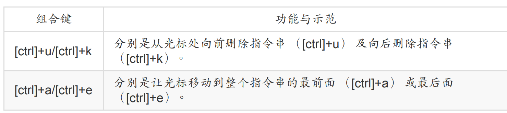

## 6.2 shell变量

### 6.2.1 变量启用与设置

```bash
[dmtsai@study ~]$ echo $variable
[dmtsai@study ~]$ echo $PATH
/usr/local/bin:/usr/bin:/usr/local/sbin:/usr/sbin:/home/dmtsai/.local/bin:/home/dmtsai/bin
[dmtsai@study ~]$ echo ${PATH} # 近年来，鸟哥比较偏向使用这种格式喔！
```

我们可以这样来设置变量

```bash
dmtsai@study ~]$ echo ${myname}
<==这里并没有任何数据～因为这个变量尚未被设置！是空的！
[dmtsai@study ~]$ myname=VBird
[dmtsai@study ~]$ echo ${myname}
VBird <==出现了！因为这个变量已经被设置了！
```

可以使用`unset`命令来取消变量，下面有一些注意事项

- 等号两边不能直接接空白字符

- 在一串指令的执行中，还需要借由其他额外的指令所提供的信息时，可以使用反单引
  号“ 指令 ”或 “$（指令）”。比如下面这两个
  
  ```bash
  version=$(uname -r)
  version=`uname -r`
  ```

- 若该变量为扩增变量内容时，则可用 "$变量名称" 或 ${变量} 累加内容，如下所示：

```bash
“PATH="$PATH":/home/bin”或“PATH=${PATH}:/home/bin”
```

- 如果变量需要在其他子程序执行，可以使用expert设置为环境变量

下面简单用实例说明一下

```bash
范例一：设置一变量 name ，且内容为 VBird
[dmtsai@study ~]$ 12name=VBird
bash: 12name=VBird: command not found... <==屏幕会显示错误！因为不能以数字开头！
[dmtsai@study ~]$ name = VBird <<是错误！因为有空白！
[dmtsai@study ~]$ name=VBird <==<啦！
范例二：承上题，若变量内容为 VBird's name 呢，就是变量内容含有特殊符号时：
[dmtsai@study ~]$ name=VBird's name
# 单引号与双引号必须要成对，在上面的设置中仅有一个单引号，因此当你按下 enter 后，
# 你还可以继续输入变量内容。这与我们所需要的功能不同，失败啦！
# 记得，失败后要复原请按下 [ctrl]-c 结束！
[dmtsai@study ~]$ name="VBird's name" <<K <
# 指令是由左边向右找→，先遇到的引号先有用，因此如上所示， 单引号变成一般字符！
[dmtsai@study ~]$ name='VBird's name' <==<！
<为前两个单引号已成对，后面就多了一个不成对的单引号了！因此也就失败了！
[dmtsai@study ~]$ name=VBird\'s\ name <<K <
#<斜线 （\） 跳脱特殊字符，例如单引号与空白键，这也是 OK 的啦！
范例三：我要在 PATH 这个变量当中“累加”:/home/dmtsai/bin 这个目录
[dmtsai@study ~]$ PATH=$PATH:/home/dmtsai/bin
[dmtsai@study ~]$ PATH="$PATH":/home/dmtsai/bin
[dmtsai@study ~]$ PATH=${PATH}:/home/dmtsai/bin
# 上面这三种格式在 PATH 里头的设置都是 OK 的！但是下面的例子就不见得啰！
范例四：承范例三，我要将 name 的内容多出 "yes" 呢？
[dmtsai@study ~]$ name=$nameyes
# 知道了吧？如果没有双引号，那么变量成了啥？name 的内容是 $nameyes 这个变量！
# 呵呵！我们可没有设置过 nameyes 这个变量呐！所以，应该是下面这样才对！
[dmtsai@study ~]$ name="$name"yes
[dmtsai@study ~]$ name=${name}yes <==<佳！<五：<刚刚设置的 name=VBird 可以用在下个 shell 的程序？
[dmtsai@study ~]$ name=VBird
[dmtsai@study ~]$ bash <<入到<程序<mt<study ~]$ echo $name <==<再次<ho<
<==嘿嘿！并没有刚刚设置的内容喔！
[dmt<study ~]$ exit <<程序<个子<[d<i@stu<]$ export name
[dmtsai@study ~]$ bash <==<谓的<
[<ai<dy ~]<ho $name <<程序<行！<ir<t;<！出现设置<
[dmtsai@stud<xi<t;==子程序：离开这个子程序<
```

### 6.2.2 环境变量功能

可以使用`env`列出所有的环境变量

- `echo $RANDOM`可以用于显示随机数

可以使用`set`来查看自定义的变量

可以使用`PS1`来设置我们BASH默认显示的环境

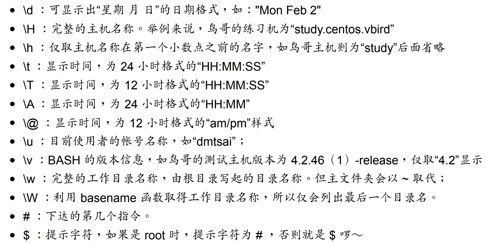

比如我们这里设置一下

```bash
PS1='[\u@\h \w \A #\#]\$ '
# 然后就变成下面这样了
[xiaoyou@dev ~ 10:13 #26]$
```

使用 `echo $$`来查看当前shell的PID

使用`echo $?`查看上个指令的回传值,如果成功的执行该指令， 则会回传一个 0 值，如果执行过程发生错误，就会回传“错误代码”才对！

### 6.2.3 语系变量

可以使用`locale -a`来查看当前系统支持的语系编码

### 6.2.3 键盘变量读取

可以使用read来读取键盘数据

```bash
[dmtsai@study ~]$ read [-pt] variable
选项与参数：
-p ：后面可以接提示字符！
-t ：后面可以接等待的“秒数！”这个比较有趣～不会一直等待使用者啦！
范例一：让使用者由键盘输入一内容，将该内容变成名为 atest 的变量
[dmtsai@study ~]$ read atest
This is a test <==此时光标会等待你输入！请输入左侧文字看看
[dmtsai@study ~]$ echo ${atest}
This is a test <<刚刚输入的数据已经变成一个变量内容！
范例二：提示使用者 30 秒内输入自己的大名，将该输入字串作为名为 named 的变量内容
[dmtsai@study ~]$ read -p "Please keyin your name: " -t 30 named
Please keyin your name: VBird Tsai <==<会有提示字符喔！
[dmtsai@study ~]$ echo ${named}
VBird Tsai <<入的<成一个变量的内容了！
```

declare 或 typeset 是一样的功能，就是在“宣告变量的类型”

```bash
[dmtsai@study ~]$ declare [-aixr] variable
选项与参数：
-a ：将后面名为 variable 的变量定义成为阵列 （array） 类型
-i ：将后面名为 variable 的变量定义成为整数数字 （integer） 类型
-x ：用法与 export 一样，就是将后面的 variable 变成环境变量；
-r ：将变量设置成为 readonly 类型，该变量不可被更改内容，也不能 unset
范例一：让变量 sum 进行 100+300+50 的加总结果
[dmtsai@study ~]$ sum=100+300+50
[dmtsai@study ~]$ echo ${sum}
100+300+50 <==咦！怎么没有帮我计算加总？因为这是文字体态的变量属性啊！
[dmtsai@study ~]$ declare -i sum=100+300+50
[dmtsai@study ~]$ echo ${sum}
450 <<乎？？
```

declare还有一些其他操作

```bash
范例二：将 sum 变成环境变量
[dmtsai@study ~]$ declare -x sum
[dmtsai@study ~]$ export | grep sum
declare -ix sum="450" <==果然出现了！包括有 i 与 x 的宣告！
范例三：让 sum 变成只读属性，不可更动！
[dmtsai@study ~]$ declare -r sum
[dmtsai@study ~]$ sum=tesgting
-bash: sum: readonly variable <<天爷～不能改这个变量了！
范例四：让 sum 变成非环境变量的自订变量吧！
[dmtsai@study ~]$ declare +x sum <==< 变成 + 可以进行“取消”动作
[dmtsai@study ~]$ declare -p sum <<-p<独列出变量的类型
declare -ir sum="450" <==<只剩< r 的类型，不具有 x 啰！
```

数组声明

```bash
范例：设置上面提到的 var[1] ～ var[3] 的变量。
[dmtsai@study ~]$ var[1]="small min"
[dmtsai@study ~]$ var[2]="big min"
[dmtsai@study ~]$ var[3]="nice min"
[dmtsai@study ~]$ echo "${var[1]}, ${var[2]}, ${var[3]}"
small min, big min, nice min
```

### 6.2.4 文件系统与程序的限制关系

```bash
[dmtsai@study ~]$ ulimit [-SHacdfltu] [配额]
选项与参数：
-H ：hard limit ，严格的设置，必定不能超过这个设置的数值；
-S ：soft limit ，警告的设置，可以超过这个设置值，但是若超过则有警告讯息。
在设置上，通常 soft 会比 hard 小，举例来说，soft 可设置为 80 而 hard
设置为 100，那么你可以使用到 90 （因为没有超过 100），但介于 80~100 之间时，
系统会有警告讯息通知你！
-a ：后面不接任何选项与参数，可列出所有的限制额度；
-c ：当某些程序发生错误时，系统可能会将该程序在内存中的信息写成文件（除错用），
这种文件就被称为核心文件（core file）。此为限制每个核心文件的最大容量。
-f ：此 shell 可以创建的最大文件大小（一般可能设置为 2GB）单位为 KBytes
-d ：程序可使用的最大断裂内存（segment）容量；
-l ：可用于锁定 （lock） 的内存量
-t ：可使用的最大 CPU 时间 （单位为秒）
-u ：单一使用者可以使用的最大程序（process）数量。
范例一：列出你目前身份（假设为一般帐号）的所有限制数据数值
[dmtsai@study ~]$ ulimit -a
core file size （blocks, -c） 0 <==只要是 0 就代表没限制
data seg size （kBytes, -d） unlimited
scheduling priority （-e） 0
file size （blocks, -f） unlimited <<创建的单一文件的大小
pending signals （-i） 4903
max locked memory （kBytes, -l） 64
max memory size （kBytes, -m） unlimited
open files （-n） 1024 <==<开的文件数量
pipe size （512 Bytes, -p） 8
POSIX message queues （Bytes, -q） 819200
real-time priority （-r） 0
stack size （kBytes, -s） 8192
cpu time （seconds, -t） unlimited
max user processes （-u） 4096
virtual memory （kBytes, -v） unlimited
file locks （-x） unlimited
范例二：限制使用者仅能创建 10MBytes 以下的容量的文件
[dmtsai@study ~]$ ulimit -f 10240
[dmtsai@study ~]$ ulimit -a | grep 'file size'
core file size （blocks, -c） 0
file size （blocks, -f） 10240 <<大量<40Kbyes，相当10MBytes
[dmtsai@study ~]$ dd if=/dev/zero of=123 bs=1M count=20
File size limit exceeded （core dumped） <==< 2<的文件，结果失败了！
[dmtsai@study ~]$ rm 123 <<快将<删除<你得要登出再次的登陆才能解开 10M 的限制
```

### 6.2.5 变量删除与取代

直接上例子

```bash
范例一：先让小写的 path 自订变量设置的与 PATH 内容相同
[dmtsai@study ~]$ path=${PATH}
[dmtsai@study ~]$ echo ${path}
/usr/local/bin:/usr/bin:/usr/local/sbin:/usr/sbin:/home/dmtsai/.local/bin:/home/dmtsai/bin
范例二：假设我不喜欢 local/bin，所以要将前 1 个目录删除掉，如何显示？
[dmtsai@study ~]$ echo ${path#/*local/bin:}
/usr/bin:/usr/local/sbin:/usr/sbin:/home/dmtsai/.local/bin:/home/dmtsai/bin
```

简单说明

```bash
${variable#/*local/bin:}
上面的特殊字体部分是关键字！用在这种删除模式所必须存在的
${variable#/*local/bin:}
这就是原本的变量名称，以上面范例二来说，这里就填写 path 这个“变量名称”啦！
${variable#/*local/bin:}
这是重点！代表“从变量内容的最前面开始向右删除”，且仅删除最短的那个
${variable#/*local/bin:}
代表要被删除的部分，由于 # 代表由前面开始删除，所以这里便由开始的 / 写起。
需要注意的是，我们还可以通过万用字符 * 来取代 0 到无穷多个任意字符
以上面范例二的结果来看， path 这个变量被删除的内容如下所示：
/usr/local/bin:/usr/bin:/usr/local/sbin:/usr/sbin:/home/dmtsai/.local/bin:/home/dmtsai/bin
```

更多范例

```bash
范例三：我想要删除前面所有的目录，仅保留最后一个目录
[dmtsai@study ~]$ echo ${path#/*:}
/usr/bin:/usr/local/sbin:/usr/sbin:/home/dmtsai/.local/bin:/home/dmtsai/bin
# 由于一个 # 仅删除掉最短的那个，因此他删除的情况可以用下面的删除线来看：
# /usr/local/bin:/usr/bin:/usr/local/sbin:/usr/sbin:/home/dmtsai/.local/bin:/home/dmtsai/bin
[dmtsai@study ~]$ echo ${path##/*:}
/home/dmtsai/bin
# 嘿！多加了一个 # 变成 ## 之后，他变成“删除掉最长的那个数据”！亦即是：
# /usr/local/bin:/usr/bin:/usr/local/sbin:/usr/sbin:/home/dmtsai/.local/bin:/home/dm
范例四：我想要删除最后面那个目录，亦即从 : 到 bin 为止的字串
[dmtsai@study ~]$ echo ${path%:*bin}
/usr/local/bin:/usr/bin:/usr/local/sbin:/usr/sbin:/home/dmtsai/.local/bin
# 注意啊！最后面一个目录不见去！
# 这个 % 符号代表由最后面开始向前删除！所以上面得到的结果其实是来自如下：
# /usr/local/bin:/usr/bin:/usr/local/sbin:/usr/sbin:/home/dmtsai/.local/bin:/home/dmtsai/bin
范例五：那如果我只想要保留第一个目录呢？
[dmtsai@study ~]$ echo ${path%%:*bin}
/usr/local/bin
# 同样的， %% 代表的则是最长的符合字串，所以结果其实是来自如下：
# /usr/local/bin:/usr/bin:/usr/local/sbin:/usr/sbin:/home/dmtsai/.local/bin:/home/dmtsai/bintsai/bin
```

还有一个变量取代功能

```bash
例六：将 path 的变量内容内的 sbin 取代成大写 SBIN：
[dmtsai@study ~]$ echo ${path/sbin/SBIN}
/usr/local/bin:/usr/bin:/usr/local/SBIN:/usr/sbin:/home/dmtsai/.local/bin:/home/dmtsai/bin
# 这个部分就容易理解的多了！关键字在于那两个斜线，两斜线中间的是旧字串
# 后面的是新字串，所以结果就会出现如上述的特殊字体部分啰！
[dmtsai@study ~]$ echo ${path//sbin/SBIN}
/usr/local/bin:/usr/bin:/usr/local/SBIN:/usr/SBIN:/home/dmtsai/.local/bin:/home/dmtsai/bin
# 如果是两条斜线，那么就变成所有符合的内容都会被取代喔！
```

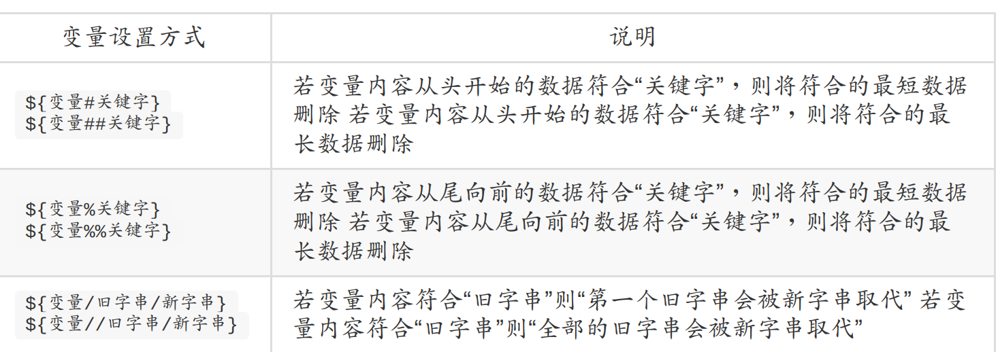

如果变量不存在可以自己手动判断一下

```bash
范例一：测试一下是否存在 username 这个变量，若不存在则给予 username 内容为 root
[dmtsai@study ~]$ echo ${username}
<==由于出现空白，所以 username 可能不存在，也可能是空字串
[dmtsai@study ~]$ username=${username-root}
[dmtsai@study ~]$ echo ${username}
root <<为 username 没有设置，所以主动给予名为 root 的内容。
[dmtsai@study ~]$ username="vbird tsai" <==< username 的内容
[dmtsai@study ~]$ username=${username-root}
[dmtsai@study ~]$ echo ${username}
vbird tsai <<为 <name 已经设置了，所以使用旧有的设置而不以 root 取代
```

另外如果变量是空字符串，可以用下面这种解决方式

```bash
范例二：若 username 未设置或为空字串，则将 username 内容设置为 root
[dmtsai@study ~]$ username=""
[dmtsai@study ~]$ username=${username-root}
[dmtsai@study ~]$ echo ${username}
<==因为 username 被设置为空字串了！所以当然还是保留为空字串！
[dmtsai@study ~]$ username=${username:-root}
[dmtsai@study ~]$ echo ${username}
root <<上“ : ”后若变量内容为空或者是未设置，都能够以后面的内容替换！
```

详细的规则如下

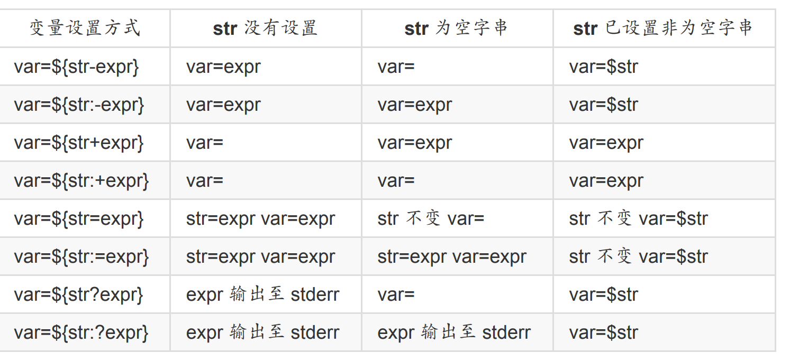

## 6.3 变量别名与历史命令

### 6.3.1 别名设置

如果想让`lm`来替代`ls -al | more`可以这样操作

```bash
[dmtsai@study ~]$ alias lm='ls -al|more'
```

如果想去掉别名可以这样

```bash
[dmtsai@study ~]$ unalias lm
```

### 6.2.2 history使用

```bash
[dmtsai@study ~]$ history [n]
[dmtsai@study ~]$ history [-c]
[dmtsai@study ~]$ history [-raw] histfiles
选项与参数：
n ：数字，意思是“要列出最近的 n 笔命令列表”的意思！
-c ：将目前的 shell 中的所有 history 内容全部消除
-a ：将目前新增的 history 指令新增入 histfiles 中，若没有加 histfiles ，
则默认写入 ~/.bash_history
-r ：将 histfiles 的内容读到目前这个 shell 的 history 记忆中；
-w ：将目前的 history 记忆内容写入 histfiles 中！
范例一：列出目前内存内的所有 history 记忆
[dmtsai@study ~]$ history
# 前面省略
1017 man bash
1018 ll
1019 history
1020 history
# 列出的信息当中，共分两栏，第一栏为该指令在这个 shell 当中的代码，
# 另一个则是指令本身的内容喔！至于会秀出几笔指令记录，则与 HISTSIZE 有关！
范例二：列出目前最近的 3 笔数据
[dmtsai@study ~]$ history 3
1019 history
1020 history
1021 history 3
范例三：立刻将目前的数据写入 histfile 当中
[dmtsai@study ~]$ history -w
# 在默认的情况下，会将历史纪录写入 ~/.bash_history 当中！
[dmtsai@study ~]$ echo ${HISTSIZE}
1000
```

除了这些还有另外一个关键词

```bash
[dmtsai@study ~]$ !number
[dmtsai@study ~]$ !command
[dmtsai@study ~]$ !!
选项与参数：
number ：执行第几笔指令的意思；
command ：由最近的指令向前搜寻“指令串开头为 command”的那个指令，并执行；
!! ：就是执行上一个指令（相当于按↑按键后，按 Enter）
[dmtsai@study ~]$ history
66 man rm
67 alias
68 man history
69 history
[dmtsai@study ~]$ !66 <==执行第 66 笔指令
[dmtsai@study ~]$ !! <<行上一个指令，本例中亦即 !66
[dmtsai@study ~]$ !al <==<以 al 为开头的指令（上头列出的第 67 个）
```

## 6.4 BASH 操作环境

### 6.4.1 执行顺序

1. 以相对/绝对路径执行指令，例如“ /bin/ls ”或“ ./ls ”；
2. 由 alias 找到该指令来执行；
3. 由 bash 内置的 （builtin） 指令来执行；
4. 通过 $PATH 这个变量的顺序搜寻到的第一个指令来执行。

我们可以简单验证一下

```bash
[dmtsai@study ~]$ alias echo='echo -n'
[dmtsai@study ~]$ type -a echo
echo is aliased to `echo -n'
echo is a shell builtin
echo is /usr/bin/echo
```

### 6.4.2 欢迎信息

我们可以这样去查看欢迎信息

```bash
[dmtsai@study ~]$ cat /etc/issue
\S
Kernel \r on an \m
```

issue内各代码的意义如下

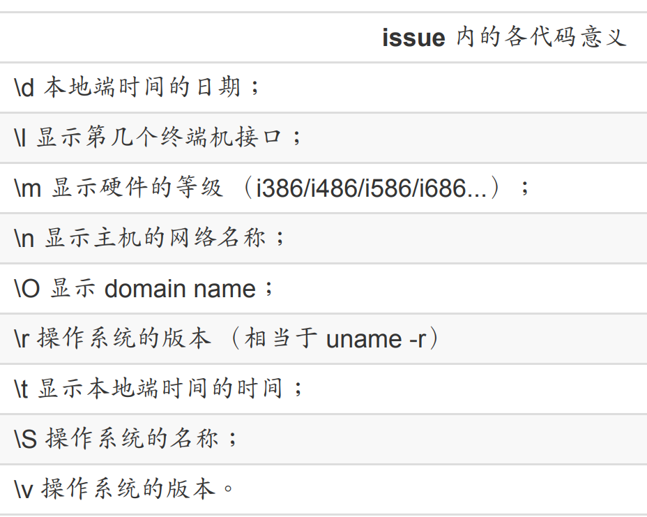

另外还有一个`/etc/issue.net`这个是给telnet来登录使用的

### 6.4.3 环境配置文件

shell有两种

- login shell：取得 bash 时需要完整的登陆流程的，就称为 login shell。举例来说，你要由tty1 ~ tty6 登陆，需要输入使用者的帐号与密码，此时取得的 bash 就称为“ login shell”啰；

- non-login shell：取得 bash 接口的方法不需要重复登陆的举动，举例来说，（1）你以 Xwindow 登陆 Linux 后， 再以 X 的图形化接口启动终端机，此时那个终端接口并没有需要再次的输入帐号与密码，那个 bash 的环境就称为 non-login shell了。（2）你在原本的 bash 环境下再次下达 bash 这个指令，同样的也没有输入帐号密码， 那第二个 bash（子程序） 也是 non-login shell 。

/etc/profile （login shell 才会读）

- /etc/profile.d/*.sh

其实这是个目录内的众多文件！只要在 /etc/profile.d/ 这个目录内且扩展名为 .sh ，另外，使用者能够具有 r 的权限， 那么该文件就会被 /etc/profile 调用进来。在 CentOS 7.x 中，这个目录下面的文件规范了 bash 操作接口的颜色、 语系、ll 与 ls 指令的命令别名、vi 的命令别名、which 的命令别名等等。如果你需要帮所有使用者设置一些共享的命令别名时， 可以在这个目录下面自行创建扩展名为 .sh 的文件，并将所需要的数据写入即可喔！

- /etc/locale.conf

这个文件是由 /etc/profile.d/lang.sh 调用进来的！这也是我们决定 bash 默认使用何种语系的重要配置文件！ 文件里最重要的就是 LANG/LC_ALL 这些个变量的设置啦！我们在前面的
locale 讨论过这个文件啰！ 自行回去瞧瞧先！

- /usr/share/bash-completion/completions/*

记得我们上头谈过 [tab] 的妙用吧？除了命令补齐、文件名补齐之外，还可以进行指令的选项/参数补齐功能！那就是从这个目录里面找到相对应的指令来处理的！ 其实这个目录下面的内容是由 /etc/profile.d/bash_completion.sh 这个文件载入的啦！
反正你只要记得，bash 的 login shell 情况下所读取的整体环境配置文件其实只有
/etc/profile，但是 /etc/profile 还会调用出其他的配置文件，所以让我们的 bash 操作接口变的非常的友善啦！ 接下来，让我们来瞧瞧，那么个人偏好的配置文件又是怎么回事？

- ~/.bash_profile （login shell 才会读）

bash 在读完了整体环境设置的 /etc/profile 并借此调用其他配置文件后，接下来则是会读取使用者的个人配置文件。 在 login shell 的 bash 环境中，所读取的个人偏好配置文件其实主要有三个，依序分别是：

1. ~/.bash_profile
2. ~/.bash_login
3. ~/.profile

整个流程如下

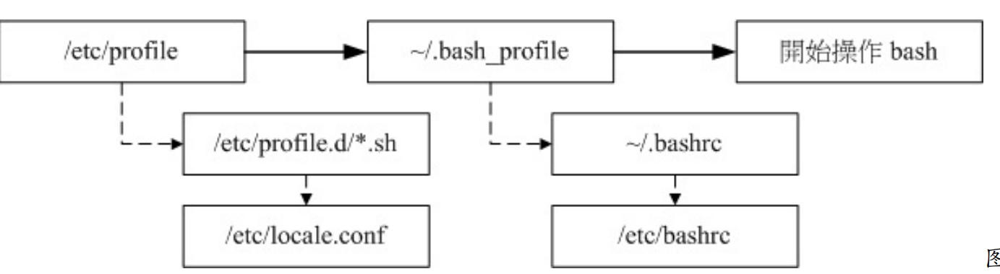


我们可以使用source来读取环境配置文件

```bash
[dmtsai@study ~]$ source 配置文件文件名
范例：将主文件夹的 ~/.bashrc 的设置读入目前的 bash 环境中
[dmtsai@study ~]$ source ~/.bashrc <==下面这两个指令是一样的！
[dmtsai@study ~]$ . ~/.bashrc
```

~/.bashrc （non-login shell 会读）
谈完了 login shell 后，那么 non-login shell 这种非登陆情况取得 bash 操作接口的环境配置文件又是什么？ 当你取得 non-login shell 时，该 bash 配置文件仅会读取 ~/.bashrc 而已啦！

~/.bash_history

还记得我们在历史命令提到过这个文件吧？默认的情况下， 我们的历史命令就记录在这里
啊！而这个文件能够记录几笔数据，则与 HISTFILESIZE 这个变量有关啊。每次登陆 bash
后，bash 会先读取这个文件，将所有的历史指令读入内存， 因此，当我们登陆 bash 后就可以查知上次使用过哪些指令啰。

~/.bash_logout

这个文件则记录了“当我登出 bash 后，系统再帮我做完什么动作后才离开”的意思。 你可以去读取一下这个文件的内容，默认的情况下，登出时， bash 只是帮我们清掉屏幕的讯息而已。不过，你也可以将一些备份或者是其他你认为重要的工作写在这个文件中 （例如清空暂存盘）， 那么当你离开 Linux 的时候，就可以解决一些烦人的事情啰！

### 6.4.4 终端环境

么如何查阅目前的一些按键内容呢？可以利用 stty （setting tty 终端机的意思） 呢！ stty
也可以帮助设置终端机的输入按键代表意义喔！

```bash
[dmtsai@study ~]$ stty [-a]
选项与参数：
-a ：将目前所有的 stty 参数列出来；
范例一：列出所有的按键与按键内容
[dmtsai@study ~]$ stty -a
```

几个比较重要的有

- ntr : 送出一个 interrupt （中断） 的讯号给目前正在 run 的程序 （就是终止啰！）；

- quit : 送出一个 quit 的讯号给目前正在 run 的程序；

- erase : 向后删除字符，

- kill : 删除在目前命令行上的所有文字；

- eof : End of file 的意思，代表“结束输入”。

- start : 在某个程序停止后，重新启动他的 output

- stop : 停止目前屏幕的输出；

- susp : 送出一个 terminal stop 的讯号给正在 run 的程序

我们可以使用set来手动设置一些环境

```bash
[dmtsai@study ~]$ set [-uvCHhmBx]
选项与参数：
-u ：默认不启用。若启用后，当使用未设置变量时，会显示错误讯息；
-v ：默认不启用。若启用后，在讯息被输出前，会先显示讯息的原始内容；
-x ：默认不启用。若启用后，在指令被执行前，会显示指令内容（前面有 ++ 符号）
-h ：默认启用。与历史命令有关；
-H ：默认启用。与历史命令有关；
-m ：默认启用。与工作管理有关；
-B ：默认启用。与刮号 [] 的作用有关；
-C ：默认不启用。若使用> 等，则若文件存在时，该文件不会被覆盖。
范例一：显示目前所有的 set 设置值
[dmtsai@study ~]$ echo $-
himBH
# 那个 $- 变量内容就是 set 的所有设置啦！ bash 默认是 himBH 喔！
范例二：设置 "若使用未定义变量时，则显示错误讯息"
[dmtsai@study ~]$ set -u
[dmtsai@study ~]$ echo $vbirding
-bash: vbirding: unbound variable
# 默认情况下，未设置/未宣告 的变量都会是“空的”，不过，若设置 -u 参数，
# 那么当使用未设置的变量时，就会有问题啦！很多的 shell 都默认启用 -u 参数。
# 若要取消这个参数，输入 set +u 即可！
范例三：执行前，显示该指令内容。
[dmtsai@study ~]$ set -x
++ printf '\033]0;%s@%s:%s\007' dmtsai study '~' # 这个是在列出提示字符的控制码！
[dmtsai@study ~]$ echo ${HOME}
+ echo /home/dmtsai
/home/dmtsai
++ printf '\033]0;%s@%s:%s\007' dmtsai study '~'
# 看见否？要输出的指令都会先被打印到屏幕上喔！前面会多出 + 的符号！
```

最后这里简单贴一下默认组合键

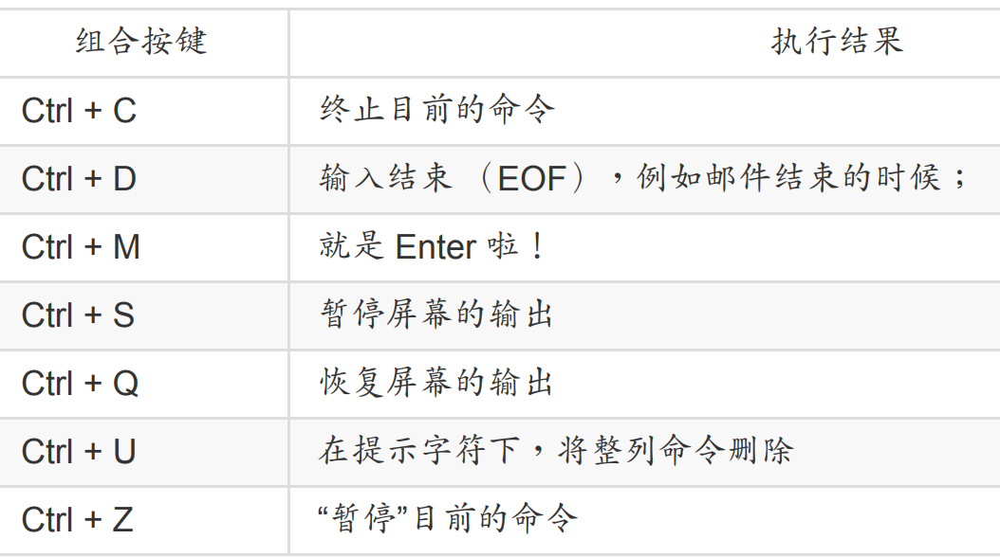

### 6.4.5 通配字符

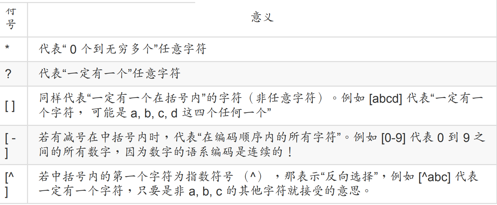

除了通配字符，linux还有一些特殊的符号

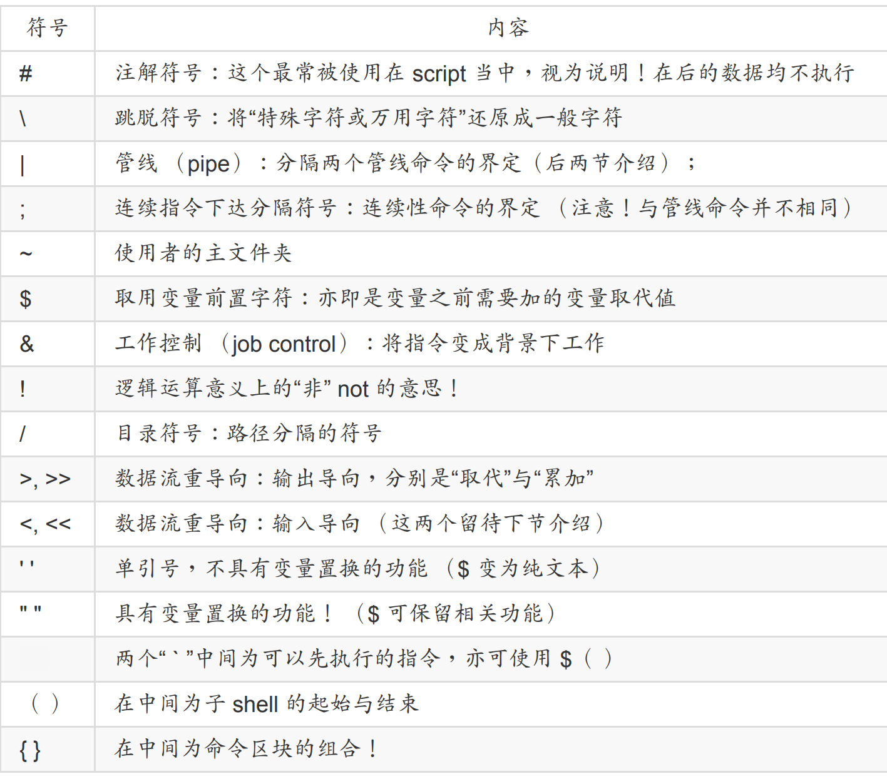

## 6.5 数据流重定向

### 6.5.1 简单介绍

首先有一些特殊字符

- 标准输入 （stdin） ：代码为 0 ，使用 < 或 << ；

- 标准输出 （stdout）：代码为 1 ，使用 > 或 >> ；

- 标准错误输出（stderr）：代码为 2 ，使用 2> 或 2>> ；

先来一个简单的例子

```bash
范例一：观察你的系统根目录 （/） 下各目录的文件名、权限与属性，并记录下来
[dmtsai@study ~]$ ll / <==此时屏幕会显示出文件名信息
[dmtsai@study ~]$ ll / > ~/rootfile <==屏幕并无任何信息
[dmtsai@study ~]$ ll ~/rootfile <==有个新文件被创建了！
-rw-rw-r--. 1 dmtsai dmtsai 1078 Jul 9 18:51 /home/dmtsai/rootfile
```

默认情况下>会覆盖数据，如果我们想累加的话可以使用>>

比如这样`ll >> ~/rootfile`

- 1> ：以覆盖的方法将“正确的数据”输出到指定的文件或设备上；

- 1>>：以累加的方法将“正确的数据”输出到指定的文件或设备上；

- 2> ：以覆盖的方法将“错误的数据”输出到指定的文件或设备上；

- 2>>：以累加的方法将“错误的数据”输出到指定的文件或设备上；

如果我们想把错误数据丢弃可以直接放到`/dev/null`中

```bash
范例四：承范例三，将错误的数据丢弃，屏幕上显示正确的数据
[dmtsai@study ~]$ find /home -name .bashrc 2> /dev/null
/home/dmtsai/.bashrc <==只有 stdout 会显示到屏幕上， stderr 被丢弃了
```

如果想把正确和错误的数据都写到同一个文件中可以这样

```bash
范例五：将指令的数据全部写入名为 list 的文件中
[dmtsai@study ~]$ find /home -name .bashrc > list 2> list <==错误
[dmtsai@study ~]$ find /home -name .bashrc > 2>&1 <==正确
[dmtsai@study ~]$ find /home -name .bashrc &> list <= 正确
```

你可以使用 2>&1 也可以使用 &> ！ 一般来说，鸟哥比较习惯使用2>&1 的语法啦！

前面是输出，下面简单讲一下输入，也就是原本由键盘输入的，现在改成从文件中输入

```bash
范例六：利用 cat 指令来创建一个文件的简单流程
[dmtsai@study ~]$ cat > catfile
testing
cat file test
<==这里按下 [ctrl]+d 来离开
[dmtsai@study ~]$ cat catfile
testing
cat file test
```

上面是我吗手动输入的，下面我们可以改成从文件中输入

```bash
范例七：用 stdin 取代键盘的输入以创建新文件的简单流程
[dmtsai@study ~]$ cat > catfile < ~/.bashrc
[dmtsai@study ~]$ ll catfile ~/.bashrc
-rw-r--r--. 1 dmtsai dmtsai 231 Mar 6 06:06 /home/dmtsai/.bashrc
-rw-rw-r--. 1 dmtsai dmtsai 231 Jul 9 18:58 catfile
# 注意看，这两个文件的大小会一模一样！几乎像是使用 cp 来复制一般！
```

那么两个<<代表啥意思呢？

```bash
[dmtsai@study ~]$ cat > catfile << "eof"
> This is a test.
> OK now stop
> eof <==输入这关键字，立刻就结束而不需要输入 [ctrl]+d
[dmtsai@study ~]$ cat catfile
This is a test.
OK now stop <==只有这两行，不会存在关键字那一行！
```

利用 << 右侧的控制字符，我们可以终止一次输入， 而不必输入 [crtl]+d 来结束哩！这对程序写作很有帮助喔！

> 既然有 2>&1 来将 2> 转到 1> 去，那么应该也会有 1>&2 吧?有的

### 6.5.2 命令执行判断依据

在某些时候，我们希望可以一次执行多个指令，例如在关机的时候我希望可以先执行两次
sync 同步化写入磁盘后才 shutdown 计算机，那么可以怎么作呢？这样做呀：

```bash
[root@study ~]# sync; sync; shutdown -h now
```

万一我想要在某个目录下面创建一个文件，也就是说，如果该目录存在的话， 那我才创建这个文件，如果不存在，那就算了。也就是说这两个指令彼此之间是有相关性的， 前一个指令是否成功的执行与后一个指令是否要执行有关！那就得动用到 && 或 || 啰！

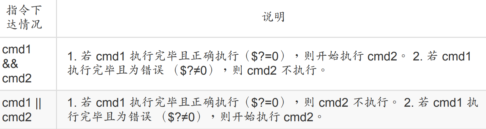

简单例子

```bash
范例一：使用 ls 查阅目录 /tmp/abc 是否存在，若存在则用 touch 创建 /tmp/abc/hehe
[dmtsai@study ~]$ ls /tmp/abc && touch /tmp/abc/hehe
ls: cannot access /tmp/abc: No such file or directory
# ls 很干脆的说明找不到该目录，但并没有 touch 的错误，表示 touch 并没有执行
[dmtsai@study ~]$ mkdir /tmp/abc
[dmtsai@study ~]$ ls /tmp/abc && touch /tmp/abc/hehe
[dmtsai@study ~]$ ll /tmp/abc
-rw-rw-r--. 1 dmtsai dmtsai 0 Jul 9 19:16 hehe
```

## 6.6 管道

假设我们想要知道 /etc/ 下面有多少文件，那么可以利用 ls /etc 来查阅，不过， 因为 /etc 下
面的文件太多，导致一口气就将屏幕塞满了～不知道前面输出的内容是啥？此时，我们可以
通过 less 指令的协助，利用：

```bash
[dmtsai@study ~]$ ls -al /etc | less
```

我们可以这样理解

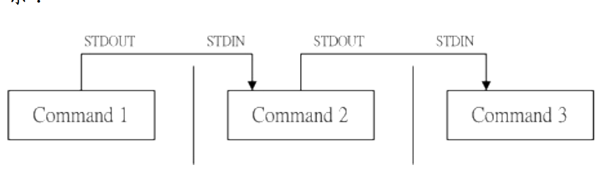

### 6.6.1截取命令

```bash
[dmtsai@study ~]$ cut -d'分隔字符' -f fields <==用于有特定分隔字符
[dmtsai@study ~]$ cut -c 字符区间 <==用于排列整齐的讯息
选项与参数：
-d ：后面接分隔字符。与 -f 一起使用；
-f ：依据 -d 的分隔字符将一段讯息分区成为数段，用 -f 取出第几段的意思；
-c ：以字符 （characters） 的单位取出固定字符区间；
范例一：将 PATH 变量取出，我要找出第五个路径。
[dmtsai@study ~]$ echo ${PATH}
/usr/local/bin:/usr/bin:/usr/local/sbin:/usr/sbin:/home/dmtsai/.local/bin:/home/dmtsai/bin
# 1 | 2 | 3 | 4 | 5 | 6 |
[dmtsai@study ~]$ echo ${PATH} | cut -d ':' -f 5
# 如同上面的数字显示，我们是以“ : ”作为分隔，因此会出现 /home/dmtsai/.local/bin
# 那么如果想要列出第 3 与第 5 呢？，就是这样：
[dmtsai@study ~]$ echo ${PATH} | cut -d ':' -f 3,5
范例二：将 export 输出的讯息，取得第 12 字符以后的所有字串
[dmtsai@study ~]$ export
declare -x HISTCONTROL="ignoredups"
declare -x HISTSIZE="1000"
declare -x HOME="/home/dmtsai"
declare -x HOSTNAME="study.centos.vbird"
.....（其他省略）.....
# 注意看，每个数据都是排列整齐的输出！如果我们不想要“ declare -x ”时，就得这么做：
[dmtsai@study ~]$ export | cut -c 12-
HISTCONTROL="ignoredups"
HISTSIZE="1000"
HOME="/home/dmtsai"
HOSTNAME="study.centos.vbird"
.....（其他省略）.....
# 知道怎么回事了吧？用 -c 可以处理比较具有格式的输出数据！
# 我们还可以指定某个范围的值，例如第 12-20 的字符，就是 cut -c 12-20 等等！
范例三：用 last 将显示的登陆者的信息中，仅留下使用者大名
[dmtsai@study ~]$ last
root pts/1 192.168.201.101 Sat Feb 7 12:35 still logged in
root pts/1 192.168.201.101 Fri Feb 6 12:13 - 18:46 （06:33）
root pts/1 192.168.201.254 Thu Feb 5 22:37 - 23:53 （01:16）
# last 可以输出“帐号/终端机/来源/日期时间”的数据，并且是排列整齐的
[dmtsai@study ~]$ last | cut -d ' ' -f 1
# 由输出的结果我们可以发现第一个空白分隔的字段代表帐号，所以使用如上指令：
# 但是因为 root pts/1 之间空格有好几个，并非仅有一个，所以，如果要找出
# pts/1 其实不能以 cut -d ' ' -f 1,2 喔！输出的结果会不是我们想要的。
```

cut是只取出我们想要的，如果想把行拿出来，使用grep

```bash
[dmtsai@study ~]$ grep [-acinv] [--color=auto] '搜寻字串' filename
选项与参数：
-a ：将 binary 文件以 text 文件的方式搜寻数据
-c ：计算找到 '搜寻字串' 的次数
-i ：忽略大小写的不同，所以大小写视为相同
-n ：顺便输出行号
-v ：反向选择，亦即显示出没有 '搜寻字串' 内容的那一行！
--color=auto ：可以将找到的关键字部分加上颜色的显示喔！
范例一：将 last 当中，有出现 root 的那一行就取出来；
[dmtsai@study ~]$ last | grep 'root'
范例二：与范例一相反，只要没有 root 的就取出！
[dmtsai@study ~]$ last | grep -v 'root'
范例三：在 last 的输出讯息中，只要有 root 就取出，并且仅取第一栏
[dmtsai@study ~]$ last | grep 'root' |cut -d ' ' -f1
# 在取出 root 之后，利用上个指令 cut 的处理，就能够仅取得第一栏啰！
范例四：取出 /etc/man_db.conf 内含 MANPATH 的那几行
[dmtsai@study ~]$ grep --color=auto 'MANPATH' /etc/man_db.conf
....（前面省略）....
MANPATH_MAP /usr/games /usr/share/man
MANPATH_MAP /opt/bin /opt/man
MANPATH_MAP /opt/sbin /opt/man
# 神奇的是，如果加上 --color=auto 的选项，找到的关键字部分会用特殊颜色显示喔！
```

### 6.6.2 排序命令

首先时sort命令

```bash
[dmtsai@study ~]$ sort [-fbMnrtuk] [file or stdin]
选项与参数：
-f ：忽略大小写的差异，例如 A 与 a 视为编码相同；
-b ：忽略最前面的空白字符部分；
-M ：以月份的名字来排序，例如 JAN, DEC 等等的排序方法；
-n ：使用“纯数字”进行排序（默认是以文字体态来排序的）；
-r ：反向排序；
-u ：就是 uniq ，相同的数据中，仅出现一行代表；
-t ：分隔符号，默认是用 [tab] 键来分隔；
-k ：以那个区间 （field） 来进行排序的意思
范例一：个人帐号都记录在 /etc/passwd 下，请将帐号进行排序。
[dmtsai@study ~]$ cat /etc/passwd | sort
abrt:x:173:173::/etc/abrt:/sbin/nologin
adm:x:3:4:adm:/var/adm:/sbin/nologin
alex:x:1001:1002::/home/alex:/bin/bash
# 鸟哥省略很多的输出～由上面的数据看起来， sort 是默认“以第一个”数据来排序，
# 而且默认是以“文字”型态来排序的喔！所以由 a 开始排到最后啰！
范例二：/etc/passwd 内容是以 : 来分隔的，我想以第三栏来排序，该如何？
[dmtsai@study ~]$ cat /etc/passwd | sort -t ':' -k 3
root:x:0:0:root:/root:/bin/bash
dmtsai:x:1000:1000:dmtsai:/home/dmtsai:/bin/bash
alex:x:1001:1002::/home/alex:/bin/bash
arod:x:1002:1003::/home/arod:/bin/bash
# 看到特殊字体的输出部分了吧？怎么会这样排列啊？呵呵！没错啦～
# 如果是以文字体态来排序的话，原本就会是这样，想要使用数字排序：
# cat /etc/passwd | sort -t ':' -k 3 -n
# 这样才行啊！用那个 -n 来告知 sort 以数字来排序啊！
范例三：利用 last ，将输出的数据仅取帐号，并加以排序
[dmtsai@study ~]$ last | cut -d ' ' -f1 | sort

```

排序完后如果我们想让重复的数据只显示一列可以使用uniq

```bash
[dmtsai@study ~]$ uniq [-ic]
选项与参数：
-i ：忽略大小写字符的不同；
-c ：进行计数
范例一：使用 last 将帐号列出，仅取出帐号栏，进行排序后仅取出一位；
[dmtsai@study ~]$ last | cut -d ' ' -f1 | sort | uniq
范例二：承上题，如果我还想要知道每个人的登陆总次数呢？
[dmtsai@study ~]$ last | cut -d ' ' -f1 | sort | uniq -c
1
6 （unknown
47 dmtsai
4 reboot
7 root
1 wtmp
# 从上面的结果可以发现 reboot 有 4 次， root 登陆则有 7 次！大部分是以 dmtsai 来操作！
# wtmp 与第一行的空白都是 last 的默认字符，那两个可以忽略的！

```

如果想知道多少文字，可以使用wc命令来判断

```bash
[dmtsai@study ~]$ wc [-lwm]
选项与参数：
-l ：仅列出行；
-w ：仅列出多少字（英文单字）；
-m ：多少字符；
范例一：那个 /etc/man_db.conf 里面到底有多少相关字、行、字符数？
[dmtsai@study ~]$ cat /etc/man_db.conf | wc
131 723 5171
# 输出的三个数字中，分别代表： “行、字数、字符数”
范例二：我知道使用 last 可以输出登陆者，但是 last 最后两行并非帐号内容，那么请问，
我该如何以一行指令串取得登陆系统的总人次？
[dmtsai@study ~]$ last | grep [a-zA-Z] | grep -v 'wtmp' | grep -v 'reboot' | \
< grep -v 'unknown'| wc -l
# 由于 last 会输出空白行, wtmp, unknown, reboot 等无关帐号登陆的信息，因此，我利用
# grep 取出非空白行，以及去除上述关键字那几行，再计算行数，就能够了解啰！

```

### 6.6.3 双向重导向

tee 会同时将数据流分送到文件去与屏幕 （screen）；而输出到屏幕的，其实就是 stdout，那就可以让下个指令继续处理喔！

```bash
[dmtsai@study ~]$ tee [-a] file
选项与参数：
-a ：以累加 （append） 的方式，将数据加入 file 当中！
[dmtsai@study ~]$ last | tee last.list | cut -d " " -f1
# 这个范例可以让我们将 last 的输出存一份到 last.list 文件中；
[dmtsai@study ~]$ ls -l /home | tee ~/homefile | more
# 这个范例则是将 ls 的数据存一份到 ~/homefile ，同时屏幕也有输出讯息！
[dmtsai@study ~]$ ls -l / | tee -a ~/homefile |more
# 要注意！ tee 后接的文件会被覆盖，若加上 -a 这个选项则能将讯息累加。
```

### 6.6.4 字符串转换命令

tr 可以用来删除一段讯息当中的文字，或者是进行文字讯息的替换！

```bash
[dmtsai@study ~]$ tr [-ds] SET1 ...
选项与参数：
-d ：删除讯息当中的 SET1 这个字串；
-s ：取代掉重复的字符！
范例一：将 last 输出的讯息中，所有的小写变成大写字符：
[dmtsai@study ~]$ last | tr '[a-z]' '[A-Z]'
# 事实上，没有加上单引号也是可以执行的，如：“ last | tr [a-z] [A-Z] ”
范例二：将 /etc/passwd 输出的讯息中，将冒号 （:） 删除
[dmtsai@study ~]$ cat /etc/passwd | tr -d ':'
范例三：将 /etc/passwd 转存成 dos 断行到 /root/passwd 中，再将 ^M 符号删除
[dmtsai@study ~]$ cp /etc/passwd ~/passwd && unix2dos ~/passwd
[dmtsai@study ~]$ file /etc/passwd ~/passwd
/etc/passwd: ASCII text
/home/dmtsai/passwd: ASCII text, with CRLF line terminators <==就是 DOS 断行
[dmtsai@study ~]$ cat ~/passwd | tr -d '\r' > ~/passwd.linux
# 那个 \r 指的是 DOS 的断行字符，关于更多的字符，请参考 man tr
[dmtsai@study ~]$ ll /etc/passwd ~/passwd*
-rw-r--r--. 1 root root 2092 Jun 17 00:20 /etc/passwd
-rw-r--r--. 1 dmtsai dmtsai 2133 Jul 9 22:13 /home/dmtsai/passwd
-rw-rw-r--. 1 dmtsai dmtsai 2092 Jul 9 22:13 /home/dmtsai/passwd.linux
# 处理过后，发现文件大小与原本的 /etc/passwd 就一致了！
```

```bash
[dmtsai@study ~]$ col [-xb]
选项与参数：
-x ：将 tab 键转换成对等的空白键
范例一：利用 cat -A 显示出所有特殊按键，最后以 col 将 [tab] 转成空白
[dmtsai@study ~]$ cat -A /etc/man_db.conf <==此时会看到很多 ^I 的符号，那就是 tab
[dmtsai@study ~]$ cat /etc/man_db.conf | col -x | cat -A | more
# 嘿嘿！如此一来， [tab] 按键会被取代成为空白键，输出就美观多了！
```

join 看字面上的意义 （加入/参加） 就可以知道，他是在处理两个文件之间的数据， 而且，
主要是在处理“两个文件当中，有 "相同数据" 的那一行，才将他加在一起”的意思。

```bash
[dmtsai@study ~]$ join [-ti12] file1 file2
选项与参数：
-t ：join 默认以空白字符分隔数据，并且比对“第一个字段”的数据，
如果两个文件相同，则将两笔数据联成一行，且第一个字段放在第一个！
-i ：忽略大小写的差异；
-1 ：这个是数字的 1 ，代表“第一个文件要用那个字段来分析”的意思；
-2 ：代表“第二个文件要用那个字段来分析”的意思。
范例一：用 root 的身份，将 /etc/passwd 与 /etc/shadow 相关数据整合成一栏
[root@study ~]# head -n 3 /etc/passwd /etc/shadow
==> /etc/passwd <==
root:x:0:0:root:/root:/bin/bash
bin:x:1:1:bin:/bin:/sbin/nologin
daemon:x:2:2:daemon:/sbin:/sbin/nologin
==> /etc/shadow <==
root:$6$wtbCCce/PxMeE5wm$KE2IfSJr...:16559:0:99999:7:::
bin:*:16372:0:99999:7:::
daemon:*:16372:0:99999:7:::
# 由输出的数据可以发现这两个文件的最左边字段都是相同帐号！且以 : 分隔
[root@study ~]# join -t ':' /etc/passwd /etc/shadow | head -n 3
root:x:0:0:root:/root:/bin/bash:$6$wtbCCce/PxMeE5wm$KE2IfSJr...:16559:0:99999:7:::
bin:x:1:1:bin:/bin:/sbin/nologin:*:16372:0:99999:7:::
daemon:x:2:2:daemon:/sbin:/sbin/nologin:*:16372:0:99999:7:::
# 通过上面这个动作，我们可以将两个文件第一字段相同者整合成一列！
# 第二个文件的相同字段并不会显示（因为已经在最左边的字段出现了啊！）
范例二：我们知道 /etc/passwd 第四个字段是 GID ，那个 GID 记录在
/etc/group 当中的第三个字段，请问如何将两个文件整合？
[root@study ~]# head -n 3 /etc/passwd /etc/group
==> /etc/passwd <==
root:x:0:0:root:/root:/bin/bash
bin:x:1:1:bin:/bin:/sbin/nologin
daemon:x:2:2:daemon:/sbin:/sbin/nologin
==> /etc/group <==
root:x:0:
bin:x:1:
daemon:x:2:
# 从上面可以看到，确实有相同的部分喔！赶紧来整合一下！
[root@study ~]# join -t ':' -1 4 /etc/passwd -2 3 /etc/group | head -n 3
0:root:x:0:root:/root:/bin/bash:root:x:
1:bin:x:1:bin:/bin:/sbin/nologin:bin:x:
2:daemon:x:2:daemon:/sbin:/sbin/nologin:daemon:x:
# 同样的，相同的字段部分被移动到最前面了！所以第二个文件的内容就没再显示。
# 请读者们配合上述显示两个文件的实际内容来比对！
```

paste 就直接“将两行贴在一起，且中间以 [tab] 键隔开”而已

```bash
[dmtsai@study ~]$ paste [-d] file1 file2
选项与参数：
-d ：后面可以接分隔字符。默认是以 [tab] 来分隔的！
- ：如果 file 部分写成 - ，表示来自 standard input 的数据的意思。
范例一：用 root 身份，将 /etc/passwd 与 /etc/shadow 同一行贴在一起
[root@study ~]# paste /etc/passwd /etc/shadow
root:x:0:0:root:/root:/bin/bash root:$6$wtbCCce/PxMeE5wm$KE2IfSJr...:16559:0:99999:7:::
bin:x:1:1:bin:/bin:/sbin/nologin bin:*:16372:0:99999:7:::
daemon:x:2:2:daemon:/sbin:/sbin/nologin daemon:*:16372:0:99999:7:::
# 注意喔！同一行中间是以 [tab] 按键隔开的！
范例二：先将 /etc/group 读出（用 cat），然后与范例一贴上一起！且仅取出前三行
[root@study ~]# cat /etc/group|paste /etc/passwd /etc/shadow -|head -n 3
# 这个例子的重点在那个 - 的使用！那玩意儿常常代表 stdin 喔！
```

expand这玩意儿就是在将 [tab] 按键转成空白键啦～

```bash
[dmtsai@study ~]$ expand [-t] file
选项与参数：
-t ：后面可以接数字。一般来说，一个 tab 按键可以用 8 个空白键取代。
我们也可以自行定义一个 [tab] 按键代表多少个字符呢！
范例一：将 /etc/man_db.conf 内行首为 MANPATH 的字样就取出；仅取前三行；
[dmtsai@study ~]$ grep '^MANPATH' /etc/man_db.conf | head -n 3
MANPATH_MAP /bin /usr/share/man
MANPATH_MAP /usr/bin /usr/share/man
MANPATH_MAP /sbin /usr/share/man
# 行首的代表标志为 ^ ，这个我们留待下节介绍！先有概念即可！
范例二：承上，如果我想要将所有的符号都列出来？（用 cat）
[dmtsai@study ~]$ grep '^MANPATH' /etc/man_db.conf | head -n 3 |cat -A
MANPATH_MAP^I/bin^I^I^I/usr/share/man$
MANPATH_MAP^I/usr/bin^I^I/usr/share/man$
MANPATH_MAP^I/sbin^I^I^I/usr/share/man$
# 发现差别了吗？没错～ [tab] 按键可以被 cat -A 显示成为 ^I
范例三：承上，我将 [tab] 按键设置成 6 个字符的话？
[dmtsai@study ~]$ grep '^MANPATH' /etc/man_db.conf | head -n 3 | expand -t 6 - | cat -A
MANPATH_MAP /bin /usr/share/man$
MANPATH_MAP /usr/bin /usr/share/man$
MANPATH_MAP /sbin /usr/share/man$
123456123456123456123456123456123456123456123456...
# 仔细看一下上面的数字说明，因为我是以 6 个字符来代表一个 [tab] 的长度，所以，
# MAN... 到 /usr 之间会隔 12 （两个 [tab]） 个字符喔！如果 tab 改成 9 的话，
# 情况就又不同了！这里也不好理解～您可以多设置几个数字来查阅就晓得！
```

### 6.6.5 分区命令

```bash
[dmtsai@study ~]$ split [-bl] file PREFIX
选项与参数：
-b ：后面可接欲分区成的文件大小，可加单位，例如 b, k, m 等；
-l ：以行数来进行分区。
PREFIX ：代表前置字符的意思，可作为分区文件的前导文字。
范例一：我的 /etc/services 有六百多K，若想要分成 300K 一个文件时？
[dmtsai@study ~]$ cd /tmp; split -b 300k /etc/services services
[dmtsai@study tmp]$ ll -k services*
-rw-rw-r--. 1 dmtsai dmtsai 307200 Jul 9 22:52 servicesaa
-rw-rw-r--. 1 dmtsai dmtsai 307200 Jul 9 22:52 servicesab
-rw-rw-r--. 1 dmtsai dmtsai 55893 Jul 9 22:52 servicesac
# 那个文件名可以随意取的啦！我们只要写上前导文字，小文件就会以
# xxxaa, xxxab, xxxac 等方式来创建小文件的！
范例二：如何将上面的三个小文件合成一个文件，文件名为 servicesback
[dmtsai@study tmp]$ cat services* >> servicesback
# 很简单吧？就用数据流重导向就好啦！简单！
范例三：使用 ls -al / 输出的信息中，每十行记录成一个文件
[dmtsai@study tmp]$ ls -al / | split -l 10 - lsroot
[dmtsai@study tmp]$ wc -l lsroot*
10 lsrootaa
10 lsrootab
4 lsrootac
24 total
# 重点在那个 - 啦！一般来说，如果需要 stdout/stdin 时，但偏偏又没有文件，
# 有的只是 - 时，那么那个 - 就会被当成 stdin 或 stdout ～
```

### 6.6.6 参数替换命令

```bash
[dmtsai@study ~]$ xargs [-0epn] command
选项与参数：
-0 ：如果输入的 stdin 含有特殊字符，例如 `, \, 空白键等等字符时，这个 -0 参数
可以将他还原成一般字符。这个参数可以用于特殊状态喔！
-e ：这个是 EOF （end of file） 的意思。后面可以接一个字串，当 xargs 分析到这个字串时，
就会停止继续工作！
-p ：在执行每个指令的 argument 时，都会询问使用者的意思；
-n ：后面接次数，每次 command 指令执行时，要使用几个参数的意思。
当 xargs 后面没有接任何的指令时，默认是以 echo 来进行输出喔！
范例一：将 /etc/passwd 内的第一栏取出，仅取三行，使用 id 这个指令将每个帐号内容秀出来
[dmtsai@study ~]$ id root
uid=0（root） gid=0（root） groups=0（root） # 这个 id 指令可以查询使用者的 UID/GID 等信息
[dmtsai@study ~]$ id $（cut -d ':' -f 1 /etc/passwd | head -n 3）
# 虽然使用 $（cmd） 可以预先取得参数，但可惜的是， id 这个指令“仅”能接受一个参数而已！
# 所以上述的这个指令执行会出现错误！根本不会显示用户的 ID 啊！
[dmtsai@study ~]$ cut -d ':' -f 1 /etc/passwd | head -n 3 | id
uid=1000（dmtsai） gid=1000（dmtsai） groups=1000（dmtsai）,10（wheel） # 我不是要查自己啊！
# 因为 id 并不是管线命令，因此在上面这个指令执行后，前面的东西通通不见！只会执行 id！
[dmtsai@study ~]$ cut -d ':' -f 1 /etc/passwd | head -n 3 | xargs id
# 依旧会出现错误！这是因为 xargs 一口气将全部的数据通通丢给 id 处理～但 id 就接受 1 个啊最多！
[dmtsai@study ~]$ cut -d ':' -f 1 /etc/passwd | head -n 3 | xargs -n 1 id
uid=0（root） gid=0（root） groups=0（root）
uid=1（bin） gid=1（bin） groups=1（bin）
uid=2（daemon） gid=2（daemon） groups=2（daemon）
# 通过 -n 来处理，一次给予一个参数，因此上述的结果就 OK 正常的显示啰！
范例二：同上，但是每次执行 id 时，都要询问使用者是否动作？
[dmtsai@study ~]$ cut -d ':' -f 1 /etc/passwd | head -n 3 | xargs -p -n 1 id
id root ?...y
uid=0（root） gid=0（root） groups=0（root）
id bin ?...y
.....（下面省略）.....
# 呵呵！这个 -p 的选项可以让使用者的使用过程中，被询问到每个指令是否执行！
范例三：将所有的 /etc/passwd 内的帐号都以 id 查阅，但查到 sync 就结束指令串
[dmtsai@study ~]$ cut -d ':' -f 1 /etc/passwd | xargs -e'sync' -n 1 id
# 仔细与上面的案例做比较。也同时注意，那个 -e'sync' 是连在一起的，中间没有空白键。
# 上个例子当中，第六个参数是 sync 啊，那么我们下达 -e'sync' 后，则分析到 sync 这个字串时，
# 后面的其他 stdin 的内容就会被 xargs 舍弃掉了！
```

### 6.6.7 减号的用途

管线命令在 bash 的连续的处理程序中是相当重要的！另外，在 log file 的分析当中也是相当
重要的一环， 所以请特别留意！另外，在管线命令当中，常常会使用到前一个指令的 stdout
作为这次的 stdin ， 某些指令需要用到文件名称 （例如 tar） 来进行处理时，该 stdin 与
stdout 可以利用减号 "-" 来替代， 举例来说：

```bash
[root@study ~]# mkdir /tmp/homeback
[root@study ~]# tar -cvf - /home | tar -xvf - -C /tmp/homeback
```

上面这个例子是说：“我将 /home 里面的文件给他打包，但打包的数据不是纪录到文件，而是传送到 stdout； 经过管线后，将 tar -cvf - /home 传送给后面的 tar -xvf - ”。后面的这个 - 则是取用前一个指令的 stdout， 因此，我们就不需要使用 filename 了！这是很常见的例子喔！


