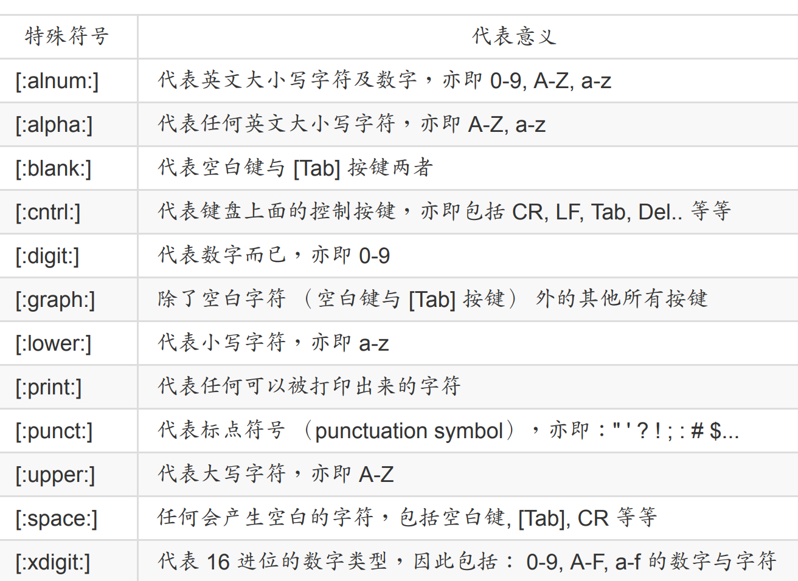
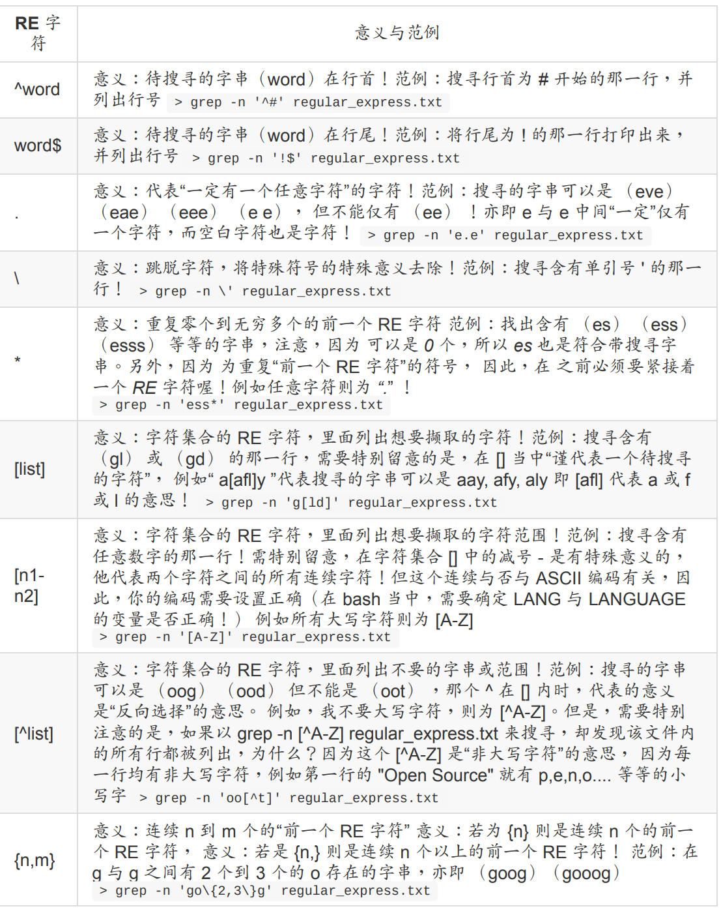
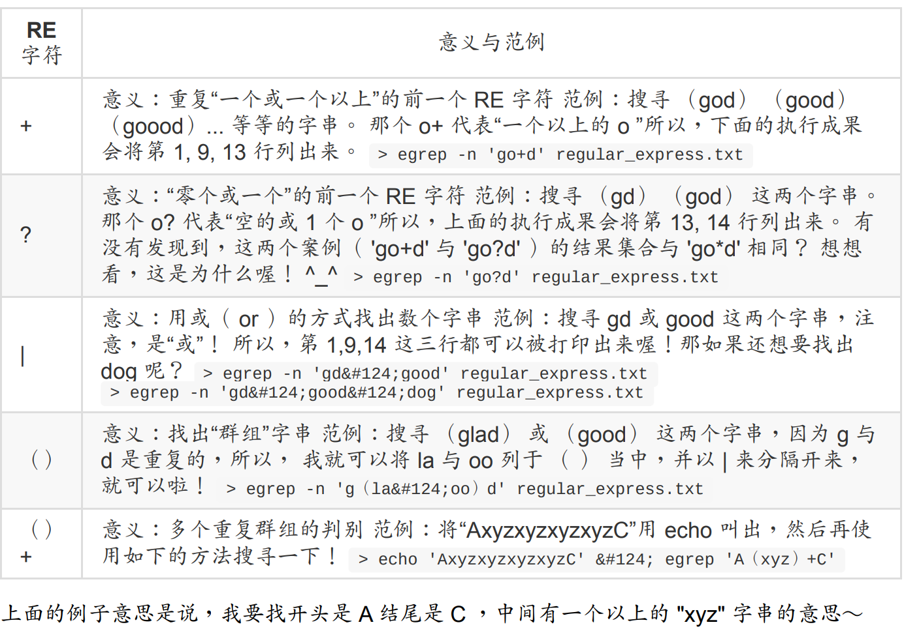
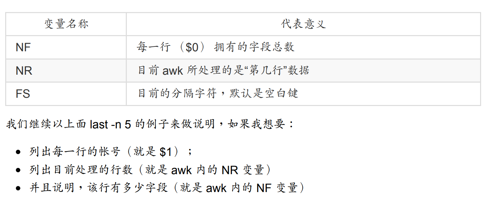
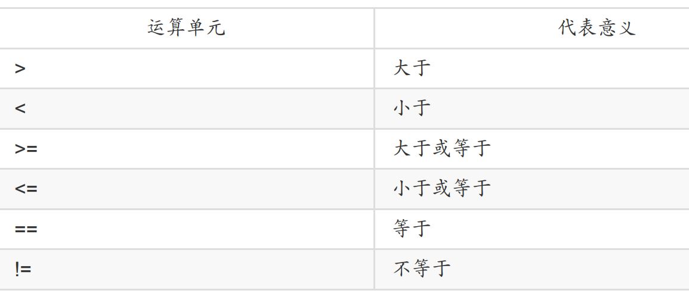

## 7.1 基础

首先我们要记住一些特殊符号



### 7.1.1 grep的一些选项

```bash
[dmtsai@study ~]$ grep [-A] [-B] [--color=auto] '搜寻字串' filename
选项与参数：
-A ：后面可加数字，为 after 的意思，除了列出该行外，后续的 n 行也列出来；
-B ：后面可加数字，为 befer 的意思，除了列出该行外，前面的 n 行也列出来；
--color=auto 可将正确的那个撷取数据列出颜色
范例一：用 dmesg 列出核心讯息，再以 grep 找出内含 qxl 那行
[dmtsai@study ~]$ dmesg | grep 'qxl'
[ 0.522749] [drm] qxl: 16M of VRAM memory size
[ 0.522750] [drm] qxl: 63M of IO pages memory ready （VRAM domain）
[ 0.522750] [drm] qxl: 32M of Surface memory size
[ 0.650714] fbcon: qxldrmfb （fb0） is primary device
[ 0.668487] qxl 0000:00:02.0: fb0: qxldrmfb frame buffer device
# dmesg 可列出核心产生的讯息！包括硬件侦测的流程也会显示出来。
# 鸟哥使用的显卡是 QXL 这个虚拟卡，通过 grep 来 qxl 的相关信息，可发现如上信息。
范例二：承上题，要将捉到的关键字显色，且加上行号来表示：
[dmtsai@study ~]$ dmesg | grep -n --color=auto 'qxl'
515:[ 0.522749] [drm] qxl: 16M of VRAM memory size
516:[ 0.522750] [drm] qxl: 63M of IO pages memory ready （VRAM domain）
517:[ 0.522750] [drm] qxl: 32M of Surface memory size
529:[ 0.650714] fbcon: qxldrmfb （fb0） is primary device
539:[ 0.668487] qxl 0000:00:02.0: fb0: qxldrmfb frame buffer device
# 除了 qxl 会有特殊颜色来表示之外，最前面还有行号喔！其实颜色显示已经是默认在 alias 当中了！
范例三：承上题，在关键字所在行的前两行与后三行也一起捉出来显示
[dmtsai@study ~]$ dmesg | grep -n -A3 -B2 --color=auto 'qxl'
# 你会发现关键字之前与之后的数行也被显示出来！这样可以让你将关键字前后数据捉出来进行分析啦！
```

### 7.1.2 基础表达式练习

可以先把我们的例子给写进去

```textile
"Open Source" is a good mechanism to develop programs.
apple is my favorite food.
Football game is not use feet only.
this dress doesn't fit me.
However, this dress is about $ 3183 dollars.^M
GNU is free air not free beer.^M
Her hair is very beauty.^M
I can't finish the test.^M
Oh! The soup taste good.^M
motorcycle is cheap than car.
This window is clear.
the symbol '*' is represented as start.
Oh! My god!
The gd software is a library for drafting programs.^M
You are the best is mean you are the no. 1.
The world <Happy> is the same with "glad".
I like dog.
google is the best tools for search keyword.
goooooogle yes!
go! go! Let's go.
# I am VBird
```

首先时最简单的过滤字符串，加上n用于显示行数

```bash
 grep -n 'the' regular_express.txt
```

如果要反向选择那么久使用-v参数

```bash
grep -vn 'the' regular_express.txt
```

 如果想不区分大小写，可以这样

```bash
grep -in 'the' regular_express.txt
```

下面我们可以使用中括号来区分, [] 里面不论有几个字符，他都仅代表某“一个”字符

```bash
 grep -n 't[ae]st' regular_express.txt
```

如果我不想要 oo 前面有 g 的话呢？此时，可以利用在集合字符的反向选择 来达成

```bash
grep -n '[^g]oo' regular_express.txt
```

假设我 oo 前面不想要有小写字符

```bash
grep -n '[^a-z]oo' regular_express.txt
```

如果该字符组是连续的，例如大写英文/小写英文/数字等等， 就可以使用[a-z],[A-Z],[0-9]等方式来书写

```bash
 grep -n '[0-9]' regular_express.txt
```

也可以使用如下的方法

```bash
grep -n '[^[:lower:]]oo' regular_express.txt
```

如果我想要让 the 只在行首列出呢？ 这个时候就得要使用定位字符了

```bash
grep -n '^the' regular_express.txt
```

如果我想要开头是小写字符的那一行就列出呢

```bash
 grep -n '^[a-z]' regular_express.txt
```

那如果我不想要开头是英文字母

```bash
grep -n '^[^a-zA-Z]' regular_express.txt
```

如果我想要找出来，行尾结束为小数点 （.） 的那一行

```bash
grep -n '\.$' regular_express.txt
```

假设我需要找出 g??d 的字串，亦即共有四个字符，起头是 g 而结束是 d

```bash
grep -n 'g..d' regular_express.txt
```

当我们需要“至少两个 o 以上的字串”时，就需要 ooo*

```bash
grep -n 'ooo*' regular_express.txt
```

.* 就代表零个或多个任意字符

```bash
grep -n 'g.*g' regular_express.txt
```

如果我想要找出“任意数字”的行列呢？因为仅有数字

```bash
grep -n '[0-9][0-9]*' regular_express.txt
```

我想要找出两个到五个 o 的连续字串，该如何作？这时候就得要使用到限定范围的字符 {} 了。 但因为 { 与 } 的符号在 shell 是有特殊意义的，因此， 我们必须要使用跳脱字符 \ 来让他失去特殊意义才行.假设我要找到两个 o 的字串

```bash
 grep -n 'o\{2\}' regular_express.txt
```

假设我们要找出 g 后面接 2 到 5 个 o ，然后再接一个 g

```bash
 grep -n 'go\{2,5\}g' regular_express.txt
```

如果我想要的是2 个 o 以上的 goooo....g 呢？除了可以是 gooo*g ，也可以是

```bash
 grep -n 'go\{2,\}g' regular_express.txt
```

### 7.1.3 基础正则表达式汇总



### 7.1.4 sed工具

```bash
[dmtsai@study ~]$ sed [-nefr] [动作]
选项与参数：
-n ：使用安静（silent）模式。在一般 sed 的用法中，所有来自 STDIN 的数据一般都会被列出到屏幕上。
但如果加上 -n 参数后，则只有经过 sed 特殊处理的那一行（或者动作）才会被列出来。
-e ：直接在命令行界面上进行 sed 的动作编辑；
-f ：直接将 sed 的动作写在一个文件内， -f filename 则可以执行 filename 内的 sed 动作；
-r ：sed 的动作支持的是延伸型正则表达式的语法。（默认是基础正则表达式语法）
-i ：直接修改读取的文件内容，而不是由屏幕输出。
动作说明： [n1[,n2]]function
n1, n2 ：不见得会存在，一般代表“选择进行动作的行数”，举例来说，如果我的动作
是需要在 10 到 20 行之间进行的，则“ 10,20[动作行为] ”
function 有下面这些咚咚：
a ：新增， a 的后面可以接字串，而这些字串会在新的一行出现（目前的下一行）～
c ：取代， c 的后面可以接字串，这些字串可以取代 n1,n2 之间的行！
d ：删除，因为是删除啊，所以 d 后面通常不接任何咚咚；
i ：插入， i 的后面可以接字串，而这些字串会在新的一行出现（目前的上一行）；
p ：打印，亦即将某个选择的数据印出。通常 p 会与参数 sed -n 一起运行～
s ：取代，可以直接进行取代的工作哩！通常这个 s 的动作可以搭配正则表达式！
例如 1,20s/old/new/g 就是啦！
```

```bash
范例一：将 /etc/passwd 的内容列出并且打印行号，同时，请将第 2~5 行删除！
nl /etc/passwd | sed '2,5d'
```

举例来说，如果只要删除第 2 行，可以使用“ nl /etc/passwd | sed '2d' ”来达成， 至于若是要删除第 3 到最后一行，则是“ nl /etc/passwd | sed '3,$d' ”的啦，那个钱字号“  ”代表最后一行！

```bash
范例二：承上题，在第二行后（亦即是加在第三行）加上“drink tea?”字样！
nl /etc/passwd | sed '2a drink tea'
```

那如果是要在第二行前呢？`nl /etc/passwd | sed '2i drink tea' `就对啦！就是将“ a ”变成“ i ”即可

我们以前想要列出第 11~20 行， 得要通过“head -n 20 | tail -n 10”之类的方法来处理，很麻烦啦～ sed则可以简单的直接取出你想要的那几行！

```bash
范例五：仅列出 /etc/passwd 文件内的第 5-7 行
nl /etc/passwd | sed -n '5,7p'
```

除了整行的处理模式之外， sed 还可以用行为单位进行部分数据的搜寻并取代的功能喔！ 基
本上 sed 的搜寻与取代的与 vi 相当的类似

```bash
sed 's/要被取代的字串/新的字串/g'
```

下面来一个简单例子

```bash
步骤一：先观察原始讯息，利用 /sbin/ifconfig 查询 IP 为何？
[dmtsai@study ~]$ /sbin/ifconfig eth0
eth0: flags=4163&lt;UP,BROADCAST,RUNNING,MULTICAST&gt; mtu 1500
inet 192.168.1.100 netmask 255.255.255.0 broadcast 192.168.1.255
inet6 fe80::5054:ff:fedf:e174 prefixlen 64 scopeid 0x20&lt;link&gt;
ether 52:54:00:df:e1:74 txqueuelen 1000 （Ethernet）
.....（以下省略）.....
# 因为我们还没有讲到 IP ，这里你先有个概念即可啊！我们的重点在第二行，
# 也就是 192.168.1.100 那一行而已！先利用关键字捉出那一行！
步骤二：利用关键字配合 grep 撷取出关键的一行数据
[dmtsai@study ~]$ /sbin/ifconfig eth0 &#124; grep 'inet '
inet 192.168.1.100 netmask 255.255.255.0 broadcast 192.168.1.255
# 当场仅剩下一行！要注意， CentOS 7 与 CentOS 6 以前的 ifconfig 指令输出结果不太相同，
# 鸟哥这个范例主要是针对 CentOS 7 以后的喔！接下来，我们要将开始到 addr: 通通删除，
# 就是像下面这样：
# inet 192.168.1.100 netmask 255.255.255.0 broadcast 192.168.1.255
# 上面的删除关键在于“ ^.*inet ”啦！正则表达式出现！ ^_^
步骤三：将 IP 前面的部分予以删除
[dmtsai@study ~]$ /sbin/ifconfig eth0 &#124; grep 'inet ' &#124; sed 's/^.*inet //g'
192.168.1.100 netmask 255.255.255.0 broadcast 192.168.1.255
# 仔细与上个步骤比较一下，前面的部分不见了！接下来则是删除后续的部分，亦即：
192.168.1.100 netmask 255.255.255.0 broadcast 192.168.1.255
# 此时所需的正则表达式为：“ ' *netmask.*$ ”就是啦！
步骤四：将 IP 后面的部分予以删除
[dmtsai@study ~]$ /sbin/ifconfig eth0 &#124; grep 'inet ' &#124; sed 's/^.*inet //g' \
&gt; &#124; sed 's/ *netmask.*$//g'
192.168.1.100
```

下面把正则和sed结合起来

```bash
步骤一：先使用 grep 将关键字 MAN 所在行取出来
[dmtsai@study ~]$ cat /etc/man_db.conf &#124; grep 'MAN'
# MANDATORY_MANPATH manpath_element
# MANPATH_MAP path_element manpath_element
# MANDB_MAP global_manpath [relative_catpath]
# every automatically generated MANPATH includes these fields
....（后面省略）....
步骤二：删除掉注解之后的数据！
[dmtsai@study ~]$ cat /etc/man_db.conf &#124; grep 'MAN'&#124; sed 's/#.*$//g'
MANDATORY_MANPATH /usr/man
....（后面省略）....
# 从上面可以看出来，原本注解的数据都变成空白行啦！所以，接下来要删除掉空白行
[dmtsai@study ~]$ cat /etc/man_db.conf &#124; grep 'MAN'&#124; sed 's/#.*$//g' &#124; sed '/^$/d'
MANDATORY_MANPATH /usr/man
MANDATORY_MANPATH /usr/share/man
MANDATORY_MANPATH /usr/local/share/man
....（后面省略）....
```

sed甚至还可以直接修改文件内容

```bash
范例六：利用 sed 将 regular_express.txt 内每一行结尾若为 . 则换成 !
[dmtsai@study ~]$ sed -i 's/\.$/\!/g' regular_express.txt
# 上头的 -i 选项可以让你的 sed 直接去修改后面接的文件内容而不是由屏幕输出喔！
# 这个范例是用在取代！请您自行 cat 该文件去查阅结果啰！
范例七：利用 sed 直接在 regular_express.txt 最后一行加入“# This is a test”
[dmtsai@study ~]$ sed -i '$a # This is a test' regular_express.txt
# 由于 $ 代表的是最后一行，而 a 的动作是新增，因此该文件最后新增啰！
```

## 7.2 正则表达式进阶



如果你想要查出来文件中含有 ! 与 > 的字行时，可以这样

```bash
grep -n '[!>]' regular_express.txt
```

## 7.3 文件格式化命令

### 7.3.1 格式化打印printf

```bash
[dmtsai@study ~]$ printf '打印格式' 实际内容
选项与参数：
关于格式方面的几个特殊样式：
\a 警告声音输出
\b 倒退键（backspace）
\f 清除屏幕 （form feed）
\n 输出新的一行
\r 亦即 Enter 按键
\t 水平的 [tab] 按键
\v 垂直的 [tab] 按键
\xNN NN 为两位数的数字，可以转换数字成为字符。
关于 C 程序语言内，常见的变量格式
%ns 那个 n 是数字， s 代表 string ，亦即多少个字符；
%ni 那个 n 是数字， i 代表 integer ，亦即多少整数码数；
%N.nf 那个 n 与 N 都是数字， f 代表 floating （浮点），如果有小数码数，
假设我共要十个位数，但小数点有两位，即为 %10.2f 啰！
```

我们先写入测试文件

```bash
Name Chinese English Math Average
DmTsai 80 60 92 77.33
VBird 75 55 80 70.00
Ken 60 90 70 73.33
```

先来一个简单例子

```bash
范例一：将刚刚上头数据的文件 （printf.txt） 内容仅列出姓名与成绩：（用 [tab] 分隔）
printf '%s\t %s\t %s\t %s\t %s\t \n' $(cat printf.txt)
```

例子2

```bash
范例二：将上述数据关于第二行以后，分别以字串、整数、小数点来显示：
xiaoyou@dev:/tmp$ printf '%10s %5i %5i %5i %8.2f \n' $(cat printf.txt | grep -v Name)
    DmTsai    80    60    92    77.33 
     VBird    75    55    80    70.00 
       Ken    60    90    70    73.33 
```

我们可以使用下面的说明来介绍 %8.2f 的意义

> 字符宽度： 12345678 %8.2f意义：00000.00

printf 除了可以格式化处理之外，他还可以依据 ASCII 的数字与图形对应来显示数据喔

```bash
范例三：列出 16 进位数值 45 代表的字符为何？
[dmtsai@study ~]$ printf '\x45\n'
E
# 这东西也很好玩～他可以将数值转换成为字符，如果你会写 script 的话，
# 可以自行测试一下，由 20~80 之间的数值代表的字符是啥喔！ ^_^
```

### 7.3.2 awk 好用的数据处理工具

awk的格式如下

```bash
awk '条件类型1{动作1} 条件类型2{动作2} ...' filename
```

我们用 last 可以将登陆者的数据取出来，结果如下所示：

```bash
# 只取前5行
xiaoyou@dev:/tmp$ last -n 5
xiaoyou  pts/0        192.168.1.153    Mon Nov  7 21:17   still logged in
xiaoyou  pts/0        192.168.1.153    Mon Nov  7 21:16 - 21:17  (00:00)
xiaoyou  pts/0        192.168.1.153    Mon Nov  7 20:49 - 21:16  (00:26)
xiaoyou  pts/0        192.168.1.153    Mon Nov  7 08:17 - 09:07  (00:49)
xiaoyou  pts/0        192.168.1.153    Sun Nov  6 10:37 - 16:03  (05:26)

wtmp begins Sat Jul  2 09:36:35 2022
```

若我想要取出帐号与登陆者的 IP ，且帐号与 IP 之间以 [tab] 隔开，则会变成这样

```bash
xiaoyou@dev:/tmp$ last -n 5 | awk '{print $1 "\t" $3}'
xiaoyou 192.168.1.153
xiaoyou 192.168.1.153
xiaoyou 192.168.1.153
xiaoyou 192.168.1.153
xiaoyou 192.168.1.153

wtmp    Sat
```

整个 awk 的处理流程是:

1. 读入第一行，并将第一行的数据填入 $0, $1, $2.... 等变量当中；
2. 依据 "条件类型" 的限制，判断是否需要进行后面的 "动作"；
3. 做完所有的动作与条件类型；
4. 若还有后续的“行”的数据，则重复上面 1~3 的步骤，直到所有的数据都读完为止。经过这样的步骤，你会晓得， awk 是“以行为一次处理的单位”， 而“以字段为最小的处理单位”。



```bash
xiaoyou@dev:/tmp$ last -n 5 | awk '{print $1 "\t lines: " NR "\t columns: " NF}'
xiaoyou  lines: 1        columns: 10
xiaoyou  lines: 2        columns: 10
xiaoyou  lines: 3        columns: 10
xiaoyou  lines: 4        columns: 10
xiaoyou  lines: 5        columns: 10
         lines: 6        columns: 0
wtmp     lines: 7        columns: 7
```

> # 注意喔，在 awk 内的 NR, NF 等变量要用大写，且不需要有钱字号 $ 啦！

既然有需要用到 "条件" 的类别，自然就需要一些逻辑运算啰～例如下面这些



假设我要查阅，第三栏小于10 以下的数据，并且仅列出帐号与第三栏， 那么可以这样做:

```bash
xiaoyou@dev:/tmp$ cat /etc/passwd | awk '{FS=":"} $3 < 10 {print $1 "\t " $3}'
root:x:0:0:root:/root:/bin/bash  
daemon   1
bin      2
sys      3
sync     4
games    5
man      6
lp       7
mail     8
news     9
```

怎么第一行没有正确的显示出来呢？这是因为我们读入第一行的时候，那些变量 $1, $2... 默认还是以空白键为分隔的，所以虽然我们定义了 FS=":" 了， 但是却仅能在第二行后才开始生效。那么怎么办呢？我们可以预先设置 awk 的变量啊！ 利用 BEGIN 这个关键字喔！

```bash
xiaoyou@dev:/tmp$ cat /etc/passwd | awk 'BEGIN {FS=":"} $3 < 10 {print $1 "\t " $3}'
root     0
daemon   1
bin      2
sys      3
sync     4
games    5
man      6
lp       7
mail     8
```

除了 BEGIN 之外，我们还有 END 呢！另外，如果要用 awk 来进行“计算功能”呢？以下面的例子来看， 假设我有一个薪资数据表文件名为 pay.txt ，内容是这样的

如何帮我计算每个人的总额呢？而且我还想要格式化输出喔！我们可以这样考虑：

- 第一行只是说明，所以第一行不要进行加总 （NR==1 时处理）；

- 第二行以后就会有加总的情况出现 （NR>=2 以后处理）

```bash
cat pay.txt | \
 awk 'NR==1{printf "%10s %10s %10s %10s %10s\n",$1,$2,$3,$4,"Total" }
 NR<=2{total = $2 + $3 + $4
 printf "%10s %10d %10d %10d %10.2f\n", $1, $2, $3, $4, total}'
```

```bash
xiaoyou@dev:/tmp$ cat pay.txt | \
>  awk 'NR==1{printf "%10s %10s %10s %10s %10s\n",$1,$2,$3,$4,"Total" }
>  NR<=2{total = $2 + $3 + $4
>  printf "%10s %10d %10d %10d %10.2f\n", $1, $2, $3, $4, total}'
      Name        1st        2nd        3th      Total
      Name          1          2          3       6.00
     VBird      23000      24000      25000   72000.00
```

这里有几个注意事项

- awk 的指令间隔：所有 awk 的动作，亦即在 {} 内的动作，如果有需要多个指令辅助时，可利用分号“;”间隔， 或者直接以 [Enter] 按键来隔开每个指令，例如上面的范例中，鸟哥共按了三次 [enter] 喔！

- 逻辑运算当中，如果是“等于”的情况，则务必使用两个等号“==”！

- 格式化输出时，在 printf 的格式设置当中，务必加上 \n ，才能进行分行！

- 与 bash shell 的变量不同，在 awk 当中，变量可以直接使用，不需加上 $ 符号。

### 7.3.4 文本对比工具

我们先做一些准备工作

```bash
xiaoyou@dev:/tmp$ mkdir -p /tmp/testpw # 先创建测试用的目录
xiaoyou@dev:/tmp$ cd /tmp/testpw
xiaoyou@dev:/tmp/testpw$ cp /etc/passwd passwd.old
xiaoyou@dev:/tmp/testpw$ cat /etc/passwd | sed -e '4d' -e '6c no six line' > passwd.new
```

> 注意一下， sed 后面如果要接超过两个以上的动作时，每个动作前面得加 -e 才行！
> 
> 通过这个动作，在 /tmp/testpw 里面便有新旧的 passwd 文件存在了！

下面来看一下diff的用法

```bash
[dmtsai@study ~]$ diff [-bBi] from-file to-file
选项与参数：
from-file ：一个文件名，作为原始比对文件的文件名；
to-file ：一个文件名，作为目的比对文件的文件名；
注意，from-file 或 to-file 可以 - 取代，那个 - 代表“Standard input”之意。
-b ：忽略一行当中，仅有多个空白的差异（例如 "about me" 与 "about me" 视为相同
-B ：忽略空白行的差异。
-i ：忽略大小写的不同。
范例一：比对 passwd.old 与 passwd.new 的差异：
[dmtsai@study testpw]$ diff passwd.old passwd.new
4d3 &lt;==左边第四行被删除 （d） 掉了，基准是右边的第三行
&lt; adm:x:3:4:adm:/var/adm:/sbin/nologin &lt;==这边列出左边（&lt;）文件被删除的那一行内容
6c5 &lt;==左边文件的第六行被取代 （c） 成右边文件的第五行
&lt; sync:x:5:0:sync:/sbin:/bin/sync &lt;==左边（&lt;）文件第六行内容
---
&gt; no six line &lt;==右边（&gt;）文件第五行内容
# 很聪明吧！用 diff 就把我们刚刚的处理给比对完毕了！
```

相对于 diff 的广泛用途， cmp 似乎就用的没有这么多了～ cmp 主要也是在比对两个文件，他主要利用“字节”单位去比对， 因此，当然也可以比对 binary file 啰～（还是要再提醒喔， diff主要是以“行”为单位比对， cmp 则是以“字节”为单位去比对，这并不相同！）

```bash
[dmtsai@study ~]$ cmp [-l] file1 file2
选项与参数：
-l ：将所有的不同点的字节处都列出来。因为 cmp 默认仅会输出第一个发现的不同点。
范例一：用 cmp 比较一下 passwd.old 及 passwd.new
[dmtsai@study testpw]$ cmp passwd.old passwd.new
passwd.old passwd.new differ: char 106, line 4
```

patch 这个指令与 diff 可是有密不可分的关系啊！我们前面提到，diff 可以用来分辨两个版本之间的差异， 举例来说，刚刚我们所创建的 passwd.old 及 passwd.new 之间就是两个不同版本的文件。 那么，如果要“升级”呢？就是“将旧的文件升级成为新的文件”时，应该要怎么做呢？ 其实也不难啦！就是“先比较先旧版本的差异，并将差异档制作成为补丁文件，再由补丁文件更新旧文件”即可。 举例来说，我们可以这样做测试：

```bash
范例一：以 /tmp/testpw 内的 passwd.old 与 passwd.new 制作补丁文件
[dmtsai@study testpw]$ diff -Naur passwd.old passwd.new &gt; passwd.patch
[dmtsai@study testpw]$ cat passwd.patch
--- passwd.old 2015-07-14 22:37:43.322535054 +0800 &lt;==新旧文件的信息
+++ passwd.new 2015-07-14 22:38:03.010535054 +0800
@@ -1,9 +1,8 @@ &lt;==新旧文件要修改数据的界定范围，旧文件在 1-9 行，新文件在 1-8 行
root:x:0:0:root:/root:/bin/bash
bin:x:1:1:bin:/bin:/sbin/nologin
daemon:x:2:2:daemon:/sbin:/sbin/nologin
-adm:x:3:4:adm:/var/adm:/sbin/nologin &lt;==左侧文件删除
lp:x:4:7:lp:/var/spool/lpd:/sbin/nologin
-sync:x:5:0:sync:/sbin:/bin/sync &lt;==左侧文件删除
+no six line &lt;==右侧新文件加入
shutdown:x:6:0:shutdown:/sbin:/sbin/shutdown
```

```bash
# 因为 CentOS 7 默认没有安装 patch 这个软件，因此得要依据之前介绍的方式来安装一下软件！
# 请记得拿出原本光盘并放入光驱当中，这时才能够使用下面的方式来安装软件！
[dmtsai@study ~]$ su -
[root@study ~]# mount /dev/sr0 /mnt
[root@study ~]# rpm -ivh /mnt/Packages/patch-2.*
[root@study ~]# umount /mnt
[root@study ~]# exit
# 通过上述的方式可以安装好所需要的软件，且无须上网。接下来让我们开始操作 patch 啰！
[dmtsai@study ~]$ patch -pN &lt; patch_file &lt;==更新
[dmtsai@study ~]$ patch -R -pN &lt; patch_file &lt;==还原
选项与参数：
-p ：后面可以接“取消几层目录”的意思。
-R ：代表还原，将新的文件还原成原来旧的版本。
范例二：将刚刚制作出来的 patch file 用来更新旧版数据
[dmtsai@study testpw]$ patch -p0 &lt; passwd.patch
patching file passwd.old
[dmtsai@study testpw]$ ll passwd*
-rw-rw-r--. 1 dmtsai dmtsai 2035 Jul 14 22:38 passwd.new
-rw-r--r--. 1 dmtsai dmtsai 2035 Jul 14 23:30 passwd.old &lt;==文件一模一样！
范例三：恢复旧文件的内容
[dmtsai@study testpw]$ patch -R -p0 &lt; passwd.patch
[dmtsai@study testpw]$ ll passwd*
-rw-rw-r--. 1 dmtsai dmtsai 2035 Jul 14 22:38 passwd.new
-rw-r--r--. 1 dmtsai dmtsai 2092 Jul 14 23:31 passwd.old
# 文件就这样恢复成为旧版本啰
```


