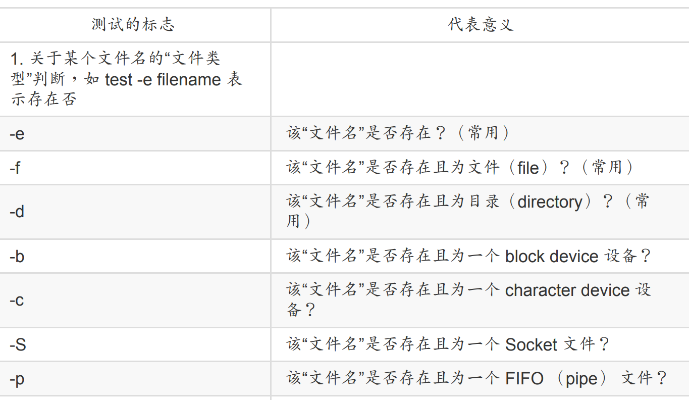
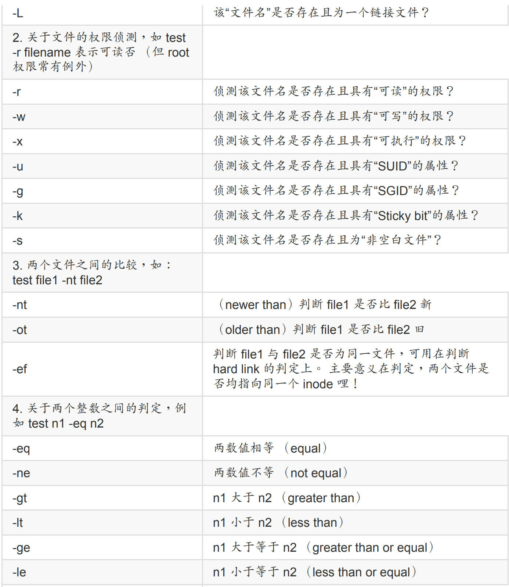
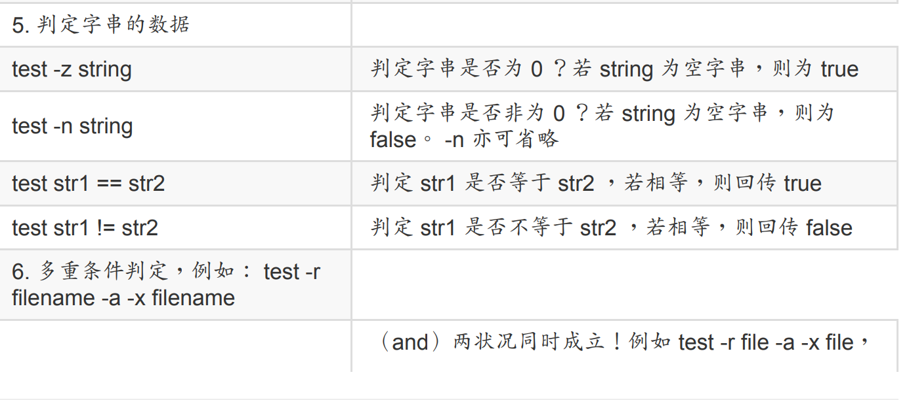
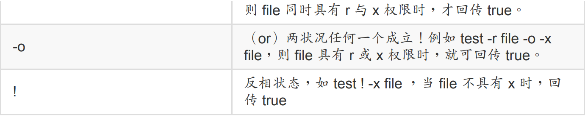

## 8.1 基础

### 8.1.1 编写第一个script

首先有一些注意事项

1. 指令的执行是从上而下、从左而右的分析与执行；
2. 指令的下达就如同第四章内提到的： 指令、选项与参数间的多个空白都会被忽略掉；
3. 空白行也将被忽略掉，并且 [tab] 按键所推开的空白同样视为空白键；
4. 如果读取到一个 Enter 符号 （CR） ，就尝试开始执行该行 （或该串） 命令；
5. 至于如果一行的内容太多，则可以使用“ [Enter] ”来延伸至下一行；
6. “ # ”可做为注解！任何加在 # 后面的数据将全部被视为注解文字而被忽略！

先写一个最简单的脚本

```bash
[dmtsai@study ~]$ mkdir bin; cd bin
[dmtsai@study bin]$ vim hello.sh
#!/bin/bash
# Program:
# This program shows "Hello World!" in your screen.
# History:
# 2015/07/16 VBird First release
PATH=/bin:/sbin:/usr/bin:/usr/sbin:/usr/local/bin:/usr/local/sbin:~/bin
export PATH
echo -e "Hello World! \a \n"
exit 0
```

## 8.2 简单脚本练习

### 8.2.1 简单范例

交互式脚本

```bash
[dmtsai@study bin]$ vim showname.sh
#!/bin/bash
# Program:
# User inputs his first name and last name. Program shows his full name.
# History:
# 2015/07/16 VBird First release
PATH=/bin:/sbin:/usr/bin:/usr/sbin:/usr/local/bin:/usr/local/sbin:~/bin
export PATH
read -p "Please input your first name: " firstname # 提示使用者输入
read -p "Please input your last name: " lastname # 提示使用者输入
echo -e "\nYour full name is: ${firstname} ${lastname}" # 结果由屏幕输出
```

随日期变化

```bash
[dmtsai@study bin]$ vim create_3_filename.sh
#!/bin/bash
# Program:
# Program creates three files, which named by user's input and date command.
# History:
# 2015/07/16 VBird First release
PATH=/bin:/sbin:/usr/bin:/usr/sbin:/usr/local/bin:/usr/local/sbin:~/bin
export PATH
# 1\. 让使用者输入文件名称，并取得 fileuser 这个变量；
echo -e "I will use 'touch' command to create 3 files." # 纯粹显示信息
read -p "Please input your filename: " fileuser # 提示使用者输入
# 2\. 为了避免使用者随意按 Enter ，利用[变量功能](../Text/index.html#variable_other_re)分析文件名是否有设置？
filename=${fileuser:-"filename"} # 开始判断有否配置文件名
# 3\. 开始利用 date 指令来取得所需要的文件名了；
date1=$（date --date='2 days ago' +%Y%m%d） # 前两天的日期
date2=$（date --date='1 days ago' +%Y%m%d） # 前一天的日期
date3=$（date +%Y%m%d） # 今天的日期
file1=${filename}${date1} # 下面三行在配置文件名
file2=${filename}${date2}
file3=${filename}${date3}
# 4\. 将文件名创建吧！
touch "${file1}" # 下面三行在创建文件
touch "${file2}"
touch "${file3}"
```

数值运算

```bash
[dmtsai@study bin]$ vim multiplying.sh
#!/bin/bash
# Program:
# User inputs 2 integer numbers; program will cross these two numbers.
# History:
# 2015/07/16 VBird First release
PATH=/bin:/sbin:/usr/bin:/usr/sbin:/usr/local/bin:/usr/local/sbin:~/bin
export PATH
echo -e "You SHOULD input 2 numbers, I will multiplying them! \n"
read -p "first number: " firstnu
read -p "second number: " secnu
total=$（（${firstnu}*${secnu}））
echo -e "\nThe result of ${firstnu} x ${secnu} is ==> ${total}"
```

计算pi

```bash
[dmtsai@study bin]$ vim cal_pi.sh
#!/bin/bash
# Program:
# User input a scale number to calculate pi number.
# History:
# 2015/07/16 VBird First release
PATH=/bin:/sbin:/usr/bin:/usr/sbin:/usr/local/bin:/usr/local/sbin:~/bin
export PATH
echo -e "This program will calculate pi value. \n"
echo -e "You should input a float number to calculate pi value.\n"
read -p "The scale number （10~10000） ? " checking
num=${checking:-"10"} # 开始判断有否有输入数值
echo -e "Starting calcuate pi value. Be patient."
time echo "scale=${num}; 4*a（1）" | bc -lq
```

## 8.3 表达式

### 8.3.1 test指令

test可以判断文件是否存在

```bash
test -e /dmtsai && echo "exist" ||  echo "Not exist"
```

test还有一些其他的参数









下面时一个简单例子

```bash
[dmtsai@study bin]$ vim file_perm.sh
#!/bin/bash
# Program:
# User input a filename, program will check the flowing:
# 1.） exist? 2.） file/directory? 3.） file permissions
# History:
# 2015/07/16 VBird First release
PATH=/bin:/sbin:/usr/bin:/usr/sbin:/usr/local/bin:/usr/local/sbin:~/bin
export PATH
# 1\. 让使用者输入文件名，并且判断使用者是否真的有输入字串？
echo -e "Please input a filename, I will check the filename's type and permission. \n\n"
read -p "Input a filename : " filename
test -z ${filename} && echo "You MUST input a filename." && exit 0
# 2\. 判断文件是否存在？若不存在则显示讯息并结束脚本
test ! -e ${filename} && echo "The filename '${filename}' DO NOT exist" && exit 0
# 3\. 开始判断文件类型与属性
test -f ${filename} && filetype="regulare file"
test -d ${filename} && filetype="directory"
test -r ${filename} && perm="readable"
test -w ${filename} && perm="${perm} writable"
test -x ${filename} && perm="${perm} executable"
# 4\. 开始输出信息！
echo "The filename: ${filename} is a ${filetype}"
echo "And the permissions for you are : ${perm}"
```

### 8.3.2 判断符号 []

举例来说，如果我想要知道 ${HOME} 这个变量是否为空的

```bash
xiaoyou@dev:~$ [ -z "${HOME}" ] ; echo $?
1
```

这里需要注意一下

- 在中括号 [] 内的每个元件都需要有空白键来分隔；

- 在中括号内的变量，最好都以双引号括号起来；

- 在中括号内的常数，最好都以单或双引号括号起来。

我们可以使用这个来实现一个yes or no的判断

```bash
[dmtsai@study bin]$ vim ans_yn.sh
#!/bin/bash
# Program:
# This program shows the user's choice
# History:
# 2015/07/16 VBird First release
PATH=/bin:/sbin:/usr/bin:/usr/sbin:/usr/local/bin:/usr/local/sbin:~/bin
export PATH
read -p "Please input （Y/N）: " yn
[ "${yn}" == "Y" -o "${yn}" == "y" ] && echo "OK, continue" && exit 0
[ "${yn}" == "N" -o "${yn}" == "n" ] && echo "Oh, interrupt!" && exit 0
echo "I don't know what your choice is" && exit 0
```

### 8.3.3 默认变量

script 针对参数已经有设置好一些变量名称了！对应如下：

```bash
/path/to/scriptname opt1 opt2 opt3 opt4
$0 $1 $2 $3 $4
```

除了这些数字的变量之外， 我们还有一些较为特殊的变量可以在 script 内使用来调用这些参数喔！

```bash
$# ：代表后接的参数“个数”，以上表为例这里显示为“ 4 ”；
$@ ：代表“ "$1" "$2" "$3" "$4" ”之意，每个变量是独立的（用双引号括起来）；
$* ：代表“ "$1<u>c</u>$2<u>c</u>$3<u>c</u>$4" ”，其中 <u>c</u> 为分隔字符，默
认为空白键， 所以本例中代表“ "$1 $2 $3 $4" ”之意。
```

下面我们可以把这些都打印出来

```bash
[dmtsai@study bin]$ vim how_paras.sh
#!/bin/bash
# Program:
# Program shows the script name, parameters...
# History:
# 2015/07/16 VBird First release
PATH=/bin:/sbin:/usr/bin:/usr/sbin:/usr/local/bin:/usr/local/sbin:~/bin
export PATH
echo "The script name is ==> ${0}"
echo "Total parameter number is ==> $#"
[ "$#" -lt 2 ] && echo "The number of parameter is less than 2\. Stop here." && exit 0
echo "Your whole parameter is ==> '$@'"
echo "The 1st parameter ==> ${1}"
echo "The 2nd parameter ==> ${2}"
```

除此之外，脚本后面所接的变量是否能够进行偏移 （shift） 呢？什么是偏移啊？我们直接以
下面的范例来说明好了

```bash
[dmtsai@study bin]$ vim shift_paras.sh
#!/bin/bash
# Program:
# Program shows the effect of shift function.
# History:
# 2009/02/17 VBird First release
PATH=/bin:/sbin:/usr/bin:/usr/sbin:/usr/local/bin:/usr/local/sbin:~/bin
export PATH
echo "Total parameter number is ==> $#"
echo "Your whole parameter is ==> '$@'"
shift # 进行第一次“一个变量的 shift ”
echo "Total parameter number is ==> $#"
echo "Your whole parameter is ==> '$@'"
shift 3 # 进行第二次“三个变量的 shift ”
echo "Total parameter number is ==> $#"
echo "Your whole parameter is ==> '$@'"
```

光看结果你就可以知道啦，那个 shift 会移动变量，而且 shift 后面可以接数字，代表拿掉最前面的几个参数的意思。 上面的执行结果中，第一次进行 shift 后他的显示情况是“ one two
three four five six”，所以就剩下五个啦！第二次直接拿掉三个，就变成“ two three fourfive
six ”啦！

## 8.4 条件判断式

### 8.4.1 if then

这个 if .... then 是最常见的条件判断式了～简单的说，就是当符合某个条件判断的时候， 就予以进行某项工作就是了。

最简单的例子

```bash
if [ 条件判断式 ]; then
当条件判断式成立时，可以进行的指令工作内容；
fi <==将 if 反过来写，就成为 fi 啦！结束 if 之意！
```

- && 代表 AND ；

- || 代表 or ；

我们改造一下上面的例子

```bash
[dmtsai@study bin]$ cp ans_yn.sh ans_yn-2.sh <==用复制来修改的比较快！
[dmtsai@study bin]$ vim ans_yn-2.sh
#!/bin/bash
# Program:
# This program shows the user's choice
# History:
# 2015/07/16 VBird First release
PATH=/bin:/sbin:/usr/bin:/usr/sbin:/usr/local/bin:/usr/local/sbin:~/bin
export PATH
read -p "Please input （Y/N）: " yn
if [ "${yn}" == "Y" ] || [ "${yn}" == "y" ]; then
echo "OK, continue"
exit 0
fi
if [ "${yn}" == "N" ] || [ "${yn}" == "n" ]; then
echo "Oh, interrupt!"
exit 0
fi
echo "I don't know what your choice is" && exit 0
```

多重判断

```bash
# 多个条件判断 （if ... elif ... elif ... else） 分多种不同情况执行
if [ 条件判断式一 ]; then
当条件判断式一成立时，可以进行的指令工作内容；
elif [ 条件判断式二 ]; then
当条件判断式二成立时，可以进行的指令工作内容；
else
当条件判断式一与二均不成立时，可以进行的指令工作内容；
fi
```

我们再改造一下

```bash
[dmtsai@study bin]$ cp ans_yn-2.sh ans_yn-3.sh
[dmtsai@study bin]$ vim ans_yn-3.sh
#!/bin/bash
# Program:
# This program shows the user's choice
# History:
# 2015/07/16 VBird First release
PATH=/bin:/sbin:/usr/bin:/usr/sbin:/usr/local/bin:/usr/local/sbin:~/bin
export PATH
read -p "Please input （Y/N）: " yn
if [ "${yn}" == "Y" ] || [ "${yn}" == "y" ]; then
echo "OK, continue"
elif [ "${yn}" == "N" ] || [ "${yn}" == "n" ]; then
echo "Oh, interrupt!"
else
echo "I don't know what your choice is"
fi
```

下面我们使用if来进行一个端口判断

```bash
[dmtsai@study bin]$ vim netstat.sh
#!/bin/bash
# Program:
# Using netstat and grep to detect WWW,SSH,FTP and Mail services.
# History:
# 2015/07/16 VBird First release
PATH=/bin:/sbin:/usr/bin:/usr/sbin:/usr/local/bin:/usr/local/sbin:~/bin
export PATH
# 1\. 先作一些告知的动作而已～
echo "Now, I will detect your Linux server's services!"
echo -e "The www, ftp, ssh, and mail（smtp） will be detect! \n"
# 2\. 开始进行一些测试的工作，并且也输出一些信息啰！
testfile=/dev/shm/netstat_checking.txt
netstat -tuln > ${testfile} # 先转存数据到内存当中！不用一直执行 netstat
testing=$（grep ":80 " ${testfile}） # 侦测看 port 80 在否？
if [ "${testing}" != "" ]; then
echo "WWW is running in your system."
fi
testing=$（grep ":22 " ${testfile}） # 侦测看 port 22 在否？
if [ "${testing}" != "" ]; then
echo "SSH is running in your system."
fi
testing=$（grep ":21 " ${testfile}） # 侦测看 port 21 在否？
if [ "${testing}" != "" ]; then
echo "FTP is running in your system."
fi
testing=$（grep ":25 " ${testfile}） # 侦测看 port 25 在否？
if [ "${testing}" != "" ]; then
echo "Mail is running in your system."
fi
```

下面来一个比较复杂的例子

```bash
[dmtsai@study bin]$ vim cal_retired.sh
#!/bin/bash
# Program:
# You input your demobilization date, I calculate how many days before you demobilize.
# History:
# 2015/07/16 VBird First release
PATH=/bin:/sbin:/usr/bin:/usr/sbin:/usr/local/bin:/usr/local/sbin:~/bin
export PATH
# 1\. 告知使用者这支程序的用途，并且告知应该如何输入日期格式？
echo "This program will try to calculate :"
echo "How many days before your demobilization date..."
read -p "Please input your demobilization date （YYYYMMDD ex>20150716）: " date2
# 2\. 测试一下，这个输入的内容是否正确？利用正则表达式啰～
date_d=$（echo ${date2} |grep '[0-9]\{8\}'） # 看看是否有八个数字
if [ "${date_d}" == "" ]; then
echo "You input the wrong date format...."
exit 1
fi
# 3\. 开始计算日期啰～
declare -i date_dem=$（date --date="${date2}" +%s） # 退伍日期秒数
declare -i date_now=$（date +%s） # 现在日期秒数
declare -i date_total_s=$（（${date_dem}-${date_now}）） # 剩余秒数统计
declare -i date_d=$（（${date_total_s}/60/60/24）） # 转为日数
if [ "${date_total_s}" -lt "0" ]; then # 判断是否已退伍
echo "You had been demobilization before: " $（（-1*${date_d}）） " ago"
else
declare -i date_h=$（（$（（${date_total_s}-${date_d}*60*60*24））/60/60））
echo "You will demobilize after ${date_d} days and ${date_h} hours."
fi
```

### 8.4.2 利用case ..esac 来判断

```bash
case $变量名称 in <==关键字为 case ，还有变量前有钱字号
"第一个变量内容"） <==每个变量内容建议用双引号括起来，关键字则为小括号 ）
程序段
;; <==每个类别结尾使用两个连续的分号来处理！
"第二个变量内容"）
程序段
;;
*） <==最后一个变量内容都会用 * 来代表所有其他值
不包含第一个变量内容与第二个变量内容的其他程序执行段
exit 1
;;
esac <==最终的 case 结尾！“反过来写”思考一下！
```

下面来例子

```bash
[dmtsai@study bin]$ vim hello-3.sh
#!/bin/bash
# Program:
# Show "Hello" from $1.... by using case .... esac
# History:
# 2015/07/16 VBird First release
PATH=/bin:/sbin:/usr/bin:/usr/sbin:/usr/local/bin:/usr/local/sbin:~/bin
export PATH
case ${1} in
"hello"）
echo "Hello, how are you ?"
;;
""）
echo "You MUST input parameters, ex> {${0} someword}"
;;
*） # 其实就相当于万用字符，0~无穷多个任意字符之意！
echo "Usage ${0} {hello}"
;;
esac
```

再来一个例子,让使用者能够输入 one, two,three ， 并且将使用者的变量显示到屏幕上，如果不是 one, two, three 时，就告知使用者仅有这三种选择。

```bash
[dmtsai@study bin]$ vim show123.sh
#!/bin/bash
# Program:
# This script only accepts the flowing parameter: one, two or three.
# History:
# 2015/07/17 VBird First release
PATH=/bin:/sbin:/usr/bin:/usr/sbin:/usr/local/bin:/usr/local/sbin:~/bin
export PATH
echo "This program will print your selection !"
# read -p "Input your choice: " choice # 暂时取消，可以替换！
# case ${choice} in # 暂时取消，可以替换！
case ${1} in # 现在使用，可以用上面两行替换！
"one"）
echo "Your choice is ONE"
;;
"two"）
echo "Your choice is TWO"
;;
"three"）
echo "Your choice is THREE"
;;
*）
echo "Usage ${0} {one|two|three}"
;;
esac
```

### 8.4.3 function功能

语法如下

```bash
function fname（） {
程序段
}
```

我们可以把上面的例子给封装为一个函数

```bash
[dmtsai@study bin]$ vim show123-2.sh
#!/bin/bash
# Program:
# Use function to repeat information.
# History:
# 2015/07/17 VBird First release
PATH=/bin:/sbin:/usr/bin:/usr/sbin:/usr/local/bin:/usr/local/sbin:~/bin
export PATH
function printit（）{
echo -n "Your choice is " # 加上 -n 可以不断行继续在同一行显示
}
echo "This program will print your selection !"
case ${1} in
"one"）
**printit**; echo ${1} | tr 'a-z' 'A-Z' # 将参数做大小写转换！
;;
"two"）
**printit**; echo ${1} | tr 'a-z' 'A-Z'
;;
"three"）
**printit**; echo ${1} | tr 'a-z' 'A-Z'
;;
*）
echo "Usage ${0} {one|two|three}"
;;
esac
```

我们可以给函数传递一个参数

```bash
[dmtsai@study bin]$ vim show123-3.sh
#!/bin/bash
# Program:
# Use function to repeat information.
# History:
# 2015/07/17 VBird First release
PATH=/bin:/sbin:/usr/bin:/usr/sbin:/usr/local/bin:/usr/local/sbin:~/bin
export PATH
function printit（）{
echo "Your choice is ${1}" # 这个 $1 必须要参考下面指令的下达
}
echo "This program will print your selection !"
case ${1} in
"one"）
**printit 1** # 请注意， printit 指令后面还有接参数！
;;
"two"）
**printit 2**
;;
"three"）
**printit 3**
;;
*）
echo "Usage ${0} {one|two|three}"
;;
esac
```

## 8.5 循环

### 8.5.1 while 不定循环

while语法如下

```bash
while [ condition ] <==中括号内的状态就是判断式
do <==do 是循环的开始！
程序段落
done <==done 是循环的结束
```

until语法如下

```bash
until [ condition ]
do
程序段落
done
```

假设我要让使用者输入 yes 或者是 YES 才结束程序的执行，否则就一直进行告知使用者输入字串

```bash
[dmtsai@study bin]$ vim yes_to_stop.sh
#!/bin/bash
# Program:
# Repeat question until user input correct answer.
# History:
# 2015/07/17 VBird First release
PATH=/bin:/sbin:/usr/bin:/usr/sbin:/usr/local/bin:/usr/local/sbin:~/bin
export PATH
while [ "${yn}" != "yes" -a "${yn}" != "YES" ]
do
read -p "Please input yes/YES to stop this program: " yn
done
echo "OK! you input the correct answer."
```

那如果使用 until 呢？

```bash
[dmtsai@study bin]$ vim yes_to_stop-2.sh
#!/bin/bash
# Program:
# Repeat question until user input correct answer.
# History:
# 2015/07/17 VBird First release
PATH=/bin:/sbin:/usr/bin:/usr/sbin:/usr/local/bin:/usr/local/sbin:~/bin
export PATH
until [ "${yn}" == "yes" -o "${yn}" == "YES" ]
do
read -p "Please input yes/YES to stop this program: " yn
done
echo "OK! you input the correct answer."
```

如果我想要计算 1+2+3+....+100 这个数据呢？ 利用循环啊～他是这样的：

```bash
[dmtsai@study bin]$ vim cal_1_100.sh
#!/bin/bash
# Program:
# Use loop to calculate "1+2+3+...+100" result.
# History:
# 2015/07/17 VBird First release
PATH=/bin:/sbin:/usr/bin:/usr/sbin:/usr/local/bin:/usr/local/sbin:~/bin
export PATH
s=0 # 这是加总的数值变量
i=0 # 这是累计的数值，亦即是 1, 2, 3....
while [ "${i}" != "100" ]
do
i=$（（$i+1）） # 每次 i 都会增加 1
s=$（（$s+$i）） # 每次都会加总一次！
done
echo "The result of '1+2+3+...+100' is ==> $s"
```

### 8.5.2 for..do..done 固定循环

```bash
for var in con1 con2 con3 ...
do
程序段
done
```

以上面的例子来说，这个 $var 的变量内容在循环工作时：

1. 第一次循环时， $var 的内容为 con1 ；
2. 第二次循环时， $var 的内容为 con2 ；
3. 第三次循环时， $var 的内容为 con3 ；

假设我有三种动物，分别是 dog, cat, elephant 三种， 我想每一行都输出这样：“There are dogs...”之类的字样，则可以：

```bash
[dmtsai@study bin]$ vim show_animal.sh
#!/bin/bash
# Program:
# Using for .... loop to print 3 animals
# History:
# 2015/07/17 VBird First release
PATH=/bin:/sbin:/usr/bin:/usr/sbin:/usr/local/bin:/usr/local/sbin:~/bin
export PATH
for animal in dog cat elephant
do
echo "There are ${animal}s.... "
done
```

由于系统上面的各种帐号都是写在 /etc/passwd 内的第一个字段，你能不能通过管线命令的 cut 捉出单纯的帐号名称后，以 id 分别检查使用者的识别码与特殊参数呢？由于不同的 Linux 系统上面的帐号都不一样！此时实际去捉 /etc/passwd 并使用循环处理，就是一个可行的方案了！

```bash
[dmtsai@study bin]$ vim userid.sh
#!/bin/bash
# Program
# Use id, finger command to check system account's information.
# History
# 2015/07/17 VBird first release
PATH=/bin:/sbin:/usr/bin:/usr/sbin:/usr/local/bin:/usr/local/sbin:~/bin
export PATH
users=$（cut -d ':' -f1 /etc/passwd） # 撷取帐号名称
for username in ${users} # 开始循环进行！
do
id ${username}
done
```

我想要侦测的网域是本机所在的 192.168.1.1~192.168.1.100，由于有 100 台主机， 总不会要我在 for 后面输入 1 到 100 吧？此时你可以这样做喔！

```bash
[dmtsai@study bin]$ vim pingip.sh
#!/bin/bash
# Program
# Use ping command to check the network's PC state.
# History
# 2015/07/17 VBird first release
PATH=/bin:/sbin:/usr/bin:/usr/sbin:/usr/local/bin:/usr/local/sbin:~/bin
export PATH
network="192.168.1" # 先定义一个网域的前面部分！
for sitenu in $（seq 1 100） # seq 为 sequence（连续） 的缩写之意
do
# 下面的程序在取得 ping 的回传值是正确的还是失败的！
ping -c 1 -w 1 ${network}.${sitenu} &> /dev/null && result=0 || result=1
# 开始显示结果是正确的启动 （UP） 还是错误的没有连通 （DOWN）
if [ "${result}" == 0 ]; then
echo "Server ${network}.${sitenu} is UP."
else
echo "Server ${network}.${sitenu} is DOWN."
fi
done
```

我想要让使用者输入某个目录文件名， 然后我找出某目录内的文件名的权限，该如何是好？

```bash
[dmtsai@study bin]$ vim dir_perm.sh
#!/bin/bash
# Program:
# User input dir name, I find the permission of files.
# History:
# 2015/07/17 VBird First release
PATH=/bin:/sbin:/usr/bin:/usr/sbin:/usr/local/bin:/usr/local/sbin:~/bin
export PATH
# 1\. 先看看这个目录是否存在啊？
read -p "Please input a directory: " dir
if [ "${dir}" == "" -o ! -d "${dir}" ]; then
echo "The ${dir} is NOT exist in your system."
exit 1
fi
# 2\. 开始测试文件啰～
filelist=$（ls ${dir}） # 列出所有在该目录下的文件名称
for filename in ${filelist}
do
perm=""
test -r "${dir}/${filename}" && perm="${perm} readable"
test -w "${dir}/${filename}" && perm="${perm} writable"
test -x "${dir}/${filename}" && perm="${perm} executable"
echo "The file ${dir}/${filename}'s permission is ${perm} "
done
```

### 5.5.3 for..do..done 数值处理

```bash
for （（ 初始值; 限制值; 执行步阶 ））
do
程序段
done
```

这种语法适合于数值方式的运算当中，在 for 后面的括号内的三串内容意义为：

- 初始值：某个变量在循环当中的起始值，直接以类似 i=1 设置好；

- 限制值：当变量的值在这个限制值的范围内，就继续进行循环。例如 i<=100；

- 执行步阶：每作一次循环时，变量的变化量。例如 i=i+1。

```bash
[dmtsai@study bin]$ vim cal_1_100-2.sh
#!/bin/bash
# Program:
# Try do calculate 1+2+....+${your_input}
# History:
# 2015/07/17 VBird First release
PATH=/bin:/sbin:/usr/bin:/usr/sbin:/usr/local/bin:/usr/local/sbin:~/bin
export PATH
read -p "Please input a number, I will count for 1+2+...+your_input: " nu
s=0
for （（ i=1; i<=${nu}; i=i+1 ））
do
s=$（（${s}+${i}））
done
echo "The result of '1+2+3+...+${nu}' is ==> ${s}"
```

### 8.5.3 搭配乱数与阵列的实验

可以加入随机要素

```bash
[dmtsai@study bin]$ vim what_to_eat.sh
#!/bin/bash
# Program:
# Try do tell you what you may eat.
# History:
# 2015/07/17 VBird First release
PATH=/bin:/sbin:/usr/bin:/usr/sbin:/usr/local/bin:/usr/local/sbin:~/bin
export PATH
eat[1]="卖当当漢堡包" # 写下你所收集到的店家！
eat[2]="肯爷爷炸鸡"
eat[3]="彩虹日式便当"
eat[4]="越油越好吃大雅"
eat[5]="想不出吃啥学餐"
eat[6]="太师父便当"
eat[7]="池上便当"
eat[8]="怀念火车便当"
eat[9]="一起吃方便面"
eatnum=9 # 需要输入有几个可用的餐厅数！
check=$（（ ${RANDOM} * ${eatnum} / 32767 + 1 ））
echo "your may eat ${eat[${check}]}"
```

不过，这个例子中只选择一个样本，不够看！如果想要每次都秀出 3 个店家呢？ 而且这个店家不能重复喔！

```bash
[dmtsai@study bin]$ vim what_to_eat-2.sh
#!/bin/bash
# Program:
# Try do tell you what you may eat.
# History:
# 2015/07/17 VBird First release
PATH=/bin:/sbin:/usr/bin:/usr/sbin:/usr/local/bin:/usr/local/sbin:~/bin
export PATH
eat[1]="卖当当漢堡包"
eat[2]="肯爷爷炸鸡"
eat[3]="彩虹日式便当"
eat[4]="越油越好吃大雅"
eat[5]="想不出吃啥学餐"
eat[6]="太师父便当"
eat[7]="池上便当"
eat[8]="怀念火车便当"
eat[9]="一起吃方便面"
eatnum=9
eated=0
while [ "${eated}" -lt 3 ]; do
check=$（（ ${RANDOM} * ${eatnum} / 32767 + 1 ））
mycheck=0
if [ "${eated}" -ge 1 ]; then
for i in $（seq 1 ${eated} ）
do
if [ ${eatedcon[$i]} == $check ]; then
mycheck=1
fi
done
fi
if [ ${mycheck} == 0 ]; then
echo "your may eat ${eat[${check}]}"
eated=$（（ ${eated} + 1 ））
eatedcon[${eated}]=${check}
fi
done
```

## 8.6 shell脚本debug

我们就直接以 bash 的相关参数来进行判断吧！

```bash
[dmtsai@study ~]$ sh [-nvx] scripts.sh
选项与参数：
-n ：不要执行 script，仅查询语法的问题；
-v ：再执行 sccript 前，先将 scripts 的内容输出到屏幕上；
-x ：将使用到的 script 内容显示到屏幕上，这是很有用的参数！
范例一：测试 dir_perm.sh 有无语法的问题？
[dmtsai@study ~]$ sh -n dir_perm.sh
# 若语法没有问题，则不会显示任何信息！
范例二：将 show_animal.sh 的执行过程全部列出来～
[dmtsai@study ~]$ sh -x show_animal.sh
+ PATH=/bin:/sbin:/usr/bin:/usr/sbin:/usr/local/bin:/usr/local/sbin:/root/bin
+ export PATH
+ for animal in dog cat elephant
+ echo 'There are dogs.... '
There are dogs....
+ for animal in dog cat elephant
+ echo 'There are cats.... '
There are cats....
+ for animal in dog cat elephant
+ echo 'There are elephants.... '
There are elephants....
```


