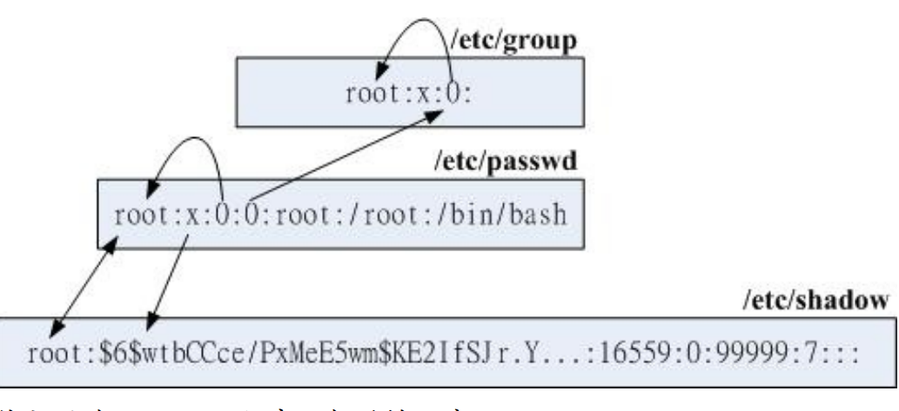

## 9.1账号与群组

### 9.1.1 使用者识别码 UID与GID

```bash
# 1\. 先察看一下，系统里面有没有一个名为 dmtsai 的用户？
[root@study ~]# id dmtsai
uid=1000（dmtsai） gid=1000（dmtsai） groups=1000（dmtsai）,10（wheel） <==确定有这个帐号喔！
[root@study ~]# ll -d /home/dmtsai
drwx------. 17 dmtsai dmtsai 4096 Jul 17 19:51 /home/dmtsai
# 瞧一瞧，使用者的字段正是 dmtsai 本身喔！
# 2\. 修改一下，将刚刚我们的 dmtsai 的 1000 UID 改为 2000 看看：
[root@study ~]# vim /etc/passwd
....（前面省略）....
dmtsai:x:2000:1000:dmtsai:/home/dmtsai:/bin/bash <==修改一下特殊字体部分，由 1000 改过来
[root@study ~]# ll -d /home/dmtsai
drwx------. 17 1000 dmtsai 4096 Jul 17 19:51 /home/dmtsai
# 很害怕吧！怎么变成 1000 了？因为文件只会记录 UID 的数字而已！
# 因为我们乱改，所以导致 1000 找不到对应的帐号，因此显示数字！
# 3\. 记得将刚刚的 2000 改回来！
[root@study ~]# vim /etc/passwd
....（前面省略）....
dmtsai:x:1000:1000:dmtsai:/home/dmtsai:/bin/bash <==“务必一定要”改回来！
```

### 9.1.2 使用者账号

Linux 系统上面的使用者如果需要登陆主机以取得 shell 的环境来工作时，他需要如何进行
呢？ 首先，他必须要在计算机前面利用 tty1~tty6 的终端机提供的 login 接口，并输入帐号与密码后才能够登陆。 如果是通过网络的话，那至少使用者就得要学习 ssh 这个功能了 （服务器篇再来谈）。 那么你输入帐号密码后，系统帮你处理了什么呢？

- 先找寻 /etc/passwd 里面是否有你输入的帐号？如果没有则跳出，如果有的话则将该帐号对应的 UID 与 GID （在 /etc/group 中） 读出来，另外，该帐号的主文件夹与 shell 设置也一并读出；

- 再来则是核对密码表啦！这时 Linux 会进入 /etc/shadow 里面找出对应的帐号与 UID，然后核对一下你刚刚输入的密码与里头的密码是否相符？

- 如果一切都 OK 的话，就进入 Shell 控管的阶段啰！

下面我们简单列出账号内容

```bash
xiaoyou@dev:~$ head -n 4 /etc/passwd
root:x:0:0:root:/root:/bin/bash
daemon:x:1:1:daemon:/usr/sbin:/usr/sbin/nologin
bin:x:2:2:bin:/bin:/usr/sbin/nologin
sys:x:3:3:sys:/dev:/usr/sbin/nologin
```

可以明显的看出来，每一行使用“:”分隔开，共有七个咚咚，分别是：

1. 帐号名称： 就是帐号啦！用来提供给对数字不太敏感的人类使用来登陆系统的！需要用来对应 UID 喔。例如 root 的 UID 对应就是 0 （第三字段）；

2. 密码： 早期 Unix 系统的密码就是放在这字段上！但是因为这个文件的特性是所有的程序都能够读取，这样一来很容易造成密码数据被窃取， 因此后来就将这个字段的密码数据给他改放到 /etc/shadow 中了。所以这里你会看到一个“ x ”，呵呵！

3. UID： 这个就是使用者识别码啰！通常 Linux 对于 UID 有几个限制需要说给您了解一
   下：

```bash
| id 范围 | 该 ID 使用者特性 |
| 0（系统管理员） | 当 UID 是 0 时，代表这个帐号是“系统管理员”！ 所以当你要让其他的帐号名称也具有 root 的权限时，将该帐号的 UID 改为 0 即可。 这也就是说，一部系统上面的系统管理员不见得只有 root 喔！ 不过，很不建议有多个帐号的 UID 是 0 啦～容易让系统管理员混乱！ |
| 1~999（系统帐号） | 保留给系统使用的 ID，其实除了 0 之外，其他的 UID 权限与特性并没有不一样。默认 1000 以下的数字让给系统作为保留帐号只是一个习惯。由于系统上面启动的网络服务或背景服务希望使用较小的权限去运行，因此不希望使用 root 的身份去执行这些服务， 所以我们就得要提供这些运行中程序的拥有者帐号才行。这些系统帐号通常是不可登陆的， 所以才会有我们在[第十章](../Text/index.html)提到的 /sbin/nologin 这个特殊的 shell 存在。根据系统帐号的由来，通常这类帐号又约略被区分为两种：1~200：由 distributions 自行创建的系统帐号；201~999：若使用者有系统帐号需求时，可以使用的帐号 UID。 |
| 1000~60000（可登陆帐号） | 给一般使用者用的。事实上，目前的 linux 核心 （3.10.x 版）已经可以支持到 429496
```

4. GID： 这个与 /etc/group 有关！其实 /etc/group 的观念与 /etc/passwd 差不多，只是他是用来规范群组名称与 GID 的对应而已！

5. 使用者信息说明栏： 这个字段基本上并没有什么重要用途，只是用来解释这个帐号的意
   义而已！不过，如果您提供使用 finger 的功能时， 这个字段可以提供很多的讯息呢！本
   章后面的 chfn 指令会来解释这里的说明。

6. 主文件夹： 这是使用者的主文件夹，以上面为例， root 的主文件夹在 /root ，所以当
   root 登陆之后，就会立刻跑到 /root 目录里头啦！呵呵！ 如果你有个帐号的使用空间特别的大，你想要将该帐号的主文件夹移动到其他的硬盘去该怎么作？ 没有错！可以在这个字段进行修改呦！默认的使用者主文件夹在 /home/yourIDnam

7. Shell： 我们在第十章 BASH 提到很多次，当使用者登陆系统后就会取得一个 Shell 来与
   系统的核心沟通以进行使用者的操作任务。那为何默认 shell 会使用 bash 呢？就是在这
   个字段指定的啰！ 这里比较需要注意的是，有一个 shell 可以用来替代成让帐号无法取得shell 环境的登陆动作！那就是 /sbin/nologin 这个东西！这也可以用来制作纯 pop 邮件帐号者的数据呢！

下面来看/etc/shadow

```bash
[root@study ~]# head -n 4 /etc/shadow
root:$6$wtbCCce/PxMeE5wm$KE2IfSJr.YLP7Rcai6oa/T7KFhO...:16559:0:99999:7::: <==下面说明用
bin:*:16372:0:99999:7:::
daemon:*:16372:0:99999:7:::
adm:*:16372:0:99999:7:::
```

基本上， shadow 同样以“:”作为分隔符号，如果数一数，会发现共有九个字段啊，这九个字段的用途是这样的：

1. 帐号名称： 由于密码也需要与帐号对应啊～因此，这个文件的第一栏就是帐号，必须要
   与 /etc/passwd 相同才行！

2. 密码： 这个字段内的数据才是真正的密码，而且是经过编码的密码 （加密） 啦！ 你只
   会看到有一些特殊符号的字母就是了！需要特别留意的是，虽然这些加密过的密码很难
   被解出来， 但是“很难”不等于“不会”，所以，这个文件的默认权限是“-rw-------”或者是“----
   ------”，亦即只有 root 才可以读写就是了！你得随时注意，不要不小心更动了这个文件的权限呢！

> 另外，由于各种密码编码的技术不一样，因此不同的编码系统会造成这个字段的长度不相同。 举例来说，旧式的 DES, MD5 编码系统产生的密码长度就与目前惯用的 SHA 不同[2]！SHA 的密码长度明显的比较长些。由于固定的编码系统产生的密码长度必须一致，因此“当你让这个字段的长度改变后，该密码就会失效（算不出来）”。 很多软件通过这个功能，在此字段前加上 ! 或 * 改变密码字段长度，就会让密码“暂时失效”了。

3. 最近更动密码的日期： 这个字段记录了“更动密码那一天”的日期，不过，很奇怪呀！在
   我的例子中怎么会是 16559 呢？呵呵，这个是因为计算 Linux 日期的时间是以 1970 年 1月 1 日作为 1 而累加的日期，1971 年 1 月 1 日则为 366 啦！ 得注意一下这个数据呦！上述的 16559 指的就是 2015-05-04 那一天啦！了解乎？ 而想要了解该日期可以使用本章后面 chage 指令的帮忙！至于想要知道某个日期的累积日数， 可使用如下的程序计算：

```bash
[root@study ~]# echo $（（$（date --date="2015/05/04" +%s）/86400+1））
16559
```

4. 密码不可被更动的天数：（与第 3 字段相比） 第四个字段记录了：这个帐号的密码在最
   近一次被更改后需要经过几天才可以再被变更！如果是 0 的话， 表示密码随时可以更动
   的意思。这的限制是为了怕密码被某些人一改再改而设计的！如果设置为 20 天的话，那
   么当你设置了密码之后， 20 天之内都无法改变这个密码呦！

5. 密码需要重新变更的天数：（与第 3 字段相比） 经常变更密码是个好习惯！为了强制要
   求使用者变更密码，这个字段可以指定在最近一次更改密码后， 在多少天数内需要再次
   的变更密码才行。你必须要在这个天数内重新设置你的密码，否则这个帐号的密码将
   会“变为过期特性”。 而如果像上面的 99999 （计算为 273 年） 的话，那就表示，呵呵，密码的变更没有强制性之意。

6. 密码需要变更期限前的警告天数：（与第 5 字段相比） 当帐号的密码有效期限快要到的
   时候 （第 5 字段），系统会依据这个字段的设置，发出“警告”言论给这个帐号，提醒
   他“再过 n 天你的密码就要过期了，请尽快重新设置你的密码呦！”，如上面的例子，则是密码到期之前的 7 天之内，系统会警告该用户。

7. 密码过期后的帐号宽限时间（密码失效日）：（与第 5 字段相比） 密码有效日期为“更新
   日期（第3字段）”+“重新变更日期（第5字段）”，过了该期限后使用者依旧没有更新密
   码，那该密码就算过期了。 虽然密码过期但是该帐号还是可以用来进行其他工作的，包
   括登陆系统取得 bash 。不过如果密码过期了， 那当你登陆系统时，系统会强制要求你
   必须要重新设置密码才能登陆继续使用喔，这就是密码过期特性。
   那这个字段的功能是什么呢？是在密码过期几天后，如果使用者还是没有登陆更改密
   码，那么这个帐号的密码将会“失效”， 亦即该帐号再也无法使用该密码登陆了。要注意
   密码过期与密码失效并不相同。

8. 帐号失效日期： 这个日期跟第三个字段一样，都是使用 1970 年以来的总日数设置。这
   个字段表示： 这个帐号在此字段规定的日期之后，将无法再使用。 就是所谓的“帐号失
   效”，此时不论你的密码是否有过期，这个“帐号”都不能再被使用！ 这个字段会被使用通
   常应该是在“收费服务”的系统中，你可以规定一个日期让该帐号不能再使用啦！

9. 保留： 最后一个字段是保留的，看以后有没有新功能加入。

### 9.1.3 关于群组

下面介绍 /etc/group 与 /etc/gshadow

/etc/group 文件结构

这个文件就是在记录 GID 与群组名称的对应了～

```bash
xiaoyou@dev:~$ head -n 4 /etc/group
root:x:0:
daemon:x:1:
bin:x:2:
sys:x:3:
```

这个文件每一行代表一个群组，也是以冒号“:”作为字段的分隔符号，共分为四栏，每一字段
的意义是：

1. 群组名称： 就是群组名称啦！同样用来给人类使用的，基本上需要与第三字段的 GID 对
   应。

2. 群组密码： 通常不需要设置，这个设置通常是给“群组管理员”使用的，目前很少有这个
   机会设置群组管理员啦！ 同样的，密码已经移动到 /etc/gshadow 去，因此这个字段只会存在一个“x”而已；

3. GID： 就是群组的 ID 啊。我们 /etc/passwd 第四个字段使用的 GID 对应的群组名，就是由这里对应出来的！

4. 此群组支持的帐号名称： 我们知道一个帐号可以加入多个群组，那某个帐号想要加入此
   群组时，将该帐号填入这个字段即可。 举例来说，如果我想要让 dmtsai 与 alex 也加入
   root 这个群组，那么在第一行的最后面加上“dmtsai,alex”，注意不要有空格， 使成为“
   root: x: 0:dmtsai,alex ”就可以啰～

这几个字段的关系如下



有效群组（effective group）与初始群组（initial group）

还记得每个使用者在他的 /etc/passwd 里面的第四栏有所谓的 GID 吧？那个 GID 就是所谓
的“初始群组 （initial group） ”！也就是说，当使用者一登陆系统，立刻就拥有这个群组的相关权限的意思。 举例来说，我们上面提到 dmtsai 这个使用者的 /etc/passwd 与 /etc/group 还有 /etc/gshadow 相关的内容如下：

```bash
[root@study ~]# usermod -a -G users dmtsai <==先设置好次要群组
[root@study ~]# grep dmtsai /etc/passwd /etc/group /etc/gshadow
/etc/passwd:dmtsai:x:1000:1000:dmtsai:/home/dmtsai:/bin/bash
/etc/group:wheel:x:10:dmtsai <==次要群组的设置、安装时指定的
/etc/group:users:x:100:dmtsai <==次要群组的设置
/etc/group:dmtsai:x:1000: <==因为是初始群组，所以第四字段不需要填入帐号
/etc/gshadow:wheel:::dmtsai <==次要群组的设置
/etc/gshadow:users:::dmtsai <==次要群组的设置
/etc/gshadow:dmtsai:!!::
```

groups: 有效与支持群组的观察

如果我以 dmtsai 这个使用者的身份登陆后，该如何知道我所有支持的群组呢？ 很简单啊，直接输入 groups 就可以了！注意喔，是 groups 有加 s 呢！结果像这样：

```bash
[dmtsai@study ~]$ groups
dmtsai wheel users
```

第一个输出的群组即为有效群组 （effective group） 了。 也就是说，我的有效群
组为 dmtsai 啦～此时，如果我以 touch 去创建一个新文件，例如： “ touch test ”，那么这个文件的拥有者为 dmtsai ，而且群组也是 dmtsai 的啦。

通常有效群组的作用是在新建文件啦！

newgrp: 有效群组的切换

使用 newgrp 是有限制的，那就是你想要
切换的群组必须是你已经有支持的群组。举例来说， dmtsai 可以在 dmtsai/wheel/users 这三个群组间切换有效群组，但是 dmtsai 无法切换有效群组成为 sshd 啦！使用的方式如下：

```bash
[dmtsai@study ~]$ newgrp users
[dmtsai@study ~]$ groups
users wheel dmtsai
[dmtsai@study ~]$ touch test2
[dmtsai@study ~]$ ll test*
-rw-rw-r--. 1 dmtsai dmtsai 0 Jul 20 19:54 test
-rw-r--r--. 1 dmtsai users 0 Jul 20 19:56 test2
[dmtsai@study ~]$ exit # 注意！记得离开 newgrp 的环境喔！
```

那么如何让一个帐号加入不同的群组就是问题的所在啰。你要加入一个群组有两个方式，一个是通过系统管理员 （root） 利用 usermod 帮你加入，如果 root 太忙了而且你的系统有设置群组管理员，那么你可以通过群组管理员以 gpasswd 帮你加入他所管理的群组中！

/etc/gshadow

```bash
[root@study ~]# head -n 4 /etc/gshadow
root:::
bin:::
daemon:::
sys:::
```

这个文件内同样还是使用冒号“:”来作为字段的分隔字符，而且你会发现，这个文件几乎与
/etc/group 一模一样啊！是这样没错～不过，要注意的大概就是第二个字段吧～第二个字段是密码栏， 如果密码栏上面是“!”或空的时，表示该群组不具有群组管理员！至于第四个字段也就是支持的帐号名称啰～ 这四个字段的意义为：

1.  群组名称

2. 密码栏，同样的，开头为 ! 表示无合法密码，所以无群组管理员

3. 群组管理员的帐号 （相关信息在 gpasswd 中介绍）

4. 有加入该群组支持的所属帐号 （与 /etc/group 内容相同！）

## 9.2 账号管理

### 9.2.1 新增与移除使用者

要如何在 Linux 的系统新增一个使用者啊？呵呵～真是太简单了～我们登陆系统时会输入
（1）帐号与 （2）密码， 所以创建一个可用的帐号同样的也需要这两个数据。那帐号可以使用 useradd 来新建使用者，密码的给予则使用 passwd 这个指令！这两个指令下达方法如
下：

```bash
[root@study ~]# useradd [-u UID] [-g 初始群组] [-G 次要群组] [-mM]\
> [-c 说明栏] [-d 主文件夹绝对路径] [-s shell] 使用者帐号名
选项与参数：
-u ：后面接的是 UID ，是一组数字。直接指定一个特定的 UID 给这个帐号；
-g ：后面接的那个群组名称就是我们上面提到的 initial group 啦～
该群组的 GID 会被放置到 /etc/passwd 的第四个字段内。
-G ：后面接的群组名称则是这个帐号还可以加入的群组。
这个选项与参数会修改 /etc/group 内的相关数据喔！
-M ：强制！不要创建使用者主文件夹！（系统帐号默认值）
-m ：强制！要创建使用者主文件夹！（一般帐号默认值）
-c ：这个就是 /etc/passwd 的第五栏的说明内容啦～可以随便我们设置的啦～
-d ：指定某个目录成为主文件夹，而不要使用默认值。务必使用绝对路径！
-r ：创建一个系统的帐号，这个帐号的 UID 会有限制 （参考 /etc/login.defs）
-s ：后面接一个 shell ，若没有指定则默认是 /bin/bash 的啦～
-e ：后面接一个日期，格式为“YYYY-MM-DD”此项目可写入 shadow 第八字段，
亦即帐号失效日的设置项目啰；
-f ：后面接 shadow 的第七字段项目，指定密码是否会失效。0为立刻失效，
-1 为永远不失效（密码只会过期而强制于登陆时重新设置而已。）
范例一：完全参考默认值创建一个使用者，名称为 vbird1
[root@study ~]# useradd vbird1
[root@study ~]# ll -d /home/vbird1
drwx------. 3 vbird1 vbird1 74 Jul 20 21:50 /home/vbird1
# 默认会创建使用者主文件夹，且权限为 700 ！这是重点！
[root@study ~]# grep vbird1 /etc/passwd /etc/shadow /etc/group
/etc/passwd:vbird1:x:1003:1004::/home/vbird1:/bin/bash
/etc/shadow:vbird1:!!:16636:0:99999:7:::
/etc/group:vbird1:x:1004: <==默认会创建一个与帐号一模一样的群组名
```

如果有一些特殊要求

```bash
范例二：假设我已知道我的系统当中有个群组名称为 users ，且 UID 1500 并不存在，
请用 users 为初始群组，以及 uid 为 1500 来创建一个名为 vbird2 的帐号
[root@study ~]# useradd -u 1500 -g users vbird2
[root@study ~]# ll -d /home/vbird2
drwx------. 3 vbird2 users 74 Jul 20 21:52 /home/vbird2
[root@study ~]# grep vbird2 /etc/passwd /etc/shadow /etc/group
/etc/passwd:vbird2:x:1500:100::/home/vbird2:/bin/bash
/etc/shadow:vbird2:!!:16636:0:99999:7:::
# 看一下，UID 与 initial group 确实改变成我们需要的了！
```

下面我们创建一个系统账号

```bash
范例三：创建一个系统帐号，名称为 vbird3
[root@study ~]# useradd -r vbird3
[root@study ~]# ll -d /home/vbird3
ls: cannot access /home/vbird3: No such file or directorya <==不会主动创建主文件夹
[root@study ~]# grep vbird3 /etc/passwd /etc/shadow /etc/group
/etc/passwd:vbird3:x:699:699::/home/vbird3:/bin/bash
/etc/shadow:vbird3:!!:16636::::::
/etc/group:vbird3:x:699:
```

其实 useradd 的默认值可以使用下面的方法调用出来：

```bash
[root@study ~]# useradd -D
GROUP=100 <==默认的群组
HOME=/home <==默认的主文件夹所在目录
INACTIVE=-1 <==密码失效日，在 shadow 内的第 7 栏
EXPIRE= <==帐号失效日，在 shadow 内的第 8 栏
SHELL=/bin/bash <==默认的 shell
SKEL=/etc/skel <==使用者主文件夹的内容数据参考目录
CREATE_MAIL_SPOOL=yes <==是否主动帮使用者创建邮件信箱（mailbox）
```

除了这些基本的帐号设置值之外， UID/GID 还有密码参数又是在哪里参考的呢？那就得要看
一下 /etc/login.defs 啦！ 这个文件的内容有点像下面这样：

```bash
MAIL_DIR /var/spool/mail <==使用者默认邮件信箱放置目录
PASS_MAX_DAYS 99999 <==/etc/shadow 内的第 5 栏，多久需变更密码日数
PASS_MIN_DAYS 0 <==/etc/shadow 内的第 4 栏，多久不可重新设置密码日数
PASS_MIN_LEN 5 <==密码最短的字符长度，已被 pam 模块取代，失去效用！
PASS_WARN_AGE 7 <==/etc/shadow 内的第 6 栏，过期前会警告的日数
UID_MIN 1000 <==使用者最小的 UID，意即小于 1000 的 UID 为系统保留
UID_MAX 60000 <==使用者能够用的最大 UID
SYS_UID_MIN 201 <==保留给使用者自行设置的系统帐号最小值 UID
SYS_UID_MAX 999 <==保留给使用者自行设置的系统帐号最大值 UID
GID_MIN 1000 <==使用者自订群组的最小 GID，小于 1000 为系统保留
GID_MAX 60000 <==使用者自订群组的最大 GID
SYS_GID_MIN 201 <==保留给使用者自行设置的系统帐号最小值 GID
SYS_GID_MAX 999 <==保留给使用者自行设置的系统帐号最大值 GID
CREATE_HOME yes <==在不加 -M 及 -m 时，是否主动创建使用者主文件夹？
UMASK 077 <==使用者主文件夹创建的 umask ，因此权限会是 700
USERGROUPS_ENAB yes <==使用 userdel 删除时，是否会删除初始群组
ENCRYPT_METHOD SHA512 <==密码加密的机制使用的是 sha512 这一个机制！
```

创建好账号后，下面我们来处理密码

```bash
[root@study ~]# passwd [--stdin] [帐号名称] <==所有人均可使用来改自己的密码
[root@study ~]# passwd [-l] [-u] [--stdin] [-S] \
> [-n 日数] [-x 日数] [-w 日数] [-i 日期] 帐号 <==root 功能
选项与参数：
--stdin ：可以通过来自前一个管线的数据，作为密码输入，对 shell script 有帮助！
-l ：是 Lock 的意思，会将 /etc/shadow 第二栏最前面加上 ! 使密码失效；
-u ：与 -l 相对，是 Unlock 的意思！
-S ：列出密码相关参数，亦即 shadow 文件内的大部分信息。
-n ：后面接天数，shadow 的第 4 字段，多久不可修改密码天数
-x ：后面接天数，shadow 的第 5 字段，多久内必须要更动密码
-w ：后面接天数，shadow 的第 6 字段，密码过期前的警告天数
-i ：后面接“日期”，shadow 的第 7 字段，密码失效日期
范例一：请 root 给予 vbird2 密码
[root@study ~]# passwd vbird2
Changing password for user vbird2.
New UNIX password: <==这里直接输入新的密码，屏幕不会有任何反应
BAD PASSWORD: The password is shorter than 8 characters <==密码太简单或过短的错误！
Retype new UNIX password: <==再输入一次同样的密码
passwd: all authentication tokens updated successfully. <==竟然还是成功修改了！
```

那如果是使用者自己要改密码呢？ 包括 root 也是这样修改的喔！

```bash
范例二：用 vbird2 登陆后，修改 vbird2 自己的密码
[vbird2@study ~]$ passwd <==后面没有加帐号，就是改自己的密码！
Changing password for user vbird2.
Changing password for vbird2
（current） UNIX password: <==这里输入“原有的旧密码”
New UNIX password: <==这里输入新密码
BAD PASSWORD: The password is shorter than 8 characters <==密码太短！不可以设置！重新想
New password: <==这里输入新想的密码
BAD PASSWORD: The password fails the dictionary check - it is based on a dictionary word
# 同样的，密码设置在字典里面找的到该字串，所以也是不建议！无法通过，再想新的！
New UNIX password: <==这里再想个新的密码来输入吧
Retype new UNIX password: <==通过密码验证！所以重复这个密码的输入
passwd: all authentication tokens updated successfully. <==有无成功看关键字
```

为了方便系统管理，新版的 passwd 还加入了很多创意选项喔！鸟哥个人认为最好用的大概
就是这个“ --stdin ”了！ 举例来说，你想要帮 vbird2 变更密码成为 abc543CC ，可以这样下达指令呢！

```bash
范例三：使用 standard input 创建用户的密码
[root@study ~]# echo "abc543CC" | passwd --stdin vbird2
Changing password for user vbird2.
passwd: all authentication tokens updated successfully.
```

这个动作会直接更新使用者的密码而不用再次的手动输入！好处是方便处理，缺点是这个密
码会保留在指令中， 未来若系统被攻破，人家可以在 /root/.bash_history 找到这个密码呢！
所以这个动作通常仅用在 shell script 的大量创建使用者帐号当中！要注意的是，这个选项并
不存在所有 distributions 版本中

如果你想要让 vbird2 的密码具有相当的规则，举例来说你要让 vbird2 每 60 天需要变更密
码， 密码过期后 10 天未使用就宣告帐号失效，那该如何处理？

```bash
范例四：管理 vbird2 的密码使具有 60 天变更、密码过期 10 天后帐号失效的设置
[root@study ~]# passwd -S vbird2
vbird2 PS 2015-07-20 0 99999 7 -1 （Password set, SHA512 crypt.）
# 上面说明密码创建时间 （2015-07-20）、0 最小天数、99999 变更天数、7 警告日数与密码不会失效 （-1）
[root@study ~]# passwd -x 60 -i 10 vbird2
[root@study ~]# passwd -S vbird2
vbird2 PS 2015-07-20 0 60 7 10 （Password set, SHA512 crypt.）
```

那如果我想要让某个帐号暂时无法使用密码登陆主机呢？举例来说， vbird2 这家伙最近老是
胡乱在主机乱来， 所以我想要暂时让她无法登陆的话，最简单的方法就是让她的密码变成不
合法 （shadow 第 2 字段长度变掉）！ 处理的方法就更简单的！

```bash
范例五：让 vbird2 的帐号失效，观察完毕后再让她失效
[root@study ~]# passwd -l vbird2
[root@study ~]# passwd -S vbird2
vbird2 LK 2015-07-20 0 60 7 10 （Password locked.）
# 嘿嘿！状态变成“ LK, Lock ”了啦！无法登陆喔！
[root@study ~]# grep vbird2 /etc/shadow
vbird2:!!$6$iWWO6T46$uYStdkB7QjcUpJaCLB.OOp...:16636:0:60:7:10::
# 其实只是在这里加上 !! 而已！
[root@study ~]# passwd -u vbird2
[root@study ~]# grep vbird2 /etc/shadow
vbird2:$6$iWWO6T46$uYStdkB7QjcUpJaCLB.OOp...:16636:0:60:7:10::
# 密码字段恢复正常！
```

除了使用 passwd -S 之外，有没有更详细的密码参数显示功能呢？有的！那就是 chage 了！
他的用法如下：

```bash
[root@study ~]# chage [-ldEImMW] 帐号名
选项与参数：
-l ：列出该帐号的详细密码参数；
-d ：后面接日期，修改 shadow 第三字段（最近一次更改密码的日期），格式 YYYY-MM-DD
-E ：后面接日期，修改 shadow 第八字段（帐号失效日），格式 YYYY-MM-DD
-I ：后面接天数，修改 shadow 第七字段（密码失效日期）
-m ：后面接天数，修改 shadow 第四字段（密码最短保留天数）
-M ：后面接天数，修改 shadow 第五字段（密码多久需要进行变更）
-W ：后面接天数，修改 shadow 第六字段（密码过期前警告日期）
范例一：列出 vbird2 的详细密码参数
[root@study ~]# chage -l vbird2
Last password change : Jul 20, 2015
Password expires : Sep 18, 2015
Password inactive : Sep 28, 2015
Account expires : never
Minimum number of days between password change : 0
Maximum number of days between password change : 60
Number of days of warning before password expires : 7
```

chage 有一个功能很不错喔！如果你想要让“使用者在第一次登陆时， 强制她们一定要更改密
码后才能够使用系统资源”，可以利用如下的方法来处理的！

```bash
范例二：创建一个名为 agetest 的帐号，该帐号第一次登陆后使用默认密码，但必须要更改过密码后，
使用新密码才能够登陆系统使用 bash 环境
[root@study ~]# useradd agetest
[root@study ~]# echo "agetest" | passwd --stdin agetest
[root@study ~]# chage -d 0 agetest
[root@study ~]# chage -l agetest | head -n 3
Last password change : password must be changed
Password expires : password must be changed
Password inactive : password must be changed
# 此时此帐号的密码创建时间会被改为 1970/1/1 ，所以会有问题！
范例三：尝试以 agetest 登陆的情况
You are required to change your password immediately （root enforced）
WARNING: Your password has expired.
You must change your password now and login again!
Changing password for user agetest.
Changing password for agetest
（current） UNIX password: <==这个帐号被强制要求必须要改密码！
```

下面简单介绍一下如何修改useradd 参数

```bash
[root@study ~]# usermod [-cdegGlsuLU] username
选项与参数：
-c ：后面接帐号的说明，即 /etc/passwd 第五栏的说明栏，可以加入一些帐号的说明。
-d ：后面接帐号的主文件夹，即修改 /etc/passwd 的第六栏；
-e ：后面接日期，格式是 YYYY-MM-DD 也就是在 /etc/shadow 内的第八个字段数据啦！
-f ：后面接天数，为 shadow 的第七字段。
-g ：后面接初始群组，修改 /etc/passwd 的第四个字段，亦即是 GID 的字段！
-G ：后面接次要群组，修改这个使用者能够支持的群组，修改的是 /etc/group 啰～
-a ：与 -G 合用，可“增加次要群组的支持”而非“设置”喔！
-l ：后面接帐号名称。亦即是修改帐号名称， /etc/passwd 的第一栏！
-s ：后面接 Shell 的实际文件，例如 /bin/bash 或 /bin/csh 等等。
-u ：后面接 UID 数字啦！即 /etc/passwd 第三栏的数据；
-L ：暂时将使用者的密码冻结，让他无法登陆。其实仅改 /etc/shadow 的密码栏。
-U ：将 /etc/shadow 密码栏的 ! 拿掉，解冻啦！
```

```bash
范例一：修改使用者 vbird2 的说明栏，加上“VBird's test”的说明。
[root@study ~]# usermod -c "VBird's test" vbird2
[root@study ~]# grep vbird2 /etc/passwd
vbird2:x:1500:100:VBird's test:/home/vbird2:/bin/bash
范例二：使用者 vbird2 这个帐号在 2015/12/31 失效。
[root@study ~]# usermod -e "2015-12-31" vbird2
[root@study ~]# chage -l vbird2 | grep 'Account expires'
Account expires : Dec 31, 2015
范例三：我们创建 vbird3 这个系统帐号时并没有给予主文件夹，请创建他的主文件夹
[root@study ~]# ll -d ~vbird3
ls: cannot access /home/vbird3: No such file or directory <==确认一下，确实没有主文件夹的存在！
[root@study ~]# cp -a /etc/skel /home/vbird3
[root@study ~]# chown -R vbird3:vbird3 /home/vbird3
[root@study ~]# chmod 700 /home/vbird3
[root@study ~]# ll -a ~vbird3
drwx------. 3 vbird3 vbird3 74 May 4 17:51 . <==使用者主文件夹权限
drwxr-xr-x. 10 root root 4096 Jul 20 22:51 ..
-rw-r--r--. 1 vbird3 vbird3 18 Mar 6 06:06 .bash_logout
-rw-r--r--. 1 vbird3 vbird3 193 Mar 6 06:06 .bash_profile
-rw-r--r--. 1 vbird3 vbird3 231 Mar 6 06:06 .bashrc
drwxr-xr-x. 4 vbird3 vbird3 37 May 4 17:51 .mozilla
# 使用 chown -R 是为了连同主文件夹下面的使用者/群组属性都一起变更的意思；
# 使用 chmod 没有 -R ，是因为我们仅要修改目录的权限而非内部文件的权限！
```

删除用户的命令如下

```bash
[root@study ~]# userdel [-r] username
选项与参数：
-r ：连同使用者的主文件夹也一起删除
范例一：删除 vbird2 ，连同主文件夹一起删除
[root@study ~]# userdel -r vbird2
```

这个指令下达的时候要小心了！通常我们要移除一个帐号的时候，你可以手动的将
/etc/passwd 与 /etc/shadow 里头的该帐号取消即可！一般而言，如果该帐号只是“暂时不启
用”的话，那么将 /etc/shadow 里头帐号失效日期 （第八字段） 设置为 0 就可以让该帐号无法使用，但是所有跟该帐号相关的数据都会留下来！ 使用 userdel 的时机通常是“你真的确定不要让该用户在主机上面使用任何数据了！”

### 9.2.2 使用者功能

id 这个指令则可以查询某人或自己的相关 UID/GID 等等的信息，他的参数也不少，不过，都
不需要记～反正使用 id 就全部都列出啰！ 另外，也回想一下，我们在前一章谈到的循环时，就有用过这个指令喔！

```bash
[root@study ~]# id [username]
范例一：查阅 root 自己的相关 ID 信息！
[root@study ~]# id
uid=0（root） gid=0（root） groups=0（root） context=unconfined_u:unconfined_r:unconfined_t:
s0-s0:c0.c1023
# 上面信息其实是同一行的数据！包括会显示 UID/GID 以及支持的所有群组！
# 至于后面那个 context=... 则是 SELinux 的内容，先不要理会他！
范例二：查阅一下 vbird1 吧～
[root@study ~]# id vbird1
uid=1003（vbird1） gid=1004（vbird1） groups=1004（vbird1）
[root@study ~]# id vbird100
id: vbird100: No such user <== id 这个指令也可以用来判断系统上面有无某帐号！
```

finger 的中文字面意义是：“手指”或者是“指纹”的意思。这个 finger 可以查阅很多使用者相关
的信息喔！ 大部分都是在 /etc/passwd 这个文件里面的信息啦！不过，这个指令有点危险，
所以新的版本中已经默认不安装这个软件！

```bash
[root@study ~]# finger [-s] username
选项与参数：
-s ：仅列出使用者的帐号、全名、终端机代号与登陆时间等等；
-m ：列出与后面接的帐号相同者，而不是利用部分比对 （包括全名部分）
范例一：观察 vbird1 的使用者相关帐号属性
[root@study ~]# finger vbird1
Login: vbird1 Name:
Directory: /home/vbird1 Shell: /bin/bash
Never logged in.
No mail.
No Plan.
```

由于 finger 类似指纹的功能，他会将使用者的相关属性列出来！如上表所示，其实他列出来
的几乎都是 /etc/passwd 文件里面的东西。列出的信息说明如下：

- Login：为使用者帐号，亦即 /etc/passwd 内的第一字段；

- Name：为全名，亦即 /etc/passwd 内的第五字段（或称为注解）；

- Directory：就是主文件夹了；

- Shell：就是使用的 Shell 文件所在；

- Never logged in.：figner 还会调查使用者登陆主机的情况喔！

- No mail.：调查 /var/spool/mail 当中的信箱数据；

- No Plan.：调查 ~vbird1/.plan 文件，并将该文件取出来说明！

我们可以创建一个自己的计划档

```bash
范例二：利用 vbird1 创建自己的计划档
[vbird1@study ~]$ echo "I will study Linux during this year." > ~/.plan
[vbird1@study ~]$ finger vbird1
Login: vbird1 Name:
Directory: /home/vbird1 Shell: /bin/bash
Last login Mon Jul 20 23:06 （CST） on pts/0
No mail.
Plan:
I will study Linux during this year.
范例三：找出目前在系统上面登陆的使用者与登陆时间
[vbird1@study ~]$ finger
Login Name Tty Idle Login Time Office Office Phone Host
dmtsai dmtsai tty2 11d Jul 7 23:07
dmtsai dmtsai pts/0 Jul 20 17:59
```

chfn 有点像是： change finger 的意思！这玩意的使用方法如下：

```bash
[root@study ~]# chfn [-foph] [帐号名]
选项与参数：
-f ：后面接完整的大名；
-o ：您办公室的房间号码；
-p ：办公室的电话号码；
-h ：家里的电话号码！
范例一：vbird1 自己更改一下自己的相关信息！
[vbird1@study ~]$ chfn
Changing finger information for vbird1.
Name []: VBird Tsai test <==输入你想要呈现的全名
Office []: DIC in KSU <==办公室号码
Office Phone []: 06-2727175#356 <==办公室电话
Home Phone []: 06-1234567 <==家里电话号码
Password: <==确认身份，所以输入自己的密码
Finger information changed.
[vbird1@study ~]$ grep vbird1 /etc/passwd
vbird1:x:1003:1004:VBird Tsai test,DIC in KSU,06-2727175#356,06-1234567:/home/vbird1:/bin/bash
# 其实就是改到第五个字段，该字段里面用多个“ , ”分隔就是了！
[vbird1@study ~]$ finger vbird1
Login: vbird1 Name: VBird Tsai test
Directory: /home/vbird1 Shell: /bin/bash
Office: DIC in KSU, 06-2727175#356 Home Phone: 06-1234567
Last login Mon Jul 20 23:12 （CST） on pts/0
No mail.
Plan:
I will study Linux during this year.
# 就是上面特殊字体呈现的那些地方是由 chfn 所修改出来的！
```

chsh就是 change shell 的简写！使用方法就更简单了！

```bash
[vbird1@study ~]$ chsh [-ls]
选项与参数：
-l ：列出目前系统上面可用的 shell ，其实就是 /etc/shells 的内容！
-s ：设置修改自己的 Shell 啰
范例一：用 vbird1 的身份列出系统上所有合法的 shell，并且指定 csh 为自己的 shell
[vbird1@study ~]$ chsh -l
/bin/sh
/bin/bash
/sbin/nologin <==所谓：合法不可登陆的 Shell 就是这玩意！
/usr/bin/sh
/usr/bin/bash
/usr/sbin/nologin
/bin/tcsh
/bin/csh <==这就是 C shell 啦！
# 其实上面的信息就是我们在 [bash](../Text/index.html) 中谈到的 /etc/shells 啦！
[vbird1@study ~]$ chsh -s /bin/csh; grep vbird1 /etc/passwd
Changing shell for vbird1.
Password: <==确认身份，请输入 vbird1 的密码
Shell changed.
vbird1:x:1003:1004:VBird Tsai test,DIC in KSU,06-2727175#356,06-1234567:/home/vbird1:/bin/csh
[vbird1@study ~]$ chsh -s /bin/bash
# 测试完毕后，立刻改回来！
[vbird1@study ~]$ ll $（which chsh）
-rws--x--x. 1 root root 23856 Mar 6 13:59 /bin/chsh
```

### 9.2.3 新增与移除群组

groupadd

```bash
[root@study ~]# groupadd [-g gid] [-r] 群组名称
选项与参数：
-g ：后面接某个特定的 GID ，用来直接给予某个 GID ～
-r ：创建系统群组啦！与 /etc/login.defs 内的 GID_MIN 有关。
范例一：新建一个群组，名称为 group1
[root@study ~]# groupadd group1
[root@study ~]# grep group1 /etc/group /etc/gshadow
/etc/group:group1:x:1503:
/etc/gshadow:group1:!::
# 群组的 GID 也是会由 1000 以上最大 GID+1 来决定！
```

groupmod

```bash
[root@study ~]# groupmod [-g gid] [-n group_name] 群组名
选项与参数：
-g ：修改既有的 GID 数字；
-n ：修改既有的群组名称
范例一：将刚刚上个指令创建的 group1 名称改为 mygroup ， GID 为 201
[root@study ~]# groupmod -g 201 -n mygroup group1
[root@study ~]# grep mygroup /etc/group /etc/gshadow
/etc/group:mygroup:x:201:
/etc/gshadow:mygroup:!::
```

groupdel

```bash
[root@study ~]# groupdel [groupname]
范例一：将刚刚的 mygroup 删除！
[root@study ~]# groupdel mygroup
范例二：若要删除 vbird1 这个群组的话？
[root@study ~]# groupdel vbird1
groupdel: cannot remove the primary group of user 'vbird1'
```

gpasswd：群组管理员功能

```bash
# 关于系统管理员（root）做的动作：
[root@study ~]# gpasswd groupname
[root@study ~]# gpasswd [-A user1,...] [-M user3,...] groupname
[root@study ~]# gpasswd [-rR] groupname
选项与参数：
：若没有任何参数时，表示给予 groupname 一个密码（/etc/gshadow）
-A ：将 groupname 的主控权交由后面的使用者管理（该群组的管理员）
-M ：将某些帐号加入这个群组当中！
-r ：将 groupname 的密码移除
-R ：让 groupname 的密码栏失效
# 关于群组管理员（Group administrator）做的动作：
[someone@study ~]$ gpasswd [-ad] user groupname
选项与参数：
-a ：将某位使用者加入到 groupname 这个群组当中！
-d ：将某位使用者移除出 groupname 这个群组当中。
范例一：创建一个新群组，名称为 testgroup 且群组交由 vbird1 管理：
[root@study ~]# groupadd testgroup <==先创建群组
[root@study ~]# gpasswd testgroup <==给这个群组一个密码吧！
Changing the password for group testgroup
New Password:
Re-enter new password:
# 输入两次密码就对了！
[root@study ~]# gpasswd -A vbird1 testgroup <==加入群组管理员为 vbird1
[root@study ~]# grep testgroup /etc/group /etc/gshadow
/etc/group:testgroup:x:1503:
/etc/gshadow:testgroup:$6$MnmChP3D$mrUn.Vo.buDjObMm8F2emTkvGSeuWikhRzaKHxpJ...:vbird1:
# 很有趣吧！此时 vbird1 则拥有 testgroup 的主控权喔！身份有点像板主啦！
范例二：以 vbird1 登陆系统，并且让他加入 vbird1, vbird3 成为 testgroup 成员
[vbird1@study ~]$ id
uid=1003（vbird1） gid=1004（vbird1） groups=1004（vbird1） ...
# 看得出来，vbird1 尚未加入 testgroup 群组喔！
[vbird1@study ~]$ gpasswd -a vbird1 testgroup
[vbird1@study ~]$ gpasswd -a vbird3 testgroup
[vbird1@study ~]$ grep testgroup /etc/group
testgroup:x:1503:vbird1,vbird3
```

## 9.3 细部权限规划：ACL的使用

### 9.3.1 什么是ACL与如何支持启动ACL

ACL 是 unix-like 操作系统的额外支持项目，但因为近年以来 Linux 系统对权限
细部设置的热切需求， 因此目前 ACL 几乎已经默认加入在所有常见的 Linux 文件系统的挂载
参数中 （ext2/ext3/ext4/xfs等等）！所以你无须进行任何动作， ACL 就可以被你使用啰！不过，如果你不放心系统是否真的有支持 ACL 的话，那么就来检查一下核心挂载时显示的信息吧！

```bash
[root@study ~]# dmesg | grep -i acl
[ 0.330377] systemd[1]: systemd 208 running in system mode. （+PAM +LIBWRAP +AUDIT
+SELINUX +IMA +SYSVINIT +LIBCRYPTSETUP +GCRYPT +ACL +XZ）
[ 0.878265] SGI XFS with ACLs, security attributes, large block/inode numbers, no
debug enabled
```

### 9.3.2 ACL设置技巧

既然知道我们的 filesystem 有支持 ACL 之后，接下来该如何设置与观察 ACL 呢？ 很简单，利用这两个指令就可以了：

setfacl 指令用法介绍及最简单的“ u:帐号:权限 ”设置

```bash
[root@study ~]# setfacl [-bkRd] [{-m|-x} acl参数] 目标文件名
选项与参数：
-m ：设置后续的 acl 参数给文件使用，不可与 -x 合用；
-x ：删除后续的 acl 参数，不可与 -m 合用；
-b ：移除“所有的” ACL 设置参数；
-k ：移除“默认的” ACL 参数，关于所谓的“默认”参数于后续范例中介绍；
-R ：递回设置 acl ，亦即包括次目录都会被设置起来；
-d ：设置“默认 acl 参数”的意思！只对目录有效，在该目录新建的数据会引用此默认值
```

如何设置 ACL 的特殊权限呢？特殊权限的设置方法有很多， 我们先来谈谈最常见的，就是针对单一使用者的设置方式：

```bash
# 1\. 针对特定使用者的方式：
# 设置规范：“ u:[使用者帐号列表]:[rwx] ”，例如针对 vbird1 的权限规范 rx ：
[root@study ~]# touch acl_test1
[root@study ~]# ll acl_test1
-rw-r--r--. 1 root root 0 Jul 21 17:33 acl_test1
[root@study ~]# setfacl -m u:vbird1:rx acl_test1
[root@study ~]# ll acl_test1
-rw-r-xr--+ 1 root root 0 Jul 21 17:33 acl_test1
# 权限部分多了个 + ，且与原本的权限 （644） 看起来差异很大！但要如何查阅呢？
[root@study ~]# setfacl -m u::rwx acl_test1
[root@study ~]# ll acl_test1
-rwxr-xr--+ 1 root root 0 Jul 21 17:33 acl_test1
# 设置值中的 u 后面无使用者列表，代表设置该文件拥有者，所以上面显示 root 的权限成为 rwx 了！
```

getfacl 指令用法

```bash
[root@study ~]# getfacl filename
选项与参数：
getfacl 的选项几乎与 setfacl 相同！所以鸟哥这里就免去了选项的说明啊！
# 请列出刚刚我们设置的 acl_test1 的权限内容：
[root@study ~]# getfacl acl_test1
# file: acl_test1 <==说明文档名而已！
# owner: root <==说明此文件的拥有者，亦即 ls -l 看到的第三使用者字段
# group: root <==此文件的所属群组，亦即 ls -l 看到的第四群组字段
user::rwx <==使用者列表栏是空的，代表文件拥有者的权限
user:vbird1:r-x <==针对 vbird1 的权限设置为 rx ，与拥有者并不同！
group::r-- <==针对文件群组的权限设置仅有 r
mask::r-x <==此文件默认的有效权限 （mask）
other::r-- <==其他人拥有的权限啰！
```

特定的单一群组的权限设置：“ g:群组名:权限

```bash
# 2\. 针对特定群组的方式：
# 设置规范：“ g:[群组列表]:[rwx] ”，例如针对 mygroup1 的权限规范 rx ：
[root@study ~]# setfacl -m g:mygroup1:rx acl_test1
[root@study ~]# getfacl acl_test1
# file: acl_test1
# owner: root
# group: root
user::rwx
user:vbird1:r-x
group::r--
group:mygroup1:r-x <==这里就是新增的部分！多了这个群组的权限设置！
mask::r-x
other::r--
```

针对有效权限设置：“ m:权限 ”

基本上，群组与使用者的设置并没有什么太大的差异啦！如上表所示，非常容易了解意义。
不过，你应该会觉得奇怪的是， 那个 mask 是什么东西啊？其实他有点像是“有效权限”的意
思！他的意义是： 使用者或群组所设置的权限必须要存在于 mask 的权限设置范围内才会生
效，此即“有效权限 （effective permission）” 我们举个例子来看，如下所示：

```bash
# 3\. 针对有效权限 mask 的设置方式：
# 设置规范：“ m:[rwx] ”，例如针对刚刚的文件规范为仅有 r ：
[root@study ~]# setfacl -m m:r acl_test1
[root@study ~]# getfacl acl_test1
# file: acl_test1
# owner: root
# group: root
user::rwx
user:vbird1:r-x #effective:r-- <==vbird1+mask均存在者，仅有 r 而已，x 不会生效
group::r--
group:mygroup1:r-x #effective:r--
mask::r--
other::r--
```

您瞧，vbird1 与 mask 的集合发现仅有 r 存在，因此 vbird1 仅具有 r 的权限而已，并不存在 x权限！这就是 mask 的功能了！我们可以通过使用 mask 来规范最大允许的权限，就能够避免不小心开放某些权限给其他使用者或群组了。

```bash
# 1\. 先测试看看，使用 myuser1 能否进入该目录？
[myuser1@study ~]$ cd /srv/projecta
-bash: cd: /srv/projecta: Permission denied <==确实不可进入！
# 2\. 开始用 root 的身份来设置一下该目录的权限吧！
[root@study ~]# setfacl -m u:myuser1:rx /srv/projecta
[root@study ~]# getfacl /srv/projecta
# file: srv/projecta
# owner: root
# group: projecta
# flags: -suser::rwx
user:myuser1:r-x <==还是要看看有没有设置成功喔！
group::rwx
mask::rwx
other::---
# 3\. 还是得要使用 myuser1 去测试看看结果！
[myuser1@study ~]$ cd /srv/projecta
[myuser1@study projecta]$ ll -a
drwxrws---+ 2 root projecta 4096 Feb 27 11:29 . <==确实可以查询文件名
drwxr-xr-x 4 root root 4096 Feb 27 11:29 ..
[myuser1@study projecta]$ touch testing
touch: cannot touch `testing': Permission denied <==确实不可以写入！
```

如果我用 root 或者是 pro1 的身份去 /srv/projecta 增加文件或目录时，该文件或目录是否
能够具有 ACL 的设置？ 意思就是说，ACL 的权限设置是否能够被次目录所“继承？”先试看
看：

```bash
[root@study ~]# cd /srv/projecta
[root@study ~]# touch abc1
[root@study ~]# mkdir abc2
[root@study ~]# ll -d abc*
-rw-r--r--. 1 root projecta 0 Jul 21 17:49 abc1
drwxr-sr-x. 2 root projecta 6 Jul 21 17:49 abc2
```

你可以明显的发现，权限后面都没有 + ，代表这个 acl 属性并没有继承喔！如果你想要让 acl
在目录下面的数据都有继承的功能，那就得如下这样做了！

使用默认权限设置目录未来文件的 ACL 权限继承“ d:[u|g]:[user|group]:权限 ”

```bash
# 4\. 针对默认权限的设置方式：
# 设置规范：“ d:[ug]:使用者列表:[rwx] ”
# 让 myuser1 在 /srv/projecta 下面一直具有 rx 的默认权限！
[root@study ~]# setfacl -m d:u:myuser1:rx /srv/projecta
[root@study ~]# getfacl /srv/projecta
# file: srv/projecta
# owner: root
# group: projecta
# flags: -suser::rwx
user:myuser1:r-x
group::rwx
mask::rwx
other::---
default:user::rwx
default:user:myuser1:r-x
default:group::rwx
default:mask::rwx
default:other::---
[root@study ~]# cd /srv/projecta
[root@study projecta]# touch zzz1
[root@study projecta]# mkdir zzz2
[root@study projecta]# ll -d zzz*
-rw-rw----+ 1 root projecta 0 Jul 21 17:50 zzz1
drwxrws---+ 2 root projecta 6 Jul 21 17:51 zzz2
# 看吧！确实有继承喔！然后我们使用 getfacl 再次确认看看！
[root@study projecta]# getfacl zzz2
# file: zzz2
# owner: root
# group: projecta
# flags: -suser::rwx
user:myuser1:r-x
group::rwx
mask::rwx
other::---
default:user::rwx
default:user:myuser1:r-x
default:group::rwx
default:mask::rwx
default:other::---
```

针对刚刚的 /srv/projecta 目录的权限设置中，我需要 1）取消 myuser1 的设置（连同默
认值），以及 2）我不能让 pro3 这个用户使用该目录，亦即 pro3 在该目录下无任何权限，
该如何设置？答：取消全部的 ACL 设置可以使用 -b 来处理，但单一设置值的取消，就得要通过 -x 才行了！所以你应该这样作：

```bash
# 1.1 找到针对 myuser1 的设置值
[root@study ~]# getfacl /srv/projecta | grep myuser1
user:myuser1:r-x
default:user:myuser1:r-x
# 1.2 针对每个设置值来处理，注意，取消某个帐号的 ACL 时，不需要加上权限项目！
[root@study ~]# setfacl -x u:myuser1 /srv/projecta
[root@study ~]# setfacl -x d:u:myuser1 /srv/projecta
# 2.1 开始让 pro3 这个用户无法使用该目录啰！
[root@study ~]# setfacl -m u:pro3:- /srv/projecta
```

## 9.4 使用者身份切换

### 9.4.1 su

su 是最简单的身份切换指令了，他可以进行任何身份的切换唷！

```bash
[root@study ~]# su [-lm] [-c 指令] [username]
选项与参数：
- ：单纯使用 - 如“ su - ”代表使用 login-shell 的变量文件读取方式来登陆系统；
若使用者名称没有加上去，则代表切换为 root 的身份。
-l ：与 - 类似，但后面需要加欲切换的使用者帐号！也是 login-shell 的方式。
-m ：-m 与 -p 是一样的，表示“使用目前的环境设置，而不读取新使用者的配置文件”
-c ：仅进行一次指令，所以 -c 后面可以加上指令喔！
```

下面来一个简单的例子

```bash
范例一：假设你原本是 dmtsai 的身份，想要使用 non-login shell 的方式变成 root
[dmtsai@study ~]$ su <==注意提示字符，是 dmtsai 的身份喔！
Password: <==这里输入 root 的密码喔！
[root@study dmtsai]# id <==提示字符的目录是 dmtsai 喔！
uid=0（root） gid=0（root） groups=0（root） context=unconf.... <==确实是 root 的身份！
[root@study dmtsai]# env | grep 'dmtsai'
USER=dmtsai <==竟然还是 dmtsai 这家伙！
PATH=...:/home/dmtsai/.local/bin:/home/dmtsai/bin <==这个影响最大！
MAIL=/var/spool/mail/dmtsai <==收到的 mailbox 是 vbird1
PWD=/home/dmtsai <==并非 root 的主文件夹
LOGNAME=dmtsai
# 虽然你的 UID 已经是具有 root 的身份，但是看到上面的输出讯息吗？
# 还是有一堆变量为原本 dmtsai 的身份，所以很多数据还是无法直接利用。
[root@study dmtsai]# exit <==这样可以离开 su 的环境！
```

上面切换可能有有些问题，建议这样操作

```bash
范例二：使用 login shell 的方式切换为 root 的身份并观察变量
[dmtsai@study ~]$ su -
Password: <==这里输入 root 的密码喔！
[root@study ~]# env | grep root
USER=root
MAIL=/var/spool/mail/root
PATH=/usr/local/sbin:/usr/local/bin:/sbin:/bin:/usr/sbin:/usr/bin:/root/bin
PWD=/root
HOME=/root
LOGNAME=root
# 了解差异了吧？下次变换成为 root 时，记得最好使用 su - 喔！
[root@study ~]# exit <==这样可以离开 su 的环境！
```

我如果只是想要执行“一个只有 root 才能进行的指令，且执行完毕就恢复原本的身份”呢？那就可以加上 -c 这个选项啰

```bash
范例三：dmtsai 想要执行“ head -n 3 /etc/shadow ”一次，且已知 root 密码
[dmtsai@study ~]$ head -n 3 /etc/shadow
head: cannot open `/etc/shadow' for reading: Permission denied
[dmtsai@study ~]$ su - -c "head -n 3 /etc/shadow"
Password: <==这里输入 root 的密码喔！
root:$6$wtbCCce/PxMeE5wm$KE2IfSJr.YLP7Rcai6oa/T7KFhOYO62vDnqfLw85...:16559:0:99999:7:::
bin:*:16372:0:99999:7:::
daemon:*:16372:0:99999:7:::
[dmtsai@study ~]$ <==注意看，身份还是 dmtsai 喔！继续使用旧的身份进行系统操作！
```

如果我是 root 或者是其他人， 想要变更成为某些特殊帐号，可以使用如下的方法来切换喔！

```bash
范例四：原本是 dmtsai 这个使用者，想要变换身份成为 vbird1 时？
[dmtsai@study ~]$ su -l vbird1
Password: <==这里输入 vbird1 的密码喔！
[vbird1@study ~]$ su -
Password: <==这里输入 root 的密码喔！
[root@study ~]# id sshd
uid=74（sshd） gid=74（sshd） groups=74（sshd） ... <==确实有存在此人
[root@study ~]# su -l sshd
This account is currently not available. <==竟然说此人无法切换？
[root@study ~]# finger sshd
Login: sshd Name: Privilege-separated SSH
Directory: /var/empty/sshd Shell: /sbin/nologin
[root@study ~]# exit <==离开第二次的 su
[vbird1@study ~]$ exit <==离开第一次的 su
[dmtsai@study ~]$ exit <==这才是最初的环境！
```

### 9.4.2 sudo

 sudo 的执行则仅需要自己的密码即可！ 甚至可以设置不需要密码即可执行 sudo 呢！由于 sudo 可以让你以其他用户的身份执行指令 （通常是使用 root 的身份来执行指令），因此并非所有人都能够执行sudo ， 而是仅有规范到 /etc/sudoers 内的用户才能够执行 sudo 这个指令喔！

```bash
[root@study ~]# sudo [-b] [-u 新使用者帐号]
选项与参数：
-b ：将后续的指令放到背景中让系统自行执行，而不与目前的 shell 产生影响
-u ：后面可以接欲切换的使用者，若无此项则代表切换身份为 root 。
范例一：你想要以 sshd 的身份在 /tmp 下面创建一个名为 mysshd 的文件
[root@study ~]# sudo -u sshd touch /tmp/mysshd
[root@study ~]# ll /tmp/mysshd
-rw-r--r--. 1 sshd sshd 0 Jul 21 23:37 /tmp/mysshd
# 特别留意，这个文件的权限是由 sshd 所创建的情况喔！
范例二：你想要以 vbird1 的身份创建 ~vbird1/www 并于其中创建 index.html 文件
[root@study ~]# sudo -u vbird1 sh -c <u>"mkdir ~vbird1/www; cd ~vbird1/www; \</u>
> <u>echo 'This is index.html file' > index.html"</u>
[root@study ~]# ll -a ~vbird1/www
drwxr-xr-x. 2 vbird1 vbird1 23 Jul 21 23:38 .
drwx------. 6 vbird1 vbird1 4096 Jul 21 23:38 ..
-rw-r--r--. 1 vbird1 vbird1 24 Jul 21 23:38 index.html
# 要注意，创建者的身份是 vbird1 ，且我们使用 sh -c "一串指令" 来执行的！
```

visudo 与 /etc/sudoers

假如我们要让 vbird1 这个帐号可以使用 root 的任何指令，基本上有两种作法，第一种是直接通过修改 /etc/sudoers ，方法如下：

```bash
[root@study ~]# visudo
....（前面省略）....
root ALL=（ALL） ALL <==找到这一行，大约在 98 行左右
vbird1 ALL=（ALL） ALL <==这一行是你要新增的！
....（下面省略）....
```

其实 visudo 只是利用 vi 将 /etc/sudoers 文件调用出来进行修改而已，所以这个文件就是 /etc/sudoers 啦！

文件的格式如下

```bash
使用者帐号 登陆者的来源主机名称=（可切换的身份） 可下达的指令
root ALL=（ALL） ALL <==这是默认值
```

- “使用者帐号”：系统的哪个帐号可以使用 sudo 这个指令的意思；

- “登陆者的来源主机名称”：当这个帐号由哪部主机连线到本 Linux 主机，意思是这个帐号
  可能是由哪一部网络主机连线过来的， 这个设置值可以指定用户端计算机（信任的来源
  的意思）。默认值 root 可来自任何一部网络主机

- “（可切换的身份）”：这个帐号可以切换成什么身份来下达后续的指令，默认 root 可以
  切换成任何人；

- “可下达的指令”：可用该身份下达什么指令？这个指令请务必使用绝对路径撰写。 默认
  root 可以切换任何身份且进行任何指令之意。

下面简单测试一下

```bash
[vbird1@study ~]$ tail -n 1 /etc/shadow <==注意！身份是 vbird1
tail: cannot open `/etc/shadow' for reading: Permission denied
# 因为不是 root 嘛！所以当然不能查询 /etc/shadow
[vbird1@study ~]$ sudo tail -n 1 /etc/shadow <==通过 sudo
We trust you have received the usual lecture from the local System
Administrator. It usually boils down to these three things:
#1） Respect the privacy of others. <==这里仅是一些说明与警示项目
#2） Think before you type.
#3） With great power comes great responsibility.
[sudo] password for vbird1: <==注意啊！这里输入的是“ vbird1 自己的密码 ”
pro3:$6$DMilzaKr$OeHeTDQPHzDOz/u5Cyhq1Q1dy...:16636:0:99999:7:::
# 看！vbird1 竟然可以查询 shadow ！
```

利用 wheel 群组以及免密码的功能处理 visudo

我们在本章前面曾经创建过 pro1, pro2, pro3 ，这三个用户能否通过群组的功能让这三个人可以管理系统？ 可以的，而且很简单！同样我们使用实际案例来说明：

```bash
[root@study ~]# visudo <==同样的，请使用 root 先设置
....（前面省略）....
%wheel ALL=（ALL） ALL <==大约在 106 行左右，请将这行的 # 拿掉！
# 在最左边加上 % ，代表后面接的是一个“群组”之意！改完请储存后离开
[root@study ~]# usermod -a -G wheel pro1 <==将 pro1 加入 wheel 的支持
```

上面的设置值会造成“任何加入 wheel 这个群组的使用者，就能够使用 sudo 切换任何身份来
操作任何指令”的意思。 你当然可以将 wheel 换成你自己想要的群组名。接下来，请分别切换身份成为 pro1 及 pro2 试看看 sudo 的运行。

```bash
[pro1@study ~]$ sudo tail -n 1 /etc/shadow <==注意身份是 pro1
....（前面省略）....
[sudo] password for pro1: <==输入 pro1 的密码喔！
pro3:$6$DMilzaKr$OeHeTDQPHzDOz/u5Cyhq1Q1dy...:16636:0:99999:7:::
[pro2@study ~]$ sudo tail -n 1 /etc/shadow <==注意身份是 pro2
[sudo] password for pro2: <==输入 pro2 的密码喔！
pro2 is not in the sudoers file. This incident will be reported.
# 仔细看错误讯息他是说这个 pro2 不在 /etc/sudoers 的设置中！
```

既然我们都信任这些 sudo 的用户了，能否提供“不需要密码即可使用 sudo”呢？ 就通过如下的方式：

```bash
root@study ~]# visudo <==同样的，请使用 root 先设置
....（前面省略）....
%wheel ALL=（ALL） NOPASSWD: ALL <==大约在 109 行左右，请将 # 拿掉！
# 在最左边加上 % ，代表后面接的是一个“群组”之意！改完请储存后离开
```

上面两点都会让使用者能够利用 root 的身份进行任何事情！这样总是不太好～如果我想要让
使用者仅能够进行部分系统任务， 比方说，系统上面的 myuser1 仅能够帮 root 修改其他使
用者的密码时，亦即“当使用者仅能使用 passwd 这个指令帮忙 root 修改其他用户的密码”时，你该如何撰写呢？可以这样做：

```bash
[root@study ~]# visudo <==注意是 root 身份
myuser1 ALL=（root） /usr/bin/passwd <==最后指令务必用绝对路径
```

要注意的是： 指令字段必须要填写绝对路径才行！否则 visudo 会出现语法错误的状况发生！ 此外，上面的设置是有问题的！我们使用下面的指令操作来让您了解：

```bash
[myuser1@study ~]$ sudo passwd myuser3 <==注意，身份是 myuser1
[sudo] password for myuser1: <==输入 myuser1 的密码
Changing password for user myuser3\. <==下面改的是 myuser3 的密码喔！这样是正确的
New password:
Retype new password:
passwd: all authentication tokens updated successfully.
[myuser1@study ~]$ sudo passwd
Changing password for user root. <==见鬼！怎么会去改 root 的密码？
```

恐怖啊！我们竟然让 root 的密码被 myuser1 给改变了！下次 root 回来竟无法登陆系统...欲哭无泪～怎办？ 所以我们必须要限制使用者的指令参数！修改的方法为将上述的那行改一改
先：

```bash
[root@study ~]# visudo <==注意是 root 身份
myuser1 ALL=（root） !/usr/bin/passwd, /usr/bin/passwd [A-Za-z]*, !/usr/bin/passwd root
```

在设置值中加上惊叹号“ ! ”代表“不可执行”的意思。因此上面这一行会变成：可以执行“
passwd 任意字符”，但是“ passwd ”与“ passwd root ”这两个指令例外！ 如此一来 myuser1 就无法改变 root 的密码了！这样这位使用者可以具有 root 的能力帮助你修改其他用户的密码，而且也不能随意改变 root 的密码！很有用处的

通过别名创建 visudo：

如上述第三点，如果我有 15 个用户需要加入刚刚的管理员行列，那么我是否要将上述那长长的设置写入 15 行啊？ 而且如果想要修改命令或者是新增命令时，那我每行都需要重新设
置，很麻烦ㄟ！有没有更简单的方式？ 是有的！通过别名即可！我们 visudo 的别名可以
是“指令别名、帐号别名、主机别名”等。不过这里我们仅介绍帐号别名:

假设我的 pro1, pro2, pro3 与 myuser1, myuser2 要加入上述的密码管理员的 sudo 列表中，那我可以创立一个帐号别名称为 ADMPW 的名称，然后将这个名称处理一下即可。处理的方式如下：

```bash
[root@study ~]# visudo <==注意是 root 身份
User_Alias ADMPW = pro1, pro2, pro3, myuser1, myuser2
Cmnd_Alias ADMPWCOM = !/usr/bin/passwd, /usr/bin/passwd [A-Za-z]*, !/usr/bin/passwd root
ADMPW ALL=（root） ADMPWCOM
```

sudo 搭配 su 的使用方式

很多时候我们需要大量执行很多 root 的工作，所以一直使用 sudo 觉得很烦ㄟ！那有没有办
法使用 sudo 搭配 su ， 一口气将身份转为 root ，而且还用使用者自己的密码来变成 root
呢？是有的！而且方法简单的会让你想笑！ 我们创建一个 ADMINS 帐号别名，然后这样做：

```bash
[root@study ~]# visudo
User_Alias ADMINS = pro1, pro2, pro3, myuser1
ADMINS ALL=（root） /bin/su -
```

接下来，上述的 pro1, pro2, pro3, myuser1 这四个人，只要输入“ sudo su - ”并且输入“自己的密码”后， 立刻变成 root 的身份！不但 root 密码不会外流，使用者的管理也变的非常方便！

## 9.5 使用者特殊shell与PAM模块

### 9.5.1 特殊shell

当使用者尝试利用纯 mail 帐号 （例如 myuser3） 时，利用 /etc/nologin.txt 告知使用
者不要利用该帐号登陆系统。答：直接以 vim 编辑该文件，内容可以是这样：

```bash
[root@study ~]# vim /etc/nologin.txt
This account is system account or mail account.
Please DO NOT use this account to login my Linux server.
```

### 9.5.2 PAM 模块

PAM 可以说是一套应用程序接口 （Application Programming Interface, API），他提供了一连串的验证机制，只要使用者将验证阶段的需求告知 PAM 后， PAM 就能够回报使用者验证的结果 （成功或失败）。由于 PAM 仅是一套验证的机制，又可以提供给其他程序所调用引用，因此不论你使用什么程序，都可以使用 PAM 来进行验证，如此一来，就能够让帐号密码或者是其他方式的验证具有一致的结果！

### 9.5.3 常用模块简介

现在让我们来查阅一下 CentOS 5.x 提供的 PAM 默认文件的内容是啥吧！ 由于我们常常需要通过各种方式登陆 （login） 系统，因此就来看看登陆所需要的PAM 流程为何：

```bash
[root@study ~]# cat /etc/pam.d/login
#%PAM-1.0
auth [user_unknown=ignore success=ok ignore=ignore default=bad] pam_securetty.so
auth substack system-auth
auth include postlogin
account required pam_nologin.so
account include system-auth
password include system-auth
# pam_selinux.so close should be the first session rule
session required pam_selinux.so close
session required pam_loginuid.so
session optional pam_console.so
# pam_selinux.so open should only be followed by sessions to be executed in the user context
session required pam_selinux.so open
session required pam_namespace.so
session optional pam_keyinit.so force revoke
session include system-auth
session include postlogin
-session optional pam_ck_connector.so
# 我们可以看到，其实 login 也调用多次的 system-auth ，所以下面列出该配置文件
[root@study ~]# cat /etc/pam.d/system-auth
#%PAM-1.0
# This file is auto-generated.
# User changes will be destroyed the next time authconfig is run.
auth required pam_env.so
auth sufficient pam_fprintd.so
auth sufficient pam_unix.so nullok try_first_pass
auth requisite pam_succeed_if.so uid >= 1000 quiet_success
auth required pam_deny.so
account required pam_unix.so
account sufficient pam_localuser.so
account sufficient pam_succeed_if.so uid < 1000 quiet
account required pam_permit.so
password requisite pam_pwquality.so try_first_pass local_users_only retry=3 authtok_type=
password sufficient pam_unix.so sha512 shadow nullok try_first_pass use_authtok
password required pam_deny.so
session optional pam_keyinit.so revoke
session required pam_limits.so
-session optional pam_systemd.so
session [success=1 default=ignore] pam_succeed_if.so service in crond quiet use_uid
session required pam_unix.so
```

上面这个表格当中使用到非常多的 PAM 模块，每个模块的功能都不太相同，详细的模块情报
可以在你的系统中找到：

```bash
/etc/pam.d/*：每个程序个别的 PAM 配置文件；
/lib64/security/*：PAM 模块文件的实际放置目录；
/etc/security/*：其他 PAM 环境的配置文件；
/usr/share/doc/pam-*/：详细的 PAM 说明文档。
```

## 9.6 使用者讯息传递

### 9.6.1 查询使用者

那如果你想要知道目前已登陆在系统上面的使用者呢？可以通过 w 或 who 来查询喔！

```bash
[root@study ~]# w
01:49:18 up 25 days, 3:34, 3 users, load average: 0.00, 0.01, 0.05
USER TTY FROM LOGIN@ IDLE JCPU PCPU WHAT
dmtsai tty2 07Jul15 12days 0.03s 0.03s -bash
dmtsai pts/0 172.16.200.254 00:18 6.00s 0.31s 0.11s sshd: dmtsai [priv]
# 第一行显示目前的时间、开机 （up） 多久，几个使用者在系统上平均负载等；
# 第二行只是各个项目的说明，
# 第三行以后，每行代表一个使用者。如上所示，dmtsai 登陆并取得终端机名 tty2 之意。
[root@study ~]# who
dmtsai tty2 2015-07-07 23:07
dmtsai pts/0 2015-07-22 00:18 （192.168.1.100）
```

另外，如果您想要知道每个帐号的最近登陆的时间，则可以使用 lastlog 这个指令喔！ lastlog会去读取 /var/log/lastlog 文件，结果将数据输出如下表：

```bash
xiaoyou@dev:~$ lastlog
Username         Port     From             Latest
root                                       **Never logged in**
daemon                                     **Never logged in**
bin                                        **Never logged in**
sys                                        **Never logged in**
sync                                       **Never logged in**
games                                      **Never logged in**
man                                        **Never logged in**
lp                                         **Never logged in**
mail                                       **Never logged in**
news                                       **Never logged in**
uucp                                       **Never logged in**
proxy                                      **Never logged in**
www-data                                   **Never logged in**
backup                                     **Never logged in**
list                                       **Never logged in**
irc                                        **Never logged in**
gnats                                      **Never logged in**
nobody                                     **Never logged in**
systemd-network                            **Never logged in**
systemd-resolve                            **Never logged in**
systemd-timesync                           **Never logged in**
messagebus                                 **Never logged in**
syslog                                     **Never logged in**
_apt                                       **Never logged in**
tss                                        **Never logged in**
uuidd                                      **Never logged in**
tcpdump                                    **Never logged in**
landscape                                  **Never logged in**
pollinate                                  **Never logged in**
usbmux                                     **Never logged in**
```

### 9.6.2 使用者对谈

那么我是否可以跟系统上面的使用者谈天说地呢？当然可以啦！利用 write 这个指令即可。
write 可以直接将讯息传给接收者啰！举例来说，我们的 Linux 目前有 vbird1 与 root 两个人在线上， 我的 root 要跟 vbird1 讲话，可以这样做：

```bash
[root@study ~]# write 使用者帐号 [使用者所在终端接口]
[root@study ~]# who
vbird1 tty3 2015-07-22 01:55 <==有看到 vbird1 在线上
root tty4 2015-07-22 01:56
[root@study ~]# write vbird1 pts/2
Hello, there:
Please don't do anything wrong... <==这两行是 root 写的信息！
# 结束时，请按下 [crtl]-d 来结束输入。此时在 vbird1 的画面中，会出现：
Message from root@study.centos.vbird on tty4 at 01:57 ...
Hello, there:
Please don't do anything wrong...
```

不过......当时 vbird1 正在查数据，哇！ 这些讯息会立刻打断 vbird1 原本的工作喔！所以，如果 vbird1 这个人不想要接受任何讯息，直接下达这个动作：

```bash
[vbird1@study ~]$ mesg n
[vbird1@study ~]$ mesg
is n
```

不过，这个 mesg 的功能对 root 传送来的讯息没有抵挡的能力！所以如果是 root 传送讯息，vbird1 还是得要收下。 但是如果 root 的 mesg 是 n 的，那么 vbird1 写给 root 的信息会变这样：

```bash
[vbird1@study ~]$ write root
write: root has messages disabled
```

相对于 write 是仅针对一个使用者来传“简讯”，我们还可以“对所有
系统上面的使用者传送简讯 （广播）”哩～ 如何下达？用 wall 即可啊！他的语法也是很简单
的喔！

```bash
xiaoyou@dev:~$ wall "I will shutdown my linux server..."

Broadcast message from xiaoyou@dev (pts/0) (Wed Nov  9 09:12:01 2022):         

I will shutdown my linux server...
```

然后你就会发现所有的人都会收到这个简讯呢！连发送者自己也会收到耶！
